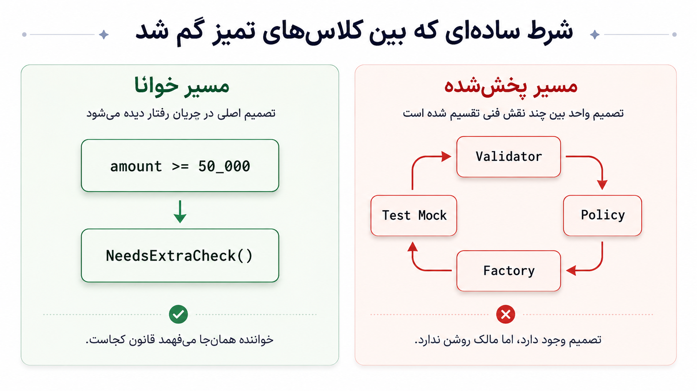
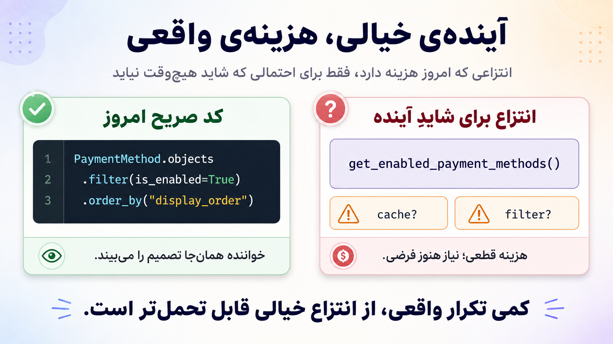

import Tabs from '@theme/Tabs';
import TabItem from '@theme/TabItem';

# اصل تک‌مسئولیتی؛ وقتی خودِ قاب‌بندی مسئله‌ساز است


این نوشته درباره‌ی این نیست که کسی اصل تک‌مسئولیتی را «بد اجرا کرده» و اگر کمی دقیق‌تر اجرا می‌کرد، همه‌چیز درست می‌شد. نقد من کمی ریشه‌ای‌تر است: خودِ قاب‌بندی این اصل گاهی ما را با سؤال اشتباهی وارد طراحی می‌کند.

به‌جای اینکه از خودمان بپرسیم «این مرزبندی در طول زمان چه هزینه‌ای دارد؟»، خیلی زود می‌پرسیم: «این کلاس چند مسئولیت دارد؟» همین تغییر کوچک در سؤال، ما را آرام‌آرام به سمت شکستن کد بر اساس مسئولیت‌های ظاهری می‌برد: `Validator`، `Policy`، `Factory`، `Writer`، `Service`.

گاهی نتیجه، کدی است که از دور مرتب‌تر و حرفه‌ای‌تر به نظر می‌رسد؛ اما تصمیم اصلی دامنه‌ای در آن مالک روشن ندارد. حرف اصلی این متن همین است: **جداسازی باید هزینه‌ی آینده را کم کند؛ اگر فقط ظاهر امروز را تمیزتر کند، هنوز باید از خودش دفاع کند.**


{/* truncate */}

بعضی اصل‌ها آن‌قدر خوش‌بیان و دلنشین‌اند که مخالفت با آن‌ها شبیه مخالفت با عقل سلیم به نظر می‌رسد. اصل تک‌مسئولیتی هم از همین جنس است. جمله‌ی «هر چیز فقط یک دلیل برای تغییر داشته باشد» کوتاه است، مرتب است، و در نگاه اول انگار عصاره‌ی طراحی خوب را در خودش دارد.

اما گاهی همین جمله‌های خیلی تمیز، دقیقاً همان‌جایی خطرناک می‌شوند که دیگر کسی درباره‌ی هزینه‌ی واقعی‌شان سؤال نمی‌پرسد.

مسئله این نیست که جداسازی همیشه بد است. مسئله این است که ما قبل از دیدن الگوی واقعی تغییر در کدبیس، وارد بازی دیگری می‌شویم: بازیِ شمردن مسئولیت‌ها، شکستن کلاس‌ها، نام‌گذاری نقش‌های فنی، و ساختن انتزاع‌هایی که شاید هیچ‌وقت هزینه‌شان را پس ندهند.

:::danger تز متن
مشکل فقط اجرای بد SRP نیست؛ مشکل این است که SRP طراحی را با سؤال اشتباهی شروع می‌کند.
:::

سؤال رایج در این قاب‌بندی معمولاً این است:

> این کد چند مسئولیت دارد؟

اما سؤال مهندسی‌تر این است:

> این مرزبندی در طول زمان چه چیزی را ارزان‌تر و چه چیزی را گران‌تر می‌کند؟

این دو سؤال شبیه هم نیستند. اولی ما را وارد بحث‌های تمام‌نشدنی درباره‌ی تعریف «مسئولیت» می‌کند. دومی مجبورمان می‌کند هزینه‌ی تصمیم را در طول عمر کد بسنجیم: فهم، تغییر، تست، ریویو، دیباگ، ورود آدم‌های تازه به تیم، و مقیاس‌پذیری این قاعده در کل کدبیس.

## سؤال غلط: «چند مسئولیت دارد؟»

اصل تک‌مسئولیتی می‌گوید هر ماژول باید فقط یک دلیل برای تغییر داشته باشد. روی کاغذ، این حرف بدی نیست. اتفاقاً اگر آن را دقیق و بالغ بفهمیم، دارد درباره‌ی تغییر حرف می‌زند، نه درباره‌ی کوتاه‌بودن فایل یا زیادبودن فعل‌ها.

اما پروژه‌ی واقعی به این تمیزی رفتار نمی‌کند. دلیل تغییر معمولاً یک چیز ساده، ثابت و تک‌محوری نیست. یک تغییر از محصول می‌آید، یکی از مقررات، یکی از مدل داده، یکی از کارایی، یکی از تست، یکی از مشاهده‌پذیری، و یکی از مالکیت تیمی. گاهی هم چندتا از این‌ها با هم وارد می‌شوند و همه‌ی مرزهای قبلی را به چالش می‌کشند.

حالا در چنین محیطی، وقتی از خودمان می‌پرسیم «این کلاس چند مسئولیت دارد؟»، خیلی زود وارد یک بازی تفسیری می‌شویم:

- یک نفر می‌گوید validation یک مسئولیت است.
- یکی می‌گوید policy یک مسئولیت است.
- یکی می‌گوید ساخت object یک مسئولیت است.
- یکی می‌گوید persistence یک مسئولیت است.

و نکته‌ی دردناک این است که همه می‌توانند با ادبیات SRP از خودشان دفاع کنند.

یکی می‌گوید این شرط‌ها را ببریم در `Validator`، چون اعتبارسنجی مسئولیت جداست. یکی می‌گوید تصمیم دامنه باید در `Policy` باشد. یکی می‌گوید ساخت آبجکت باید برود در `Factory`. یکی هم می‌گوید سرویس باید لاغر بماند و فقط orchestration کند.

هیچ‌کدام از این جمله‌ها ذاتاً غلط نیستند. خیلی وقت‌ها حتی نجات‌دهنده‌اند. مشکل این است که SRP به‌تنهایی به ما نمی‌گوید کدام‌یک از این جداسازی‌ها در طول زمان هزینه‌ی تغییر را کم می‌کند. فقط یک قاب جذاب می‌دهد: «مسئولیت‌ها را جدا کن.»

:::tip قاعده‌ی جایگزین
به‌جای اینکه اول بپرسیم «این چند مسئولیت دارد؟»، بهتر است این پرسش‌ها را جلویمان بگذاریم:

- این تصمیم کجا زندگی می‌کند؟
- چه چیزهایی با هم تغییر می‌کنند؟
- کدام مرز فهم را ساده‌تر می‌کند؟
- این جداسازی در مقیاس تیمی چه هزینه‌ای دارد؟
:::

وقتی اصل، معیار عملیاتی روشن نمی‌دهد، هر کس برداشت خودش از «مسئولیت» را تبدیل به معماری می‌کند. همین‌جاست که کد از نظر ظاهری تمیز می‌شود، اما رفتار واقعی سیستم آرام‌آرام بین چند نقش فنی پخش می‌شود.

## یک قانون کوچک و یک تصمیم بی‌مالک

فرض کن قانون محصولی کوچکی عوض شده است:

> انتقال‌های زیر ۵۰ هزار تومان دیگر نیاز به بررسی اضافه ندارند.

از بیرون، تغییر ساده است. یک قانون کوچک عوض شده. نه قرارداد API عوض شده، نه مدل داده، نه جریان اصلی محصول.

اما وارد کد که می‌شوی، سؤال ساده‌ای که باید جواب روشن داشته باشد، پخش می‌شود:

> این تصمیم دقیقاً کجا زندگی می‌کند؟

آیا این حد در `validator` است؟ در `policy`؟ در ساختن تراکنش؟ در تست سرویس؟ در چند جای هم‌زمان؟

اینجا نباید حواسمان پرت تعداد فایل‌ها شود. تعداد فایل به‌تنهایی استدلال قوی‌ای نیست. تغییر زیاد می‌تواند کاملاً طبیعی و حتی نشانه‌ی کار درست باشد. اگر schema عوض شده، migration لازم بوده، مستندات اصلاح شده، تست‌ها به‌روز شده‌اند، قرارداد API تغییر کرده، یا observability باید با رفتار جدید هماهنگ می‌شده، این‌ها fan-out ضروری‌اند.

مشکل جای دیگری است: **تصمیم واحد دامنه‌ای مالک روشن ندارد.**

یعنی مسئله واقعاً چند مرز مستقل ندارد؛ یک تصمیم واحد قبلاً به اسم مسئولیت‌های جداگانه تکه‌تکه شده است. حالا برای فهم و اصلاح آن باید چند کلاس، چند تست و چند mock را کنار هم بگذاری تا تازه بفهمی تصمیم اصلی کجا پنهان شده است.

این همان جایی است که تمیزی ظاهری شروع می‌کند به گرفتن مالیات از تیم.

در یک کدبیس کوچک، شاید فقط کمی آزاردهنده باشد. در یک تیم بزرگ‌تر، این هزینه چند برابر می‌شود. یک نفر قانون محصولی را تغییر می‌دهد، نفر دوم تست را می‌خواند، نفر سوم ریویو می‌کند، نفر چهارم شش ماه بعد باگ را دیباگ می‌کند. اگر هر کدام برای فهم یک تصمیم ساده باید همان مسیر پراکنده را دوباره کشف کنند، هزینه‌ی طراحی فقط یک بار پرداخت نشده؛ بارها و بارها از جیب تیم کم شده است.

## درد اصلی: جداسازی مسئولیت‌محور، نه تغییرمحور

مشکل من «جداسازی» نیست. مشکل من جداسازی‌ای است که از سؤال غلط شروع می‌شود.

وقتی به‌جای محور تغییر، از «مسئولیت ظاهری» شروع کنیم، خیلی زود کد را بر اساس نقش‌های فنی می‌بریم:

| سؤال SRP-زده | سؤال مهندسی‌تر |
|---|---|
| این کلاس چند مسئولیت دارد؟ | این مرز در طول زمان چه هزینه‌ای می‌سازد؟ |
| آیا validation را جدا کرده‌ایم؟ | آیا تصمیم اصلی مالک روشن دارد؟ |
| آیا policy جداست؟ | آیا تغییر محصولی در یک نقطه‌ی قابل فهم جمع می‌شود؟ |
| آیا سرویس لاغر است؟ | آیا مسیر تصمیم برای خواننده روشن است؟ |
| آیا abstraction داریم؟ | آیا abstraction هزینه‌اش را پس داده است؟ |

نظم فنی همیشه بد نیست. اتفاقاً در خیلی از تیم‌ها مزیت جدی است. وقتی تازه‌وارد می‌داند validation کجاست، policy کجاست و persistence کجاست، ورودش به کدبیس ساده‌تر می‌شود. ساختار قابل پیش‌بینی کمک می‌کند آدم‌ها سریع‌تر در کد راه بیفتند. مالکیت لایه‌ها هم می‌تواند روشن‌تر شود.

اما همین نظم از جایی به بعد می‌تواند ضد خودش شود.

اگر یک تصمیم واحد دامنه‌ای بین `Validator` و `Policy` و `Factory` پخش شود، ساختار قابل پیش‌بینی دیگر کمک نمی‌کند؛ فقط باعث می‌شود تصمیم در کشوهای مرتب گم شود. مشکل کشو داشتن نیست. کشو، فهرست و نمایه گاهی دقیقاً همان چیزی است که یک کتاب را قابل استفاده می‌کند. مشکل وقتی شروع می‌شود که برای خواندن یک پاراگراف مجبور شوی پنج کشو را هم‌زمان باز کنی.



## چند حالت خوب و بد

برای اینکه بحث منصفانه بماند، باید بپذیریم خیلی از چیزهایی که نقد می‌کنم، در جای درست خودشان ابزارهای مفیدی‌اند. مشکل ابزار نیست؛ معیار تصمیم است. مشکل وقتی شروع می‌شود که ابزار مفید را بدون سنجیدن هزینه‌ی بلندمدت، به قاعده‌ی عمومی تبدیل کنیم.

<Tabs>
  <TabItem value="validator" label="Validator" default>

`Validator` خوب است وقتی واقعاً مرز مستقلی دارد. مثلاً اعتبارسنجی زیر مالکیت تیم compliance یا security است، با تغییر مقررات عوض می‌شود، و چند مسیر از یک قرارداد ورودی مشترک استفاده می‌کنند. در این حالت، جداکردن validation هزینه‌ی تغییر را کم می‌کند؛ چون تغییر مقررات در همان مرز جمع می‌شود.

اما `Validator` بد می‌شود وقتی فقط چند شرط از یک تصمیم واحد دامنه‌ای را جدا کرده‌ایم. اگر هر بار قانون محصولی عوض می‌شود هم `validator` تغییر می‌کند، هم `policy`، یعنی شاید این دو از نظر اسم جدا باشند، اما از نظر تغییر واقعی هنوز به هم چسبیده‌اند.

بده‌بستان اینجاست:

| جنبه | توضیح |
|---|---|
| مزیت | مرز روشن برای اعتبارسنجی |
| هزینه | احتمال پخش‌شدن تصمیم محصولی بین validation و policy |
| سؤال مهندسی | در تغییرهای واقعی، این دو مستقل حرکت می‌کنند یا همیشه با هم؟ |

SRP می‌تواند جداشدن validator را تشویق کند، اما به‌تنهایی نمی‌پرسد آیا این جداسازی تغییر آینده را محلی‌تر کرده یا نه.

  </TabItem>
  <TabItem value="policy" label="Policy">

`Policy` خوب است وقتی واقعاً مرکز تصمیم‌های دامنه است. یعنی تغییرهای محصولی آنجا جمع می‌شوند، قرارداد رفتاری روشنی دارد، و تست‌های رفتاری نشان می‌دهند این policy چه تصمیمی می‌گیرد.

اما `Policy` بد می‌شود وقتی فقط اسم شیک‌تری برای چند شرط پراکنده است. بخشی از تصمیم در `validator` مانده، بخشی در `factory` دفن شده، بخشی هم در mockهای تست فرض شده. در این حالت policy مالک تصمیم نیست؛ فقط یک ایستگاه در زنجیره‌ی پاس‌دادن است.

بده‌بستان:

| جنبه | توضیح |
|---|---|
| مزیت | تمرکز تصمیم دامنه |
| هزینه | اگر تصمیم از policy نشت کند، policy فقط یک نام زیبا روی پراکندگی است |
| سؤال مهندسی | آیا تغییر محصولی واقعاً در policy جمع می‌شود؟ |

SRP به ما می‌گوید تصمیم را جدا کن، اما نمی‌گوید تصمیم واقعاً کجا باید زندگی کند و چه چیزی نباید از آن بیرون نشت کند.

  </TabItem>
  <TabItem value="factory" label="Factory">

`Factory` خوب است وقتی ساخت آبجکت واقعاً پیچیده است؛ مثلاً invariantهای ساخت باید یک‌جا حفظ شوند، چند مسیر ساخت داریم، یا خود ساختن آبجکت قرارداد مهمی دارد.

اما `Factory` بد می‌شود وقتی فقط constructor ساده را پنهان کرده‌ایم. بدتر از آن، وقتی بخشی از تصمیم دامنه‌ای در status mapping یا type mapping داخل factory دفن شده باشد. آن‌وقت برای فهم قانون محصولی باید factory را هم بخوانیم، نه چون ساخت آبجکت مهم است، بلکه چون تصمیم از جای خودش نشت کرده.

بده‌بستان:

| جنبه | توضیح |
|---|---|
| مزیت | تمرکز ساخت پیچیده و invariantها |
| هزینه | پنهان‌شدن تصمیم دامنه‌ای در مرحله‌ی ساخت |
| سؤال مهندسی | factory قرارداد ساخت را ساده کرده یا مسیر فهم تصمیم را طولانی‌تر؟ |

SRP می‌تواند «ساختن» را مسئولیتی جدا ببیند، اما گاهی همین جداکردن باعث می‌شود بخشی از تصمیم دامنه‌ای در مرحله‌ی ساخت دفن شود.

  </TabItem>
  <TabItem value="interface" label="Interface">

`Interface` خوب است وقتی مرز خارجی داریم، قرارداد پایدار می‌خواهیم، چند پیاده‌سازی واقعی یا نزدیک داریم، یا می‌خواهیم وابستگی به جزئیات فنی را کم کنیم. در این حالت interface می‌تواند مرز سیستم را روشن‌تر و تغییر آینده را ارزان‌تر کند.

اما interface بد می‌شود وقتی فقط چون «شاید بعداً پیاده‌سازی دوم آمد» ساخته شده. هیچ مرز واقعی، قرارداد مفهومی یا تغییرپذیری واقعی ایجاد نکرده، اما از همین امروز به همه‌ی خواننده‌ها و تست‌ها مالیات abstraction تحمیل کرده است.

بده‌بستان:

| جنبه | توضیح |
|---|---|
| مزیت | مرز پایدار و امکان جایگزینی واقعی |
| هزینه | لایه‌ی اضافه برای خواننده، تست و ریویو |
| سؤال مهندسی | آیا این interface امروز ارزشی تولید کرده یا فقط آینده‌ی خیالی را بیمه کرده؟ |

مشکل این است که SRP، وقتی کنار ادبیات رایج clean code و dependency inversion می‌نشیند، خیلی راحت آینده‌ی خیالی را تبدیل به abstraction امروز می‌کند.

  </TabItem>
</Tabs>

:::warning آینده‌ی خیالی، هزینه‌ی واقعی
«شاید بعداً لازم شود» به‌تنهایی دلیل کافی برای ساختن مرز جدید نیست. مرز جدید از همان روز اول هزینه دارد: خواندن، تست، ریویو، navigation و تصمیم‌گیری را گران‌تر می‌کند. آینده باید آن‌قدر محتمل و نزدیک باشد که این هزینه را پس بدهد.
:::

## شاهد کدی: انتقال پول

حالا برگردیم به همان قانون انتقال زیر ۵۰ هزار تومان.

نسخه‌ی مستقیم‌تر شاید چیزی شبیه این باشد:

```go title="transfer_service.go"
func (s *TransferService) Transfer(ctx context.Context, cmd TransferCommand) error {
    if cmd.Amount <= 0 {
        return ErrInvalidAmount
    }

    account, err := s.accounts.Get(ctx, cmd.SourceAccountID)
    if err != nil {
        return err
    }

    if cmd.Amount >= 50_000 && account.NeedsExtraCheck() {
        return ErrExtraCheckRequired
    }

    if !account.CanWithdraw(cmd.Amount) {
        return ErrInsufficientBalance
    }

    transfer := NewTransfer(cmd)

    if err := s.ledger.Record(ctx, transfer); err != nil {
        return err
    }

    return s.accounts.ApplyTransfer(ctx, transfer)
}
```

این کد ایده‌آل نیست. ممکن است `ledger` واقعاً مرز مستقل حسابداری باشد. ممکن است `accounts` ماژول جدا داشته باشد. ممکن است تصمیم‌های انتقال واقعاً باید در policy باشند. من از تابع‌های چاق و کلاس‌های خداگونه دفاع نمی‌کنم.

اما این نسخه یک مزیت دارد: خواننده می‌تواند مسیر تصمیم را ببیند. قانون ۵۰ هزار تومان همان‌جا وسط جریان دیده می‌شود.

نسخه‌ی SRPزده ممکن است از دور تمیزتر باشد:

```go title="transfer_service.go"
func (s *TransferService) Transfer(ctx context.Context, cmd TransferCommand) error {
    if err := s.validator.Validate(ctx, cmd); err != nil {
        return err
    }

    decision, err := s.policy.Decide(ctx, cmd)
    if err != nil {
        return err
    }

    tx := s.factory.Build(cmd, decision)

    if err := s.writer.Write(ctx, tx); err != nil {
        return err
    }

    return s.updater.Apply(ctx, tx)
}
```

این نسخه هم لزوماً بد نیست. `TransferService` می‌تواند orchestrator سالمی باشد؛ یعنی dependencyهای معنادار را کنار هم بیاورد و مسیر تصمیم را روشن کند. اما اگر فقط pass-through chain باشد، یعنی کار را از یک collaborator به بعدی پاس بدهد و تصمیم اصلی را پنهان کند، مشکل داریم.

نسخه‌ی بد ماجرا وقتی است که قانون اصلی در چند تکه پخش شده باشد:

```go title="transfer_validator.go"
func (v *TransferValidator) Validate(cmd TransferCommand) error {
    if cmd.Amount <= 0 {
        return ErrInvalidAmount
    }

    if cmd.Amount < SmallTransferLimit && cmd.RequiresExtraCheckFlag {
        return ErrInvalidSmallTransfer
    }

    return nil
}
```

```go title="transfer_policy.go"
func (p *TransferPolicy) Decide(account Account, cmd TransferCommand) Decision {
    if cmd.Amount >= SmallTransferLimit && account.NeedsExtraCheck() {
        return Decision{RequiresExtraCheck: true}
    }

    return Decision{RequiresExtraCheck: false}
}
```

```go title="transaction_factory.go"
func (f *TransactionFactory) Build(cmd TransferCommand, decision Decision) Transfer {
    return Transfer{
        Amount: cmd.Amount,
        Status: statusFromDecision(decision),
    }
}
```

حالا اگر قانون ۵۰ هزار تومان تغییر کند، باید بفهمیم این حد در `validator` چه اثری دارد، در `policy` چه تصمیمی می‌سازد، در `factory` چه وضعیتی تولید می‌کند، و کدام تست‌ها با mock کردن policy فقط بخشی از رفتار را فرض گرفته‌اند.

مشکل این نیست که policy داریم. مشکل این است که تصمیم اصلی در یک جای روشن زندگی نمی‌کند.

تست هم همین‌جا می‌تواند هزینه را زیاد کند. interaction test همیشه بد نیست. mock کردن `policy` می‌تواند تست سرویس را سریع‌تر و متمرکزتر کند؛ قرار نیست هر تست سرویس کل مسیر را end-to-end اجرا کند. مشکل وقتی شروع می‌شود که mock تنها شاهد ما از رفتار باشد، قرارداد واقعی `policy` جداگانه تست نشده باشد، یا تست سرویس به جای سنجیدن اثر قابل مشاهده‌ی انتقال، فقط ثابت کند که `policy` با چه ورودی‌ای صدا زده شده است.


## مثال کوچک‌تر: تابعی که فقط برای آینده abstract شده

این بیماری فقط در کلاس‌های بزرگ و الگوهای معماری نیست. گاهی در یک تابع کوچک هم خودش را نشان می‌دهد.

مثلاً:

```python title="payment_methods.py"
def get_enabled_payment_methods() -> list[PaymentMethod]:
    return list(
        PaymentMethod.objects
        .filter(is_enabled=True)
        .order_by("display_order")
    )
```

در نگاه اول، بی‌آزار است. حتی ممکن است کسی بگوید: «خب خوب است دیگر؛ اگر فردا خواستیم cache اضافه کنیم، همین‌جا اضافه می‌کنیم. اگر فردا filter جدید خواستیم، همین تابع را تغییر می‌دهیم.»

اما سؤال مهندسی این است:

> آیا امروز واقعاً چنین محوری برای تغییر داریم، یا فقط یک query ساده را پشت یک اسم پنهان کرده‌ایم؟

این تابع می‌تواند خوب باشد اگر واقعاً مفهوم دامنه‌ای مشترکی داریم: «روش‌های پرداخت فعال». اگر چند caller همین قرارداد را می‌خواهند. اگر ترتیب `display_order` بخشی از قرارداد محصول است. اگر cache واقعاً نیاز شده یا نزدیک است.

اما اگر فقط یک‌بار استفاده شده، اگر cache هنوز فقط یک احتمال ذهنی است، اگر callerهای آینده معلوم نیستند، و اگر این تابع فقط query ساده‌ای را پنهان می‌کند، شاید inline بودن صادقانه‌تر باشد:

```python
payment_methods = list(
    PaymentMethod.objects
    .filter(is_enabled=True)
    .order_by("display_order")
)
```

کد تکراری واقعی، از abstraction خیالی قابل تحمل‌تر است. چون تکرار را می‌بینی، اما abstraction غلط خودش را شبیه طراحی خوب جا می‌زند.



## از کجا بفهمیم وارد مسیر غلط شده‌ایم؟

من دنبال عدد قطعی نیستم. تعداد فایل، تعداد کلاس، تعداد mock یا تعداد interface به‌تنهایی حکم نمی‌دهد. این‌ها فقط proxy هستند. اگر تبدیلشان کنیم به هدف، خودشان فساد می‌سازند.

هدف اصلی این است:

> کاهش هزینه‌ی فهم و تغییر در طول زمان

برای نزدیک‌شدن به این هدف، چند سیگنال بهتر از «چند مسئولیت دارد؟» داریم:

| Signal | سؤال عملی |
|---|---|
| مالک تصمیم | آیا می‌توانیم یک نقطه‌ی روشن در کد نشان بدهیم و بگوییم تصمیم اینجاست؟ |
| هم‌تغییری در گیت | آیا چند فایل ظاهراً جدا، در تغییرهای مشابه مدام با هم تغییر می‌کنند؟ |
| تست رفتاری | آیا تست‌ها اثر قابل مشاهده را می‌سنجند یا فقط interactionها را قفل کرده‌اند؟ |
| ریویوی متمرکز | آیا ریویور تصمیم اصلی را می‌بیند یا در سیم‌کشی DI و mock و constructor گم می‌شود؟ |
| abstraction واقعی | آیا abstraction با نیاز واقعی توجیه شده یا با «شاید بعداً»؟ |
| مقیاس تیمی | اگر این قاعده در کل تیم تکرار شود، هزینه‌ی نگهداری کم می‌شود یا زیاد؟ |

این‌ها حقیقت مطلق نیستند، اما از سؤال «چند مسئولیت دارد؟» عملیاتی‌ترند. چون به جای بحث‌های تفسیری، ما را می‌برند سمت رفتار واقعی کد در طول زمان.

<details>
<summary>این سیگنال‌ها را چطور بخوانیم؟</summary>

این جدول قرار نیست به ماشین تصمیم‌گیری تبدیل شود. مثلاً هم‌تغییری در گیت همیشه بد نیست؛ ممکن است چند فایل واقعاً بخشی از یک قرارداد بزرگ‌تر باشند. mock هم همیشه بد نیست؛ گاهی برای جدا کردن مرزهای کند و ناپایدار لازم است. interface تک‌پیاده‌سازی‌شده هم همیشه اشتباه نیست؛ اگر قرارداد پایدار و مرز خارجی می‌سازد، می‌تواند کاملاً قابل دفاع باشد.

اما اگر چند سیگنال هم‌زمان ظاهر شوند، باید مکث کنیم. مثلاً تصمیم مالک روشن ندارد، تست‌ها فقط interactionها را قفل کرده‌اند، و هر تغییر محصولی همان چند فایل را با هم تکان می‌دهد. آنجا دیگر با یک «کد تمیزتر» طرف نیستیم؛ احتمالاً با هزینه‌ای طرفیم که فقط خوب بسته‌بندی شده است.

</details>

:::tip قبل از جداکردن، این‌ها را بپرس
- آیا این جداسازی تغییر را محلی‌تر می‌کند؟
- آیا تصمیم مالک روشن‌تری پیدا می‌کند؟
- آیا فهم مسیر اصلی ساده‌تر می‌شود؟
- آیا تست‌ها رفتاری‌تر می‌شوند؟
- آیا ریویو روی تصمیم متمرکزتر می‌شود؟
- آیا این قاعده در مقیاس تیمی جواب می‌دهد؟
:::

## نه God Class، نه SRPزدگی

ممکن است کسی بگوید: «پس همه‌چیز را بریزیم در یک کلاس؟»

نه. این هم همان‌قدر بد است.

کلاس خداگونه هم هزینه‌ی خودش را دارد: تغییر خطرناک می‌شود، تست سخت می‌شود، مسئولیت‌های واقعاً نامرتبط قاطی می‌شوند، و هر اصلاح کوچک ممکن است جای دیگری را خراب کند. من از تابع‌های هزارخطی، duplication بی‌حد، و کلاس‌هایی که همه‌چیز را قورت می‌دهند دفاع نمی‌کنم.

اما نقد من این است که SRP ما را زیادی زود به سمت شکستن می‌برد. قبل از اینکه هزینه‌ی تغییر را بسنجیم، شروع می‌کنیم به تعریف مسئولیت و جداکردن اجزا.

مرز سالم نه با شعار «همه‌چیز جدا»، نه با شعار «همه‌چیز کنار هم» پیدا می‌شود. مرز سالم از مشاهده‌ی تغییر واقعی، مالکیت تصمیم، فهم انسانی و مقیاس تیمی می‌آید.

جمله‌ی من این است:

> همه‌چیز را کنار هم نگه ندار؛ اما قبل از جداکردن، ثابت کن این جداسازی هزینه‌ی آینده را کم می‌کند.

## اصل‌هایی که هزینه‌شان را نشان نمی‌دهند

مشکل من با SRP این است که هزینه‌ی خودش را نشان نمی‌دهد. جمله‌ی «هر چیز فقط یک دلیل برای تغییر داشته باشد» آن‌قدر تمیز است که آدم حس می‌کند اگر کد را شکست، حتماً کار درستی کرده است.

اما طراحی خوب با حس خوب فرق دارد.

طراحی خوب باید در طول زمان دوام بیاورد. باید وقتی تیم بزرگ‌تر شد، هنوز قابل فهم باشد. باید وقتی قانون محصولی عوض شد، محل تغییر قابل پیش‌بینی باشد. باید وقتی refactor می‌کنیم، تست‌ها از رفتار محافظت کنند، نه از سیم‌کشی داخلی. باید وقتی ریویو می‌کنیم، تصمیم اصلی دیده شود، نه فقط choreography کلاس‌ها.

پس دفعه‌ی بعد که خواستی چیزی را به اسم اصل تک‌مسئولیتی جدا کنی، فقط نپرس:

> آیا این مسئولیت جداست؟

بپرس:

> این جداسازی چه چیزی را در آینده ارزان‌تر می‌کند؟

اگر جواب روشنی نداری، شاید هنوز وقت شکستن نرسیده است.

:::danger ضربه‌ی آخر
اگر این جداسازی نه تغییر را محلی‌تر کرده، نه فهم را ساده‌تر، نه تست را رفتاری‌تر، و نه مرز واقعی‌تری ساخته، کد را تمیز نکرده‌ای؛ فقط کد کثیفی ساخته‌ای که خوب لباس پوشیده است.
:::
