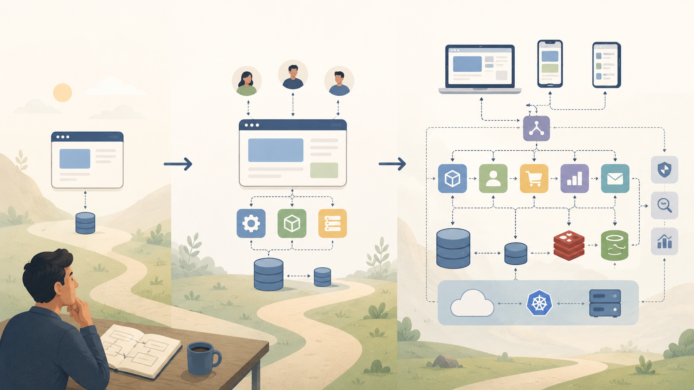

گاهی یک نرم‌افزار از جای خیلی ساده‌ای آغاز می‌شود: چند صفحه، چند قابلیت روشن، چند کاربر اول، و یک تیم کوچک که فقط می‌خواهد محصولش درست کار کند. اما اگر آن محصول زنده بماند، آرام‌آرام بزرگ می‌شود؛ نیازهای تازه پیدا می‌کند، کاربران بیشتری سراغش می‌آیند، تصمیم‌های قدیمی سنگین‌تر می‌شوند، و چیزهایی که دیروز ساده و کافی بودند، امروز گره‌های تازه می‌سازند. درست همین‌جاست که بسیاری از واژه‌های ظاهراً خشک مهندسی نرم‌افزار، از دل زندگی واقعی یک سیستم معنا پیدا می‌کنند.

من در این نوشته نمی‌خواهم از همان ابتدا سراغ معماری‌های پرزرق‌وبرق بروم و برای هر مسئله‌ای یک ابزار بزرگ روی میز بگذارم. برعکس، می‌خواهم از یک سؤال ساده شروع کنم: اگر واقعاً بخواهیم محصولی را قدم‌به‌قدم بسازیم، چه زمانی به چه چیزی نیاز پیدا می‌کنیم؟ چه زمانی یک برنامه‌ی ساده کافی است؟ چه زمانی همان سادگی، دیگر کمک نمی‌کند و تبدیل به مانع می‌شود؟ چرا روزی به طراحی بهتر رابط‌های برنامه‌نویسی فکر می‌کنیم، روزی به صف پیام، روزی به کانتینر، روزی به مهاجرت داده، و روزی به عملیات یادگیری ماشین؟

این نوشته سفری مرحله‌به‌مرحله در مسیر بزرگ‌شدن یک نرم‌افزار است؛ از روزی که فقط می‌خواهیم چیزی کار کند، تا روزی که باید قابل تغییر، قابل اعتماد و قابل نگه‌داری هم بماند. قرار نیست با واژه‌ها مرعوب شویم؛ قرار است بفهمیم هرکدام کجا به درد می‌خورند و چرا نباید زودتر از موعد سراغشان برویم. خط اصلی این مسیر برای من همین است: نه معماری نمایشی، نه سادگی بی‌مسئولیت.

