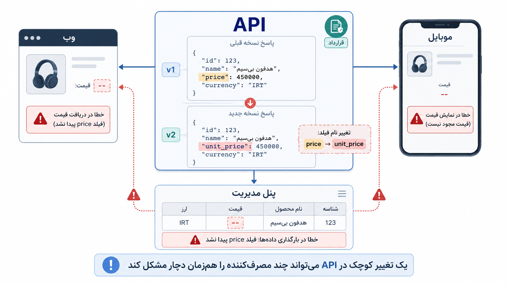

## وقتی یک تغییر کوچک، چند جای سیستم را می‌شکند

گاهی ماجرا از یک تغییر خیلی کوچک آغاز می‌شود. مثلاً در پاسخ سرور، نام یک فیلد را عوض می‌کنیم؛ چون در کد تازه، نام جدید تمیزتر و دقیق‌تر به نظر می‌رسد. روی نسخه‌ی وب همه‌چیز درست کار می‌کند. چند بار هم دستی امتحان می‌کنیم و مشکلی نمی‌بینیم. با خودمان می‌گوییم: «چیزی نبود، فقط اسم یک فیلد عوض شد.»

اما چند ساعت بعد پیام‌ها شروع می‌شوند. برنامه‌ی موبایل قیمت محصول را نشان نمی‌دهد. پنل مدیریت در بارگذاری داده‌ها خطا می‌دهد. شاید یک گزارش داخلی هم از همان پاسخ استفاده می‌کرده و حالا خالی مانده است. ناگهان روشن می‌شود چیزی که برای ما «یک تغییر کوچک» بود، برای چند بخش دیگر از سیستم، شکستن یک قول و قرار بوده است.

اینجاست که API یا همان رابط برنامه‌نویسی، از یک جزئیات فنی ساده به یک قرارداد تبدیل می‌شود. تا وقتی فقط خودمان از آن استفاده می‌کنیم، شاید چند مسیر و چند پاسخ ساده به نظر برسد. اما وقتی وب، موبایل، پنل مدیریت، یک تیم دیگر یا یک سرویس بیرونی به آن وابسته می‌شوند، دیگر با یک تکه کد معمولی طرف نیستیم. داریم زبانی مشترک می‌سازیم که دیگران بر پایه‌ی آن کارشان را جلو می‌برند.

:::tip[ایده‌ی اصلی]
هر API دیر یا زود از «راهی برای گرفتن داده» به «قراردادی میان بخش‌های سیستم» تبدیل می‌شود. هرچه مصرف‌کننده‌های بیشتری به آن وابسته شوند، تغییر دادن آن هم باید سنجیده‌تر باشد.
:::

رویکرد API-first را می‌شود خیلی ساده این‌طور فهمید: **اول قرارداد را روشن کنیم، بعد سراغ پیاده‌سازی برویم.** یعنی پیش از اینکه با عجله کد بزنیم، کمی مکث کنیم و بپرسیم این بخش از سیستم قرار است با چه کسانی حرف بزند. چه داده‌ای لازم است؟ نام‌ها برای مصرف‌کننده قابل فهم‌اند؟ خطاها چطور برمی‌گردند؟ اگر چیزی تغییر کرد، تکلیف نسخه‌های قبلی چه می‌شود؟ پاسخ امروز فقط نیاز همین صفحه را حل می‌کند، یا برای رشد آرام فردا هم جایی می‌گذارد؟

_یک تغییر کوچک در پاسخ سرور، وقتی چند مصرف‌کننده دارد، دیگر فقط یک تغییر کوچک نیست._

البته این نگاه به معنی سنگین کردن کار از روز اول نیست. قرار نیست محصولی را که هنوز شکل نگرفته، زیر بار سندهای طولانی، جلسه‌های زیاد و طراحی‌های خشک ببریم. گاهی یک قرارداد کوتاه، چند نمونه‌ی روشن از درخواست و پاسخ، نام‌گذاری دقیق، و توافق ساده میان اعضای تیم کافی است. مسئله این نیست که همه‌چیز را بزرگ و تشریفاتی کنیم؛ مسئله این است که بفهمیم کجا داریم چیزی می‌سازیم که دیگران روی آن حساب می‌کنند.

| نگاه عجولانه | نگاه سنجیده‌تر |
|---|---|
| فعلاً همین پاسخ کار می‌کند. | چه کسی قرار است این پاسخ را مصرف کند؟ |
| نام فیلد را بعداً عوض می‌کنیم. | تغییر نام فیلد چه چیزی را می‌شکند؟ |
| خطا را هرطور شد برمی‌گردانیم. | خطا باید برای مصرف‌کننده قابل فهم باشد. |
| مستندات را بعداً می‌نویسیم. | چند نمونه‌ی روشن از درخواست و پاسخ داریم. |
| فقط نیاز امروز مهم است. | نیاز امروز مهم است، اما راه تغییر فردا هم نباید بسته شود. |

:::warning[یک سوءبرداشت رایج]
API-first یعنی از روز اول کار را کند، رسمی و پر از تشریفات کنیم؟ نه. یعنی پیش از پیاده‌سازی، به قرارداد میان بخش‌های سیستم کمی احترام بگذاریم.
:::

  
یک نشانه که می‌گوید وقت جدی‌تر گرفتن API رسیده است

اگر برای تغییر دادن یک پاسخ ساده باید چند مصرف‌کننده را بررسی کنیم، با چند نفر هماهنگ شویم، و نگران شکستن بخش‌های دیگر باشیم، آن API دیگر فقط یک جزئیات داخلی نیست. در این نقطه بهتر است آن را مثل یک قرارداد ببینیم: روشن، قابل فهم، تا حد ممکن پایدار، و قابل تغییر با احتیاط.

برای من، درس این بخش همین است: هنوز قرار نیست معماری بزرگی بسازیم، اما باید بفهمیم بعضی چیزها زودتر از بقیه به مرز سیستم تبدیل می‌شوند. API یکی از همان جاهاست؛ جایی که تصمیم‌های کوچک امروز، روی آزادی عمل فردای ما اثر می‌گذارند.
