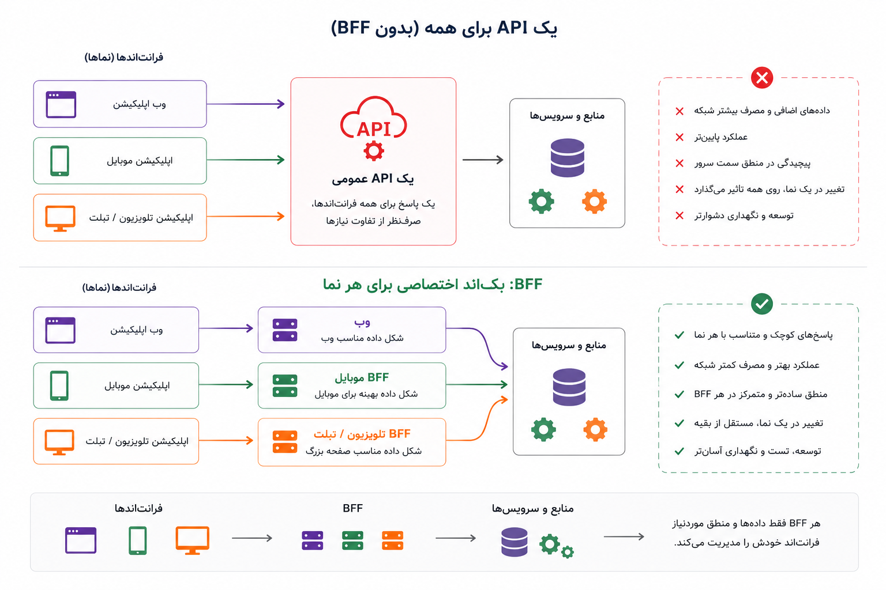

## وقتی یک پاسخ واحد، برای همه مناسب نیست

اوایل کار، معمولاً یک API عمومی برای همه کافی است. نسخه‌ی وب همان داده‌ای را می‌گیرد که لازم دارد، صفحه‌ها را می‌سازد، و کاربر هم بدون دردسر با محصول کار می‌کند. تا وقتی فقط یک نما داریم، این مدل ساده و قابل فهم است. حتی اگر کمی داده‌ی اضافه هم در پاسخ‌ها باشد، هنوز مسئله‌ی بزرگی به نظر نمی‌رسد.

اما محصول که جلوتر می‌رود، نماها هم شبیه هم نمی‌مانند. برنامه‌ی موبایل می‌خواهد پاسخ‌ها سبک‌تر باشند، چون صفحه کوچک‌تر است و شبکه همیشه پایدار نیست. نسخه‌ی وب شاید به داده‌های بیشتری برای ساختن یک صفحه‌ی کامل نیاز داشته باشد. پنل مدیریت هم اصلاً جنس دیگری از اطلاعات می‌خواهد؛ جزئیات بیشتر، وضعیت‌های داخلی، ابزارهای جست‌وجو، و داده‌هایی که نباید در دسترس کاربر عادی باشد.

اینجاست که یک API عمومی کم‌کم زیر فشار قرار می‌گیرد. اگر بخواهیم همه را با همان پاسخ واحد راضی کنیم، یا پاسخ‌ها بیش از حد بزرگ و شلوغ می‌شوند، یا هر نما مجبور می‌شود خودش چندین درخواست بزند و داده‌ها را کنار هم بچیند. نتیجه معمولاً این است: بخشی از پیچیدگی بک‌اند، آرام‌آرام به سمت فرانت‌اند هل داده می‌شود.

:::tip[ایده‌ی اصلی]
وقتی نیازهای وب، موبایل و پنل مدیریت واقعاً از هم فاصله می‌گیرند، یک پاسخ واحد ممکن است دیگر ساده‌ترین راه نباشد؛ ممکن است فقط ظاهر ساده‌ای داشته باشد و پیچیدگی را به جای دیگری منتقل کند.
:::

بک‌اند ویژه‌ی نما یا Backend for Frontend، که معمولاً به اختصار BFF گفته می‌شود، پاسخی به همین وضعیت است. ایده‌اش این است که به‌جای ساختن یک API عمومی که قرار است همه‌ی نماها را راضی کند، برای هر تجربه‌ی کاربری مهم، یک لایه‌ی بک‌اند نزدیک‌تر به همان نما بسازیم. این لایه می‌تواند داده‌ها را از چند سرویس یا چند API بگیرد، آن‌ها را به شکل مناسب کنار هم بگذارد، چیزهای اضافه را حذف کند، و پاسخی برگرداند که دقیقاً به درد همان نما بخورد.

مثلاً برنامه‌ی موبایل شاید برای صفحه‌ی سفارش فقط نام محصول، قیمت، وضعیت ارسال و یک دکمه‌ی اقدام لازم داشته باشد. اما پنل مدیریت برای همان سفارش، شناسه‌های داخلی، وضعیت پرداخت، تاریخچه‌ی تغییرات، یادداشت پشتیبانی و چند فیلتر دیگر می‌خواهد. اگر هر دو را با یک پاسخ واحد تغذیه کنیم، یا موبایل داده‌ی زیادی می‌گیرد، یا پنل مدیریت داده‌ی کمی. BFF کمک می‌کند هرکدام چیزی را بگیرند که برای تجربه‌ی خودشان مناسب‌تر است.

<!-- TODO: اگر تصویر ساختیم، فایل را کنار همین نوشته بگذاریم و این بخش را فعال کنیم.

_به‌جای اینکه همه‌ی نماها از یک پاسخ عمومی و سنگین استفاده کنند، هر نما می‌تواند از لایه‌ای نزدیک‌تر به نیاز خودش داده بگیرد._
-->

البته اینجا هم همان قاعده‌ی همیشگی برقرار است: نباید زودتر از درد واقعی، درمان پیچیده بیاوریم. اگر محصول کوچک است، فقط یک کلاینت دارد، یا تفاوت نیازها هنوز جدی نشده، ساختن چند لایه‌ی BFF بیشتر از اینکه کمک کند، نگه‌داری را سخت می‌کند. هر لایه‌ی تازه یعنی کد تازه، خطای تازه، آزمون تازه، مالکیت تازه و هماهنگی تازه.

| وضعیت | احتمالاً چه کاری بهتر است؟ |
|---|---|
| فقط یک نما داریم و نیازها ساده‌اند | همان API عمومی کافی است. |
| وب و موبایل تفاوت‌های کوچک دارند | شاید کمی بهبود در همان API کافی باشد. |
| هر نما داده‌ی متفاوت، شکل متفاوت و سرعت متفاوت می‌خواهد | BFF می‌تواند ارزشمند شود. |
| هر صفحه برای خودش BFF جدا می‌خواهد | احتمالاً داریم بیش از حد خرد می‌کنیم. |

:::warning[یک سوءبرداشت رایج]
BFF یعنی برای هر صفحه یا هر دکمه، یک بک‌اند جدا بسازیم؟ نه. BFF زمانی معنا دارد که تفاوت تجربه‌ها واقعی، تکرارشونده و پرهزینه شده باشد؛ نه وقتی فقط می‌خواهیم معماری را پیچیده‌تر نشان بدهیم.
:::

  
یک نشانه که می‌گوید شاید وقت BFF رسیده است

اگر فرانت‌اند برای ساختن یک صفحه باید چندین API را صدا بزند، داده‌های زیادی را دور بریزد، پاسخ‌ها را خودش به هم بچسباند، و مدام درگیر جزئیات داخلی بک‌اند شود، احتمالاً بخشی از مسئولیت اشتباه جابه‌جا شده است. در این نقطه، یک لایه‌ی BFF می‌تواند پیچیدگی را به جایی برگرداند که بهتر می‌تواند آن را مدیریت کند.

برای من، BFF یعنی احترام گذاشتن به این واقعیت که همه‌ی مصرف‌کننده‌ها یکسان نیستند. وب، موبایل و پنل مدیریت شاید از یک محصول حرف بزنند، اما تجربه‌ی یکسانی نمی‌سازند. پس گاهی لازم است بک‌اند هم به‌جای یک پاسخ عمومی برای همه، پاسخ‌هایی نزدیک‌تر به نیاز هر نما فراهم کند؛ البته فقط وقتی این تفاوت واقعاً به اندازه‌ی کافی جدی شده باشد.
