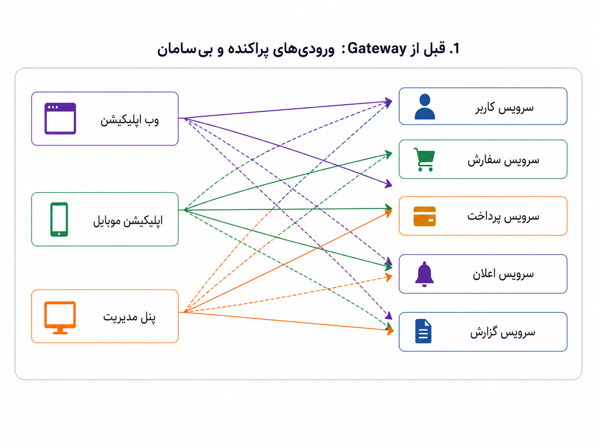
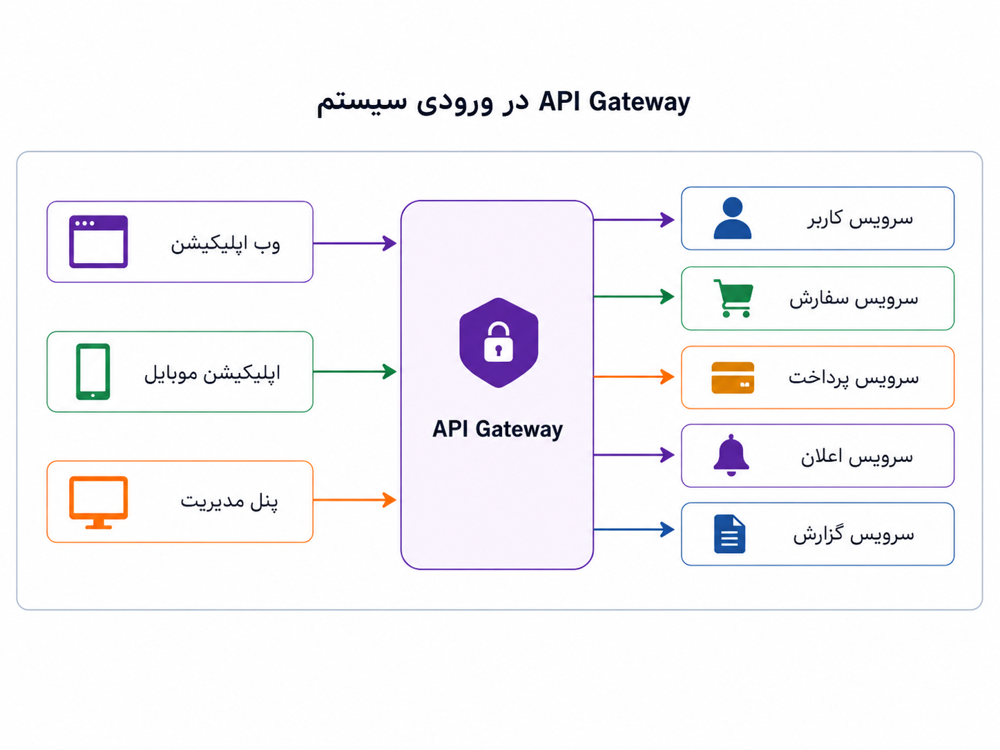
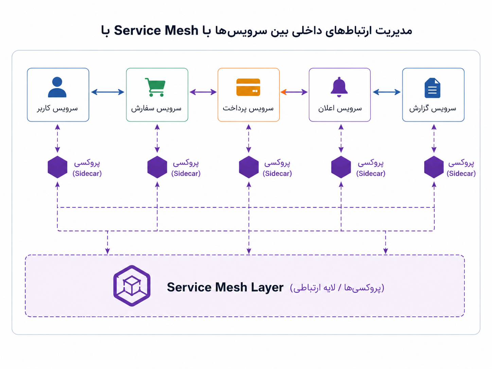

## وقتی ورودی سیستم شلوغ می‌شود و سرویس‌ها هم با هم حرف دارند

تا اینجا محصول چند نمای متفاوت پیدا کرده است: وب، موبایل و پنل مدیریت. هرکدام هم نیاز خودش را دارد و کم‌کم مسیرهای بیشتری به بک‌اند باز شده‌اند. اول شاید همه‌چیز ساده به نظر برسد؛ چند درخواست از بیرون می‌آید و چند پاسخ برمی‌گردد. اما بعد از مدتی سؤال‌های تازه‌ای پیدا می‌شوند: چه کسی حق دارد وارد سیستم شود؟ اگر یک کاربر یا یک ربات بیش از اندازه درخواست فرستاد چه کنیم؟ درخواست‌ها را کجا ثبت و ردیابی کنیم؟ نسخه‌های مختلف API را چطور مدیریت کنیم؟

اگر برای هر سرویس جداگانه همین منطق‌ها را بنویسیم، خیلی زود با تکرار و آشفتگی روبه‌رو می‌شویم. یک سرویس احراز هویت را یک‌جور انجام می‌دهد، سرویس دیگر محدودسازی درخواست را جور دیگری پیاده می‌کند، و لاگ‌ها هم هرکدام شکل خودشان را دارند. نتیجه این می‌شود که ورودی سیستم به جای یک مسیر قابل فهم، تبدیل می‌شود به چند در کوچک و پراکنده که هرکدام قانون خودش را دارد.

_وقتی هر نما مستقیم به چند مسیر و سرویس وصل می‌شود، کنترل ورودی‌ها سخت‌تر و پراکنده‌تر می‌شود._

اینجاست که API Gateway معنا پیدا می‌کند. Gateway را می‌توان مثل در ورودی آگاهانه‌ی سیستم دید؛ جایی که درخواست‌های بیرونی از آن عبور می‌کنند و بعد به سرویس مناسب می‌رسند. این لایه می‌تواند بخشی از کارهای مشترک را متمرکزتر کند: احراز هویت، محدودسازی نرخ درخواست، مسیریابی، ثبت لاگ، کنترل دسترسی و گاهی تبدیل شکل درخواست یا پاسخ.

:::tip[ایده‌ی اصلی]
API Gateway برای مدیریت ورودی‌های بیرونی سیستم است. یعنی جایی میان کلاینت‌ها و سرویس‌های داخلی می‌نشیند تا هر سرویس مجبور نباشد همه‌ی دغدغه‌های مشترک ورودی را دوباره از نو حل کند.
:::

_در این مدل، درخواست‌های بیرونی اول از یک نقطه‌ی مشخص عبور می‌کنند و بعد به سرویس مناسب می‌رسند._

اینجا ممکن است یک سؤال طبیعی پیش بیاید: مگر در بخش قبل نگفتیم BFF هم بین فرانت‌اند و بک‌اند می‌نشیند؟ پس Gateway چه فرقی با BFF دارد؟ فرق اصلی در نیت و مسئولیت آن‌هاست. BFF نزدیک به تجربه‌ی کاربری است و می‌پرسد «این نما دقیقاً چه داده‌ای و با چه شکلی لازم دارد؟» اما Gateway نزدیک به مرز ورودی سیستم است و می‌پرسد «این درخواست اصلاً اجازه‌ی ورود دارد؟ به کدام سرویس باید برود؟ چطور محدود، ثبت و ردیابی شود؟»

:::note[فرق BFF و Gateway]
BFF پاسخ را برای نیاز یک نما شکل می‌دهد؛ Gateway ورود درخواست‌ها به سیستم را مدیریت می‌کند. ممکن است در یک معماری هر دو را داشته باشیم: کلاینت‌ها اول از Gateway عبور کنند و بعد، بسته به نیاز، به BFF وب، BFF موبایل یا سرویس‌های داخلی برسند.
:::

| پرسش | BFF | API Gateway |
|---|---|---|
| به چه چیزی نزدیک‌تر است؟ | تجربه‌ی کاربری و نیاز هر نما | مرز ورودی سیستم |
| دغدغه‌ی اصلی چیست؟ | شکل‌دهی پاسخ مناسب برای وب، موبایل یا پنل مدیریت | ورود امن، مسیریابی، محدودسازی و ثبت درخواست‌ها |
| منطق کسب‌وکار کجا باید باشد؟ | تا حد ممکن نه در BFF؛ فقط ترکیب و آماده‌سازی داده‌ی نما | نباید در Gateway پخش شود؛ Gateway جای منطق محصول نیست |
| چه زمانی معنا پیدا می‌کند؟ | وقتی نیاز نماها واقعاً متفاوت شده باشد | وقتی ورودی‌ها زیاد، حساس یا پراکنده شده باشند |

اما این تمرکز یک دام هم دارد. هرچه چیزهای بیشتری را از یک نقطه عبور می‌دهیم، باید بیشتر مراقب باشیم همان نقطه به گلوگاه یا محل خوابیدن کل سیستم تبدیل نشود. Gateway قرار نیست یک سرور تنها و قهرمان باشد که اگر از کار افتاد، همه‌ی مسیرهای ورود به سیستم هم از کار بیفتند. Gateway یک نقش معماری است، نه الزاماً یک نمونه‌ی منفرد.

:::caution[تمرکز همیشه بی‌هزینه نیست]
وقتی ورودی‌های سیستم را از یک Gateway عبور می‌دهیم، کنترل و نظم بیشتری به دست می‌آوریم؛ اما هم‌زمان باید مراقب باشیم Gateway به «نقطه‌ی شکست واحد» (Single Point of Failure) تبدیل نشود. در عمل، Gateway معمولاً باید چند نمونه‌ی فعال داشته باشد، پشت بارپخش‌کننده قرار بگیرد، پایش و هشدار درست داشته باشد، و در برابر افزایش ناگهانی درخواست‌ها تاب‌آور باشد.
:::

داستان همین‌جا تمام نمی‌شود. فرض کنیم محصول بزرگ‌تر شده و دیگر پشت صحنه فقط یک بک‌اند ساده نداریم. سرویس سفارش با سرویس پرداخت حرف می‌زند، پرداخت با کیف پول، سفارش با اعلان، و گزارش‌گیری با چند بخش دیگر. حالا مسئله فقط «ورود درخواست از بیرون» نیست؛ مسئله‌ی تازه این است که سرویس‌های داخلی چگونه با هم حرف بزنند.

اینجا سؤال‌ها عوض می‌شوند. اگر سرویس سفارش کند شد، از کجا بفهمیم مشکل از خودش بوده یا از پرداخت؟ اگر ارتباط بین دو سرویس شکست، تکرار درخواست چگونه انجام شود؟ ارتباط داخلی سرویس‌ها امن است؟ اگر بخواهیم فقط بخشی از ترافیک را به نسخه‌ی تازه‌ی یک سرویس بفرستیم، این کار کجا مدیریت شود؟ آیا همه‌ی این منطق‌ها باید در کد تک‌تک سرویس‌ها تکرار شوند؟

Service Mesh برای چنین مسئله‌ای مطرح می‌شود. اگر API Gateway بیشتر به در ورودی شهر شبیه باشد، Service Mesh بیشتر شبیه شبکه‌ی خیابان‌ها و چراغ‌ها و تابلوهایی است که رفت‌وآمد درون شهر را قابل کنترل و قابل مشاهده می‌کند. این لایه روی ارتباط میان سرویس‌های داخلی تمرکز دارد: ردیابی درخواست‌ها، کنترل ترافیک، امنیت ارتباط سرویس به سرویس، سیاست‌های تکرار درخواست، و مشاهده‌پذیری بهتر.

_اگر Gateway ورودی سیستم را سامان می‌دهد، Service Mesh گفت‌وگوی درونی سرویس‌ها را قابل مشاهده‌تر و قابل کنترل‌تر می‌کند._

:::warning[زیاده‌روی رایج]
Service Mesh را نباید فقط چون مدرن و جذاب است وارد سیستم کنیم. اگر چند سرویس محدود داریم و ارتباط‌ها ساده‌اند، این لایه می‌تواند خودش به منبع تازه‌ای از پیچیدگی تبدیل شود.
:::

برای ساده‌تر شدن تفاوت این سه، می‌شود این‌طور نگاه کرد:

| مفهوم | بیشتر کجا می‌نشیند؟ | مسئله‌ی اصلی که حل می‌کند | خطر مهم اگر بد طراحی شود |
|---|---|---|---|
| BFF | نزدیک به هر نمای کاربری | آماده‌سازی پاسخ مناسب برای وب، موبایل یا پنل مدیریت | ممکن است منطق محصول را تکه‌تکه و پخش کند. |
| API Gateway | میان کلاینت‌ها و سرویس‌های داخلی | مدیریت ورودی بیرونی، مسیریابی، احراز هویت، محدودسازی درخواست | می‌تواند گلوگاه یا نقطه‌ی شکست واحد شود. |
| Service Mesh | میان خود سرویس‌های داخلی | مدیریت ارتباط سرویس به سرویس، ردیابی، امنیت داخلی، کنترل ترافیک | می‌تواند پیچیدگی عملیاتی و عیب‌یابی را بیشتر کند. |

  
چه زمانی هنوز به Service Mesh نیاز نداریم؟

اگر تعداد سرویس‌ها کم است، ارتباط‌ها ساده‌اند، مشاهده‌پذیری پایه‌ای داریم و مشکل جدی در مدیریت ترافیک داخلی نداریم، احتمالاً Service Mesh زود است. در چنین مرحله‌ای، ساده نگه داشتن معماری ارزشمندتر از افزودن یک لایه‌ی عملیاتی تازه است.

برای من، تفاوت اصلی این سه در محل درد است. اگر درد ما در تفاوت نیاز نماهاست، BFF می‌تواند کمک کند. اگر درد ما در ورودی سیستم است، یعنی کلاینت‌ها زیاد شده‌اند، احراز هویت و مسیریابی و کنترل درخواست‌ها پراکنده شده، Gateway قابل بررسی است. اگر درد ما در درون سیستم است، یعنی سرویس‌ها زیاد شده‌اند و گفت‌وگوی میان آن‌ها سخت، کند یا نامرئی شده، آن وقت Service Mesh معنا پیدا می‌کند.

پس باز هم همان قاعده‌ی کلی تکرار می‌شود: ابزار را از روی اسمش انتخاب نکنیم؛ از روی دردی انتخاب کنیم که واقعاً در سیستم پیدا شده است.
