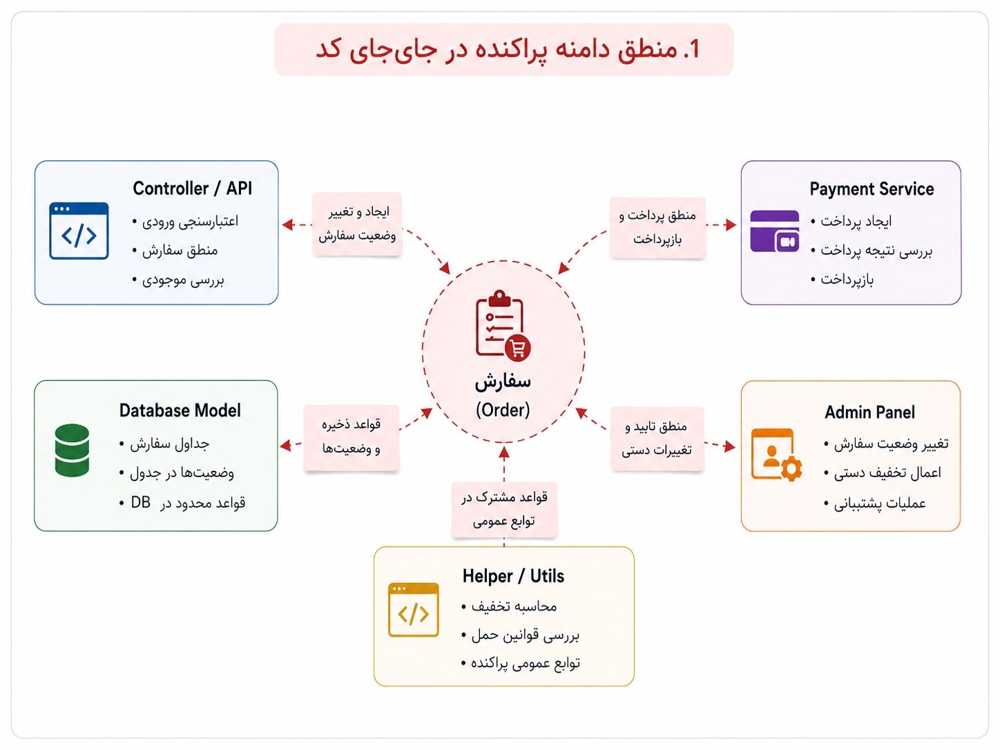
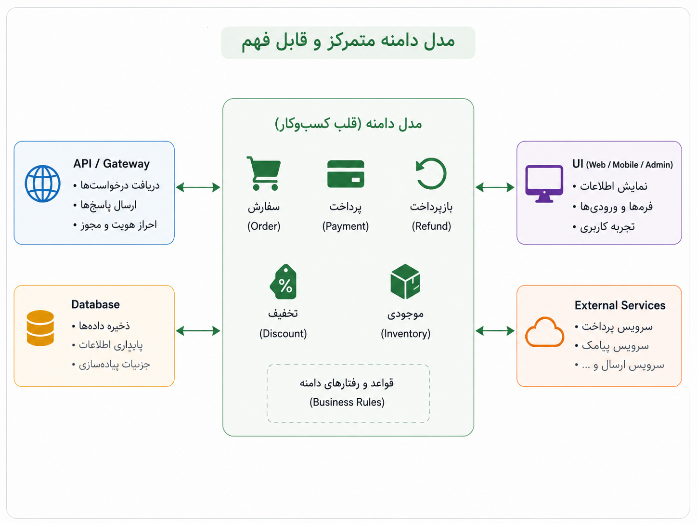

## وقتی زبان کسب‌وکار در کد گم می‌شود

اوایل کار، ثبت سفارش شاید خیلی ساده به نظر برسد. کاربر چیزی را انتخاب می‌کند، پرداخت انجام می‌شود، سفارش ثبت می‌شود و تمام. در چنین مرحله‌ای، چند تابع ساده و چند مسیر روشن شاید کاملاً کافی باشند. هنوز نه وضعیت‌های زیادی داریم، نه قانون‌های ریز و درشت، نه استثناهایی که هر هفته تغییر کنند.

اما محصول که رشد می‌کند، سفارش دیگر فقط «سفارش» نیست. تخفیف اضافه می‌شود، لغو سفارش می‌آید، بازپرداخت مطرح می‌شود، موجودی باید کنترل شود، وضعیت پرداخت اهمیت پیدا می‌کند، پشتیبانی می‌خواهد بعضی چیزها را دستی تغییر دهد، و برای هرکدام هم چند قاعده‌ی کوچک اما مهم داریم. کم‌کم می‌بینیم چیزی که در ظاهر یک قابلیت ساده بود، در عمل تبدیل شده به مجموعه‌ای از تصمیم‌های کسب‌وکاری.

مشکل از جایی شروع می‌شود که این تصمیم‌ها در کد پخش می‌شوند. کمی از منطق سفارش در کنترلر است، کمی در مدل پایگاه داده، کمی در سرویس پرداخت، کمی در پنل مدیریت، و کمی هم در یک تابع کمکی قدیمی که معلوم نیست دقیقاً چرا نوشته شده است. حالا اگر بخواهیم یک قانون کوچک را تغییر دهیم، باید چند جا را بگردیم و امیدوار باشیم چیزی از قلم نیفتاده باشد.

_در این وضعیت، مشکل فقط زیاد شدن کد نیست؛ مشکل این است که زبان کسب‌وکار در میان جزئیات فنی گم شده است._

اینجاست که طراحی دامنه‌محور یا Domain Driven Design، که معمولاً DDD گفته می‌شود، معنا پیدا می‌کند. من DDD را پیش از آنکه یک مجموعه اصطلاح یا الگوی پیاده‌سازی بدانم، تلاشی برای جدی گرفتن زبان مسئله می‌فهمم. یعنی اگر در کسب‌وکار ما مفاهیمی مثل سفارش، پرداخت، بازپرداخت، تخفیف، موجودی و تسویه مهم‌اند، در کد هم باید جای روشن و قابل فهم داشته باشند.

:::tip[ایده‌ی اصلی]
DDD می‌گوید کد نباید فقط بازتاب جدول‌ها، کنترلرها و مسیرهای فنی باشد. کد باید تا حد ممکن زبان مسئله را هم نشان دهد؛ همان واژه‌ها، همان قاعده‌ها و همان مرزهایی که اهل کسب‌وکار با آن‌ها فکر می‌کنند.
:::

در نگاه دامنه‌محور، به جای اینکه قانون‌های مهم را در گوشه‌وکنار سیستم پخش کنیم، تلاش می‌کنیم هسته‌ی مسئله را بهتر بشناسیم و مدل کنیم. مثلاً سفارش فقط یک ردیف در جدول نیست؛ رفتاری دارد، وضعیت دارد، قاعده دارد. پرداخت فقط یک فراخوانی به سرویس بیرونی نیست؛ نتیجه، شکست، بازگشت و اثر روی سفارش دارد. تخفیف فقط یک عدد کم‌شده از قیمت نیست؛ قانون اعتبار، زمان، محدودیت و شرایط استفاده دارد.

_وقتی مدل دامنه روشن‌تر باشد، تغییر دادن یک قانون کسب‌وکاری کمتر شبیه جست‌وجو در تاریکی می‌شود._

البته باید مراقب باشیم DDD را هم به یک نمایش معماری تبدیل نکنیم. طراحی دامنه‌محور یعنی از روز اول ده‌ها کلاس، اصطلاح، پوشه و مراسم پیچیده بسازیم؟ نه. اگر مسئله ساده است و قانون‌های کسب‌وکار هنوز کم و پایدارند، ساختار ساده می‌تواند کاملاً کافی باشد. DDD وقتی ارزشمند می‌شود که دامنه واقعاً پیچیده، تغییرپذیر و پرقاعده شده باشد؛ جایی که فهم مشترک از مسئله، خودش تبدیل به بخشی از کیفیت نرم‌افزار می‌شود.

:::warning[یک سوءبرداشت رایج]
DDD یعنی هر پروژه‌ای را از روز اول با واژه‌های سنگین، لایه‌های زیاد و مدل‌های پیچیده شروع کنیم؟ نه. DDD یعنی وقتی مسئله‌ی کسب‌وکار جدی و پیچیده شد، اجازه ندهیم زبان آن در میان جزئیات فنی گم شود.
:::

برای تشخیص اینکه هنوز ساختار ساده کافی است یا باید جدی‌تر به دامنه فکر کنیم، این مقایسه کمک می‌کند:

| وضعیت | احتمالاً چه نگاهی بهتر است؟ |
|---|---|
| محصول تازه است و قانون‌های کسب‌وکار کم‌اند | ساده نگه داشتن ساختار کافی است. |
| چند مفهوم کسب‌وکاری مدام در حال تغییرند | باید نام‌ها و مرزهای دامنه را جدی‌تر بگیریم. |
| یک قانون در چند جای کد تکرار شده است | نشانه‌ی پخش شدن منطق دامنه است. |
| تغییر یک قاعده‌ی کوچک چند بخش نامرتبط را درگیر می‌کند | مدل دامنه احتمالاً جای روشن و متمرکزی ندارد. |
| تیم فنی و تیم کسب‌وکار از واژه‌های متفاوت برای یک چیز استفاده می‌کنند | نیاز به زبان مشترک جدی‌تر شده است. |

  
یک نشانه‌ی ساده که می‌گوید دامنه را خوب مدل نکرده‌ایم

اگر برای توضیح یک قانون کسب‌وکاری، مجبوریم اول مسیر کنترلر، شکل جدول، چند شرط پراکنده و چند تابع کمکی را توضیح دهیم، احتمالاً مدل دامنه‌ی ما به زبان مسئله نزدیک نیست. در چنین وضعیتی، کد شاید کار کند، اما فهم آن به مرور سخت و پرهزینه می‌شود.

برای من، DDD قبل از آنکه جواب آماده باشد، یک یادآوری مهم است: نرم‌افزار فقط با فریم‌ورک و پایگاه داده و API ساخته نمی‌شود؛ با فهم درست مسئله هم ساخته می‌شود. هرچه قواعد کسب‌وکار مهم‌تر و تغییرپذیرتر شوند، لازم است این فهم در خود کد هم دیده شود، نه فقط در ذهن چند نفر یا در چند سند پراکنده.

وقتی این را بپذیریم، پرسش بعدی طبیعی می‌شود: اگر منطق دامنه قلب سیستم است، چطور نگذاریم زیر فشار پایگاه داده، فریم‌ورک، API بیرونی یا ابزارهای دیگر له شود؟ این همان جایی است که معماری شش‌ضلعی وارد داستان می‌شود.
