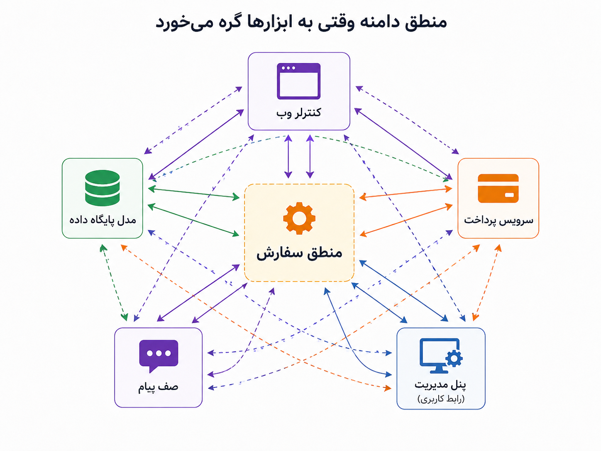
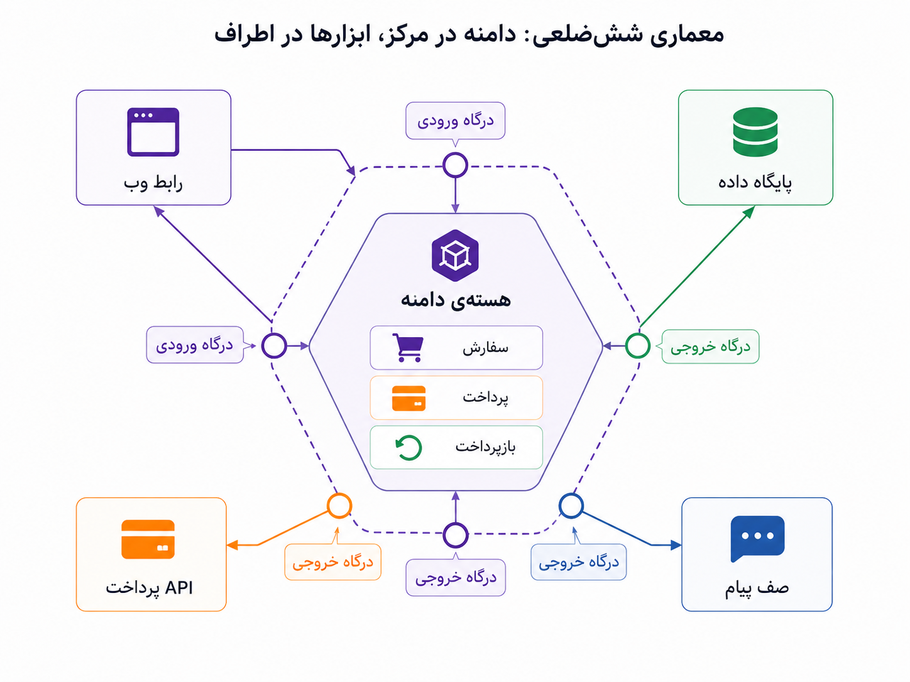

## وقتی قلب سیستم نباید اسیر ابزارهای اطرافش شود

در بخش قبل گفتیم منطق دامنه باید جای روشن‌تری در کد داشته باشد. یعنی اگر سفارش، پرداخت، بازپرداخت و تخفیف برای کسب‌وکار مهم‌اند، نباید در کنترلرها، مدل‌های پایگاه داده و چند تابع پراکنده گم شوند. اما این فقط نصف ماجراست. حتی اگر مفاهیم دامنه را خوب پیدا کنیم، باز هم ممکن است آن‌ها را زیر آوار ابزارها دفن کنیم.

فرض کنیم می‌خواهیم قانون لغو سفارش را تغییر دهیم. از نظر کسب‌وکار، قانون شاید ساده باشد: اگر سفارش هنوز وارد مرحله‌ی ارسال نشده، لغو مجاز است؛ اگر ارسال آغاز شده، باید چند شرط دیگر بررسی شود. اما وقتی وارد کد می‌شویم، می‌بینیم برای آزمودن همین قانون ساده باید پایگاه داده بالا باشد، فریم‌ورک وب اجرا شود، سرویس پرداخت شبیه‌سازی شود، تنظیمات محیطی آماده باشد و چند جزئیات فنی دیگر هم همراهش بیاید. اینجا درد اصلی روشن می‌شود: منطق دامنه را داریم، اما هنوز آزاد نیست.

_در این وضعیت، منطق سفارش در مرکز دیده می‌شود، اما از هر طرف به کنترلر، پایگاه داده، صف پیام، پنل مدیریت و سرویس پرداخت کشیده شده است._

معماری شش‌ضلعی یا Hexagonal Architecture پاسخی به همین فشار است. ایده‌ی اصلی‌اش این نیست که حتماً کد را به شکل یک شش‌ضلعی واقعی بچینیم یا از روز اول پوشه‌های زیاد بسازیم. حرف اصلی ساده‌تر است: هسته‌ی سیستم، یعنی منطق اصلی کسب‌وکار، باید تا حد ممکن مستقل از ابزارهای بیرونی بماند. پایگاه داده، فریم‌ورک وب، API پرداخت، صف پیام و رابط کاربری مهم‌اند، اما نباید شکل فکر کردن دامنه را تعیین کنند.

:::tip[ایده‌ی اصلی]
معماری شش‌ضلعی می‌گوید دامنه باید در مرکز بماند و ابزارها از بیرون به آن وصل شوند. یعنی ابزارها باید در خدمت منطق دامنه باشند، نه اینکه منطق دامنه را شبیه خودشان کنند.
:::

نسبت این بحث با طراحی دامنه‌محور مهم است. DDD کمک می‌کند بفهمیم «قلب مسئله» چیست و چه واژه‌ها و قاعده‌هایی برای کسب‌وکار مهم‌اند. معماری شش‌ضلعی کمک می‌کند از همان قلب محافظت کنیم تا با تغییر پایگاه داده، فریم‌ورک وب، سرویس پرداخت یا پیام‌رسان، منطق اصلی سیستم مدام زخمی نشود. پس این دو، دو جواب جدا برای یک مسئله نیستند؛ یکی بیشتر به فهم و مدل‌کردن دامنه کمک می‌کند، دیگری به مرزبندی و محافظت از آن مدل در برابر ابزارها.

:::note[فرق DDD و معماری شش‌ضلعی]
DDD بیشتر می‌پرسد: «مسئله‌ی اصلی کسب‌وکار چیست و با چه زبان و مدلی باید آن را بفهمیم؟» معماری شش‌ضلعی بیشتر می‌پرسد: «حالا که این مدل را جدی گرفتیم، چطور نگذاریم به دیتابیس، فریم‌ورک، API بیرونی و جزئیات زیرساختی گره بخورد؟»
:::

برای توضیح ساده‌ی این معماری، دو واژه‌ی مهم داریم: درگاه و سازگارکننده. درگاه یا Port یعنی هسته‌ی سیستم می‌گوید من برای انجام کارم به چه قابلیتی نیاز دارم؛ مثلاً ذخیره‌ی سفارش، گرفتن نتیجه‌ی پرداخت، ارسال پیام یا انتشار یک رخداد. سازگارکننده یا Adapter یعنی بخش بیرونی می‌آید و آن نیاز را با ابزار واقعی برآورده می‌کند؛ مثلاً با PostgreSQL، Redis، Kafka، یک API پرداخت یا هر ابزار دیگری.

_در این تصویر، دامنه در مرکز است. رابط وب، پایگاه داده، صف پیام و API پرداخت دور آن قرار گرفته‌اند، نه در دل آن._

مثلاً هسته‌ی سفارش لازم نیست بداند داده‌ها دقیقاً در کدام جدول ذخیره می‌شوند. کافی است بگوید «من به چیزی نیاز دارم که سفارش را ذخیره کند». بعد یک سازگارکننده‌ی واقعی می‌تواند این نیاز را با پایگاه داده پیاده کند. اگر روزی روش ذخیره‌سازی عوض شد، نباید قانون لغو سفارش یا منطق بازپرداخت را از نو بنویسیم. تغییر باید بیشتر در لبه‌ی سیستم رخ دهد، نه در قلب آن.

این جداسازی چند فایده‌ی مهم دارد. آزمون منطق دامنه ساده‌تر می‌شود، چون برای بررسی یک قانون کسب‌وکاری لازم نیست همه‌ی ابزارهای بیرونی را بالا بیاوریم. تغییر ابزارها هم کم‌خطرتر می‌شود، چون هسته‌ی سیستم کمتر به جزئیات آن‌ها وابسته است. از همه مهم‌تر، مرز ذهنی سیستم روشن‌تر می‌شود: می‌فهمیم کدام بخش واقعاً منطق کسب‌وکار است و کدام بخش فقط راهی برای اتصال این منطق به جهان بیرون.

| وضعیت | اگر مرزها مبهم باشند | اگر مرز شش‌ضلعی روشن‌تر باشد |
|---|---|---|
| تغییر قانون لغو سفارش | درگیر کنترلر، دیتابیس و سرویس پرداخت می‌شویم. | بیشتر در هسته‌ی دامنه تغییر می‌دهیم. |
| آزمودن منطق بازپرداخت | به فریم‌ورک، دیتابیس و تنظیمات محیطی وابسته می‌شویم. | می‌توانیم منطق را با جایگزین‌های ساده‌تر بیازماییم. |
| تعویض ابزار ذخیره‌سازی | خطر دست‌زدن به منطق کسب‌وکار زیاد می‌شود. | تغییر بیشتر در سازگارکننده‌ی ذخیره‌سازی رخ می‌دهد. |
| اتصال به سرویس پرداخت جدید | ممکن است قواعد پرداخت در همه‌جا پخش شوند. | سازگارکننده‌ی تازه می‌تواند پشت همان درگاه بنشیند. |

:::warning[یک سوءبرداشت رایج]
معماری شش‌ضلعی یعنی برای هر پروژه‌ی کوچک، از روز اول چندین لایه، درگاه، سازگارکننده و پوشه بسازیم؟ نه. اگر محصول هنوز ساده است و منطق کسب‌وکار کم و پایدار است، این حجم از جداسازی می‌تواند خودش هزینه‌ی اضافی بسازد. ارزش این معماری وقتی بیشتر می‌شود که دامنه مهم، ابزارها متنوع، و تغییرات بیرونی پرهزینه شده باشند.
:::

  
یک نشانه که می‌گوید مرز دامنه خوب محافظت نشده است

اگر برای تست یک قانون ساده‌ی کسب‌وکار باید وب‌سرور، پایگاه داده، صف پیام و چند سرویس بیرونی را همزمان درگیر کنیم، احتمالاً منطق دامنه بیش از حد به ابزارها چسبیده است. در چنین وضعیتی، مشکل فقط کندی تست نیست؛ مشکل این است که فهم و تغییر قلب سیستم به جزئیات بیرونی وابسته شده است.

برای من، معماری شش‌ضلعی ادامه‌ی طبیعی DDD است. DDD کمک می‌کند بفهمیم چه چیزی قلب مسئله است؛ معماری شش‌ضلعی کمک می‌کند آن قلب را از فشار ابزارها دور نگه داریم. نه چون ابزارها بی‌اهمیت‌اند، بلکه چون ابزارها باید قابل تعویض، قابل آزمون و در خدمت دامنه باشند.

وقتی هسته‌ی دامنه جای روشن‌تری پیدا می‌کند، پرسش بعدی هم آرام‌آرام پیدا می‌شود: آیا همیشه یک مدل واحد برای خواندن و نوشتن کافی است؟ یا گاهی فشار گزارش‌گیری، نمایش داده و تغییرات پیچیده باعث می‌شود مدل خواندن و نوشتن را جدا ببینیم؟ این همان جایی است که کم‌کم به CQRS نزدیک می‌شویم.
