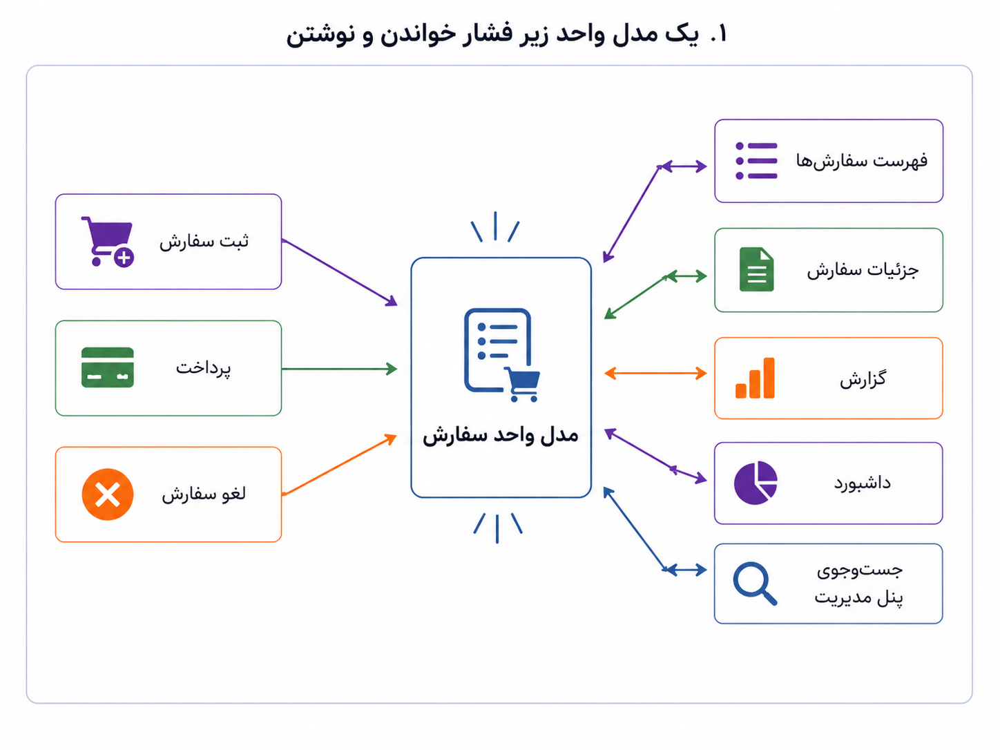
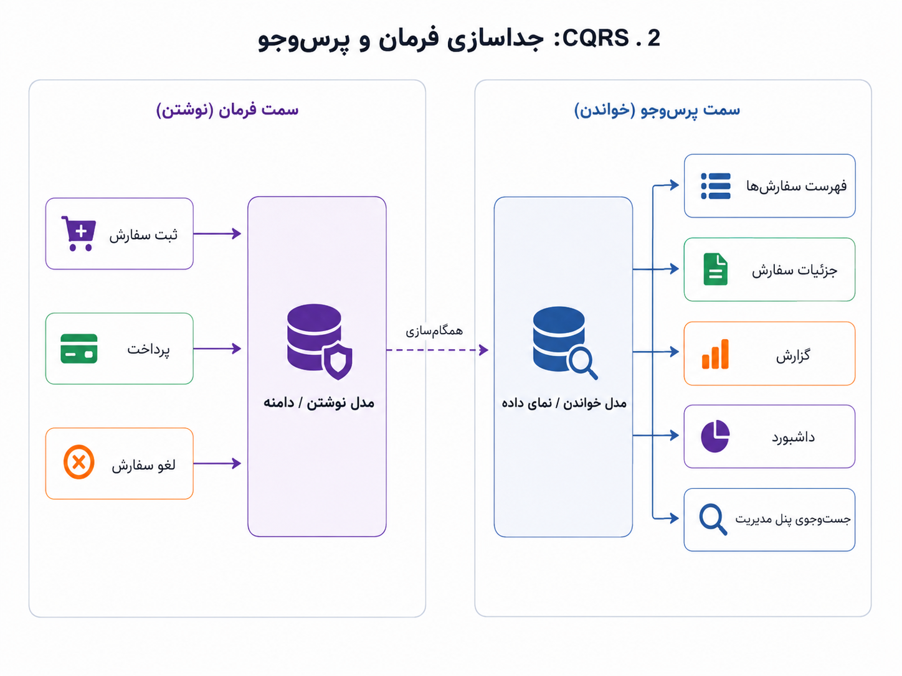

## وقتی خواندن و نوشتن نیازهای متفاوت پیدا می‌کنند

تا اینجا تلاش کرده‌ایم قلب سیستم را بهتر بشناسیم و از ابزارهای اطرافش جدا نگه داریم. با طراحی دامنه‌محور فهمیدیم سفارش، پرداخت، بازپرداخت و تخفیف فقط چند جدول نیستند؛ هرکدام رفتار و قاعده دارند. با معماری شش‌ضلعی هم گفتیم این منطق نباید به فریم‌ورک، پایگاه داده یا API بیرونی گره بخورد. اما وقتی سیستم بزرگ‌تر می‌شود، فشار تازه‌ای پیدا می‌شود: آیا همان مدلی که برای نوشتن و اجرای قانون مناسب است، برای خواندن، گزارش‌گیری و نمایش سریع هم مناسب می‌ماند؟

فرض کنیم برای ثبت سفارش، مدل نسبتاً خوبی داریم. وقتی کاربر سفارش ثبت می‌کند، موجودی بررسی می‌شود، وضعیت پرداخت درست پیش می‌رود، تخفیف اعتبارسنجی می‌شود و قانون‌های دامنه رعایت می‌شوند. این بخش از سیستم باید دقیق و سخت‌گیر باشد؛ چون دارد وضعیت واقعی سیستم را تغییر می‌دهد.

اما از سمت دیگر، نیازهای خواندن آرام‌آرام زیاد می‌شوند. برنامه‌ی موبایل فقط یک فهرست سبک و سریع از سفارش‌های کاربر می‌خواهد. پنل مدیریت می‌خواهد سفارش‌ها را بر اساس وضعیت پرداخت، شهر، روش ارسال، کد تخفیف، مبلغ، زمان ثبت و وضعیت پشتیبانی جست‌وجو کند. داشبورد مدیریتی تعداد سفارش‌های امروز، مبلغ کل، سفارش‌های لغوشده، میانگین زمان ارسال و نرخ بازپرداخت را می‌خواهد. این‌ها بیشتر از اینکه دنبال اجرای قانون باشند، دنبال نمای مناسب، سریع و قابل جست‌وجو از داده‌ها هستند.

_یک مدل واحد می‌تواند مدتی پاسخ‌گو باشد، اما وقتی نیازهای خواندن و نوشتن از دو جهت متفاوت رشد می‌کنند، همان مدل کم‌کم زیر فشار می‌رود._

اینجاست که CQRS مطرح می‌شود. CQRS کوتاه‌شده‌ی Command Query Responsibility Segregation است و می‌توان آن را «جداسازی مسئولیت فرمان و پرس‌وجو» ترجمه کرد. فرمان یعنی کاری که وضعیت سیستم را تغییر می‌دهد؛ مثل ثبت سفارش، پرداخت، لغو سفارش یا بازپرداخت. پرس‌وجو یعنی کاری که فقط داده را می‌خواند؛ مثل نمایش فهرست سفارش‌ها، گرفتن جزئیات سفارش، ساختن گزارش یا نمایش داشبورد.

:::tip[ایده‌ی اصلی]
CQRS می‌گوید گاهی بهتر است مسیر نوشتن و مسیر خواندن را جدا ببینیم. نوشتن بیشتر درگیر درستی، قواعد دامنه و تغییر وضعیت است؛ خواندن بیشتر درگیر سرعت، شکل مناسب داده، جست‌وجو و نمایش است.
:::

در ساده‌ترین برداشت، CQRS نمی‌گوید حتماً باید دو پایگاه داده، صف پیام، Kafka یا Event Sourcing داشته باشیم. گاهی جداسازی فقط در سطح کد است: یک مسیر برای فرمان‌ها و تغییر وضعیت، یک مسیر برای پرس‌وجوها و خواندن داده. در مرحله‌های پیچیده‌تر، ممکن است مدل خواندن جدا بسازیم؛ مثلاً جدولی آماده برای گزارش یا نمایی سبک برای موبایل. در سیستم‌های بزرگ‌تر، حتی ممکن است پایگاه داده‌ی خواندن و نوشتن هم جدا شوند. اما این‌ها پله‌های مختلف‌اند، نه تعریف اجباری CQRS.

_در این مدل، سمت فرمان مسئول تغییر وضعیت و رعایت قواعد دامنه است؛ سمت پرس‌وجو مسئول ساختن نماهای مناسب برای خواندن، گزارش و جست‌وجو._

نسبت CQRS با DDD و معماری شش‌ضلعی هم باید روشن باشد. DDD کمک می‌کند بفهمیم منطق دامنه چیست. معماری شش‌ضلعی کمک می‌کند این منطق را از ابزارهای بیرونی جدا نگه داریم. CQRS زمانی مطرح می‌شود که فشار خواندن و نوشتن از هم فاصله می‌گیرد. پس مسئله‌ی CQRS این نیست که «دامنه کجا باشد»، بلکه این است که «آیا مدل و مسیر خواندن باید همان مدل و مسیر نوشتن باشد؟»

:::note[فرق مسئله‌ها]
DDD بیشتر درباره‌ی فهم و مدل‌کردن زبان کسب‌وکار است. معماری شش‌ضلعی درباره‌ی محافظت از هسته‌ی دامنه در برابر ابزارهاست. CQRS درباره‌ی تفاوت نیازهای خواندن و نوشتن است. این سه می‌توانند کنار هم بیایند، اما هرکدام به درد متفاوتی پاسخ می‌دهند.
:::

این جداسازی می‌تواند چند فایده داشته باشد. مدل نوشتن می‌تواند تمیزتر و نزدیک‌تر به قواعد دامنه بماند، چون مجبور نیست همه‌ی نیازهای گزارش‌گیری و نمایش را هم در خود جا بدهد. مدل خواندن هم می‌تواند برای سرعت و شکل مناسب داده ساخته شود، بدون اینکه منطق اصلی سفارش و پرداخت را آلوده کند. برای مثال، ممکن است سمت نوشتن با مفهوم سفارش و وضعیت‌هایش کار کند، اما سمت خواندن یک نمای آماده داشته باشد که دقیقاً برای فهرست موبایل یا داشبورد مدیریتی طراحی شده است.

| وضعیت | مدل واحد احتمالاً کافی است؟ | CQRS چه زمانی ارزشمند می‌شود؟ |
|---|---|---|
| خواندن و نوشتن ساده و کم‌ترافیک‌اند | بله | معمولاً نیازی نیست. |
| گزارش‌ها و جست‌وجوها زیاد و پیچیده شده‌اند | شاید نه | وقتی کوئری‌ها مدل نوشتن را سنگین و آشفته می‌کنند. |
| مدل نوشتن پر از فیلدها و نیازهای نمایشی شده است | نه همیشه | وقتی نیازهای خواندن دارند منطق دامنه را آلوده می‌کنند. |
| خواندن باید بسیار سریع و متناسب با نماهای مختلف باشد | نه همیشه | وقتی نمای خواندن جدا می‌تواند فشار را کم کند. |
| داده‌ی خواندن ممکن است کمی با تأخیر به‌روز شود | بستگی دارد | وقتی تأخیر کوتاه پذیرفتنی است، جداسازی آسان‌تر می‌شود. |

:::warning[یک سوءبرداشت رایج]
CQRS یعنی حتماً معماری بزرگ، دو پایگاه داده، Event Sourcing و کلی زیرساخت تازه؟ نه. CQRS از یک ایده‌ی ساده شروع می‌شود: فرمان و پرس‌وجو نیازهای متفاوتی دارند. اینکه این جداسازی فقط در کد باشد یا تا سطح پایگاه داده و پیام‌رسان جلو برود، به اندازه و درد واقعی سیستم بستگی دارد.
:::

  
یک نشانه که می‌گوید شاید CQRS زود است

اگر هنوز گزارش‌ها ساده‌اند، ترافیک خواندن و نوشتن پایین است، و همان مدل داده بدون فشار جدی هم برای تغییر وضعیت و هم برای نمایش کافی است، آوردن CQRS احتمالاً زود است. در این مرحله، جداسازی بیش از حد می‌تواند فهم سیستم را سخت‌تر کند و هزینه‌ی نگه‌داری را بالا ببرد.

  
یک نشانه که می‌گوید شاید وقت فکر کردن به CQRS رسیده است

اگر هر نیاز نمایشی تازه باعث تغییر در مدل نوشتن می‌شود، گزارش‌ها کوئری‌های سنگین و شکننده می‌سازند، پنل مدیریت و داشبوردها مدام شکل متفاوتی از داده می‌خواهند، و منطق دامنه کم‌کم با نیازهای خواندن قاطی شده است، احتمالاً باید دست‌کم به جداسازی مسیر فرمان و پرس‌وجو فکر کنیم.

برای من، CQRS یک یادآوری مهم است: همه‌ی نیازهای سیستم از یک جنس نیستند. ثبت سفارش و لغو سفارش باید دقیق، قانون‌مند و محافظه‌کار باشد. فهرست سفارش‌ها و گزارش مدیریتی باید سریع، قابل جست‌وجو و مناسب نمایش باشد. اگر این دو نیاز هنوز ساده‌اند، یک مدل واحد کافی است. اما وقتی از هم فاصله گرفتند، جدا دیدن آن‌ها می‌تواند سیستم را قابل فهم‌تر و قابل تغییرتر کند.

این جداسازی آرام‌آرام ما را به یک سؤال بعدی می‌رساند: اگر تغییرهای مهم سیستم را فقط به‌صورت وضعیت نهایی ذخیره نکنیم و خود رخدادهای مهم را هم نگه داریم چه می‌شود؟ اینجا وارد بحث Event Sourcing می‌شویم.
