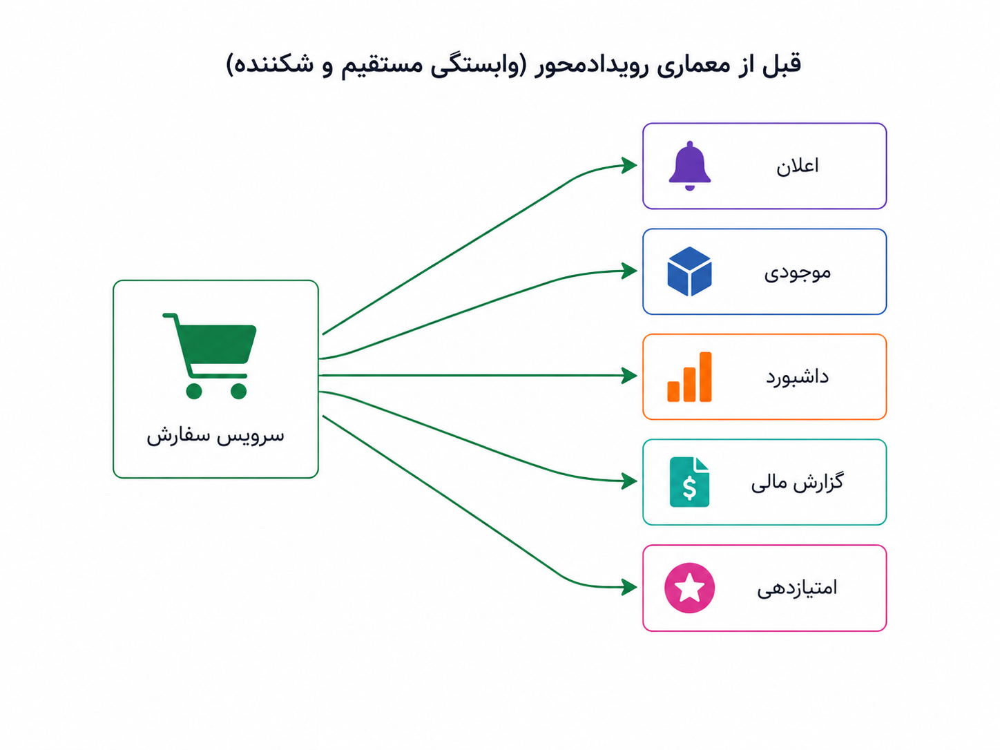
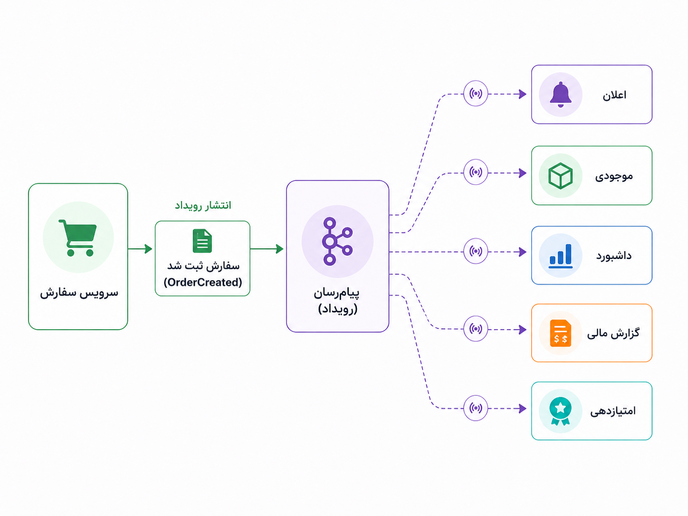

## وقتی سیستم باید خبر بدهد، نه اینکه همه را مستقیم صدا بزند

تا اینجا چند بار با یک الگوی تکرارشونده روبه‌رو شدیم: هرچه محصول رشد می‌کند، یک تصمیم ساده‌ی دیروز کم‌کم زیر فشار نیازهای تازه قرار می‌گیرد. در CQRS گفتیم خواندن و نوشتن ممکن است نیازهای متفاوتی پیدا کنند. حالا می‌خواهیم از زاویه‌ی دیگری به رشد سیستم نگاه کنیم: وقتی یک اتفاق در سیستم می‌افتد، چند بخش دیگر باید از آن باخبر شوند؟

فرض کنیم کاربر سفارشی ثبت می‌کند و پرداخت هم موفق می‌شود. در نگاه ساده، شاید بگوییم سفارش ثبت شد و تمام. اما در محصول واقعی، این اتفاق فقط برای سرویس سفارش مهم نیست. موجودی باید کم شود، برای کاربر اعلان فرستاده شود، داشبورد فروش باید به‌روز شود، گزارش مالی بعداً باید آن را حساب کند، و شاید سیستم امتیازدهی هم بخواهد به رفتار کاربر واکنش نشان دهد.

اگر سرویس سفارش بخواهد همه‌ی این کارها را خودش و به‌صورت مستقیم انجام دهد، خیلی زود گرفتار زنجیره‌ای از وابستگی‌ها می‌شود. باید سرویس اعلان را بشناسد، سرویس موجودی را صدا بزند، گزارش مالی را خبر کند، داشبورد را به‌روز کند و با سیستم امتیازدهی هم هماهنگ شود. حالا اگر یکی از این بخش‌ها کند یا خراب شود، مسیر اصلی ثبت سفارش هم ممکن است آسیب ببیند.

_وقتی یک سرویس مجبور است همه‌ی واکنش‌های بعد از یک اتفاق را خودش مدیریت کند، وابستگی‌ها زیاد و شکننده می‌شوند._

معماری رویدادمحور یا Event-Driven Architecture از همین‌جا معنا پیدا می‌کند. ایده‌اش این است که به‌جای اینکه سرویس سفارش همه را مستقیم صدا بزند، فقط یک خبر رسمی منتشر کند: «سفارش ثبت شد». بعد هر بخشی که به این اتفاق علاقه دارد، واکنش خودش را انجام می‌دهد. سرویس اعلان پیام می‌فرستد، سرویس موجودی مقدار کالا را کم می‌کند، داشبورد داده‌ی خودش را به‌روز می‌کند و گزارش مالی هم مسیر خودش را می‌رود.

:::tip[ایده‌ی اصلی]
در معماری رویدادمحور، یک بخش لازم نیست همه‌ی واکنش‌های بعد از یک اتفاق را مستقیم مدیریت کند. کافی است رخداد مهم را منتشر کند و بخش‌های علاقه‌مند، مستقل‌تر به آن واکنش نشان دهند.
:::

رویداد با دستور مستقیم فرق دارد. وقتی می‌گوییم «سفارش ثبت شد»، داریم درباره‌ی چیزی خبر می‌دهیم که قبلاً رخ داده است. اما وقتی می‌گوییم «به کاربر پیامک بفرست»، داریم به یک بخش دیگر دستور می‌دهیم کاری انجام دهد. این تفاوت کوچک، در طراحی سیستم مهم است. رخداد، سرویس منتشرکننده را از دانستن جزئیات واکنش‌های بعدی آزادتر می‌کند.

_سرویس سفارش لازم نیست همه‌ی مصرف‌کننده‌ها را بشناسد؛ فقط خبر رسمی اتفاق را منتشر می‌کند._

برای رساندن این رخدادها معمولاً یک پیام‌رسان یا واسط ارتباطی در میان قرار می‌گیرد؛ چیزی که پیام را از تولیدکننده می‌گیرد و به مصرف‌کننده‌ها می‌رساند. در این بخش لازم نیست وارد جزئیات ابزارهایی مثل Kafka یا RabbitMQ شویم؛ فعلاً همین قدر کافی است که بدانیم پیام‌رسان کمک می‌کند تولیدکننده‌ی رخداد و مصرف‌کننده‌های آن کمتر به هم قفل شوند. جزئیات صف پیام، الگوهای مصرف، تکرار پیام و تفاوت ابزارها را جداگانه در بخش Message Queue باز می‌کنیم.

نکته‌ی مهم این است که معماری رویدادمحور فقط مزیت نیست؛ پیچیدگی تازه هم می‌آورد. در مدل مستقیم، مسیر اجرا معمولاً واضح‌تر است: این سرویس آن سرویس را صدا زد و پاسخ گرفت. اما در مدل رویدادمحور، یک رخداد منتشر می‌شود و چند مصرف‌کننده بعداً واکنش نشان می‌دهند. ممکن است پیام دیر برسد، دوباره برسد، مصرف‌کننده‌ای موقتاً از کار بیفتد، یا فهمیدن مسیر کامل یک اتفاق سخت‌تر شود. پس آزادی بیشتر، با مسئولیت عملیاتی بیشتر همراه است.

:::warning[یک سوءبرداشت رایج]
رویدادمحور کردن سیستم یعنی هر تغییر کوچک را تبدیل به رخداد کنیم و همه‌چیز را از مسیر پیام‌ها بگذرانیم؟ نه. اگر سیستم کوچک است و واکنش‌ها ساده و کم‌اند، فراخوانی مستقیم می‌تواند خواناتر و کم‌هزینه‌تر باشد. معماری رویدادمحور وقتی ارزشمند می‌شود که یک اتفاق برای چند بخش مهم باشد و نخواهیم همه‌ی آن بخش‌ها مستقیم و هم‌زمان به هم گره بخورند.
:::

اینجا بد نیست خیلی کوتاه مرز CDC را هم روشن کنیم. گرفتن تغییرات داده یا Change Data Capture، که معمولاً CDC گفته می‌شود، یعنی تغییرهای پایگاه داده را دنبال کنیم و آن‌ها را به جریان پیام یا رخداد تبدیل کنیم. مثلاً وقتی ردیفی در جدول سفارش‌ها اضافه می‌شود یا وضعیت سفارشی تغییر می‌کند، CDC می‌تواند این تغییر را بخواند و برای بخش‌های دیگر منتشر کند.

:::note[CDC کجای داستان می‌نشیند؟]
در معماری رویدادمحور، رخداد می‌تواند آگاهانه از دل منطق دامنه منتشر شود؛ مثلاً سرویس سفارش بعد از ثبت موفق سفارش، رخداد «سفارش ثبت شد» را منتشر کند. CDC اما معمولاً از تغییرهای پایگاه داده خبر می‌سازد. پس CDC می‌تواند راهی عملی برای وصل کردن سیستم‌های قدیمی یا داده‌محور به جریان پیام‌ها باشد، اما همان Event Sourcing نیست.
:::

برای اینکه مرز این مفهوم‌ها با بخش‌های قبلی و بعدی روشن بماند، می‌شود این‌طور نگاه کرد:

| مفهوم | پرسش اصلی | چیزی که در این بخش نباید با آن قاطی شود |
|---|---|---|
| CQRS | آیا خواندن و نوشتن نیازهای متفاوتی دارند؟ | قرار نیست هر جداسازی خواندن و نوشتن حتماً رویدادمحور باشد. |
| معماری رویدادمحور | وقتی اتفاقی افتاد، چه بخش‌هایی باید باخبر شوند؟ | قرار نیست رخدادها الزاماً منبع اصلی حقیقت باشند. |
| CDC | اگر تغییر در پایگاه داده رخ داد، چطور دیگران باخبر شوند؟ | CDC با رخداد دامنه و Event Sourcing یکی نیست. |
| Event Sourcing | اگر خود رخدادها منبع اصلی حقیقت باشند چه؟ | این پرسش را در بخش بعدی باز می‌کنیم. |

  
یک نشانه که می‌گوید شاید معماری رویدادمحور کمک کند

اگر بعد از یک اتفاق مهم، چند بخش مستقل باید واکنش نشان دهند و اضافه‌کردن هر واکنش تازه باعث تغییر در سرویس اصلی می‌شود، احتمالاً وابستگی‌ها زیادی مستقیم شده‌اند. در این نقطه، انتشار رخداد می‌تواند کمک کند سرویس اصلی فقط خبر اتفاق را بدهد و واکنش‌های بعدی در بخش‌های جدا انجام شوند.

  
یک نشانه که می‌گوید شاید هنوز زود است

اگر فقط دو بخش ساده با هم حرف می‌زنند، مسیر اجرا باید کاملاً هم‌زمان و قابل پیش‌بینی باشد، و پیچیدگی عملیاتی پیام‌رسان برای تیم سنگین است، رویدادمحوری کامل ممکن است بیشتر از آنکه کمک کند، فهم و عیب‌یابی سیستم را سخت کند.

برای من، معماری رویدادمحور یعنی پذیرفتن اینکه بعضی اتفاق‌ها فقط متعلق به یک بخش نیستند. سفارش ثبت می‌شود، اما اعلان، موجودی، داشبورد و گزارش هم از آن تأثیر می‌گیرند. به‌جای اینکه سرویس سفارش همه را مستقیم بشناسد، می‌تواند خبر رسمی اتفاق را منتشر کند و بقیه‌ی بخش‌ها مستقل‌تر واکنش نشان دهند.

تا اینجا رخدادها را مثل خبرهایی دیدیم که بین بخش‌های سیستم جابه‌جا می‌شوند. اما اگر این رخدادها فقط پیام گذرا نباشند و خودشان منبع اصلی حقیقت سیستم شوند چه؟ این پرسش ما را به Event Sourcing می‌رساند.
