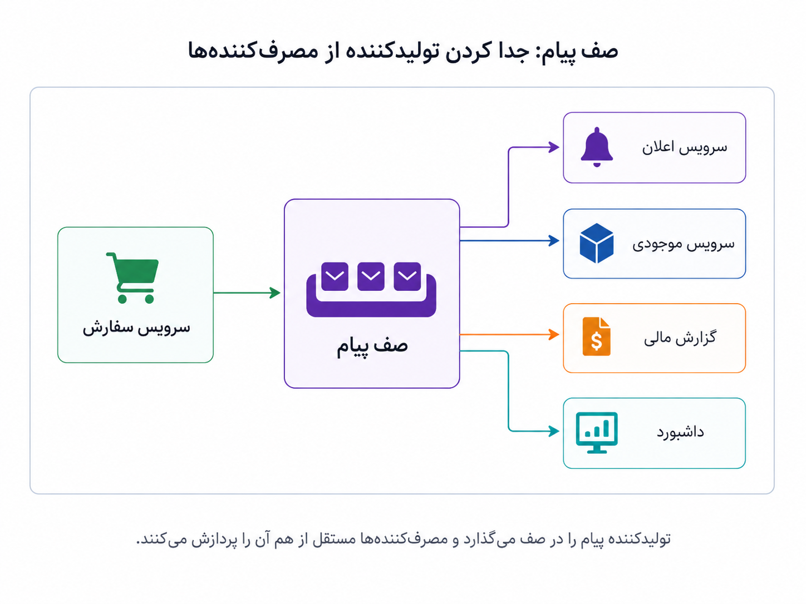
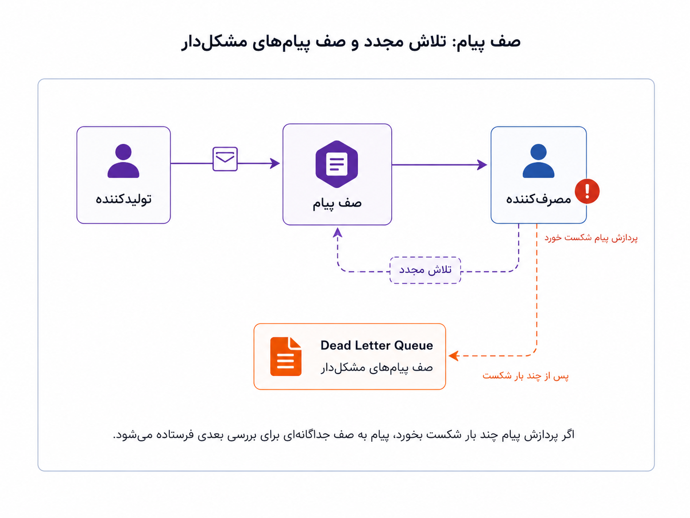

## وقتی پیام‌ها باید امن و قابل‌اعتماد جابه‌جا شوند

در بخش قبل گفتیم معماری رویدادمحور کمک می‌کند سرویس‌ها به‌جای صدا زدن مستقیم یکدیگر، خبر اتفاق‌های مهم را منتشر کنند. سرویس سفارش لازم نیست خودش اعلان بفرستد، موجودی کم کند، داشبورد را به‌روز کند و گزارش مالی بسازد. می‌تواند بگوید «سفارش ثبت شد» و بخش‌های علاقه‌مند، هرکدام واکنش خودشان را انجام دهند.

اما این حرف یک پرسش عملی مهم را باز می‌گذارد: این پیام‌ها قرار است از کجا عبور کنند؟ اگر سرویس اعلان لحظه‌ای از کار افتاده باشد چه؟ اگر سرویس گزارش مالی کندتر از بقیه پردازش کند چه؟ اگر پیام به مصرف‌کننده رسید اما پردازش آن شکست خورد چه؟ اینجاست که صف پیام یا Message Queue وارد داستان می‌شود.

صف پیام را می‌توان مثل یک فضای میانی میان تولیدکننده و مصرف‌کننده دید. تولیدکننده پیام را در صف می‌گذارد و لازم نیست منتظر بماند همه‌ی مصرف‌کننده‌ها همان لحظه کارشان را انجام دهند. مصرف‌کننده‌ها هم با سرعت و توان خودشان پیام‌ها را می‌خوانند و پردازش می‌کنند. این فاصله‌ی کوچک، در سیستم‌های بزرگ ارزش زیادی دارد؛ چون دو طرف را از وضعیت لحظه‌ای هم آزادتر می‌کند.

_تولیدکننده پیام را در صف می‌گذارد و مصرف‌کننده‌ها مستقل از هم آن را پردازش می‌کنند._

:::tip[ایده‌ی اصلی]
صف پیام کمک می‌کند تولیدکننده و مصرف‌کننده کمتر به زمان، سرعت و وضعیت لحظه‌ای هم وابسته باشند. تولیدکننده پیام را تحویل می‌دهد؛ مصرف‌کننده‌ها بعداً آن را می‌خوانند، پردازش می‌کنند و نتیجه‌ی کار خودشان را جلو می‌برند.
:::

در ساده‌ترین شکل، چند نقش اصلی داریم. تولیدکننده یا Producer بخشی است که پیام را می‌فرستد؛ مثلاً سرویس سفارش. مصرف‌کننده یا Consumer بخشی است که پیام را می‌خواند و کاری انجام می‌دهد؛ مثلاً سرویس اعلان یا گزارش مالی. خود صف یا موضوع، جایی است که پیام‌ها در آن قرار می‌گیرند. بعضی ابزارها بیشتر با واژه‌ی صف شناخته می‌شوند، بعضی با مفهوم جریان یا موضوع، اما ایده‌ی پایه یکی است: پیام‌ها باید جایی قرار بگیرند تا بین بخش‌های سیستم جابه‌جا شوند.

اینجا تفاوت Message Queue با معماری رویدادمحور هم مهم است. معماری رویدادمحور می‌گوید بخش‌های سیستم می‌توانند با خبر دادن درباره‌ی اتفاق‌ها با هم هماهنگ شوند. صف پیام بیشتر درباره‌ی زیرساخت رساندن آن خبرهاست. یعنی EDA بیشتر سبک طراحی ارتباط است، اما Message Queue ابزار و سازوکاری است برای اینکه این ارتباط عملی‌تر، قابل تحمل‌تر و قابل بازیابی‌تر شود.

:::note[فرق با بخش قبل]
در بخش Event-Driven Architecture پرسیدیم «وقتی اتفاقی افتاد، چه بخش‌هایی باید باخبر شوند؟» در این بخش می‌پرسیم «این خبر چطور قابل اعتماد جابه‌جا شود، اگر مصرف‌کننده کند بود یا پردازش شکست خورد چه کنیم؟»
:::

یکی از نکته‌های مهم در صف پیام، تأیید پردازش است. مصرف‌کننده معمولاً بعد از اینکه پیام را گرفت و کارش را انجام داد، به صف اعلام می‌کند که پیام با موفقیت پردازش شده است. اگر پردازش شکست بخورد، سیستم می‌تواند پیام را دوباره برای تلاش بعدی نگه دارد یا بعد از چند بار شکست، آن را به جای جداگانه‌ای بفرستد تا بعداً بررسی شود. به این جای جداگانه معمولاً صف پیام‌های مشکل‌دار یا Dead Letter Queue گفته می‌شود.

_همه‌ی خطاها نباید مسیر اصلی را متوقف کنند؛ بعضی پیام‌ها می‌توانند دوباره پردازش شوند یا برای بررسی جدا شوند._

اما صف پیام هم جادو نمی‌کند. وقتی پیام‌ها غیرهم‌زمان جابه‌جا می‌شوند، باید با چند واقعیت کنار بیاییم. ممکن است یک پیام بیش از یک بار به مصرف‌کننده برسد، پس مصرف‌کننده باید تا حد ممکن در برابر پردازش تکراری مقاوم باشد. ممکن است ترتیب پیام‌ها مهم باشد، پس باید بدانیم ابزار و طراحی ما چه تضمینی درباره‌ی ترتیب می‌دهد. ممکن است مصرف‌کننده عقب بماند و صف بزرگ شود. ممکن است پیام‌ها در یک بخش پردازش شوند و در بخش دیگر هنوز نه، و این یعنی سیستم برای مدتی در وضعیت کاملاً هم‌زمان و یکدست نیست.

| مسئله | پرسشی که باید از خودمان بپرسیم |
|---|---|
| پیام تکراری | اگر همین پیام دوبار برسد، آیا نتیجه خراب می‌شود؟ |
| ترتیب پیام‌ها | آیا ترتیب رخدادها برای این مصرف‌کننده مهم است؟ |
| شکست پردازش | بعد از شکست، پیام باید دوباره امتحان شود یا کنار گذاشته شود؟ |
| عقب‌ماندن مصرف‌کننده | اگر مصرف‌کننده کند شد، صف چقدر می‌تواند رشد کند؟ |
| مشاهده‌پذیری | از کجا بفهمیم پیام کجا گیر کرده یا چند بار شکست خورده است؟ |

در این فضا نام ابزارهایی مثل RabbitMQ و Kafka زیاد شنیده می‌شود. برای فهم اولیه، می‌شود خیلی ساده گفت RabbitMQ بیشتر با الگوی صف، تحویل پیام و پردازش کارها شناخته می‌شود. Kafka بیشتر شبیه یک جریان پایدار از پیام‌ها و رخدادهاست که پیام‌ها را برای مدتی نگه می‌دارد و مصرف‌کننده‌های مختلف می‌توانند از آن بخوانند. این توضیح کامل نیست، اما برای جایگاه ذهنی کافی است: هر دو برای جابه‌جایی پیام استفاده می‌شوند، اما نگاه و نقطه‌ی قوتشان یکسان نیست.

:::warning[یک سوءبرداشت رایج]
صف پیام یعنی سیستم خودبه‌خود ساده‌تر و مطمئن‌تر می‌شود؟ نه. صف پیام وابستگی مستقیم را کمتر می‌کند و تحمل خطا را بهتر می‌کند، اما عیب‌یابی، پایش، ترتیب پیام‌ها، پیام‌های تکراری و وضعیت‌های نیمه‌کاره را هم وارد داستان می‌کند.
:::

  
چه زمانی هنوز به صف پیام نیاز نداریم؟

اگر دو بخش ساده با هم ارتباط مستقیم دارند، پاسخ هم‌زمان لازم است، ترافیک پایین است و شکست یک بخش مسیر پیچیده‌ای ایجاد نمی‌کند، اضافه کردن صف پیام ممکن است زود باشد. در چنین مرحله‌ای، ارتباط مستقیم شاید خواناتر و کم‌هزینه‌تر باشد.

  
چه زمانی صف پیام ارزشمندتر می‌شود؟

اگر یک اتفاق باید چند مصرف‌کننده‌ی مستقل را خبر کند، مصرف‌کننده‌ها سرعت‌های متفاوت دارند، بعضی کارها می‌توانند با تأخیر انجام شوند، یا نمی‌خواهیم خطای یک مصرف‌کننده مسیر اصلی را خراب کند، صف پیام می‌تواند کمک کند. البته به شرطی که برای پایش، تلاش مجدد و پیام‌های مشکل‌دار هم فکر کرده باشیم.

برای من، صف پیام یعنی پذیرفتن اینکه همه‌ی بخش‌های سیستم لازم نیست هم‌زمان و مستقیم به هم قفل باشند. بعضی کارها می‌توانند کمی دیرتر، مستقل‌تر و با امکان تلاش دوباره انجام شوند. این استقلال ارزشمند است، اما فقط وقتی که هزینه‌های عملیاتی آن را هم بپذیریم.

تا اینجا پیام‌ها را به‌عنوان چیزهایی دیدیم که بین بخش‌های سیستم جابه‌جا می‌شوند. اما یک پرسش عمیق‌تر باقی می‌ماند: اگر این رخدادها فقط پیام‌های عبوری نباشند و خودشان تاریخچه‌ی رسمی سیستم و منبع اصلی حقیقت شوند چه؟ این همان جایی است که وارد Event Sourcing می‌شویم.
