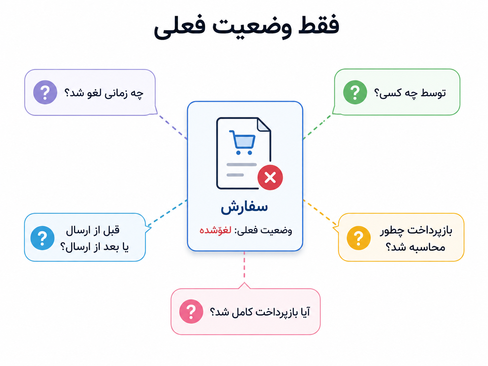
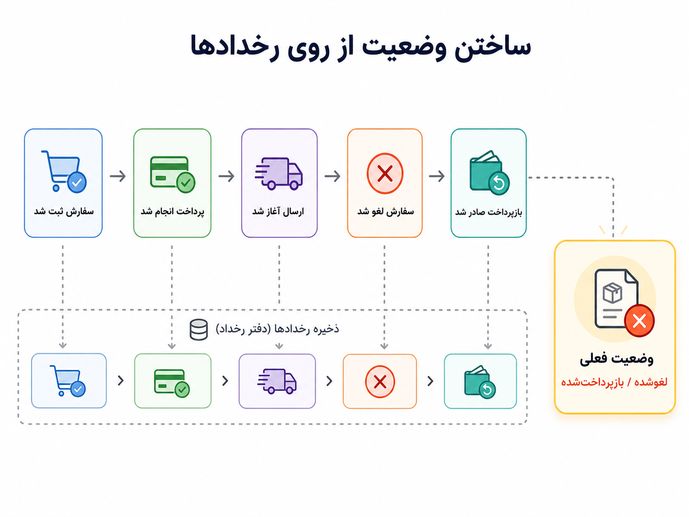

## وقتی فقط وضعیت فعلی کافی نیست

در بخش‌های قبل، رخدادها را از دو زاویه دیدیم. در معماری رویدادمحور، رخداد راهی بود برای خبر دادن به بخش‌های دیگر سیستم. در صف پیام، درباره‌ی این حرف زدیم که پیام‌ها و رخدادها چطور میان تولیدکننده و مصرف‌کننده جابه‌جا شوند. اما Event Sourcing پرسش دیگری دارد: اگر خود رخدادها فقط پیام عبوری نباشند و تاریخچه‌ی رسمی سیستم را بسازند چه؟

فرض کنیم کاربری به پشتیبانی پیام می‌دهد و می‌گوید: «من سفارشم را لغو کردم، ولی چرا فقط بخشی از پولم برگشته؟» پشتیبانی وارد پنل می‌شود و فقط یک چیز می‌بیند: وضعیت سفارش «لغوشده» است. این اطلاعات بد نیست، اما کافی هم نیست. برای فهمیدن ماجرا باید بدانیم سفارش چه زمانی ثبت شد، پرداخت چه زمانی انجام شد، لغو قبل از ارسال بود یا بعد از آن، لغو را خود کاربر انجام داد یا پشتیبانی، قانون بازپرداخت در آن لحظه چه بوده، و آیا بازپرداخت کامل شده یا فقط آغاز شده است.

اینجا مشکل روشن می‌شود: وضعیت فعلی فقط آخر داستان را نشان می‌دهد، نه مسیر رسیدن به آن را.

_اگر فقط بدانیم سفارش «لغوشده» است، هنوز نمی‌دانیم چه اتفاق‌هایی باعث رسیدن سفارش به این وضعیت شده‌اند._

در مدل معمول، بیشتر با وضعیت فعلی کار می‌کنیم. مثلاً در جدول سفارش، یک فیلد داریم که می‌گوید سفارش الان پرداخت‌شده، ارسال‌شده یا لغوشده است. اما در Event Sourcing، منبع اصلی حقیقت فقط وضعیت نهایی نیست؛ رخدادهایی است که در طول زمان اتفاق افتاده‌اند. یعنی به جای اینکه فقط بگوییم سفارش الان چه وضعیتی دارد، تاریخچه‌ی اتفاق‌ها را نگه می‌داریم.

برای یک سفارش، این رخدادها می‌توانند چنین چیزهایی باشند: سفارش ثبت شد، پرداخت انجام شد، ارسال آغاز شد، سفارش لغو شد، بازپرداخت صادر شد. بعد وضعیت فعلی سفارش از روی همین رخدادها ساخته می‌شود. در این نگاه، وضعیت فعلی نتیجه‌ی تاریخچه است؛ نه جایگزین تاریخچه.

:::tip[ایده‌ی اصلی]
در Event Sourcing، رخدادها منبع اصلی حقیقت‌اند. یعنی سیستم می‌تواند وضعیت فعلی را با خواندن و اعمال کردن رخدادهای گذشته بازسازی کند.
:::

_رخدادها فقط خبرهای پراکنده نیستند؛ تاریخچه‌ای هستند که وضعیت فعلی از روی آن‌ها ساخته می‌شود._

مرز این مفهوم با فصل‌های قبلی مهم است. در معماری رویدادمحور، شاید رخداد را برای خبر دادن به سرویس‌های دیگر منتشر کنیم. در صف پیام، درباره‌ی رساندن و پردازش همین پیام‌ها حرف زدیم. اما در Event Sourcing، رخدادها نقش عمیق‌تری دارند: آن‌ها حافظه‌ی رسمی سیستم‌اند. حتی اگر هیچ سرویس دیگری رخدادها را مصرف نکند، خود سیستم می‌تواند برای بازسازی وضعیت، حسابرسی یا تحلیل خطا به آن‌ها تکیه کند.

:::note[فرق با رخدادمحوری و صف پیام]
رخدادمحوری می‌پرسد «چه بخش‌هایی باید از یک اتفاق باخبر شوند؟» صف پیام می‌پرسد «این خبر چطور قابل اعتماد جابه‌جا شود؟» Event Sourcing می‌پرسد «آیا خود رخدادها منبع حقیقت و تاریخچه‌ی رسمی سیستم هستند؟»
:::

Event Sourcing را نباید با لاگ معمولی هم یکی گرفت. لاگ عملیاتی معمولاً برای مشاهده، عیب‌یابی و فهم رفتار سیستم نوشته می‌شود. اما رخداد در Event Sourcing بخشی از مدل اصلی سیستم است. اگر رخدادهای سفارش را از دست بدهیم، فقط چند خط گزارش را از دست نداده‌ایم؛ بخشی از حقیقت سیستم را از دست داده‌ایم.

همچنین Event Sourcing الزاماً همان CQRS نیست. ممکن است سیستمی CQRS داشته باشد، اما رخدادها را منبع حقیقت نداند. ممکن است Event Sourcing داشته باشیم و بعد برای خواندن سریع‌تر، مدل‌های خواندن جدا بسازیم؛ در این حالت این دو کنار هم می‌آیند. اما یکی تعریف دیگری نیست. CQRS درباره‌ی جداسازی خواندن و نوشتن است؛ Event Sourcing درباره‌ی این است که وضعیت از روی رخدادهای ذخیره‌شده ساخته شود.

| مفهوم | پرسش اصلی | اشتباه رایج |
|---|---|---|
| CQRS | آیا خواندن و نوشتن نیازهای متفاوتی دارند؟ | فکر کنیم هر CQRS یعنی Event Sourcing. |
| معماری رویدادمحور | چه بخش‌هایی باید از اتفاق‌ها باخبر شوند؟ | فکر کنیم هر رخداد منتشرشده منبع حقیقت است. |
| صف پیام | پیام‌ها چطور قابل اعتماد جابه‌جا شوند؟ | فکر کنیم وجود Kafka یا RabbitMQ یعنی Event Sourcing داریم. |
| Event Sourcing | آیا رخدادها تاریخچه‌ی رسمی و منبع حقیقت سیستم‌اند؟ | فکر کنیم Event Sourcing فقط یک لاگ مفصل‌تر است. |

این سبک چند مزیت جدی دارد. برای حسابرسی و پشتیبانی، تاریخچه‌ی دقیق‌تری از اتفاق‌ها داریم. اگر لازم باشد بفهمیم چرا یک سفارش به وضعیت فعلی رسیده، می‌توانیم مسیر رخدادها را دنبال کنیم. اگر باگی در محاسبه‌ی وضعیت پیدا شود، گاهی می‌توان با منطق اصلاح‌شده، وضعیت را از روی رخدادهای گذشته دوباره ساخت. همچنین می‌توان از همان تاریخچه برای ساختن نماهای خواندن، گزارش‌ها یا تحلیل‌های تازه استفاده کرد.

اما این مزایا ارزان به دست نمی‌آیند. ترتیب رخدادها مهم می‌شود. نسخه‌بندی رخدادها دردسر دارد؛ چون رخدادهای قدیمی ممکن است با شکل جدید کد یکی نباشند. بازسازی وضعیت باید دقیق و قابل اعتماد باشد. حذف یا اصلاح داده‌ها ساده نیست، چون تاریخچه بخشی از حقیقت سیستم است. خواندن داده هم گاهی مستقیم و ساده مثل خواندن یک ردیف از جدول نیست و به مدل‌های خواندن جدا نیاز پیدا می‌کند.

:::warning[یک سوءبرداشت رایج]
Event Sourcing را نباید فقط برای خاص‌تر کردن معماری وارد سیستم کنیم. اگر مسئله‌ی ما CRUD ساده است، تاریخچه‌ی دقیق برای تصمیم‌های کسب‌وکار مهم نیست، و نگه‌داری رخدادها ارزش روشن ندارد، این الگو می‌تواند بیش از آنکه کمک کند، مدل ذهنی و پیاده‌سازی را سنگین کند.
:::

  
چه زمانی Event Sourcing می‌تواند ارزشمند باشد؟

وقتی تاریخچه‌ی دقیق برای حسابرسی، پشتیبانی، بازسازی وضعیت، تحلیل خطا یا فهم تصمیم‌های کسب‌وکار مهم است، Event Sourcing می‌تواند گزینه‌ی جدی‌تری باشد. مثلاً در سیستم‌هایی که مسیر رسیدن به یک وضعیت به اندازه‌ی خود وضعیت اهمیت دارد، نگه داشتن رخدادها ارزش واقعی پیدا می‌کند.

  
چه زمانی احتمالاً زیاده‌روی است؟

اگر فقط چند موجودیت ساده داریم، بیشتر عملیات‌ها CRUD معمولی‌اند، تاریخچه‌ی دقیق ارزش کسب‌وکاری ندارد، و تیم هنوز درگیر ساده‌سازی نیازهای پایه است، Event Sourcing احتمالاً زود است. در چنین مرحله‌ای، یک مدل وضعیت ساده همراه با ثبت تغییرات مهم ممکن است کافی‌تر و خواناتر باشد.

برای من، Event Sourcing یعنی به رسمیت شناختن این نکته که گاهی «چه اتفاقی افتاد» مهم‌تر از «الان در چه وضعیتی هستیم» است. وضعیت فعلی لازم است، اما همیشه کافی نیست. وقتی تاریخچه بخشی از حقیقت سیستم می‌شود، رخدادها دیگر فقط پیام نیستند؛ حافظه‌ی رسمی سیستم‌اند.

تا اینجا بیشتر درباره‌ی شکل ارتباط و مدل‌سازی رفتار سیستم حرف زدیم. از اینجا به بعد کم‌کم باید به سراغ زیرساخت و اجرای قابل تکرار برویم: اینکه محیط‌ها، تنظیمات، سرویس‌ها و منابع زیرساختی را چطور قابل بازسازی و قابل کنترل نگه داریم. این همان جایی است که Infrastructure as Code وارد داستان می‌شود.
