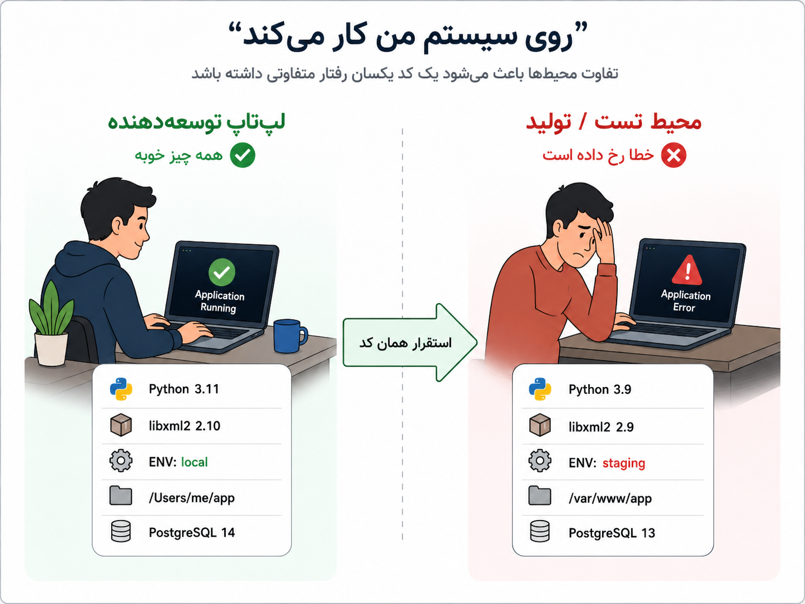
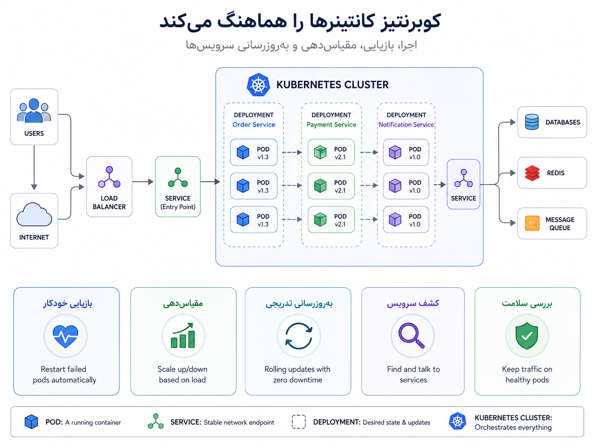

## وقتی «روی سیستم من کار می‌کند» دیگر کافی نیست

تقریباً هر تیم نرم‌افزاری، دیر یا زود، با این جمله روبه‌رو می‌شود: «روی سیستم من کار می‌کند.» برنامه روی لپ‌تاپ توسعه‌دهنده اجرا می‌شود، آزمون‌ها سبزند، همه‌چیز ظاهراً درست است؛ اما وقتی همان کد به محیط تست یا تولید می‌رود، خطا می‌دهد. چرا؟ شاید نسخه‌ی Python فرق دارد، شاید یک کتابخانه‌ی سیستمی نصب نیست، شاید متغیر محیطی جا افتاده، شاید مسیر فایل‌ها فرق می‌کند، یا شاید نسخه‌ی PostgreSQL و Redis با محیط توسعه یکی نیست.

اینجا یک نکته‌ی مهم روشن می‌شود: کد برنامه فقط خودش نیست. برنامه همراه با نسخه‌ی زبان، وابستگی‌ها، کتابخانه‌های سیستمی، تنظیمات، مسیرها، دستور اجرا و حتی فرض‌های پنهانی درباره‌ی محیط اجرا معنی پیدا می‌کند. اگر این محیط در هرجا کمی فرق کند، همان کد می‌تواند رفتار متفاوتی داشته باشد.

_مسئله همیشه خود کد نیست؛ گاهی محیط اجرا عوض شده و همان تغییر کوچک کافی است تا برنامه در محیط دیگر خراب شود._

این درد تازه نیست. پیش از فراگیر شدن کانتینرها، یکی از راه‌حل‌های رایج این بود که محیط کامل‌تری را با ماشین مجازی یا VM بسازیم. ماشین مجازی کمک می‌کرد یک سیستم‌عامل کامل‌تر و جداگانه‌تر داشته باشیم، اما هزینه‌اش هم کم نبود: سنگین‌تر بود، بالا آمدنش زمان بیشتری می‌گرفت، و برای هر برنامه انگار یک رایانه‌ی کوچک جداگانه روشن می‌کردیم.

کانتینرها از همین‌جا جذاب شدند. ایده‌ی جداسازی سبک‌تر فرایندها در لینوکس قدیمی‌تر از Docker بود، اما Docker حدود سال ۲۰۱۳ این تجربه را برای توسعه‌دهنده‌ها بسیار ساده‌تر و فراگیرتر کرد. جذابیت Docker این بود که یک زبان روزمره به تیم‌ها داد: یک فایل بنویس، وابستگی‌ها و دستور اجرا را مشخص کن، image بساز، و همان image را در محیط‌های مختلف اجرا کن. به زبان ساده، Docker مشکل «این برنامه دقیقاً با چه محیطی اجرا می‌شود؟» را قابل کنترل‌تر کرد.

:::tip[ایده‌ی اصلی]
کانتینر کمک می‌کند برنامه و وابستگی‌های اجرایی‌اش را در یک بسته‌ی قابل حمل‌تر قرار دهیم. هدف این نیست که همه‌ی تفاوت‌های محیطی جادویی از بین بروند؛ هدف این است که اجرای برنامه قابل تکرارتر، شفاف‌تر و کمتر وابسته به تنظیمات دستی هر ماشین باشد.
:::

فرض کنیم سرویس سفارش با Python نوشته شده است. بدون کانتینر، ممکن است روی هر سرور دستی Python نصب کنیم، پکیج‌ها را نصب کنیم، تنظیمات را بچینیم و امیدوار باشیم همه‌چیز شبیه محیط توسعه است. با Docker معمولاً یک `Dockerfile` می‌نویسیم و در آن مشخص می‌کنیم از چه نسخه‌ای از Python استفاده شود، چه وابستگی‌هایی نصب شود، کد کجا کپی شود و دستور اجرای برنامه چیست. بعد از روی آن یک image ساخته می‌شود.

چند واژه‌ی پایه‌ای اینجا مهم‌اند:

| مفهوم | توضیح ساده |
|---|---|
| Image | بسته‌ی آماده‌ی برنامه و وابستگی‌های اجرایی‌اش |
| Container | اجرای زنده‌ی یک image |
| Dockerfile | دستورالعمل ساخت image |
| Registry | جایی برای نگه‌داری و انتشار imageها؛ مثل Docker Hub یا registry داخلی |
| Volume | راهی برای وصل کردن داده‌ی بیرونی یا ماندگار به container |

تا اینجا Docker و کانتینر کمک می‌کنند برنامه را تمیزتر و قابل حمل‌تر اجرا کنیم. اما این پایان داستان نیست. وقتی فقط یک سرویس کوچک داریم، شاید Docker یا Docker Compose برای توسعه و حتی بعضی استقرارهای ساده کافی باشد. اما وقتی محصول بزرگ‌تر می‌شود و چند سرویس داریم، مسئله‌ها عوض می‌شوند: سرویس سفارش، پرداخت، کاربر، اعلان، گزارش، workerها، پایگاه داده، صف پیام و چند نسخه‌ی هم‌زمان از سرویس‌ها.

حالا پرسش‌های تازه‌ای داریم. اگر کانتینر سرویس سفارش خراب شد، چه کسی دوباره آن را بالا بیاورد؟ اگر ترافیک زیاد شد، چه کسی تعداد نمونه‌ها را بیشتر کند؟ اگر نسخه‌ی جدید منتشر کردیم، چطور آرام‌آرام جایگزین نسخه‌ی قدیمی شود؟ سرویس پرداخت چطور آدرس پایدار سرویس سفارش را پیدا کند؟ تنظیمات غیرحساس و رمزها کجا نگه‌داری شوند؟ از کجا بفهمیم یک نمونه سالم است یا باید از مسیر ترافیک خارج شود؟

اینجا Kubernetes وارد داستان می‌شود. Kubernetes را گوگل در سال ۲۰۱۴ معرفی کرد و طراحی آن از تجربه‌ی داخلی گوگل در اجرای workloadهای بزرگ، به‌ویژه سامانه‌هایی مثل Borg، الهام گرفته بود. نسخه‌ی ۱.۰ آن در سال ۲۰۱۵ منتشر شد و بعدتر به یکی از پایه‌های مهم دنیای cloud-native تبدیل شد. اگر Docker به توسعه‌دهنده‌ها گفت «برنامه را قابل بسته‌بندی‌تر کن»، Kubernetes گفت «حالا تعداد زیادی از این بسته‌ها را در یک محیط واقعی مدیریت کن».

:::note[سیر تحول خیلی خلاصه]
ماشین مجازی می‌گفت: محیط کامل‌تری را با خودت ببر. کانتینر گفت: سبک‌تر و توسعه‌دهنده‌پسندتر بسته‌بندی کن. Kubernetes گفت: حالا تعداد زیادی اجرای کانتینری را در چند ماشین، با بازیابی، مقیاس‌دهی و به‌روزرسانی مدیریت کن.
:::

Kubernetes یک هماهنگ‌کننده یا orchestrator است. یعنی ما وضعیت مطلوب را به آن می‌گوییم، و Kubernetes تلاش می‌کند آن وضعیت را حفظ کند. مثلاً می‌گوییم از سرویس سفارش همیشه سه نمونه در حال اجرا باشد. اگر یکی از آن‌ها خراب شود، Kubernetes تلاش می‌کند نمونه‌ی تازه‌ای بالا بیاورد. اگر نسخه‌ی جدید منتشر کنیم، می‌تواند نسخه‌ی قدیمی را کم‌کم با نسخه‌ی تازه جایگزین کند. اگر بخواهیم سرویس‌ها همدیگر را پیدا کنند، برایشان آدرس پایدار فراهم می‌کند.

_کانتینرها برنامه را قابل بسته‌بندی‌تر می‌کنند؛ Kubernetes اجرای تعداد زیادی کانتینر را در محیط واقعی هماهنگ می‌کند._

برای فهم اولیه‌ی Kubernetes، این چند مفهوم کافی است:

| مفهوم | توضیح ساده |
|---|---|
| Pod | کوچک‌ترین واحد اجرایی در Kubernetes؛ معمولاً جایی که کانتینر برنامه اجرا می‌شود |
| Deployment | تعریف می‌کند چند نمونه از برنامه اجرا شود و به‌روزرسانی چگونه انجام شود |
| Service | آدرس پایدار برای دسترسی به Podها، حتی اگر خود Podها تغییر کنند |
| ConfigMap | نگه‌داری تنظیمات غیرحساس برنامه |
| Secret | نگه‌داری داده‌های حساس مثل رمز، توکن و کلیدها |
| Health Check | راهی برای تشخیص اینکه برنامه سالم است یا باید از مدار خارج شود |
| Rollout | جایگزین کردن تدریجی نسخه‌ی قدیمی با نسخه‌ی جدید |

یک مثال ساده را در نظر بگیریم. ما سرویس سفارش را containerize می‌کنیم و image آن را در registry می‌گذاریم. بعد در Kubernetes یک Deployment تعریف می‌کنیم که بگوید سه نمونه از این سرویس اجرا شود. یک Service هم تعریف می‌کنیم تا بقیه‌ی سرویس‌ها لازم نباشد آدرس تک‌تک Podها را بدانند. تنظیماتی مثل نام صف یا آدرس سرویس‌های داخلی می‌تواند در ConfigMap بیاید، و چیزهایی مثل رمز اتصال به پایگاه داده در Secret نگه‌داری شود. اگر یکی از Podها خراب شود، Kubernetes تلاش می‌کند نمونه‌ی جایگزین بالا بیاورد. اگر نسخه‌ی تازه‌ای از image منتشر کنیم، Deployment می‌تواند rollout انجام دهد.

این‌ها کمک می‌کنند اجرای سرویس‌ها از حالت «چند دستور دستی روی چند ماشین» به وضعیتی نزدیک‌تر شود که قابل تعریف، قابل پیگیری و قابل تکرار است. اما نباید دچار خیال‌پردازی شویم: Kubernetes پیچیدگی عملیاتی جدی دارد. خود خوشه باید نصب، نگه‌داری، پایش، امن‌سازی و به‌روزرسانی شود. اگر تیم هنوز یک برنامه‌ی ساده دارد، شاید Docker Compose، یک ماشین مجازی، یک سکوی ساده‌ی میزبانی یا حتی یک PaaS انتخاب بهتری باشد.

:::warning[یک سوءبرداشت رایج]
Kubernetes جایزه‌ی بلوغ فنی نیست که هر پروژه‌ای باید زود به آن برسد. اگر تعداد سرویس‌ها کم است، ترافیک ساده است، rollout و مقیاس‌دهی پیچیده نداریم، و تیم هنوز هزینه‌ی عملیاتی Kubernetes را نمی‌پذیرد، آوردن آن می‌تواند بیش از آنکه کمک کند، سیستم را سنگین‌تر کند.
:::

| وضعیت | انتخاب محتمل‌تر |
|---|---|
| یک برنامه‌ی ساده برای تیم کوچک | اجرای مستقیم، Docker Compose یا یک PaaS ساده |
| چند سرویس با نیاز به محیط‌های مشابه | Docker و registry داخلی می‌تواند کمک کند |
| سرویس‌های متعدد با rollout، scaling و self-healing | Kubernetes می‌تواند ارزشمند شود |
| چند کار کوتاه و پراکنده | شاید Serverless یا Job/CronJob ساده مناسب‌تر باشد |
| نیاز به کنترل کامل روی شبکه، منابع و استقرار | Kubernetes گزینه‌ی جدی‌تری است، اما با هزینه‌ی عملیاتی بیشتر |

برای من، کانتینرها پاسخ به یک درد خیلی انسانی‌اند: «چرا این برنامه اینجا کار می‌کند و آنجا نه؟» و Kubernetes پاسخ به درد مرحله‌ی بعدی است: «حالا که همه‌چیز را کانتینری کردیم، چه کسی این همه اجرا را در محیط واقعی زنده، سالم، قابل کشف و قابل به‌روزرسانی نگه دارد؟» این دو یکی نیستند، اما به هم وصل‌اند. Docker بیشتر درباره‌ی بسته‌بندی و اجرای تکرارپذیر است؛ Kubernetes بیشتر درباره‌ی هماهنگ‌کردن و نگه‌داری تعداد زیادی اجرای کانتینری.

تا اینجا درباره‌ی سرویس‌هایی حرف زدیم که واقعاً باید اجرا شوند، نسخه داشته باشند، در دسترس بمانند و در محیط‌های مختلف قابل تکرار باشند. اما همه‌ی کارهای سیستم از جنس سرویس دائمی نیستند. بعضی کارها فقط گاهی و در واکنش به یک رخداد، پیام، زمان‌بندی یا وبهوک اجرا می‌شوند. آیا برای آن‌ها هم باید Deployment یا worker همیشه‌روشن داشته باشیم؟ این همان پرسشی است که ما را به Serverless می‌رساند.
