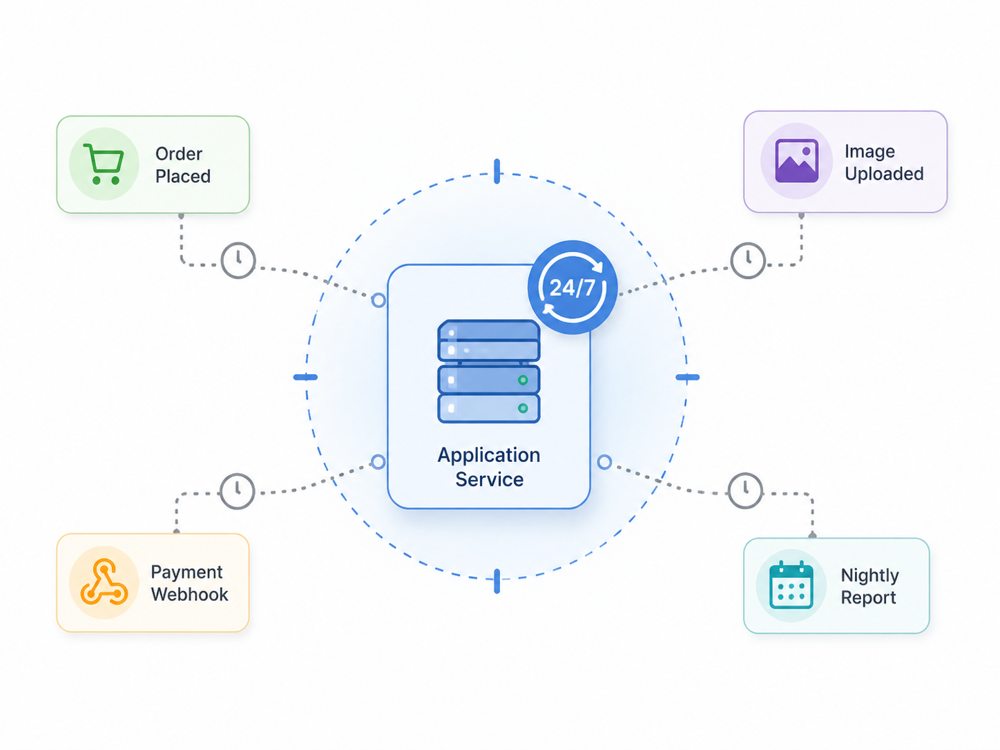
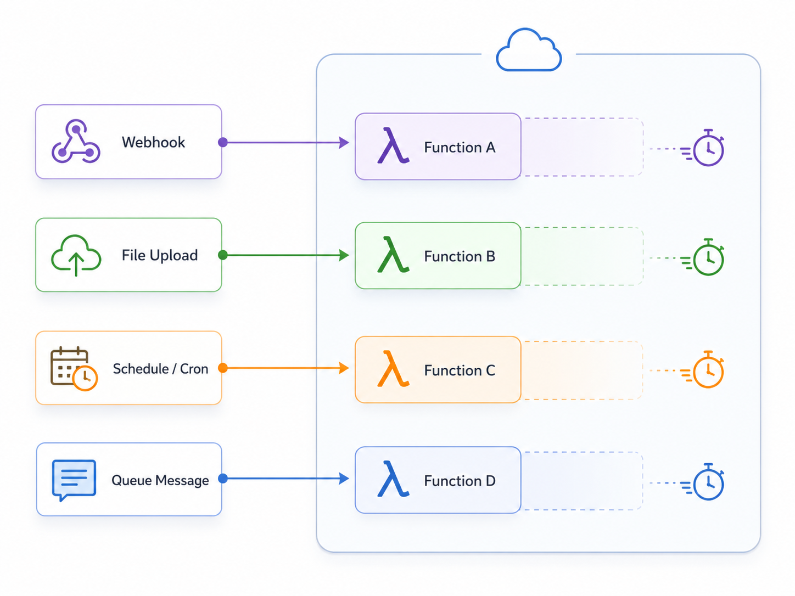

## وقتی بعضی کارها ارزش سرور دائمی ندارند

تا اینجا سیستم ما بزرگ‌تر شده است. سرویس داریم، رخداد داریم، پیام داریم، صف پیام داریم، و حتی فهمیده‌ایم گاهی تاریخچه‌ی رخدادها خودش بخشی از حقیقت سیستم است. اما در کنار سرویس‌های اصلی، کم‌کم با یک جنس کار دیگر هم روبه‌رو می‌شویم: کارهایی که مهم‌اند، اما همیشه لازم نیست در حال اجرا باشند.

مثلاً بعد از ثبت سفارش، باید یک اعلان فرستاده شود. فایلی آپلود می‌شود و باید اندازه‌های مختلف آن ساخته شود. هر شب باید یک گزارش سبک تولید شود. یک وبهوک از سرویس پرداخت می‌رسد و باید بررسی شود. هر چند ساعت هم شاید لازم باشد داده‌های موقت پاک‌سازی شوند. این کارها بخشی از محصول‌اند، اما شبیه سرویس اصلی سفارش یا پرداخت نیستند که دائماً در مسیر درخواست‌های اصلی کاربر باشند.

سؤال اصلی اینجاست: آیا برای هر کار کوچک و مقطعی باید یک سرویس دائمی بالا نگه داریم؟ یعنی برای کاری که شاید فقط هنگام رسیدن یک پیام، یک زمان‌بندی یا یک رخداد اجرا شود، سرور روشن نگه داریم، استقرار جدا داشته باشیم، مقیاس‌دهی کنیم، منابع مصرف کنیم و همیشه هزینه‌ی نگه‌داری‌اش را بدهیم؟

_وقتی کارها کوتاه و پراکنده‌اند، نگه داشتن یک سرویس همیشه‌روشن ممکن است بیش از نیاز واقعی هزینه و پیچیدگی بسازد._

معماری بی‌سرور یا Serverless Architecture از همین پرسش شروع می‌شود. البته نامش کمی گمراه‌کننده است. بی‌سرور یعنی سروری وجود ندارد؟ نه. سرور هست، اما ما به‌صورت مستقیم آن را مدیریت نمی‌کنیم. در این مدل، معمولاً منطق کوچک و مشخصی را به شکل تابع یا واحد اجرایی کوتاه‌عمر تعریف می‌کنیم، و بستر اجرا آن را هنگام نیاز اجرا می‌کند: با یک درخواست، با یک پیام در صف، با یک زمان‌بندی، با آپلود فایل، یا با رسیدن یک وبهوک.

:::tip[ایده‌ی اصلی]
Serverless برای کارهایی جذاب است که کوتاه، مستقل، رخدادمحور یا زمان‌بندی‌شده‌اند و نمی‌خواهیم برای آن‌ها یک سرویس همیشه‌روشن نگه داریم. تمرکز از «مدیریت سرور» به «اجرای کد هنگام نیاز» جابه‌جا می‌شود.
:::

برای ملموس‌تر شدن، یک سناریوی ساده را ببینیم. فرض کنید سرویس پرداخت بعد از موفق شدن پرداخت، یک وبهوک به سیستم ما می‌فرستد. در مدل معمول، ممکن است یک سرویس همیشه‌روشن داشته باشیم که منتظر این درخواست‌ها بماند. در مدل Serverless، می‌توانیم یک تابع کوچک تعریف کنیم که فقط وقتی این وبهوک رسید اجرا شود: امضای درخواست را بررسی کند، تکراری نبودن پیام را بسنجد، وضعیت پرداخت را ذخیره کند، و اگر لازم بود یک پیام برای ادامه‌ی پردازش منتشر کند. بعد از تمام شدن کار، تابع هم تمام می‌شود.

همین الگو برای کارهای دیگر هم قابل تصور است: وقتی تصویری در فضای ذخیره‌سازی بارگذاری شد، تابعی اجرا شود و تصویر بندانگشتی بسازد؛ هر شب تابعی با زمان‌بندی مشخص گزارش سبک تولید کند؛ وقتی پیامی در صف قرار گرفت، تابعی اجرا شود و یک اعلان بفرستد. در همه‌ی این مثال‌ها، اصل ماجرا این است که «رخداد یا زمان‌بندی، اجرای یک تکه کد کوتاه را روشن می‌کند».

در عمل، این مدل را با ابزارها و سکوهای مختلفی می‌بینیم. در دنیای ابری، نام‌هایی مثل AWS Lambda، Google Cloud Functions، Azure Functions، Cloudflare Workers، Vercel Functions و Netlify Functions زیاد شنیده می‌شوند. در فضای زیرساخت خودمیزبان یا نزدیک به Kubernetes هم ابزارهایی مثل Knative و OpenFaaS مطرح می‌شوند. هدف این نوشته مقایسه‌ی این ابزارها نیست؛ فقط می‌خواهیم جای ذهنی‌شان روشن شود: این‌ها کمک می‌کنند کدی کوچک را در واکنش به یک محرک اجرا کنیم، بدون اینکه خودمان مستقیماً یک سرور دائمی برای آن نگه داریم.

| کار نمونه | محرک اجرا | شکل رایج پیاده‌سازی |
|---|---|---|
| بررسی وبهوک پرداخت | رسیدن یک درخواست HTTP | یک تابع Serverless پشت یک endpoint |
| ساخت تصویر بندانگشتی | بارگذاری فایل در فضای ذخیره‌سازی | تابعی که با رخداد آپلود اجرا می‌شود |
| ارسال اعلان | رسیدن پیام در صف | تابعی که پیام را مصرف و اعلان را ارسال می‌کند |
| گزارش سبک شبانه | زمان‌بندی یا Cron | تابع زمان‌بندی‌شده |
| پاک‌سازی داده‌های موقت | اجرای دوره‌ای | تابعی کوچک برای حذف یا آرشیو داده‌ها |

برای کسی که با Kubernetes کار کرده، شاید هنوز سؤال باقی بماند: «خب من همین‌ها را با Deployment و Job و CronJob هم می‌توانم انجام بدهم؛ پس Serverless دقیقاً کجاست؟» تفاوت در این است که در Kubernetes معمولی، ما معمولاً خودمان درباره‌ی اجرای Podها، تعداد replicaها، workerهای همیشه‌روشن، تنظیم منابع، مقیاس‌دهی و چرخه‌ی عمر اجرا تصمیم می‌گیریم. اما در مدل Serverless، یک لایه‌ی بالاتر تلاش می‌کند این تصمیم‌ها را تا حدی از ما بگیرد: کار را تعریف می‌کنیم، محرک را مشخص می‌کنیم، و سکو هنگام نیاز آن را اجرا و مقیاس‌دهی می‌کند.

مثلاً اگر یک سرویس API داریم که همیشه باید پاسخ‌گو باشد، یک Deployment با چند replica کاملاً طبیعی است. اگر یک کار فقط هر شب اجرا می‌شود، شاید Kubernetes CronJob کافی و حتی ساده‌تر باشد. اگر یک کار فقط وقتی پیام در RabbitMQ یا Kafka زیاد شد باید worker بالا بیاورد، KEDA می‌تواند workerها را بر اساس تعداد پیام‌ها مقیاس بدهد و حتی در بعضی سناریوها تا صفر پایین بیاورد. اگر می‌خواهیم یک سرویس HTTP فقط هنگام درخواست بالا بیاید و بعد از مدتی بی‌درخواستی خاموش شود، Knative Serving به همین فضای فکری نزدیک است.

| در Kubernetes چه داریم؟ | برای چه کاری خوب است؟ | نسبتش با Serverless چیست؟ |
|---|---|---|
| Deployment | سرویس‌های همیشه‌روشن مثل API اصلی | Serverless نیست؛ چون سرویس دائماً اجرا می‌شود. |
| Job | کار یک‌باره و تمام‌شونده | شبیه اجرای کار کوتاه است، اما معمولاً خودمان چرخه‌ی اجرا را مدیریت می‌کنیم. |
| CronJob | کارهای زمان‌بندی‌شده مثل گزارش شبانه | برای بعضی نیازها کافی است و شاید Serverless لازم نباشد. |
| Celery worker روی Deployment | پردازش کارهای پس‌زمینه با worker دائمی | کنترل بیشتری می‌دهد، اما workerها را خودمان نگه می‌داریم. |
| KEDA | مقیاس‌دهی worker بر اساس صف، Kafka، RabbitMQ و مانند آن | به Serverless نزدیک می‌شود، چون اجرا بر اساس محرک و بار انجام می‌شود. |
| Knative | اجرای سرویس یا تابع با امکان scale-to-zero | یکی از شکل‌های Serverless روی Kubernetes است. |

پس Serverless را نباید فقط با «تابع ابری» یکی دانست. در فضای Kubernetes هم ممکن است به شکل‌های مختلف به آن نزدیک شویم. نکته‌ی اصلی این است که کار ما تا حد ممکن بر اساس محرک اجرا شود، همیشه روشن نماند، و مقیاس‌دهی و چرخه‌ی اجرای آن کمتر دستی و کمتر وابسته به نگه‌داری مستقیم تیم باشد.

اینجا ممکن است یک پرسش خیلی طبیعی پیش بیاید: «خب فرق این با Celery چیست؟ Celery هم کار پس‌زمینه اجرا می‌کند.» شباهتشان این است که هر دو می‌توانند برای کارهای غیرهم‌زمان و خارج از مسیر اصلی درخواست استفاده شوند؛ مثلاً ارسال ایمیل، پردازش فایل یا اجرای یک کار زمان‌بر. اما تفاوت اصلی در مدل اجرا و مالکیت زیرساخت است. در Celery معمولاً خودمان workerها را اجرا و مدیریت می‌کنیم، یک broker مثل Redis یا RabbitMQ داریم، و ظرفیت، استقرار، پایش و مقیاس‌دهی workerها با خودمان است. در Serverless، اجرای تابع و بخشی از مقیاس‌دهی را به سکوی اجرا می‌سپاریم.

:::note[فرق Serverless با Celery]
Celery بیشتر یک چارچوب اجرای کارهای پس‌زمینه در برنامه‌ی خودمان است؛ یعنی worker داریم، broker داریم، و زیرساخت اجرای آن را خودمان نگه می‌داریم. Serverless بیشتر یک مدل اجرای تابع روی سکوی ابری یا سکوی اجرای بیرونی است؛ تابع هنگام محرک اجرا می‌شود و مدیریت مستقیم سرور و مقیاس‌دهی کمتر بر عهده‌ی تیم برنامه است. پس مسئله‌هایشان نزدیک است، اما یکی نیستند.
:::

در اینجا مرز Serverless با چند مفهوم قبلی مهم است. معماری رویدادمحور می‌پرسید چه بخش‌هایی باید به یک اتفاق واکنش نشان دهند. صف پیام می‌پرسید پیام‌ها چطور قابل اعتماد جابه‌جا شوند. Serverless اما روی مدل اجرا تمرکز دارد: آیا برای این واکنش یا کار کوتاه‌مدت، واقعاً به یک سرویس دائمی نیاز داریم؟

_در این مدل، تابع فقط هنگام نیاز اجرا می‌شود و بعد از پایان کار، لازم نیست به‌عنوان یک سرویس دائمی روشن بماند._

بحث هزینه اینجا مهم است، اما باید با احتیاط درباره‌اش حرف زد. گاهی Serverless برای کارهای کم‌تعداد، کوتاه و پراکنده جذاب است، چون به جای روشن نگه داشتن یک سرویس دائمی، بیشتر هنگام اجرا هزینه می‌دهیم. اگر کاری روزی چند بار اجرا شود یا فقط هنگام رخدادهای خاص لازم باشد، این مدل می‌تواند به‌صرفه‌تر باشد.

اما این همیشه به معنی ارزان‌تر بودن نیست. اگر تابع‌ها بسیار پرتعداد اجرا شوند، زمان اجرای طولانی داشته باشند، داده‌ی زیادی جابه‌جا کنند، یا زنجیره‌ای از تابع‌های کوچک پشت سر هم راه بیفتد، هزینه می‌تواند غافلگیرکننده شود. حتی اگر هزینه‌ی مالی خوب به نظر برسد، هزینه‌ی خطایابی، مشاهده‌پذیری، وابستگی به ارائه‌دهنده و پیچیدگی عملیاتی هم باید حساب شود.

:::caution[هزینه همیشه فقط پول نیست]
Serverless ممکن است هزینه‌ی اجرای کارهای کوتاه و پراکنده را کم کند، اما می‌تواند هزینه‌ی فهم، پایش و خطایابی سیستم را بالا ببرد. پس انتخاب آن باید بر اساس الگوی مصرف، زمان اجرا، حجم داده و توان عملیاتی تیم باشد؛ نه فقط جذابیت ظاهری مدل پرداخت.
:::

Serverless چند چالش فنی هم دارد. یکی از شناخته‌شده‌ترین آن‌ها شروع سرد یا Cold Start است؛ یعنی تابعی که مدتی اجرا نشده، ممکن است در نخستین اجرا کمی دیرتر آماده شود. محدودیت زمان اجرا هم مهم است؛ بسیاری از بسترهای Serverless برای پردازش‌های خیلی طولانی مناسب نیستند. از طرف دیگر، اگر تابع‌ها زیاد و پراکنده شوند، دنبال کردن مسیر یک خطا از میان چند تابع کوچک سخت‌تر می‌شود. همچنین ممکن است به قراردادها و ابزارهای یک ارائه‌دهنده‌ی خاص وابسته شویم.

| وضعیت | Serverless مناسب‌تر است؟ | چرا؟ |
|---|---|---|
| کار کوتاه، مستقل و رخدادمحور است | معمولاً بله | لازم نیست سرویس دائمی نگه داریم. |
| کار کم‌تعداد و پراکنده است | معمولاً بله | هزینه بیشتر هنگام اجرا پرداخت می‌شود. |
| کار پرترافیک و دائماً فعال است | نه همیشه | سرویس دائمی یا worker دائمی ممکن است قابل پیش‌بینی‌تر و حتی ارزان‌تر باشد. |
| پردازش طولانی یا سنگین است | با احتیاط | محدودیت زمان اجرا و هزینه می‌تواند مشکل‌ساز شود. |
| کار به وضعیت درونی پیچیده نیاز دارد | با احتیاط | Serverless برای کارهای کوتاه و کم‌وضعیت مناسب‌تر است. |
| تیم کنترل کامل روی workerها می‌خواهد | نه همیشه | Celery یا سرویس worker معمولی شاید مناسب‌تر باشد. |
| تیم به مشاهده‌پذیری دقیق نیاز دارد | با طراحی دقیق | خطایابی میان چند تابع پراکنده می‌تواند سخت‌تر شود. |

:::warning[یک سوءبرداشت رایج]
Serverless یعنی کل سیستم را از روز اول به چند تابع کوچک تبدیل کنیم؟ نه. خیلی از سرویس‌ها باید همیشه در دسترس، قابل کنترل، قابل مشاهده و دارای چرخه‌ی عمر روشن باشند. Serverless برای بعضی کارها عالی است، اما برای همه‌ی مسئله‌ها نه.
:::

  
چه زمانی Serverless انتخاب خوبی است؟

وقتی کاری کوتاه، مستقل، کم‌وضعیت، رخدادمحور یا زمان‌بندی‌شده داریم، Serverless می‌تواند انتخاب خوبی باشد. مثلاً پردازش یک فایل بعد از آپلود، ارسال اعلان بعد از یک رخداد، پاک‌سازی دوره‌ای داده‌های موقت یا واکنش به یک وبهوک پرداخت.

  
چه زمانی Celery یا worker دائمی ممکن است مناسب‌تر باشد؟

اگر کارها پیوسته و پرتعدادند، کنترل دقیق روی workerها می‌خواهیم، کارها به محیط داخلی برنامه خیلی وابسته‌اند، یا تیم از قبل broker، پایش و مقیاس‌دهی workerها را خوب مدیریت می‌کند، Celery یا یک سرویس worker معمولی می‌تواند ساده‌تر و قابل پیش‌بینی‌تر باشد.

  
چه زمانی بهتر است محتاط باشیم؟

اگر پردازش طولانی است، نیاز به حافظه‌ی درونی پیچیده دارد، تأخیر شروع قابل قبول نیست، هزینه‌ی اجرا با رشد ترافیک نامطمئن می‌شود، یا وابستگی به ارائه‌دهنده برای تیم پرریسک است، شاید یک سرویس معمولی ساده انتخاب بهتری باشد.

برای من، Serverless یعنی لازم نیست برای هر کار کوچک، یک چراغ همیشه روشن نگه داریم. بعضی کارها فقط وقتی باید اجرا شوند که چیزی اتفاق افتاده، پیامی رسیده، زمانی فرا رسیده یا فایلی بارگذاری شده است. در فضای Kubernetes، این می‌تواند از یک CronJob ساده شروع شود، با KEDA به workerهای مقیاس‌پذیر برسد، یا با Knative به اجرای نزدیک‌تر به Serverless تبدیل شود. اما همین آزادی اگر بدون فهم هزینه، محدودیت و مشاهده‌پذیری بیاید، می‌تواند سیستم را پراکنده و سخت‌فهم کند.

تا اینجا دیدیم بعضی کارها را می‌توان بدون نگه داشتن سرویس دائمی اجرا کرد. اما همه‌ی سیستم از این جنس نیست. بسیاری از سرویس‌ها باید همیشه در دسترس باشند، همراه وابستگی‌هایشان بسته‌بندی شوند و در محیط‌های مختلف یکسان اجرا شوند. اینجا به مسئله‌ی بعدی می‌رسیم: چطور کاری کنیم که برنامه فقط «روی سیستم من» کار نکند، بلکه در هر محیطی قابل اجرا باشد؟ این همان جایی است که Containers و Kubernetes وارد داستان می‌شوند.
