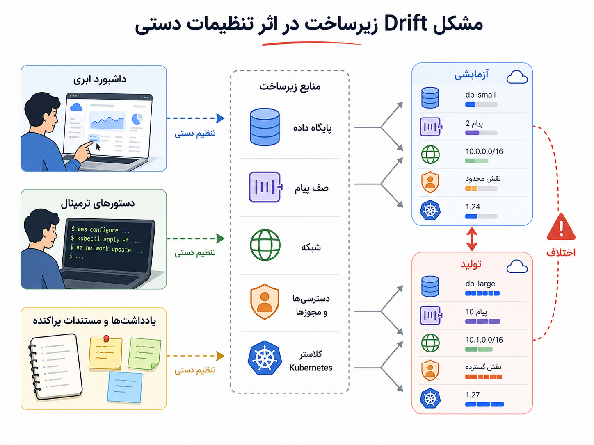
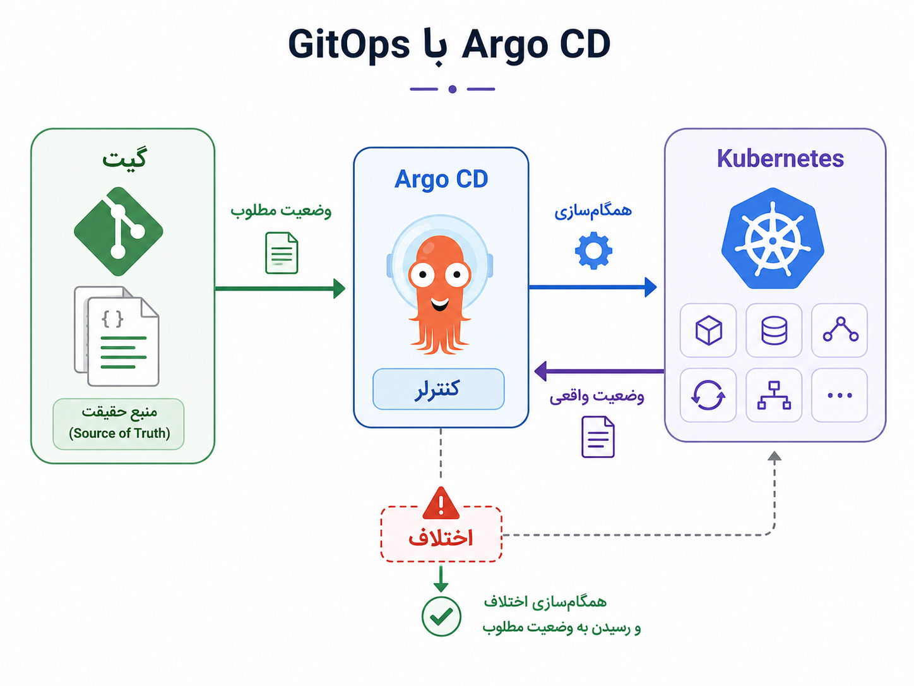

## وقتی زیرساخت هم باید قابل بازبینی باشد

تا اینجا درباره‌ی سرویس‌ها، کانتینرها، Kubernetes و Serverless حرف زدیم. کم‌کم سیستم ما فقط چند فایل کد نیست؛ پایگاه داده دارد، صف پیام دارد، شبکه دارد، کلاستر دارد، دسترسی دارد، تنظیمات محیطی دارد و برای هر محیط، از آزمایشی تا تولید، باید شکل نسبتاً قابل اعتمادی داشته باشد.

اما اینجا یک درد آشنا دوباره برمی‌گردد. یک نفر می‌خواهد محیط آزمایشی را شبیه تولید بسازد و می‌پرسد: نسخه‌ی پایگاه داده دقیقاً چیست؟ صف پیام با چه تنظیماتی ساخته شده؟ چه کسی این دسترسی را به سرویس پرداخت داده؟ چرا در تولید این متغیر محیطی هست ولی در آزمایشی نیست؟ اگر فردا کل محیط را از دست بدهیم، می‌توانیم دوباره آن را بسازیم؟

اگر پاسخ این پرسش‌ها در چند کلیک دستی، چند دستور پراکنده، حافظه‌ی آدم‌ها و مستندات قدیمی پخش شده باشد، زیرساخت خودش تبدیل به منبع خطا می‌شود. همان‌طور که کد بدون نسخه‌بندی و بازبینی خطرناک است، زیرساختی هم که معلوم نیست چه کسی، چه چیزی را، کجا و چرا تغییر داده، دیر یا زود دردسر می‌سازد.

:::tip[ایده‌ی اصلی]
Infrastructure as Code یعنی زیرساخت را با فایل‌هایی تعریف کنیم که قابل نسخه‌بندی، بازبینی، تکرار و بازسازی‌اند؛ نه اینکه بخش مهمی از سیستم فقط در پنل‌ها، دستورهای دستی و حافظه‌ی افراد زندگی کند.
:::

زیرساخت به‌مثابه کد یا Infrastructure as Code، که معمولاً IaC گفته می‌شود، از همین نیاز می‌آید. ایده این است که به‌جای ساختن دستی منابع، وضعیت مطلوب زیرساخت را در فایل‌هایی تعریف کنیم. مثلاً بگوییم این پایگاه داده را می‌خواهیم، این شبکه باید وجود داشته باشد، این صف پیام با این تنظیمات ساخته شود، این سرویس این دسترسی را داشته باشد، و این کلاستر Kubernetes با این ویژگی‌ها آماده شود.

وقتی این تعریف‌ها وارد Git می‌شوند، تغییر زیرساخت هم شبیه تغییر کد می‌شود: می‌توان آن را دید، بررسی کرد، درباره‌اش نظر داد، تاریخچه‌اش را فهمید و در بسیاری از موارد دوباره اجرا کرد. این همان جایی است که زیرساخت از «چیزی که چند نفر بلدند چطور دستی بسازند» تبدیل می‌شود به «دارایی قابل نگه‌داری تیم».

_وقتی زیرساخت با کد تعریف می‌شود، محیط‌ها کمتر به حافظه‌ی افراد و کلیک‌های دستی وابسته می‌مانند._

اینجا باید یک مرز مهم را روشن کنیم: IaC فقط «اتوماسیون» نیست. اتوماسیون می‌تواند یک اسکریپت باشد که چند دستور را پشت سر هم اجرا می‌کند. IaC معمولاً یک قدم جلوتر می‌رود و می‌گوید وضعیت مطلوب زیرساخت چیست و ابزار تلاش می‌کند محیط را به آن وضعیت نزدیک کند. البته همه‌ی ابزارها دقیقاً یکسان کار نمی‌کنند، اما در نگاه کلی، تفاوت این است: اسکریپت بیشتر می‌گوید «چه کارهایی انجام بده»، IaC بیشتر تلاش می‌کند بگوید «زیرساخت در نهایت باید چه شکلی باشد».

چند خانواده ابزار در این فضا زیاد دیده می‌شوند:

| ابزار یا خانواده | معمولاً برای چه چیزی به کار می‌آید؟ |
|---|---|
| Terraform | تعریف و مدیریت منابعی مثل شبکه، پایگاه داده، صف، load balancer و منابع ابری |
| Pulumi | تعریف زیرساخت با زبان‌های برنامه‌نویسی عمومی‌تر مثل TypeScript یا Python |
| Ansible | پیکربندی ماشین‌ها، نصب بسته‌ها و اجرای کارهای عملیاتی |
| Kubernetes manifests | تعریف مستقیم منابع Kubernetes مثل Deployment، Service، ConfigMap و Secret |
| Helm | بسته‌بندی و نصب برنامه‌ها روی Kubernetes |
| Kustomize | تنظیم و تغییر manifestهای Kubernetes برای محیط‌های مختلف |

این ابزارها جای هم نیستند. Terraform معمولاً برای ساخت و مدیریت منابع زیرساختی بیرون یا پیرامون برنامه به کار می‌آید؛ مثلاً شبکه، پایگاه داده، صف یا منابع ابری. Helm و Kustomize بیشتر در فضای Kubernetes کمک می‌کنند برنامه‌ها و منابع داخل کلاستر را تعریف و تنظیم کنیم. Ansible هم بیشتر به پیکربندی ماشین‌ها و اجرای کارهای عملیاتی نزدیک است.

برای اینکه ماجرا ملموس‌تر شود، فرض کنید سرویس سفارش به یک پایگاه داده، یک صف پیام، چند متغیر محیطی، یک Secret و یک Deployment روی Kubernetes نیاز دارد. بدون IaC، ممکن است بخشی از این‌ها در پنل ابری ساخته شود، بخشی با دستور دستی، بخشی با فایل‌های پراکنده و بخشی هم در ذهن افراد بماند. با IaC، تلاش می‌کنیم همین نیازها را در فایل‌هایی قابل بازبینی تعریف کنیم؛ فایل‌هایی که در Git نگه‌داری می‌شوند و تغییراتشان دیده می‌شود.

اما وقتی پای Kubernetes وسط است، یک پرسش عملی‌تر هم پیدا می‌شود: اگر تعریف Deployment و Service و ConfigMap داخل Git است، چه کسی مطمئن شود وضعیت واقعی کلاستر شبیه همین تعریف‌هاست؟ اگر کسی دستی در کلاستر تعداد replica را تغییر داد چه؟ اگر نسخه‌ای که واقعاً در حال اجراست با نسخه‌ی داخل Git فرق داشت چه؟

اینجا GitOps وارد داستان می‌شود.

GitOps را می‌توان این‌طور ساده فهمید: Git منبع حقیقت وضعیت مطلوب سیستم است، و یک ابزار تلاش می‌کند وضعیت واقعی محیط را با چیزی که در Git تعریف شده هماهنگ نگه دارد. یعنی Git فقط محل نگه‌داری کد برنامه نیست؛ دفتر رسمی تصمیم‌های اجرایی و زیرساختی هم می‌شود.

یکی از ابزارهای شناخته‌شده در این فضا Argo CD است. Argo CD معمولاً در کنار Kubernetes استفاده می‌شود و manifestها، Helm chartها یا تنظیمات Kustomize داخل Git را با وضعیت واقعی کلاستر مقایسه می‌کند. اگر اختلافی باشد، می‌تواند آن را نشان دهد و در صورت تنظیم، محیط را دوباره با Git همگام کند.

_در GitOps، Git منبع حقیقت وضعیت مطلوب است و ابزاری مثل Argo CD مراقب است کلاستر از آن وضعیت منحرف نشود._

تفاوت IaC و GitOps هم مهم است. IaC بیشتر درباره‌ی این است که منابع و زیرساخت را چگونه با کد تعریف کنیم. GitOps بیشتر درباره‌ی این است که محیط واقعی چگونه با تعریف‌های داخل Git همگام بماند. Argo CD هم یکی از ابزارهایی است که این ایده را، به‌ویژه در Kubernetes، عملی می‌کند.

| مفهوم | پرسش اصلی |
|---|---|
| Infrastructure as Code | زیرساخت و منابع را چطور به‌صورت فایل، قابل نسخه‌بندی و بازبینی تعریف کنیم؟ |
| GitOps | چطور کاری کنیم محیط واقعی با تعریف‌های داخل Git هماهنگ بماند؟ |
| Argo CD | چطور منابع Kubernetes را با Git مقایسه و همگام کنیم؟ |
| Terraform | منابع زیرساختی مثل شبکه، دیتابیس، صف و منابع ابری را چطور تعریف و مدیریت کنیم؟ |
| Helm / Kustomize | منابع Kubernetes را چطور بسته‌بندی یا برای محیط‌های مختلف تنظیم کنیم؟ |

:::note[Git فقط برای کد برنامه نیست]
در IaC و GitOps، Git کم‌کم به محل ثبت تصمیم‌های زیرساختی هم تبدیل می‌شود: چه نسخه‌ای deploy شده، چند replica داریم، کدام ConfigMap فعال است، چه منبعی در کدام محیط ساخته شده و چه کسی این تغییر را پیشنهاد داده است.
:::

البته IaC و GitOps هم جادو نیستند. اگر secretها را بد مدیریت کنیم، اگر reviewها سطحی باشند، اگر کسی مستقیم در محیط تولید تغییر بدهد، اگر sync خودکار بدون کنترل روی production فعال شود، یا اگر ساختار repository شلوغ و نامفهوم شود، همین ابزارها هم می‌توانند دردسر تازه بسازند.

:::warning[یک سوءبرداشت رایج]
IaC و GitOps تغییر بد را خوب نمی‌کنند؛ فقط مسیر تغییر را شفاف‌تر و قابل پیگیری‌تر می‌کنند. اگر طراحی زیرساخت بد باشد، IaC همان طراحی بد را منظم‌تر و سریع‌تر تکثیر می‌کند. اگر تغییر خطرناک بدون بازبینی از Git به production برود، همچنان خطرناک است.
:::

چند پرسش خوب پیش از جدی گرفتن IaC و GitOps این‌هاست:

| پرسش | چرا مهم است؟ |
|---|---|
| آیا محیط واقعی با فایل‌های Git فرق کرده است؟ | این همان drift است و باید دیده یا اصلاح شود. |
| secretها کجا و چطور نگه‌داری می‌شوند؟ | نباید داده‌ی حساس بی‌محافظ وارد Git شود. |
| قبل از apply یا sync چه چیزی بازبینی می‌شود؟ | تغییر زیرساخت باید مثل تغییر کد review شود. |
| rollback چطور انجام می‌شود؟ | برگشت از تغییر بد باید از قبل قابل تصور باشد. |
| چه کسی اجازه‌ی تغییر production را دارد؟ | IaC بدون مرز دسترسی، خطرناک‌تر می‌شود. |
| ساختار repository قابل فهم است؟ | اگر کسی نتواند مسیر تغییر را بفهمد، GitOps فقط ظاهر منظم دارد. |

  
چه زمانی شاید هنوز IaC کامل زود باشد؟

اگر یک محیط بسیار ساده داریم، منابع کم‌اند، تغییرها به‌ندرت رخ می‌دهند و تیم هنوز در حال کشف نیازهای پایه است، شاید چند اسکریپت ساده و مستندات دقیق برای شروع کافی باشد. اما هرچه تعداد محیط‌ها، منابع و افراد بیشتر شود، هزینه‌ی تغییر دستی و حافظه‌محور بالا می‌رود.

  
چه زمانی GitOps ارزشمندتر می‌شود؟

وقتی چند تیم روی یک یا چند کلاستر Kubernetes کار می‌کنند، نسخه‌ها زیاد تغییر می‌کنند، drift میان Git و محیط واقعی دردسرساز شده، یا لازم است مسیر تغییرات production شفاف و قابل audit باشد، GitOps می‌تواند ارزش جدی پیدا کند.

برای من، Infrastructure as Code یعنی زیرساخت را از قلمرو حافظه‌ی افراد و کلیک‌های دستی بیرون بیاوریم و به چیزی تبدیل کنیم که تیم بتواند آن را ببیند، نقد کند، تغییر دهد و دوباره بسازد. GitOps هم یک قدم جلوتر می‌پرسد: حالا که وضعیت مطلوب در Git است، چطور مطمئن شویم محیط واقعی از آن دور نشده است؟

تا اینجا درباره‌ی ساخت، اجرا و نگه‌داری زیرساخت حرف زدیم. اما وقتی محصول رشد می‌کند، پرسش دیگری هم ظاهر می‌شود: آیا همه‌ی مشتری‌ها، سازمان‌ها یا گروه‌های کاربران از یک سیستم مشترک استفاده می‌کنند؟ داده‌ها، تنظیمات و منابع آن‌ها چطور از هم جدا می‌شود؟ اینجا وارد Multi-tenancy می‌شویم.
