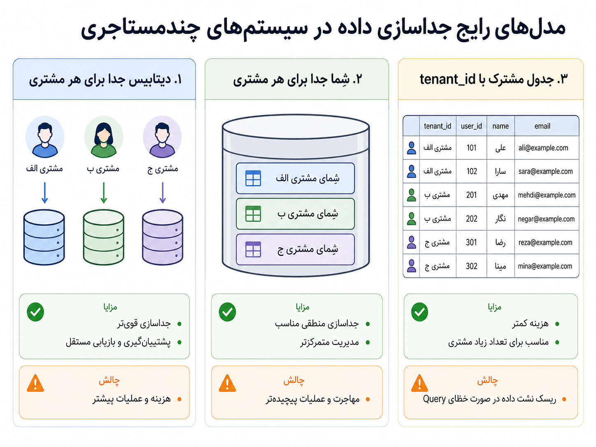
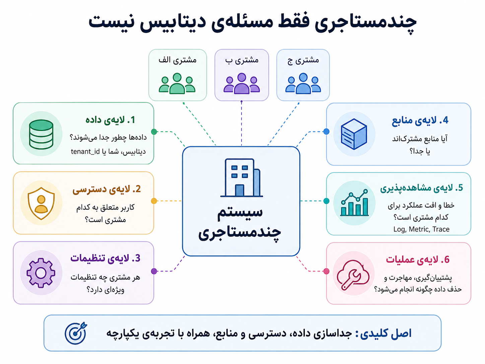

## وقتی یک سیستم باید میزبان چند مشتری باشد

تا اینجا درباره‌ی طراحی سرویس‌ها، ارتباط میان آن‌ها، اجرای کانتینری، Serverless و زیرساخت قابل بازبینی حرف زدیم. حالا فرض کنیم محصول واقعاً رشد کرده است. دیگر فقط یک تیم یا یک سازمان از آن استفاده نمی‌کند. چند شرکت، چند مدرسه، چند فروشگاه یا چند مشتری سازمانی می‌خواهند از همان سامانه استفاده کنند.

در نگاه اول، شاید ساده به نظر برسد: همان سیستم را برای چند مشتری باز می‌کنیم. اما خیلی زود پرسش‌های جدی‌تر پیدا می‌شوند. داده‌ی هر مشتری کجا نگه‌داری می‌شود؟ کاربران هر مشتری چطور از هم جدا می‌شوند؟ تنظیمات هر مشتری کجا ذخیره می‌شود؟ اگر یک مشتری پرترافیک شد، آیا روی بقیه اثر می‌گذارد؟ اگر یک query اشتباه نوشته شود، آیا ممکن است داده‌ی مشتری دیگری نمایش داده شود؟

اینجاست که مفهوم Multi-tenancy یا معماری چندمستاجری وارد داستان می‌شود. در این مدل، یک سامانه به چند tenant خدمت می‌دهد. tenant می‌تواند یک شرکت، سازمان، تیم، مدرسه، فروشگاه یا هر واحد مستقلی باشد که داده، کاربر، تنظیمات و مرزهای خودش را دارد.

:::tip[ایده‌ی اصلی]
Multi-tenancy یعنی یک سامانه بتواند به چند مشتری یا سازمان خدمت بدهد، بی‌آنکه مرز داده، دسترسی، تنظیمات و منابع آن‌ها با هم قاطی شود.
:::

ساده‌ترین راه این است که برای هر مشتری یک نسخه‌ی کامل و جدا از سیستم بالا بیاوریم. این کار از نظر جداسازی ذهنی ساده‌تر است، اما با زیاد شدن مشتری‌ها هزینه‌ی نگه‌داری بالا می‌رود: چند deployment، چند دیتابیس، چند تنظیم، چند migration، چند بکاپ و چند مسیر پایش. از آن طرف، اگر همه‌ی مشتری‌ها را روی یک سیستم کاملاً مشترک بیاوریم، هزینه‌ی عملیاتی کمتر می‌شود، اما خطرها و پیچیدگی‌های تازه‌ای وارد می‌شود.

پس چندمستاجری یک انتخاب صفر و یکی نیست؛ یک طیف است. هرچه اشتراک منابع بیشتر شود، هزینه و عملیات ممکن است ساده‌تر شود، اما مسئولیت ما برای جلوگیری از نشت داده، اثرگذاری مشتری‌ها روی هم و پیچیدگی مجوزها بیشتر می‌شود.

یکی از اولین جاهایی که این تصمیم خودش را نشان می‌دهد، مدل جداسازی داده است. سه مدل رایج‌تر را می‌شود این‌طور دید:

_هر مدل، معامله‌ای میان هزینه، جداسازی، امنیت و پیچیدگی عملیاتی است._

| مدل | توضیح | مزیت | هزینه یا خطر |
|---|---|---|---|
| دیتابیس جدا برای هر tenant | هر مشتری دیتابیس خودش را دارد | جداسازی قوی‌تر، بکاپ و بازیابی مستقل‌تر | هزینه و عملیات بیشتر |
| schema جدا برای هر tenant | همه روی یک دیتابیس‌اند، اما schema جدا دارند | جداسازی منطقی مناسب، مدیریت متمرکزتر | migration و عملیات پیچیده‌تر |
| جدول مشترک با `tenant_id` | داده‌ها در جدول‌های مشترک‌اند و با tenant_id جدا می‌شوند | هزینه کمتر و مناسب‌تر برای تعداد زیاد tenant | خطر نشت داده در صورت خطای query یا کنترل دسترسی |

هیچ‌کدام از این مدل‌ها «بهترین مطلق» نیستند. اگر داده‌ها بسیار حساس‌اند، تعداد tenantها کم است و نیاز به بکاپ و بازیابی مستقل داریم، دیتابیس جدا می‌تواند منطقی باشد. اگر تعداد tenantها زیاد است و هزینه‌ی عملیاتی باید کنترل شود، جدول مشترک با `tenant_id` شاید عملی‌تر باشد. گاهی هم مدل ترکیبی داریم: tenantهای معمولی روی منابع مشترک‌اند، اما tenantهای بزرگ یا حساس منابع جدا می‌گیرند.

اما مهم‌ترین سوءبرداشت این است که فکر کنیم چندمستاجری فقط مسئله‌ی دیتابیس است. اضافه کردن `tenant_id` به جدول‌ها شروع کار است، نه پایان آن. اگر cache با tenant جدا نشود، اگر فایل‌ها در storage مسیر یا مالکیت روشن نداشته باشند، اگر log و metricها tenant-aware نباشند، یا اگر مجوزها درست اعمال نشوند، سیستم هنوز خطرناک است.

_در سیستم چندمستاجری، جداسازی داده فقط یکی از لایه‌هاست؛ دسترسی، تنظیمات، منابع، مشاهده‌پذیری و عملیات هم باید tenant-aware باشند._

چندمستاجری را بهتر است در چند لایه ببینیم:

| لایه | پرسش اصلی |
|---|---|
| داده | داده‌ی tenantها چطور جدا می‌شود؟ دیتابیس جدا، schema جدا یا `tenant_id`؟ |
| دسترسی | کاربر از کجا معلوم است متعلق به کدام tenant است و چه مجوزی دارد؟ |
| تنظیمات | هر tenant چه تنظیمات ویژه‌ای دارد و این تنظیمات کجا نگه‌داری می‌شود؟ |
| منابع | آیا همه از منابع مشترک استفاده می‌کنند یا بعضی tenantها منابع جدا دارند؟ |
| مشاهده‌پذیری | وقتی خطا یا افت عملکرد رخ می‌دهد، می‌فهمیم مربوط به کدام tenant است؟ |
| عملیات | migration، بکاپ، حذف داده و بازیابی برای هر tenant چطور انجام می‌شود؟ |

یک مثال ساده بزنیم. فرض کنیم فروشگاه الف و فروشگاه ب هر دو از سامانه‌ی ما استفاده می‌کنند. کاربر فروشگاه الف وارد پنل می‌شود و گزارش سفارش‌ها را می‌بیند. اگر query گزارش فقط بر اساس تاریخ فیلتر کند و tenant را فراموش کند، ممکن است سفارش‌های فروشگاه ب هم در نتیجه بیاید. این فقط یک bug معمولی نیست؛ در سیستم چندمستاجری، چنین خطایی می‌تواند فاجعه‌ی اعتماد و امنیت باشد.

:::warning[یک سوءبرداشت رایج]
اضافه کردن `tenant_id` به جدول‌ها یعنی Multi-tenancy حل شد؟ نه. باید مطمئن شویم همه‌ی مسیرهای خواندن، نوشتن، cache، فایل، گزارش، log، metric، دسترسی و عملیات، مرز tenant را می‌شناسند و رعایت می‌کنند.
:::

یکی از خطرهای مهم دیگر، مسئله‌ی همسایه‌ی پرمصرف یا noisy neighbor است. وقتی چند tenant روی منابع مشترک اجرا می‌شوند، یک tenant پرترافیک می‌تواند منابع را مصرف کند و کیفیت سرویس tenantهای دیگر را پایین بیاورد. مثلاً یک مشتری گزارش سنگین می‌گیرد، صف پردازش را پر می‌کند یا تعداد زیادی درخواست هم‌زمان می‌فرستد، و مشتری‌های دیگر هم کندی را تجربه می‌کنند.

پس در سیستم چندمستاجری، عدالت منابع هم بخشی از طراحی است. ممکن است به rate limit، سهمیه، صف جدا، pool جدا، منابع اختصاصی برای مشتری‌های بزرگ، یا اولویت‌بندی پردازش نیاز داشته باشیم. این تصمیم‌ها فقط فنی نیستند؛ به قرارداد، مدل درآمدی و سطح سرویس وعده‌داده‌شده به مشتری هم ربط دارند.

:::note[چندمستاجری و زیرساخت]
فصل قبل درباره‌ی IaC و GitOps بود. در سیستم چندمستاجری، آن بحث دوباره مهم می‌شود: شاید برای tenantهای بزرگ دیتابیس جدا بسازیم، namespace جدا در Kubernetes بدهیم، یا تنظیمات و منابعشان را با کد و Git نگه‌داری کنیم. پس Multi-tenancy فقط در کد برنامه نیست؛ در زیرساخت و عملیات هم خودش را نشان می‌دهد.
:::

انتخاب مدل چندمستاجری باید با چند معیار انجام شود: حساسیت داده، تعداد tenantها، نیاز به سفارشی‌سازی، هزینه‌ی عملیات، الزامات حقوقی، نیاز به بکاپ و بازیابی مستقل، و توان تیم برای نگه‌داری سیستم. تیمی که تازه محصول را ساخته، شاید با مدل ساده‌تری شروع کند و بعد برای tenantهای خاص، جداسازی قوی‌تری اضافه کند. اما اگر از ابتدا داده‌ها بسیار حساس‌اند، ساده‌ترین مدل مشترک شاید انتخاب خطرناکی باشد.

| پرسش تصمیم‌گیری | چرا مهم است؟ |
|---|---|
| داده‌ی tenantها چقدر حساس است؟ | حساسیت بالا معمولاً جداسازی قوی‌تر می‌خواهد. |
| چند tenant داریم یا خواهیم داشت؟ | تعداد زیاد، عملیات مدل‌های جداگانه را سخت‌تر می‌کند. |
| هر tenant چقدر سفارشی‌سازی می‌خواهد؟ | تنظیمات زیاد، طراحی پیکربندی و استقرار را پیچیده‌تر می‌کند. |
| آیا tenantهای بزرگ داریم؟ | شاید برای آن‌ها منابع یا دیتابیس جدا لازم شود. |
| migration و بکاپ چطور انجام می‌شود؟ | با زیاد شدن tenantها، عملیات داده سخت‌تر می‌شود. |
| آیا مشاهده‌پذیری tenant-aware داریم؟ | بدون آن، عیب‌یابی و پاسخ‌گویی به مشتری سخت می‌شود. |

  
چه زمانی مدل مشترک با tenant_id می‌تواند مناسب باشد؟

وقتی تعداد tenantها زیاد است، داده‌ها حساسیت بسیار بالا ندارند، تیم می‌تواند کنترل دسترسی و queryها را خوب مدیریت کند، و هزینه‌ی عملیاتی باید پایین بماند، مدل مشترک با `tenant_id` می‌تواند انتخاب عملی‌تری باشد. البته این مدل نیاز به دقت جدی در queryها، cache، گزارش‌ها و تست‌ها دارد.

  
چه زمانی دیتابیس جدا برای هر tenant منطقی‌تر است؟

وقتی داده‌ها بسیار حساس‌اند، مشتری‌ها بزرگ‌اند، بکاپ و بازیابی مستقل مهم است، یا الزام حقوقی و قراردادی برای جداسازی قوی‌تر داریم، دیتابیس جدا می‌تواند گزینه‌ی مناسب‌تری باشد. هزینه‌ی عملیاتی این مدل بیشتر است، اما مرز داده روشن‌تر و مدیریت بعضی عملیات‌ها مستقل‌تر می‌شود.

برای من، Multi-tenancy یعنی پذیرفتن یک معامله‌ی مهم: می‌خواهیم تجربه‌ای مشترک و قابل نگه‌داری بسازیم، اما نباید مرز مشتری‌ها را ساده بگیریم. هرجا منابع را مشترک می‌کنیم، باید آگاهانه‌تر درباره‌ی امنیت، دسترسی، مصرف منابع، مشاهده‌پذیری و عملیات فکر کنیم.

تا اینجا گفتیم یک سیستم چندمستاجری چطور داده و منابع چند مشتری را کنار هم نگه می‌دارد. اما همین انتخاب، فصل بعدی را سخت‌تر می‌کند: وقتی ساختار داده تغییر می‌کند، migration دیگر فقط تغییر چند جدول در یک دیتابیس نیست. شاید باید تغییر را روی چند دیتابیس، چند schema یا میلیون‌ها ردیف دارای `tenant_id` اجرا کنیم. اینجاست که وارد Data Migration می‌شویم.
