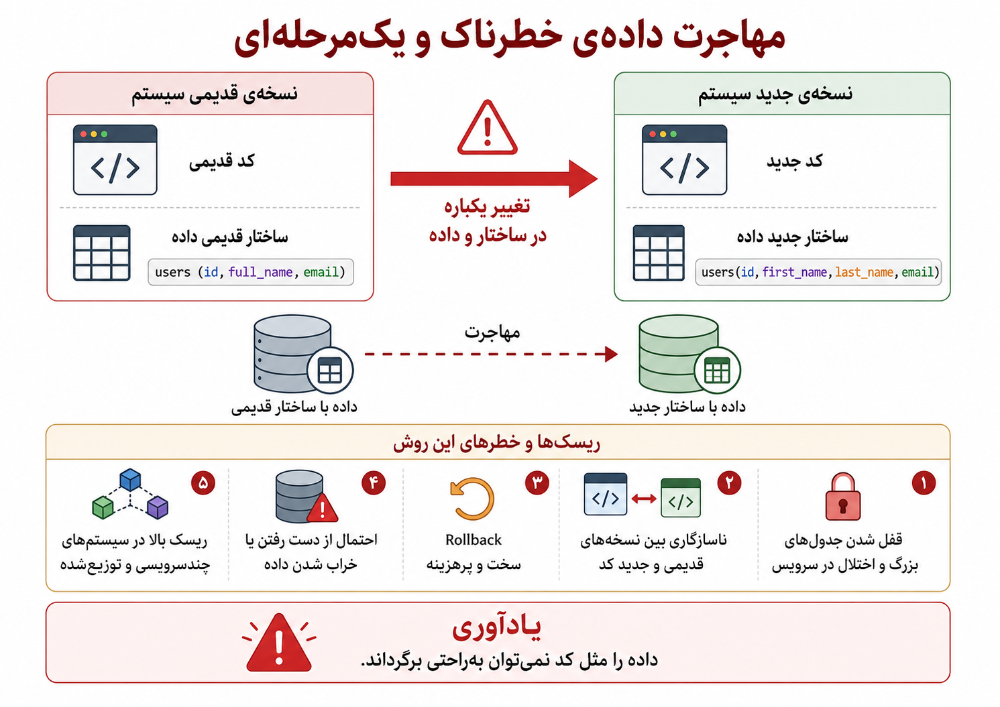
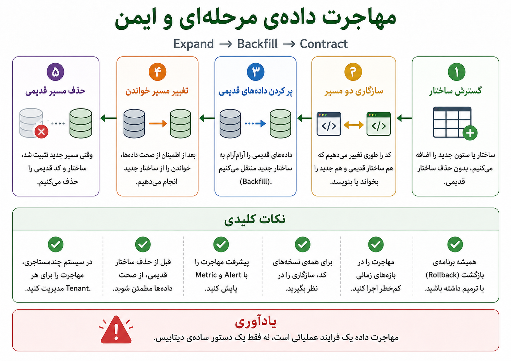

## وقتی داده‌ها هم اسباب‌کشی دارند

در فصل قبل گفتیم وقتی یک سیستم چندمستاجری می‌شود، داده‌ی چند مشتری، سازمان یا گروه کاربری در کنار هم مدیریت می‌شود. حالا تصور کنیم محصول رشد کرده و یک تغییر ظاهراً ساده از راه می‌رسد: تیم محصول می‌خواهد فیلد آدرس دقیق‌تر شود؛ شهر، استان و کدپستی جدا شوند. یا تیم فنی می‌گوید جدول کاربران باید بازطراحی شود. یا تیم مالی می‌خواهد وضعیت تراکنش‌ها از یک مقدار کلی به چند وضعیت دقیق‌تر تبدیل شود.

در نگاه اول، این‌ها فقط تغییر دیتابیس‌اند: یک ستون اضافه کن، یک جدول بساز، چند داده را جابه‌جا کن، ستون قدیمی را حذف کن. اما در سیستم واقعی، داده زنده است. کاربرها هم‌زمان در حال استفاده‌اند، سرویس‌ها به جدول‌ها وابسته‌اند، گزارش‌ها از داده می‌خوانند، workerها در پس‌زمینه چیزی می‌نویسند، و در سیستم چندمستاجری شاید همین تغییر باید برای چند tenant، schema یا دیتابیس اجرا شود.

اینجاست که Data Migration یا مهاجرت داده وارد داستان می‌شود. مهاجرت داده فقط جابه‌جایی چند ردیف نیست؛ یعنی تغییر دادن ساختار، محل یا معنای داده، بدون اینکه اعتماد سیستم به داده‌ها از بین برود.

:::tip[ایده‌ی اصلی]
Data Migration یعنی داده‌ی زنده را از یک وضعیت به وضعیت دیگر ببریم، بی‌آنکه صحت، معنا، دسترس‌پذیری و اعتماد به داده قربانی شود.
:::

یک مثال ساده را در نظر بگیریم. در جدول `users` قبلاً فقط یک ستون `full_name` داشتیم. حالا می‌خواهیم آن را به `first_name` و `last_name` تبدیل کنیم. اگر در یک حرکت ستون قدیمی را حذف کنیم و کد جدید را منتشر کنیم، ممکن است نسخه‌های قدیمی‌تر کد هنوز `full_name` بخواهند. ممکن است بعضی داده‌ها درست تفکیک نشوند. ممکن است گزارش‌ها هنوز به ستون قدیمی وابسته باشند. اگر جدول بزرگ باشد، تغییر یک‌باره حتی می‌تواند باعث قفل شدن جدول یا اختلال در سرویس شود.

_در مهاجرت یک‌مرحله‌ای، فرض می‌کنیم کد، داده و همه‌ی سرویس‌ها هم‌زمان و بی‌خطا تغییر می‌کنند؛ در سیستم واقعی این فرض معمولاً خطرناک است._

مهاجرت داده شکل‌های مختلفی دارد. گاهی ساختار جدول عوض می‌شود، گاهی خود داده‌ها تبدیل می‌شوند، و گاهی معنای یک مقدار تغییر می‌کند. سخت‌ترین حالت معمولاً همان تغییر معناست، چون خطایش همیشه سریع دیده نمی‌شود.

| نوع تغییر | مثال | خطر اصلی |
|---|---|---|
| تغییر ساختار | اضافه کردن ستون، ساخت جدول جدید، تغییر نوع ستون | ناسازگاری کد و دیتابیس |
| تغییر داده | پر کردن مقدار جدید، انتقال داده بین جدول‌ها، backfill | داده‌ی ناقص، فشار روی دیتابیس یا خطای تبدیل |
| تغییر معنا | تبدیل `canceled` به `canceled_by_user` و `canceled_by_system` | خطای پنهان در گزارش‌ها و منطق کسب‌وکار |

نکته‌ی مهم این است که migration فقط `ALTER TABLE` نیست. ممکن است یک migration از نظر دیتابیس ساده باشد، اما از نظر محصولی پیچیده شود. اگر معنای یک وضعیت تغییر کند، باید گزارش‌ها، داشبوردها، APIها، تست‌ها، مستندات و حتی زبان تیم محصول هم با آن تغییر هماهنگ شوند.

راه امن‌تر معمولاً این است که migration را به یک فرایند مرحله‌ای تبدیل کنیم؛ نه یک تغییر ناگهانی. یکی از الگوهای رایج برای این کار، الگوی گسترش، پرکردن و جمع‌کردن است؛ همان چیزی که گاهی با نام Expand → Backfill → Contract شناخته می‌شود.

_در مهاجرت مرحله‌ای، ابتدا مسیر جدید را بدون شکستن مسیر قدیمی اضافه می‌کنیم، بعد داده‌ها را آرام‌آرام منتقل می‌کنیم، و فقط وقتی مطمئن شدیم مسیر جدید پایدار است، مسیر قدیمی را حذف می‌کنیم._

در مثال `full_name`، مسیر امن‌تر می‌تواند این باشد:

1. ستون‌های `first_name` و `last_name` را اضافه کنیم، بدون حذف `full_name`.
2. کد را طوری تغییر دهیم که بتواند با هر دو ساختار کنار بیاید.
3. داده‌های قدیمی را تدریجی و در batchهای کوچک به ساختار جدید منتقل کنیم.
4. مدتی خواندن و نوشتن را پایش کنیم و مطمئن شویم داده‌های جدید درست‌اند.
5. خواندن اصلی را از ساختار جدید انجام دهیم.
6. بعد از اطمینان، مسیر قدیمی را حذف کنیم.

:::note[Migration امن معمولاً چندمرحله‌ای است]
در سیستم‌های واقعی، تغییر داده را بهتر است یک deploy ساده نبینیم. گاهی باید چند نسخه از کد و دیتابیس برای مدتی با هم سازگار بمانند تا بتوانیم بدون قطعی و با ریسک کمتر مهاجرت کنیم.
:::

اینجا دوباره بحث سازگاری نسخه‌ها مهم می‌شود. کد جدید باید بتواند با داده‌ی قدیمی کنار بیاید. کد قدیمی هم ممکن است برای مدتی با schema جدید کار کند. اگر چند سرویس داریم که هم‌زمان deploy نمی‌شوند، migration نباید فرض کند همه‌ی آن‌ها هم‌زمان به نسخه‌ی جدید رفته‌اند. اضافه کردن یک ستون معمولاً امن‌تر از rename یا حذف ستون است، چون کد قدیمی معمولاً از اضافه شدن ستون جدید نمی‌شکند؛ اما حذف و تغییرهای مخرب باید با احتیاط و مرحله‌ای انجام شوند.

در سیستم چندمستاجری، migration پیچیده‌تر هم می‌شود. اگر مدل ما جدول مشترک با `tenant_id` است، migration روی جدول‌های بزرگ و مشترک اجرا می‌شود و باید مراقب فشار روی کل سیستم باشیم. اگر schema جدا برای هر tenant داریم، migration باید روی چند schema اجرا و پایش شود. اگر دیتابیس جدا برای هر tenant داریم، باید بدانیم کدام tenant مهاجرت شده، کدام نشده، و اگر یکی شکست خورد، چه می‌کنیم.

:::warning[در چندمستاجری، migration فقط تغییر داده نیست]
در سیستم چندمستاجری، migration یک کار عملیاتی هم هست: باید بدانیم تغییر برای کدام tenant اجرا شده، کدام tenant خطا داده، آیا می‌توانیم tenantها را مرحله‌ای مهاجرت دهیم، و اگر یک tenant مشکل داشت، چطور جلوی اثرگذاری روی بقیه را بگیریم.
:::

یکی از اشتباه‌های خطرناک این است که migration را در ساعت اوج و بدون مشاهده‌پذیری اجرا کنیم. اگر backfill روی جدول بزرگ بدون محدودیت اجرا شود، می‌تواند دیتابیس را تحت فشار بگذارد. اگر جدول قفل شود، سرویس کند یا از دسترس خارج می‌شود. اگر metric و alert نداشته باشیم، شاید دیر بفهمیم داده‌ها ناقص منتقل شده‌اند.

چند پرسش مهم پیش از اجرای migration:

| پرسش | چرا مهم است؟ |
|---|---|
| آیا نسخه‌های قدیمی و جدید کد با schema جدید سازگارند؟ | سرویس‌ها همیشه هم‌زمان deploy نمی‌شوند. |
| آیا migration روی جدول بزرگ lock ایجاد می‌کند؟ | قفل شدن جدول می‌تواند سرویس را مختل کند. |
| آیا backfill قابل توقف و ادامه دادن است؟ | migration طولانی ممکن است وسط کار شکست بخورد. |
| آیا progress و خطاها را metric و alert می‌کنیم؟ | بدون مشاهده‌پذیری، migration کورکورانه است. |
| آیا backup، rollback یا برنامه‌ی ترمیم داریم؟ | داده را مثل کد همیشه راحت نمی‌شود برگرداند. |
| در سیستم چندمستاجری، وضعیت هر tenant معلوم است؟ | ممکن است بعضی tenantها مهاجرت شده باشند و بعضی نه. |

:::warning[داده را مثل کد همیشه نمی‌توان راحت برگرداند]
اگر deploy بد باشد، معمولاً می‌توانیم نسخه‌ی قبلی کد را برگردانیم. اما اگر migration داده را خراب کند، rollback همیشه ساده نیست. گاهی باید داده را ترمیم کنیم، نه فقط کد را عقب ببریم.
:::

  
چه زمانی migration یک‌مرحله‌ای قابل قبول‌تر است؟

اگر سیستم هنوز کوچک است، جدول‌ها کم‌حجم‌اند، فقط یک سرویس به داده وابسته است، downtime کوتاه قابل قبول است و backup روشن داریم، migration یک‌مرحله‌ای ممکن است کافی باشد. اما با بزرگ شدن داده، زیاد شدن سرویس‌ها و حساس‌تر شدن محصول، این روش پرریسک‌تر می‌شود.

  
چه زمانی migration مرحله‌ای ضروری‌تر می‌شود؟

وقتی داده زیاد است، سرویس‌ها متعددند، deployها هم‌زمان نیستند، downtime قابل قبول نیست، یا چند tenant داریم، migration مرحله‌ای معمولاً انتخاب امن‌تری است. در این حالت باید سازگاری نسخه‌ها، backfill تدریجی، پایش پیشرفت و برنامه‌ی ترمیم را جدی بگیریم.

برای من، Data Migration یعنی پذیرفتن این واقعیت که داده، برخلاف کد، فقط با برگشتن به commit قبلی درست نمی‌شود. داده تاریخچه دارد، معنا دارد، مشتری دارد و خطای آن می‌تواند در گزارش‌ها، تصمیم‌های کسب‌وکار و اعتماد کاربر باقی بماند. پس migration خوب بیشتر از آنکه یک دستور دیتابیس باشد، یک فرایند فنی و عملیاتی است.

وقتی migration را مرحله‌ای، قابل مشاهده و قابل ترمیم طراحی می‌کنیم، در واقع قبول کرده‌ایم که سیستم واقعی همیشه در معرض تغییر و ریسک است. اما آیا کافی است فقط امیدوار باشیم که همه‌چیز درست کار کند؟ یا می‌توانیم آگاهانه سیستم را در برابر خطاها، قطعی‌ها و رفتارهای غیرمنتظره آزمایش کنیم؟ این پرسش ما را به Chaos Engineering می‌رساند.
