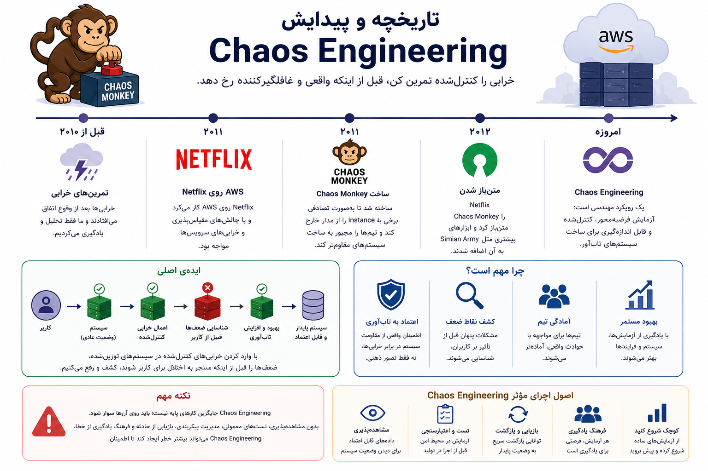
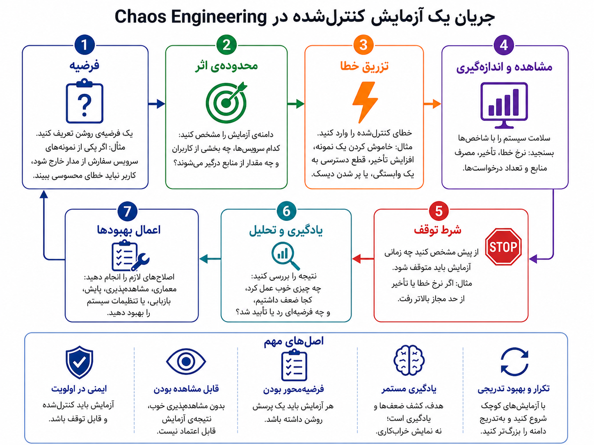

## وقتی خرابی اتفاق بد نیست؛ ناآمادگی بد است

تا اینجا سیستم ما بزرگ و واقعی‌تر شده است. سرویس‌ها از هم جدا شده‌اند، پیام و صف و رخداد داریم، داده‌ها مهاجرت می‌کنند، زیرساخت با کد مدیریت می‌شود و شاید چند tenant هم روی یک سامانه زندگی می‌کنند. اما یک پرسش هنوز باقی است: وقتی بخشی از این سیستم خراب شود، واقعاً می‌دانیم چه اتفاقی می‌افتد؟ یا فقط امیدواریم که همه‌چیز خوب کار کند؟

خیلی از سیستم‌ها در روزهای عادی سالم به نظر می‌رسند. نمودارها سبز هستند، سرویس‌ها پاسخ می‌دهند و کاربران شکایت خاصی ندارند. اما کافی است یک سرویس کمی کند شود، یک وابستگی بیرونی خطا بدهد، یک نمونه از سرویس سفارش از مدار خارج شود، یا ارتباط با cache برای چند دقیقه قطع شود. آن وقت ممکن است زنجیره‌ای از خطاها شروع شود؛ خطاهایی که تا قبل از حادثه، فقط در ذهن ما «نباید اتفاق می‌افتادند».

Chaos Engineering از همین نقطه شروع می‌شود: به‌جای اینکه فقط منتظر خرابی واقعی بمانیم، خرابی‌های محتمل را در اندازه‌ی کوچک، کنترل‌شده و قابل مشاهده تمرین کنیم تا ضعف‌ها را زودتر پیدا کنیم.

:::tip[ایده‌ی اصلی]
Chaos Engineering یعنی طراحی و اجرای آزمایش‌های کنترل‌شده برای فهمیدن اینکه سیستم در برابر خرابی‌های واقعی چقدر تاب‌آور است. هدف خراب کردن سیستم نیست؛ هدف کم کردن غافلگیری در روز حادثه است.
:::

این ایده بیش از همه با Netflix معروف شد. وقتی Netflix روی AWS و معماری ابری توزیع‌شده کار می‌کرد، با واقعیتی روبه‌رو بود که برای خیلی از سیستم‌های امروزی هم آشناست: خرابی ماشین، شبکه، وابستگی بیرونی یا بخشی از زیرساخت اتفاقی عجیب و نادر نیست؛ بخشی از زندگی روزمره‌ی سیستم‌های توزیع‌شده است. Netflix حدود سال ۲۰۱۱ ابزاری به نام Chaos Monkey ساخت؛ ابزاری که به‌صورت کنترل‌شده بعضی instanceها را از مدار خارج می‌کرد تا تیم‌ها مجبور شوند سیستم‌هایی بسازند که با خرابی یک نمونه از پا نیفتند. بعدتر این ایده در قالب ابزارها و روش‌های بیشتری رشد کرد و Chaos Engineering به یک رویکرد مهندسی برای آزمودن تاب‌آوری تبدیل شد.

_ایده این نیست که سیستم را بی‌هدف خراب کنیم؛ ایده این است که خرابی‌های قابل انتظار را قبل از روز حادثه، کنترل‌شده تمرین کنیم._

البته خود ایده‌ی تمرین خرابی از هیچ جا ناگهان ظاهر نشد. پیش از این هم تیم‌ها تمرین‌های بازیابی از فاجعه، مانورهای عملیاتی و تست‌های تاب‌آوری داشتند. تفاوت مهم این بود که Netflix این نگاه را در فضای سرویس‌های ابری و توزیع‌شده بسیار ملموس کرد: اگر می‌دانیم خرابی بخشی از واقعیت است، پس باید آن را به شکل کنترل‌شده وارد فرایند یادگیری سیستم کنیم.

اما همین‌جا باید یک سوءبرداشت خطرناک را کنار بگذاریم. Chaos Engineering یعنی «خراب‌کاری تصادفی»؟ نه. یعنی تیمی بدون آمادگی برود production را بلرزاند تا ببیند چه می‌شود؟ قطعاً نه. Chaos Engineering درست، فرضیه‌محور است: اول می‌گوییم انتظار داریم سیستم در یک شرایط مشخص چه رفتاری داشته باشد، بعد یک اختلال محدود و قابل توقف وارد می‌کنیم، و در نهایت نتیجه را با معیارهای روشن می‌سنجیم.

مثلاً فرضیه می‌تواند این باشد: «اگر یکی از نمونه‌های سرویس سفارش از مدار خارج شود، کاربر نباید خطای محسوس ببیند و ترافیک باید به نمونه‌های سالم منتقل شود.» بعد آزمایش را در محدوده‌ای کوچک اجرا می‌کنیم، نرخ خطا، تأخیر، تعداد درخواست‌های ناموفق و رفتار alertها را می‌بینیم، و اگر وضعیت از حد امن خارج شد، آزمایش را متوقف می‌کنیم.

_یک آزمایش درست در Chaos Engineering با فرضیه شروع می‌شود، محدوده‌ی اثر دارد، قابل مشاهده است، شرط توقف دارد و در نهایت به یادگیری و اصلاح منجر می‌شود._

چند مفهوم پایه در این مسیر مهم‌اند:

| مفهوم | توضیح ساده |
|---|---|
| Steady State | وضعیت عادی و سالم سیستم که انتظار داریم حفظ شود |
| Hypothesis | فرضیه‌ای که می‌خواهیم آزمایش کنیم |
| Fault Injection | وارد کردن خطای کنترل‌شده؛ مثل قطع یک instance یا افزایش تأخیر |
| Blast Radius | محدوده‌ی اثر آزمایش؛ یعنی اگر بد شد، چقدر آسیب می‌زند |
| Abort Condition | شرط توقف آزمایش |
| Game Day | تمرین برنامه‌ریزی‌شده برای آزمودن واکنش سیستم و تیم به حادثه |

نمونه‌های ساده‌ی آزمایش می‌تواند این‌ها باشد: حذف یک pod در Kubernetes، خاموش کردن یک نمونه از سرویس سفارش، افزایش تأخیر بین سرویس پرداخت و سفارش، قطع موقت دسترسی به cache، کند کردن یک read replica، پر شدن دیسک یک worker، یا خطای موقت در سرویس ارسال پیامک. در سناریوهای پیشرفته‌تر شاید درباره‌ی از دسترس خارج شدن یک availability zone هم فکر کنیم؛ اما شروع عاقلانه معمولاً از آزمایش‌های کوچک‌تر است، نه از بزرگ‌ترین فاجعه‌ی ممکن.

:::note[از کوچک شروع کنیم]
Chaos Engineering خوب معمولاً با آزمایش‌های کوچک، قابل توقف و کم‌خطر شروع می‌شود. لازم نیست روز اول یک ناحیه‌ی ابری را از مدار خارج کنیم. اول باید مطمئن شویم مشاهده‌پذیری، alert، rollback، مالکیت سرویس و واکنش تیم قابل اتکا هستند.
:::

حالا نقد مهم: چرا خیلی از تیم‌ها Chaos Engineering انجام نمی‌دهند؟ همیشه هم از تنبلی یا عقب‌ماندگی نیست. گاهی انجام ندادن آن تصمیم درستی است، چون پیش‌نیازهایش فراهم نیست. اگر metric، log، trace و alert درست نداریم، وارد کردن خطا فقط کور کردن خودمان است. اگر rollback و runbook نداریم، آزمایش خرابی ممکن است خودش حادثه شود. اگر تیم هنوز مالکیت سرویس‌ها را روشن نکرده، معلوم نیست هنگام آزمایش چه کسی باید تصمیم بگیرد.

| دلیل انجام ندادن | چرا قابل فهم است؟ |
|---|---|
| مشاهده‌پذیری ضعیف | بدون metric و alert، نتیجه‌ی آزمایش قابل اعتماد نیست. |
| نبود برنامه‌ی برگشت | اگر آزمایش بد پیش برود، باید راه توقف و ترمیم داشته باشیم. |
| فشار محصولی | تیمی که زیر فشار تحویل ویژگی است، سخت برای تمرین تاب‌آوری زمان می‌گذارد. |
| فرهنگ سازمانی نامناسب | بعضی سازمان‌ها آزمایش کنترل‌شده‌ی خطا را با بی‌احتیاطی یکی می‌گیرند. |
| سیستم هنوز ساده است | برای بعضی سیستم‌های کوچک، تست‌های معمولی و پایش ساده کافی‌تر است. |
| نبود مالکیت روشن | اگر معلوم نیست مالک هر سرویس کیست، آزمایش حادثه‌محور خطرناک می‌شود. |

بنابراین نباید Chaos Engineering را مثل مدال افتخار معرفی کنیم. این کار زمانی ارزشمند است که روی پایه‌های درست سوار شود: مشاهده‌پذیری، مدیریت حادثه، تست‌های معمولی، برنامه‌ی برگشت، مالکیت سرویس و فرهنگ یادگیری بدون مقصرسازی.

:::warning[Chaos Engineering میان‌بر بلوغ نیست]
اگر تیم هنوز مشاهده‌پذیری، rollback، runbook و واکنش روشن به حادثه ندارد، Chaos Engineering اولویت اول نیست. در چنین شرایطی، تزریق خطا می‌تواند بیشتر شلوغ‌کاری و خطر باشد تا مهندسی.
:::

خود Chaos Engineering هم اگر بد اجرا شود، چند خطر دارد. یکی اعتماد کاذب است: چند آزمایش ساده موفق می‌شود و تیم فکر می‌کند سیستم واقعاً تاب‌آور است. دیگری آسیب واقعی است: آزمایش بدون محدوده و شرط توقف، خودش outage می‌سازد. خطر سوم هم نمایش مهندسی است؛ یعنی تیم به‌جای حل بدهی‌های معلوم، یک نمایش جذاب از «ما chaos داریم» اجرا می‌کند.

چند پرسش خوب پیش از هر آزمایش:

| پرسش | چرا مهم است؟ |
|---|---|
| فرضیه‌ی ما دقیقاً چیست؟ | بدون فرضیه، آزمایش بیشتر کنجکاوی خطرناک است. |
| وضعیت سالم سیستم را چطور می‌سنجیم؟ | باید بدانیم چه چیزی نباید خراب شود. |
| محدوده‌ی اثر چقدر است؟ | آزمایش باید blast radius کنترل‌شده داشته باشد. |
| چه زمانی آزمایش را متوقف می‌کنیم؟ | شرط توقف باید قبل از اجرا روشن باشد. |
| چه کسی تصمیم‌گیر و پاسخ‌گوست؟ | در زمان اختلال، مالکیت مبهم خطرناک است. |
| بعد از آزمایش چه چیزی تغییر می‌کند؟ | اگر یادگیری به اصلاح نرسد، آزمایش ارزش کمی دارد. |

  
چه زمانی Chaos Engineering ارزشمندتر می‌شود؟

وقتی سیستم توزیع‌شده است، وابستگی‌های بیرونی دارد، چند سرویس و چند تیم درگیرند، downtime پرهزینه است، و تیم زیرساخت مشاهده‌پذیری و واکنش به حادثه‌ی قابل قبول دارد، Chaos Engineering می‌تواند ضعف‌های پنهان را پیش از حادثه‌ی واقعی آشکار کند.

  
چه زمانی بهتر است فعلاً سراغش نرویم؟

اگر هنوز تست‌های پایه، alertهای قابل اعتماد، runbook، rollback، backup، مالکیت سرویس‌ها و فرهنگ پاسخ‌گویی به حادثه نداریم، بهتر است اول همان پایه‌ها را بسازیم. Chaos Engineering نباید جایگزین کارهای پایه شود.

برای من، Chaos Engineering یعنی صادق بودن با واقعیت سیستم‌های واقعی: خرابی رخ می‌دهد. سؤال این نیست که آیا چیزی خراب می‌شود یا نه؛ سؤال این است که آیا پیش از کاربر و پیش از بحران، رفتار سیستم را در برابر خرابی فهمیده‌ایم یا نه. اگر این کار با فرضیه، محدوده، مشاهده‌پذیری و یادگیری انجام شود، می‌تواند سیستم و تیم را بالغ‌تر کند. اگر بدون این پایه‌ها انجام شود، فقط اسم شیک‌تری برای خطر ساختن است.

تا اینجا بیشتر درباره‌ی سیستم‌های فنی و تاب‌آوری آن‌ها حرف زدیم. اما بعضی پیچیدگی‌ها نه فقط از خرابی فنی، بلکه از فرایندهای انسانی و سازمانی می‌آیند: درخواست‌ها، تأییدها، گردش کارها، نقش‌ها و وضعیت‌هایی که باید بین چند نفر و چند سیستم جابه‌جا شوند. اینجا وارد Business Process Management Systems یا BPMS می‌شویم.
