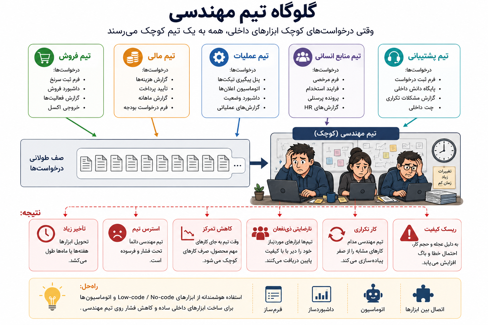
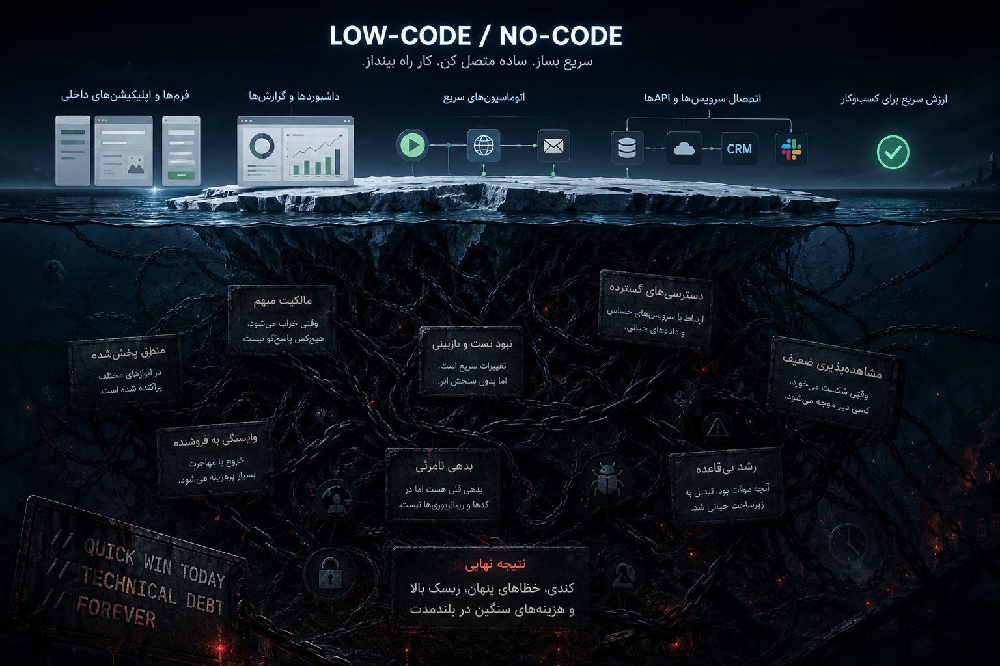
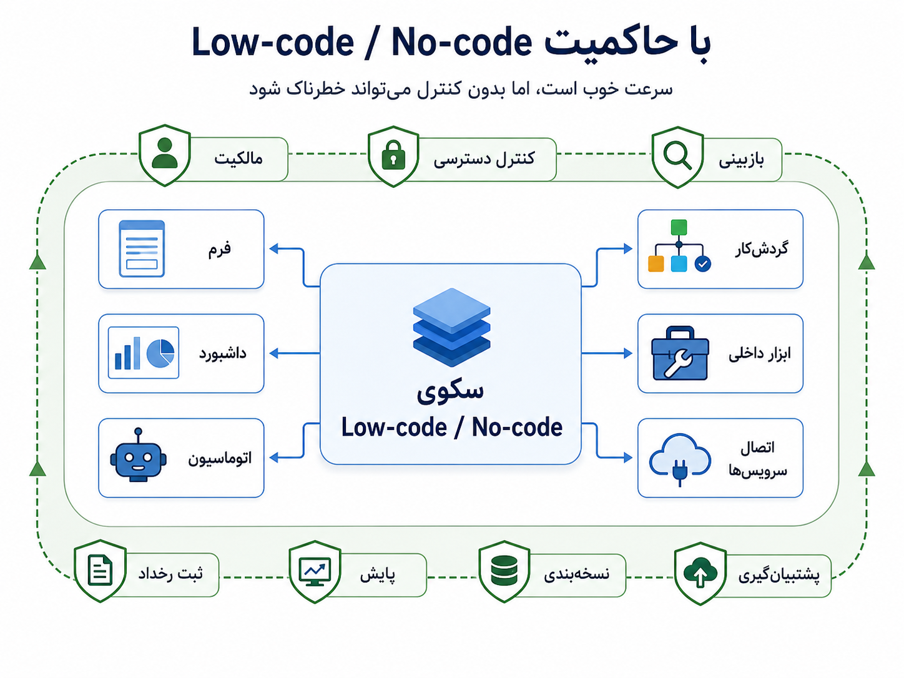

## وقتی همه‌چیز قرار نیست با کدنویسی کامل ساخته شود

بعد از این همه بحث درباره‌ی سرویس‌ها، زیرساخت، مهاجرت داده، چندمستاجری و تاب‌آوری، یک سؤال ساده اما مهم پیش می‌آید: آیا هر نیاز نرم‌افزاری باید با همین وزن مهندسی ساخته شود؟ آیا برای هر فرم داخلی، داشبورد سبک، اتوماسیون کوچک، پنل عملیاتی یا اتصال ساده بین دو ابزار، باید یک پروژه‌ی نرم‌افزاری کامل تعریف کنیم؟

در خیلی از سازمان‌ها، تیم‌های مختلف نیازهای کوچک اما واقعی دارند. تیم فروش یک فرم ثبت سرنخ می‌خواهد. تیم مالی یک گزارش هزینه می‌خواهد. تیم عملیات یک داشبورد وضعیت می‌خواهد. پشتیبانی می‌خواهد وقتی یک رخداد تکراری اتفاق افتاد، پیام خودکار بفرستد. منابع انسانی یک فرم درخواست مرخصی یا فرایند ساده‌ی تأیید می‌خواهد. اگر همه‌ی این درخواست‌ها وارد صف تیم مهندسی شود، کم‌کم تیم فنی به گلوگاه سازمان تبدیل می‌شود.

_گاهی مسئله این نیست که تیم مهندسی کند است؛ مسئله این است که هر نیاز کوچک و داخلی هم به همان مسیر سنگین توسعه‌ی نرم‌افزار فرستاده می‌شود._

Low-code و No-code از همین درد تغذیه می‌کنند. وعده‌ی آن‌ها جذاب است: سریع‌تر بساز، کمتر کد بزن، تیم‌های غیرمهندسی را توانمندتر کن، و همه‌چیز را برای یک فرم، داشبورد یا اتوماسیون کوچک از صفر نساز. اما همین‌جا باید مراقب باشیم؛ این بخش قرار نیست تبلیغ ابزار باشد. Low-code/No-code هم می‌تواند کمک کند، هم می‌تواند در بلندمدت سیستم را کندتر، مبهم‌تر و شکننده‌تر کند.

:::tip[ایده‌ی اصلی]
Low-code/No-code یعنی ساخت بخشی از نرم‌افزارها، فرم‌ها، داشبوردها، اتوماسیون‌ها یا ابزارهای داخلی با کدنویسی کم یا بدون کدنویسی سنتی. اما «کد کمتر» به معنی «مسئولیت مهندسی کمتر» نیست.
:::

ایده‌ی ساختن ابزار بدون کدنویسی کامل، چیز تازه‌ای نیست. سال‌ها قبل از اینکه اصطلاح Low-code/No-code مد شود، آدم‌ها با صفحه‌گسترده‌ها، Microsoft Access، ماکروها، فرم‌سازها و ابزارهای گزارش‌گیری تلاش می‌کردند کارهای روزمره‌ی خودشان را بدون ساختن یک نرم‌افزار کامل جلو ببرند. یعنی میل به اینکه «کاربر غیرمهندس هم بتواند چیزی بسازد» قدیمی‌تر از اسم‌های امروزی است.

بعدتر، ابزارهای سریع‌ساز برنامه، فرم‌سازها، ابزارهای اتوماسیون، پلتفرم‌های ساخت اپلیکیشن داخلی و سکوهای اتصال بین سرویس‌ها جدی‌تر شدند. امروز این فضا گسترده‌تر شده است: ابزارهایی مثل Retool، Airtable، AppSheet، Power Apps، Zapier، Make و n8n هرکدام از زاویه‌ای کمک می‌کنند فرم، داشبورد، پنل داخلی، جریان خودکار یا اتصال میان سرویس‌ها سریع‌تر ساخته شود.

n8n مثال خوبی است، چون نشان می‌دهد Low-code/No-code فقط فرم‌ساز نیست. n8n بیشتر در دسته‌ی اتوماسیون جریان کار قرار می‌گیرد: می‌توانیم چند سرویس را به هم وصل کنیم، وبهوک بگیریم، بر اساس زمان‌بندی کاری اجرا کنیم، داده را از یک ابزار به ابزار دیگر بفرستیم، پیام Telegram یا Slack ارسال کنیم، یا یک API داخلی را صدا بزنیم. مثلاً وقتی یک فرم پر شد، داده وارد CRM شود، یک پیام برای تیم فروش برود، یک وبهوک داخلی صدا زده شود، و در پایان ایمیل تأیید ارسال شود.

این‌ها واقعاً می‌توانند مفید باشند. برای ساخت نمونه‌ی اولیه، ابزار داخلی کم‌ریسک، اتوماسیون‌های سبک، داشبوردهای عملیاتی و کارهای تکراری، Low-code/No-code می‌تواند سرعت سازمان را بالا ببرد. تیم مهندسی هم به جای ساختن ده‌ها ابزار کوچک و کم‌ریسک، روی هسته‌ی محصول، معماری و مسائل سخت‌تر تمرکز می‌کند.

اما نیمه‌ی تاریک ماجرا همین‌جاست. چیزی که امروز به اسم میان‌بر ساخته می‌شود، فردا ممکن است تبدیل شود به زیرساخت نامرئی سازمان. یک جریان ساده در n8n، یک فرم در Airtable، یک پنل در Retool یا چند اتوماسیون در Zapier اول کار کمک می‌کند؛ اما کم‌کم همان‌ها می‌شوند مسیر اصلی ثبت درخواست، ارسال پیام به مشتری، تأیید مالی، تغییر وضعیت سفارش، گزارش مدیریتی یا اتصال بین دو سیستم مهم. آن وقت دیگر با یک ابزار ساده طرف نیستیم؛ با یک سیستم تولیدی طرفیم که فقط مثل سیستم تولیدی با آن رفتار نشده است.

_روی سطح، چند جریان سریع و تمیز می‌بینیم؛ زیر سطح، ممکن است منطق پخش‌شده، مالکیت مبهم، دسترسی‌های زیاد، نبود تست و بدهی نامرئی شکل گرفته باشد._

نقد ما اصل این ابزارها نیست؛ نقد ما استفاده‌ی بی‌مالکیت و بی‌چرخه‌ی عمر از آن‌هاست. نقد تند اینجاست: این ابزارها اغلب کار را از تیم مهندسی کم نمی‌کنند؛ کار را از جلوی چشم تیم مهندسی پنهان می‌کنند. در کوتاه‌مدت صف مهندسی را دور می‌زنند، اما در بلندمدت صف تازه‌ای می‌سازند: صف فهمیدن اینکه چه کسی کجا چه چیزی ساخته، چرا خراب شده، به چه داده‌ای دسترسی دارد، کدام جریان منطق اصلی کسب‌وکار را اجرا می‌کند، و اگر ابزار از کار افتاد چه کسی باید پاسخ‌گو باشد.

مشکل Low-code/No-code این نیست که «کد کم دارد»؛ مشکل وقتی شروع می‌شود که «مسئولیت مهندسی» هم کم‌کم حذف شود. هر چیزی که در مسیر واقعی کسب‌وکار قرار می‌گیرد، نرم‌افزار است؛ حتی اگر با کشیدن چند گره ساخته شده باشد. اگر آن چیز مشتری را تحت تأثیر قرار می‌دهد، داده‌ی حساس می‌خواند، پول جابه‌جا می‌کند، وضعیت سفارش را تغییر می‌دهد یا فرایند روزانه‌ی تیمی را پیش می‌برد، دیگر نمی‌توان با آن مثل یک فایل موقت برخورد کرد.

در n8n و ابزارهای مشابه، خطر اصلی این نیست که جریان ساخته‌ایم؛ خطر این است که جریان تبدیل به منطق کسب‌وکار شده، اما هنوز با آن مثل یک آزمایش کوچک برخورد می‌کنیم. این جریان‌ها معمولاً مجوز و اطلاعات اتصال دارند، به APIهای مختلف وصل می‌شوند، داده جابه‌جا می‌کنند و گاهی تصمیم‌های مهم می‌گیرند. اگر مالکیت، کنترل دسترسی، نسخه‌بندی، پشتیبان‌گیری، پایش و هشدار نداشته باشند، یک گره کوچک، یک مجوز منقضی‌شده یا یک تغییر در API بیرونی می‌تواند یک فرایند مهم را بخواباند.

پس اگر قرار است Low-code/No-code وارد سازمان شود، باید با حاکمیت و مرز روشن وارد شود. باید معلوم باشد چه کسی مالک هر جریان یا ابزار است، چه داده‌ای خوانده می‌شود، چه دسترسی‌هایی داده شده، تغییرات چطور بازبینی می‌شوند، خطاها کجا دیده می‌شوند، و چه زمانی یک ابزار داخلی باید از حالت موقت خارج شود و به سیستم جدی‌تر تبدیل شود.

_سرعت خوب است، اما بدون کنترل می‌تواند خطرناک شود. ابزارهای کم‌کدنویسی هم به مالکیت، دسترسی، بازبینی، نسخه‌بندی، پایش و پشتیبانی نیاز دارند._

Low-code/No-code برای همه‌چیز بد نیست؛ اتفاقاً اگر درست استفاده شود، بسیار مفید است. برای ساخت نمونه‌ی اولیه، فرم‌های داخلی کم‌ریسک، داشبوردهای سبک، اتوماسیون‌های ساده و ابزارهای عملیاتی کوچک می‌تواند انتخاب خوبی باشد. اما هرچه ابزار به داده‌ی حساس، تراکنش مالی، منطق اصلی محصول، مشتری واقعی یا عملیات حیاتی نزدیک‌تر شود، باید سخت‌گیرتر شویم. آنجا دیگر سرعت اولیه کافی نیست؛ چرخه‌ی عمر مهم است.

:::warning[میان‌برها گاهی مسیر را طولانی‌تر می‌کنند]
ساختن یک جریان در چند ساعت شاید سریع باشد، اما اگر مالکیت، تست، نسخه‌بندی، امنیت، مشاهده‌پذیری و برنامه‌ی خطا نداشته باشد، هزینه‌اش در زمان تغییر، خطا و مهاجرت پس گرفته می‌شود.
:::

این نگاه، ما را از یک سوءبرداشت دور می‌کند: Low-code/No-code جایگزین مهندسی نرم‌افزار نیست؛ فقط بعضی شکل‌های ساخت نرم‌افزار را برای بعضی مسئله‌ها سریع‌تر و در دسترس‌تر می‌کند. اگر مسئله کوچک، داخلی، کم‌ریسک و قابل جایگزینی است، این ابزارها می‌توانند عالی باشند. اگر مسئله حیاتی، حساس، پیچیده و بلندمدت است، باید همان سطحی از فکر مهندسی را وارد کنیم که برای هر سیستم مهم دیگری لازم داریم.

برای من، Low-code/No-code نه ناجی است و نه دشمن. یک ابزار است؛ ابزاری که وقتی برای مسئله‌ی درست، با مالکیت روشن و مرز مشخص استفاده شود، سرعت می‌سازد. اما وقتی جای معماری، مالکیت و چرخه‌ی عمر نرم‌افزار را بگیرد، در بلندمدت همان چیزی را تولید می‌کند که قرار بود حل کند: کندی، آشفتگی و وابستگی.

اینجا پل بخش بعد شکل می‌گیرد. Low-code/No-code خانواده‌ی وسیعی از ابزارهاست؛ از فرم و داشبورد تا اتوماسیون و اتصال بین سرویس‌ها. اما وقتی مسئله از چند اتصال ساده فراتر می‌رود و تبدیل می‌شود به فرایند رسمی سازمانی با نقش‌ها، وضعیت‌ها، تأییدها، زمان‌بندی‌ها، گزارش مدیریتی و چرخه‌ی عمر روشن، وارد دنیای BPMS می‌شویم.
