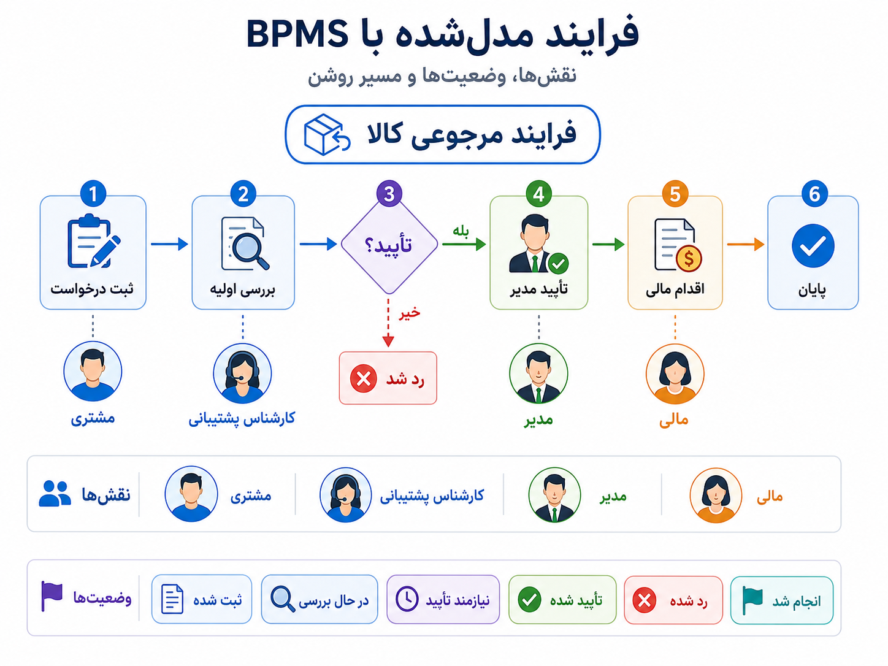
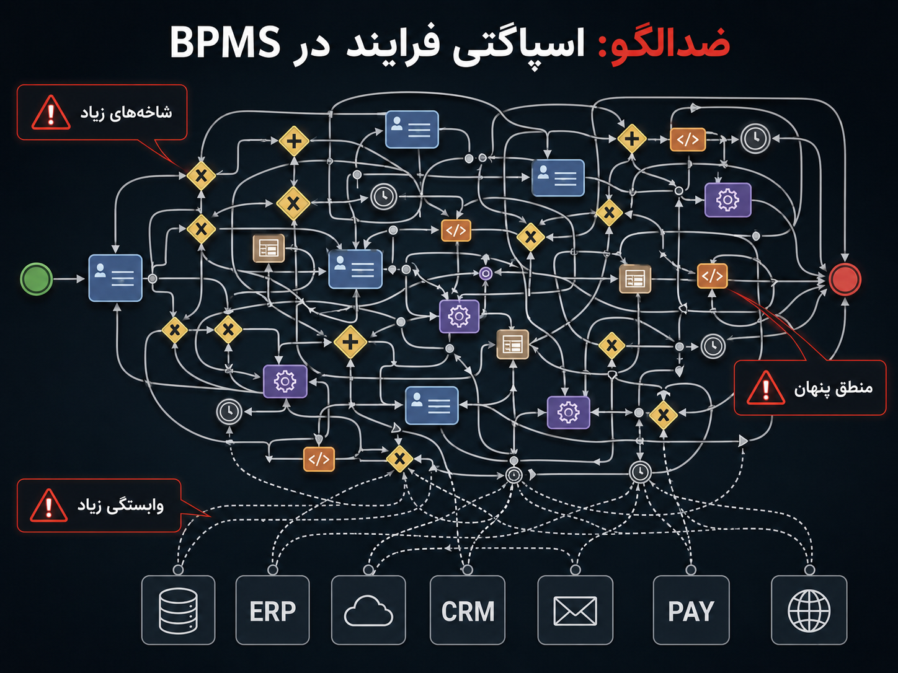

## وقتی کار فقط کد نیست، فرایند هم هست

در فصل قبل گفتیم Low-code و No-code می‌توانند برای فرم‌ها، داشبوردها، اتوماسیون‌های سبک و ابزارهای داخلی مفید باشند؛ اما همان‌جا هم دیدیم که اگر این ابزارها بدون مالکیت و مرز روشن رشد کنند، آرام‌آرام تبدیل می‌شوند به زیرساخت نامرئی سازمان. حالا یک قدم جلوتر می‌رویم. فرض کنیم مسئله دیگر فقط یک فرم یا یک workflow کوچک نیست؛ مسئله خودِ فرایند کسب‌وکار است.

یک مثال ساده را در نظر بگیریم: مرجوعی کالا. اول کار شاید فقط یک فرم باشد. مشتری درخواست می‌دهد، پشتیبانی بررسی می‌کند و نتیجه را اعلام می‌کند. اما بعد سازمان رشد می‌کند و فرایند شاخه پیدا می‌کند. اگر مبلغ کالا زیاد بود، مدیر باید تأیید کند. اگر دلیل مرجوعی خرابی بود، تیم کنترل کیفیت باید نظر بدهد. اگر تأیید شد، تیم مالی باید بازپرداخت انجام دهد. اگر سه روز گذشت و اقدامی نشد، باید هشدار بخورد. اگر رد شد، دلیل رد باید ثبت شود. اگر تأیید شد، باید به سیستم انبار یا مالی پیام برود.

اینجا دیگر با یک فرم ساده طرف نیستیم. با کاری طرفیم که بین چند نقش انسانی، چند تصمیم، چند وضعیت، چند سیستم و چند زمان‌بندی حرکت می‌کند. اگر این مسیر در ایمیل، اکسل، پیام‌رسان، تماس تلفنی، چند اسکریپت و حافظه‌ی آدم‌ها پخش شود، بعد از مدتی هیچ‌کس دقیق نمی‌داند هر درخواست کجاست، چرا گیر کرده، چه کسی باید اقدام کند و قانون تصمیم دقیقاً کجا تعریف شده است.

_وقتی یک فرایند واحد در ابزارهای مختلف پخش شود، دیدن وضعیت، مسئول مرحله‌ی بعد و دلیل توقف کار سخت می‌شود._

BPMS یا سامانه‌ی مدیریت فرایندهای کسب‌وکار، از همین درد شروع می‌شود. ایده این است که فرایندهای مهم فقط در ذهن آدم‌ها، ایمیل‌ها، فایل‌های پراکنده و کدهای نامنظم زندگی نکنند؛ بلکه مدل‌سازی، اجرا، پایش و اصلاح شوند. BPMS تلاش می‌کند جریان کار را به چیزی تبدیل کند که بتوانیم آن را ببینیم، درباره‌اش حرف بزنیم، وضعیتش را بفهمیم و تغییرش را کنترل کنیم.

:::tip[ایده‌ی اصلی]
BPMS ابزاری است برای مدل‌سازی، اجرای قابل پیگیری، پایش و تغییر فرایندهایی که معمولاً چند مرحله، چند نقش انسانی، چند تصمیم و چند اتصال سیستمی دارند.
:::

میل به مدیریت فرایندها چیز تازه‌ای نیست. سازمان‌ها همیشه فرم، ارجاع، تأیید، پرونده و گردش کار داشته‌اند. در دنیای نرم‌افزار هم از سال‌ها قبل سیستم‌های workflow، موتورهای قوانین، ابزارهای BPM و زبان‌های مدل‌سازی فرایند شکل گرفتند. استانداردهایی مثل BPMN کمک کردند فرایندها به شکل نمودارهایی مدل شوند که هم برای تحلیل‌گر کسب‌وکار قابل فهم باشند، هم برای تیم فنی قابل تبدیل به اجرا یا پیاده‌سازی. امروز ابزارهایی مثل Camunda، Flowable، Bonita و ابزارهای مشابه تلاش می‌کنند همین ایده را در سیستم‌های واقعی اجراپذیرتر کنند.

اما BPMS فقط کشیدن فلوچارت نیست. اگر فقط نمودار بکشیم و بعد همه‌چیز همچنان در ایمیل و کدهای پراکنده اجرا شود، مسئله حل نشده است. BPMS وقتی معنا دارد که فرایند بتواند وضعیت داشته باشد، در مرحله‌ای منتظر بماند، به نقش مشخصی وظیفه بدهد، بر اساس تصمیم مسیر عوض کند، به سرویس بیرونی پیام بدهد، زمان‌سنج و هشدار داشته باشد و قابل پایش باشد.

در همان مثال مرجوعی کالا، می‌توانیم مسیر را روشن‌تر کنیم: درخواست ثبت می‌شود، پشتیبانی بررسی اولیه انجام می‌دهد، اگر نیاز به تأیید داشت مدیر وارد می‌شود، اگر تأیید شد تیم مالی اقدام می‌کند و در پایان وضعیت درخواست بسته می‌شود. در هر لحظه معلوم است درخواست در چه وضعیتی است، مسئول مرحله‌ی بعد کیست و چرا از یک مسیر خاص عبور کرده است.

_در BPMS، فرایند فقط چند دستور پشت سر هم نیست؛ یک مسیر دارای وضعیت، نقش، تصمیم و قابل پیگیری است._

اینجا تفاوت BPMS با automation ساده روشن می‌شود. automation معمولاً می‌گوید: «وقتی این اتفاق افتاد، آن کار را انجام بده.» اما BPMS بیشتر درباره‌ی زندگی یک پرونده یا درخواست در طول زمان است. یک درخواست استخدام، شکایت مشتری، مرجوعی کالا، تأیید قرارداد یا درخواست وام ممکن است ساعت‌ها، روزها یا هفته‌ها میان انسان‌ها و سیستم‌ها حرکت کند. BPMS برای چنین جریان‌هایی جذاب می‌شود، چون مسئله فقط اجرای چند action نیست؛ مسئله نگه داشتن وضعیت و مسیر فرایند است.

مزیت اصلی BPMS این نیست که کد را حذف می‌کند. مزیت اصلی این است که فرایند را به یک موجود قابل مشاهده و قابل بحث تبدیل می‌کند. آدم محصول، عملیات، حقوقی، مالی و فنی می‌توانند درباره‌ی یک مدل مشترک حرف بزنند. می‌توانند ببینند گلوگاه کجاست، چه مرحله‌ای زیاد طول می‌کشد، کدام تصمیم‌ها زیاد رد می‌شوند، و کجا باید نقش، قانون یا مسیر فرایند تغییر کند.

:::note[وقتی BPMS ارزشمند می‌شود]
BPMS وقتی ارزشمند است که مسئله‌ی اصلی، خود جریان کار باشد: فرایندی چندمرحله‌ای، چندنقشی، تغییرپذیر، زمان‌مند و نیازمند ردیابی. اگر فقط یک فرم ساده یا یک automation کوچک داریم، شاید BPMS از همان ابتدا بیش از حد سنگین باشد.
:::

اما حالا نوبت نقد جدی است. BPMS نباید تبدیل شود به جایی که منطق اصلی محصول در آن دفن می‌شود. این خطر واقعی است. چون ظاهر BPMS معمولاً شفاف و فریبنده است: چند نمودار، چند task، چند فرم، چند decision و چند connector. اما اگر مراقب نباشیم، همان منطق مهمی که باید در سرویس‌های قابل تست، قابل مشاهده و دامنه‌محور باشد، در میان نمودارها، script taskها، ruleهای پراکنده و اتصال‌های پنهان دفن می‌شود.

مشکل BPMS این نیست که فرایند را مدل می‌کند؛ مشکل وقتی شروع می‌شود که مدل فرایند جای طراحی دامنه و معماری سیستم را بگیرد. اگر قواعد اصلی محصول، محاسبات حساس، تصمیم‌های امنیتی، منطق مالی یا تغییرات مهم وضعیت را بی‌حساب داخل BPMS ببریم، بعد از مدتی سیستم نه ساده‌تر، که سخت‌تر از کد معمولی قابل فهم و تغییر می‌شود.

_گاهی BPMS پیچیدگی را از کد بیرون نمی‌کشد؛ فقط همان پیچیدگی را در نمودارها، taskها و connectorهای پنهان قایم می‌کند._

فرایندها به مرور شاخه و شرط پیدا می‌کنند. یک استثنا برای مشتری مهم اضافه می‌شود، بعد یک مسیر ویژه برای قراردادهای بزرگ، بعد یک قانون موقت برای تیم مالی، بعد یک script برای اصلاح داده، بعد یک connector به CRM، بعد یک اتصال به سرویس پرداخت. بعد از مدتی نموداری که قرار بود شفاف‌کننده باشد، خودش تبدیل می‌شود به جنگلی از فلش‌ها و شرط‌ها. تغییر ساده نیازمند فهم چند مدل، چند نقش، چند فرم، چند اتصال بیرونی و چند قانون پنهان می‌شود.

پس مرز سالم این است: BPMS بهتر است ارکسترکننده‌ی فرایند باشد، نه مالک همه‌ی منطق کسب‌وکار. اگر قرار است اعتبار مالی مشتری محاسبه شود، موجودی کیف پول تغییر کند، سیاست امنیتی حساس اعمال شود یا تصمیمی با اثر مالی جدی گرفته شود، بهتر است این منطق در سرویس‌های دامنه‌محور، قابل تست و قابل مشاهده بماند. BPMS می‌تواند آن سرویس‌ها را صدا بزند، مسیر را هماهنگ کند و وضعیت فرایند را نگه دارد، اما نباید بی‌دلیل جای آن‌ها را بگیرد.

:::warning[BPMS نباید اصل سیستم شود]
BPMS برای هماهنگی فرایند خوب است، نه برای دفن کردن همه‌ی منطق محصول. اگر منطق اصلی، تست‌پذیری، مالکیت و مشاهده‌پذیری را قربانی نمودارهای ظاهراً ساده کنیم، فقط پیچیدگی را از یک جا به جای دیگر منتقل کرده‌ایم.
:::

برای فرایندهای ساده، از روز اول BPMS لازم نیست. اگر یک فرم داخلی، یک تأیید ساده یا یک اتوماسیون کم‌ریسک داریم، شاید همان ابزارهای ساده‌تر فصل قبل کافی باشند. BPMS وقتی ارزش پیدا می‌کند که فرایند واقعاً طولانی، چندنقشی، تغییرپذیر، حساس به زمان و نیازمند audit باشد. در غیر این صورت، ممکن است ابزار سنگینی وارد کنیم که خودِ ابزار از مسئله بزرگ‌تر شود.

  
چه زمانی BPMS انتخاب خوبی است؟

وقتی فرایند چندمرحله‌ای است، چند نقش انسانی دارد، وضعیت آن باید در طول زمان نگه‌داری شود، تأخیرها و گلوگاه‌ها مهم‌اند، audit لازم است، و تغییر فرایند باید برای تیم‌های فنی و غیرفنی قابل بحث باشد، BPMS می‌تواند انتخاب مناسبی باشد.

  
چه زمانی بهتر است سراغ BPMS نرویم؟

اگر فرایند ساده است، تغییر کمی دارد، یک سرویس کوچک می‌تواند آن را روشن و قابل تست پیاده کند، یا هنوز خود مسئله به اندازه‌ی کافی تثبیت نشده، شروع با BPMS ممکن است زود باشد. در چنین حالتی ابزارهای سبک‌تر، کدنویسی مستقیم یا حتی یک workflow ساده ممکن است انتخاب بهتری باشد.

برای من، BPMS یعنی پذیرفتن اینکه در بعضی سیستم‌ها، خودِ فرایند به اندازه‌ی کد مهم است. باید بدانیم کار کجاست، دست کیست، چرا متوقف شده و با چه قانونی جلو می‌رود. اما BPMS هم مثل Low-code/No-code قرار نیست جای فکر مهندسی را بگیرد. وقتی درست استفاده شود، فرایند را شفاف و قابل پایش می‌کند. وقتی بد استفاده شود، پیچیدگی را در نمودارها پنهان می‌کند و به سیستم ظاهراً تصویری اما عملاً سخت‌فهم می‌رسیم.

تا اینجا درباره‌ی ابزارهایی حرف زدیم که ساخت نرم‌افزار، عملیات، فرایند و اتوماسیون را تغییر می‌دهند. اما موج تازه‌تری هم وارد مهندسی نرم‌افزار شده است: هوش مصنوعی. حالا سؤال این است که آیا AI می‌تواند خود فرایند ساخت نرم‌افزار را تغییر دهد؟ اینجا وارد AI4SE می‌شویم؛ یعنی استفاده از هوش مصنوعی برای کمک به مهندسی نرم‌افزار.
