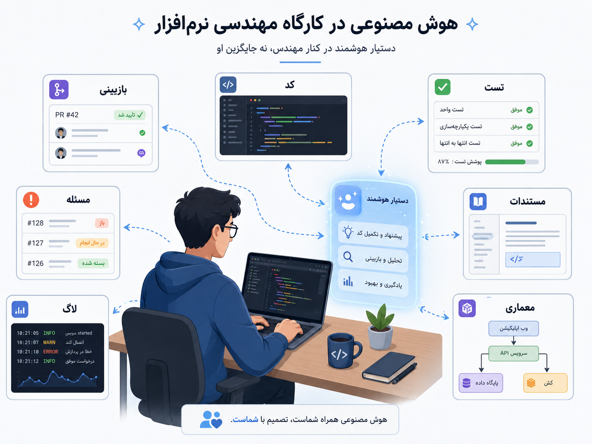
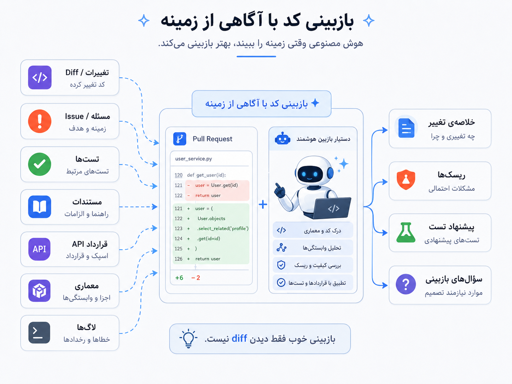
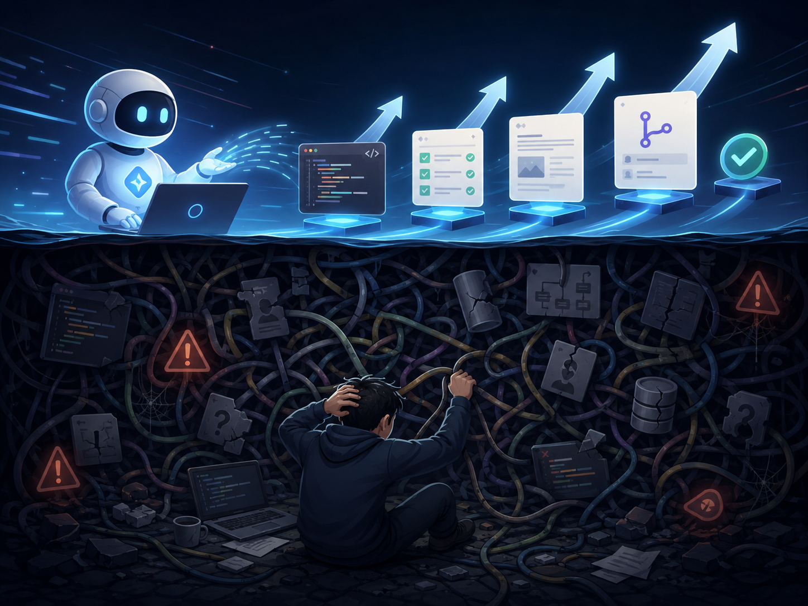

## وقتی هوش مصنوعی وارد کارگاه مهندسی نرم‌افزار می‌شود

حتی اگر معماری، زیرساخت و فرایندها را بهتر کنیم، خود کار روزمره‌ی مهندسی نرم‌افزار هنوز سنگین است. کد بیشتر شده، درخواست‌های ادغام یا Pull Requestها بزرگ‌تر شده‌اند، سرویس‌ها به هم وابسته‌تر شده‌اند، مستندات زود کهنه می‌شوند، تست‌ها باید به‌روز بمانند، بازآرایی کد یا refactor خطر شکستن رفتار دارد، و بازبینی تغییرات وقت و دقت زیادی می‌خواهد. حتی اگر تیم خوبی داشته باشیم، بخشی از کارهای روزانه تکراری، فرساینده و مستعد خطای انسانی‌اند.

اینجا AI4SE وارد می‌شود. AI4SE یعنی استفاده از هوش مصنوعی برای کمک به فعالیت‌های مهندسی نرم‌افزار؛ نه حذف مهندسی نرم‌افزار. هوش مصنوعی می‌تواند کنار تیم بنشیند، بعضی کارها را سریع‌تر کند، بعضی مسیرهای فهم را کوتاه‌تر کند و بعضی خطاها را زودتر به چشم بیاورد. اما تصمیم، مالکیت و مسئولیت همچنان با تیم مهندسی است.

:::tip[ایده‌ی اصلی]
AI4SE یعنی به‌کارگیری هوش مصنوعی برای بهتر، سریع‌تر یا قابل‌اعتمادتر کردن فعالیت‌های مهندسی نرم‌افزار؛ از فهم کد و تولید تست تا بازبینی، مستندسازی، تحلیل خطا و کمک به نگه‌داری سیستم.
:::

این مسیر از هیچ‌جا ناگهان با ChatGPT شروع نشد. قبل از موج مدل‌های زبانی بزرگ، سال‌ها ابزارهای تحلیل ایستا، ابزارهای سبک بررسی کد، جست‌وجوی کد، تکمیل خودکار، پیشنهاد بازآرایی، تشخیص خطا و تولید تست وجود داشتند. بخشی از آن‌ها قاعده‌محور بودند، بخشی از تکنیک‌های برنامه‌کاوی و یادگیری ماشین استفاده می‌کردند، و بخشی هم در محیط‌های توسعه به شکل پیشنهادهای محدود دیده می‌شدند.

بعدتر با رشد یادگیری عمیق و مدل‌های آموزش‌دیده روی کد، کمک‌های هوشمندتر ممکن شد. برای خیلی از توسعه‌دهنده‌ها، GitHub Copilot یک نقطه‌ی عطف بود؛ ابزاری که در ۲۰۲۱ به‌عنوان یک «همکار برنامه‌نویس هوشمند» معرفی شد و تجربه‌ی تولید و تکمیل کد با مدل زبانی را وارد کار روزمره‌ی توسعه‌دهندگان کرد. اما موج بعدی فقط تکمیل خودکار نبود. با رشد مدل‌های زبانی بزرگ، مسئله از ادامه دادن چند خط کد به فهمیدن شرح مسئله، خواندن چند فایل، پیشنهاد وصله، نوشتن تست، توضیح تغییر و حتی اجرای چند گام روی مخزن کد نزدیک شد.

_هوش مصنوعی می‌تواند کنار مهندس باشد؛ برای پیشنهاد، توضیح، بررسی و یادآوری. اما جای تصمیم مهندسی، مالکیت و فهم سیستم را نمی‌گیرد._

کاربردهای AI4SE فقط به تولید کد محدود نیست. گاهی ارزش آن در فهمیدن کد موجود است: خلاصه کردن یک فایل پیچیده، توضیح مسیر اجرای یک قابلیت، یا پیدا کردن ارتباط چند کلاس و سرویس. گاهی در تست کمک می‌کند: پیشنهاد حالت‌های مرزی، ساخت داده‌ی آزمایشی یا یادآوری سناریوهایی که از قلم افتاده‌اند. گاهی در بازبینی کد مفید است: خلاصه کردن درخواست ادغام، برجسته کردن تغییرهای پرریسک، پیشنهاد تست، یا پیدا کردن ناسازگاری با قرارداد API. گاهی هم در مستندسازی و عیب‌یابی کمک می‌کند: نوشتن پیش‌نویس مستندات، خلاصه کردن لاگ‌ها، دسته‌بندی خطاها یا کوتاه کردن مسیر بررسی حادثه.

اما هرچه از «تولید چند خط کد» به «تصمیم مهندسی» نزدیک می‌شویم، کیفیت زمینه مهم‌تر می‌شود. یک مدل اگر فقط تغییرات کد را ببیند، شاید بتواند ظاهر تغییر را توضیح دهد؛ اما نمی‌تواند همیشه بفهمد این تغییر با نیت شرح مسئله، قرارداد API، معماری سرویس، تست‌های موجود، محدودیت‌های دامنه و تجربه‌ی کاربر سازگار است یا نه. در کارهای جدی، مدل فقط به دستور خوب نیاز ندارد؛ به زمینه‌ی خوب نیاز دارد.

این نکته مخصوصاً در بازبینی کد پررنگ است. بازبینی خوب فقط خواندن تغییرات کد نیست. بازبینی یعنی فهمیدن اینکه چرا این تغییر انجام شده، روی چه رفتاری اثر می‌گذارد، چه قراردادی را تغییر می‌دهد، کدام تست باید اضافه شود، چه چیزی ممکن است در سرویس دیگری بشکند و آیا این تغییر با مسیر بلندمدت سیستم سازگار است یا نه.

_هوش مصنوعی وقتی بهتر بازبینی می‌کند که فقط تغییرات کد را نبیند؛ بلکه شرح مسئله، تست‌ها، مستندات، قراردادها، معماری و لاگ‌ها هم بخشی از زمینه باشند._

برای همین، بازبین هوشمند خوب باید بیشتر از یک تولیدکننده‌ی نظر باشد. باید بتواند نیت تغییر را بفهمد، سؤال‌های درست بپرسد، جاهایی را که نیاز به تست دارند برجسته کند، و اگر زمینه کافی نیست، با اعتمادبه‌نفس بی‌جا حکم ندهد. حتی در بهترین حالت هم نقش آن کمک به بازبین انسانی است، نه جایگزینی کامل او.

:::note[بازبین هوشمند خوب، زمینه می‌خواهد]
بازبینی فقط خواندن تغییرات کد نیست. بازبینی یعنی فهمیدن نیت تغییر، اثر آن روی رفتار سیستم، قراردادها، تست‌ها و نگه‌داری آینده. بدون زمینه‌ی کافی، بازبین هوشمند هم به‌راحتی به نظرهای عمومی و کم‌ارزش می‌رسد.
:::

در تولید تست هم همین مرز وجود دارد. هوش مصنوعی می‌تواند حالت آزمایشی پیشنهاد بدهد، اما تست خوب فقط زیاد بودن تعداد تست‌ها نیست. تست خوب باید رفتار مهم را تثبیت کند، حالت مرزی واقعی را پوشش دهد و نسبت به بازآرایی‌های بی‌اثر شکننده نباشد. اگر هوش مصنوعی تست‌هایی بسازد که فقط جزئیات پیاده‌سازی را بررسی می‌کنند، ممکن است تعداد تست‌ها زیاد شود، اما اعتماد ما به تغییر بیشتر نشود. حتی بدتر، ممکن است بازآرایی‌های خوب را سخت‌تر کند، چون تست‌ها به جای رفتار، به شکل داخلی کد چسبیده‌اند.

هدف تست، افزایش اعتماد به تغییر است؛ نه فقط افزایش تعداد فایل‌های تست. این همان جایی است که قضاوت مهندسی مهم می‌شود. مدل می‌تواند پیشنهاد بدهد، اما تیم باید تشخیص دهد آیا این تست واقعاً رفتار مهم را پوشش می‌دهد یا فقط خروجی ظاهراً قانع‌کننده تولید کرده است.

حالا نقد اصلی بخش: AI4SE وقتی خطرناک می‌شود که سازمان‌ها سرعت تولید خروجی را با کیفیت مهندسی اشتباه بگیرند. مدل می‌تواند سریع کد بنویسد، اما سریع‌تر نوشتن کد لزوماً یعنی سریع‌تر رسیدن به نرم‌افزار قابل نگه‌داری نیست. ممکن است خروجی زیاد شود، اما بازبینی سخت‌تر شود. ممکن است کد بیشتری تولید شود، اما کسی عمیقاً مالک آن نباشد. ممکن است تست بیشتری ساخته شود، اما رفتار مهم پوشش داده نشود. ممکن است مستندات روان‌تر شوند، اما دقیق نباشند.

_روی سطح، تولید کد، تست و مستندات سریع‌تر می‌شود؛ زیر سطح، اگر مالکیت و بازبینی نباشد، بدهی نگه‌داری و ابهام سیستم بیشتر می‌شود._

خطر AI4SE فقط این نیست که مدل اشتباه می‌کند. خطر بزرگ‌تر این است که مدل با اعتمادبه‌نفس اشتباه می‌کند و ما هم از خستگی، فشار زمانی یا جذابیت سرعت، آن را می‌پذیریم. خروجی مدل معمولاً خوش‌ساخت و قانع‌کننده است؛ همین باعث می‌شود خطاهایش دیرتر دیده شود. کدی که با اطمینان نوشته شده، تستی که نام خوبی دارد، یا مستندی که روان است، الزاماً درست نیست.

هوش مصنوعی می‌تواند تولید کد را ارزان‌تر کند، اما اگر فهم سیستم گران‌تر شود، تیم در مجموع کندتر شده است. این جمله برای من مرکز نقد AI4SE است. اگر هر قابلیت با سرعت بیشتری کد تولید کند، اما بازبینی، نگه‌داری، عیب‌یابی و فهم تغییر سخت‌تر شود، ما فقط بدهی فنی را سریع‌تر تولید کرده‌ایم.

:::warning[سرعت تولید، همان کیفیت مهندسی نیست]
هوش مصنوعی می‌تواند خروجی بیشتری تولید کند؛ اما خروجی بیشتر اگر بی‌مالک، کم‌فهم، کم‌تست یا ناسازگار با معماری باشد، به کیفیت تبدیل نمی‌شود. گاهی فقط هزینه‌ی نگه‌داری را به آینده منتقل می‌کند.
:::

پس مرز سالم چیست؟ هوش مصنوعی برای کارهای کمکی، تکراری، توضیحی و اکتشافی بسیار مفید است؛ جایی که انسان هنوز تصمیم نهایی را می‌گیرد. خلاصه کردن درخواست ادغام، پیشنهاد حالت‌های آزمایشی، تولید پیش‌نویس مستندات، توضیح کد قدیمی، کمک به جست‌وجو در مخزن کد، یا ساخت نمونه‌ی اولیه می‌تواند عالی باشد. اما تصمیم‌های حساس معماری، امنیت، داده، رفتار دامنه و تغییرات پرریسک نباید فقط به خروجی مدل سپرده شوند.

هوش مصنوعی نمی‌تواند جای خالی معماری نامفهوم، تست‌های بد، مستندات فرسوده و مالکیت مبهم را معجزه‌وار پر کند؛ گاهی فقط آن‌ها را سریع‌تر تکثیر می‌کند. اگر مخزن کد بی‌نظم است، اگر قراردادها روشن نیستند، اگر تست‌ها شکننده‌اند، اگر شرح مسئله‌ها مبهم‌اند، مدل هم بر همان ابهام سوار می‌شود و خروجی‌هایی می‌دهد که شاید زیبا باشند، اما الزاماً قابل اتکا نیستند.

  
چه زمانی AI4SE واقعاً کمک می‌کند؟

وقتی مسئله محدود و روشن است، زمینه‌ی کافی داریم، خروجی مدل بازبینی می‌شود، و تیم از هوش مصنوعی برای کاهش کار تکراری یا افزایش فهم استفاده می‌کند، نه برای حذف قضاوت مهندسی. در این حالت هوش مصنوعی می‌تواند سرعت فهم، مستندسازی، تست‌نویسی اولیه و بررسی تغییرات را بهتر کند.

  
چه زمانی AI4SE خطرناک می‌شود؟

وقتی خروجی مدل بدون بازبینی وارد کد می‌شود، وقتی زمینه ناقص است، وقتی مدل به جای بازبین یا معمار تصمیم می‌گیرد، وقتی تست‌های تولیدی فقط ظاهر اعتماد می‌سازند، یا وقتی سازمان به جای بهتر کردن معماری و کیفیت، فقط انتظار دارد هوش مصنوعی مشکلات ساختاری را جبران کند.

برای من، AI4SE یعنی آوردن یک دستیار قدرتمند به کارگاه مهندسی نرم‌افزار. این دستیار می‌تواند سریع بخواند، سریع پیشنهاد بدهد، سریع خلاصه کند و سریع پیش‌نویس بسازد. اما نرم‌افزار خوب فقط از سرعت ساخته نمی‌شود. نرم‌افزار خوب به فهم، مالکیت، بازبینی، تست، طراحی و تصمیم‌گیری مسئولانه نیاز دارد. هوش مصنوعی اگر این‌ها را تقویت کند، ارزشمند است؛ اگر جای آن‌ها بنشیند، خطرناک است.

تا اینجا گفتیم هوش مصنوعی چطور می‌تواند به مهندسی نرم‌افزار کمک کند. اما سؤال برعکس هم وجود دارد: وقتی خود محصول ما مبتنی بر هوش مصنوعی است، چطور باید آن را مهندسی کنیم؟ مدل‌ها رفتار کاملاً قطعی ندارند، داده و دستور و ارزیابی بخشی از سیستم می‌شوند، و رفتار خروجی همیشه مثل کد معمولی قابل پیش‌بینی نیست. اینجا وارد SE4AI می‌شویم: مهندسی نرم‌افزار برای سیستم‌های هوش مصنوعی.
