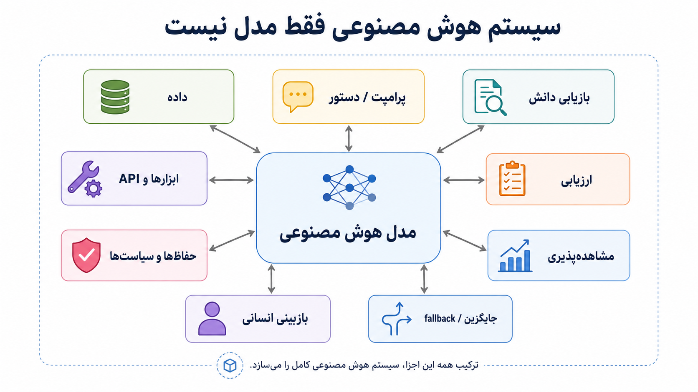
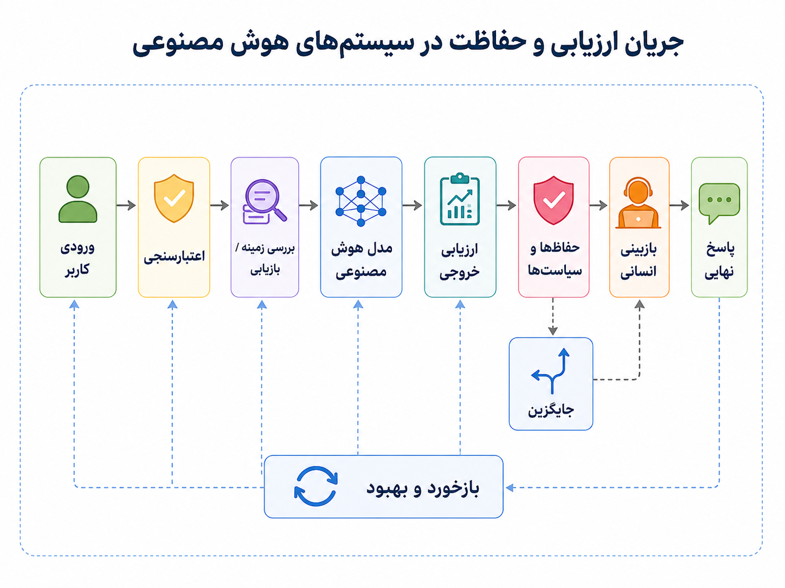
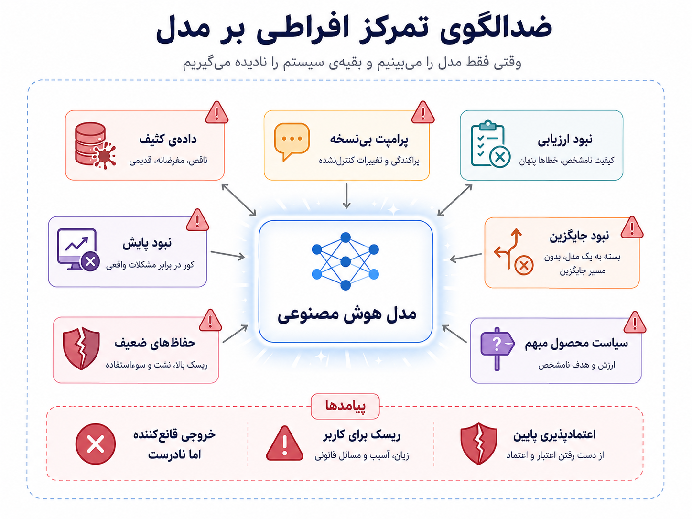

## وقتی خود هوش مصنوعی هم به مهندسی نیاز دارد

در فصل قبل گفتیم هوش مصنوعی چطور می‌تواند به مهندسی نرم‌افزار کمک کند: در فهم کد، نوشتن تست، بازبینی، مستندسازی و عیب‌یابی. حالا سؤال را برعکس می‌کنیم. اگر خودِ محصول ما مبتنی بر هوش مصنوعی باشد چه؟ اگر قابلیت اصلی سیستم نه فقط چند خط کد، بلکه یک مدل، prompt، داده، retrieval، ارزیابی و سیاست محصولی باشد، مهندسی نرم‌افزار چه نقشی دارد؟

تصور کنیم تیمی می‌خواهد یک قابلیت هوشمند به محصول اضافه کند: چت‌بات پشتیبانی، سیستم پیشنهاددهنده، تشخیص تقلب، خلاصه‌سازی تیکت‌ها، تحلیل احساسات پیام‌های کاربران، جست‌وجوی هوشمند، یا یک قابلیت LLM-based برای تولید پاسخ. در دمو همه‌چیز جذاب است. چند مثال خوب جواب می‌گیرند، تیم محصول هیجان‌زده می‌شود و همه حس می‌کنند «فقط کافی است مدل را صدا بزنیم».

اما محصول واقعی با دمو فرق دارد. ورودی‌ها تمیز و قابل پیش‌بینی نیستند. کاربران سوال‌های عجیب می‌پرسند. داده‌ی زمینه ناقص است. خروجی مدل گاهی غلط اما قانع‌کننده است. promptها تغییر می‌کنند. نسخه‌ی مدل عوض می‌شود. معیار کیفیت همیشه یک عدد ساده نیست. گاهی پاسخ از نظر زبانی خوب است، اما از نظر محصولی، حقوقی، امنیتی یا اخلاقی قابل قبول نیست. اینجا روشن می‌شود که سیستم AI فقط مدل نیست؛ یک سیستم نرم‌افزاری کامل است.

:::tip[ایده‌ی اصلی]
SE4AI یعنی استفاده از اصول مهندسی نرم‌افزار برای ساخت سیستم‌های مبتنی بر هوش مصنوعی؛ سیستم‌هایی که فقط با داشتن مدل قوی قابل اعتماد نمی‌شوند.
:::

مرز این فصل با فصل قبل و بعدی مهم است. AI4SE می‌پرسید: هوش مصنوعی چطور به کارهای مهندسی نرم‌افزار کمک می‌کند؟ SE4AI می‌پرسد: وقتی نرم‌افزارمان AI دارد، چطور آن را مثل یک سیستم مهندسی‌شده، قابل تست، قابل کنترل و قابل اعتماد بسازیم؟ MLOps که فصل بعدی است، بیشتر روی چرخه‌ی عملیاتی مدل‌ها تمرکز می‌کند: داده، آموزش، نسخه‌بندی مدل، استقرار، پایش، drift و بازآموزی.

در نرم‌افزار سنتی، بخش زیادی از رفتار سیستم از کدی می‌آمد که خودمان نوشته بودیم. اگر ورودی مشخصی می‌دادیم، انتظار خروجی مشخصی داشتیم. البته باگ همیشه وجود داشت، اما رفتار اصلی سیستم از منطق صریح کد می‌آمد. با ورود سیستم‌های یادگیری ماشین، بخشی از رفتار دیگر مستقیماً در کد نوشته نمی‌شد؛ از داده یاد گرفته می‌شد. با LLMها این پیچیدگی شکل تازه‌ای گرفت: علاوه بر کد، داده و مدل، حالا prompt، context، retrieval، حافظه، ابزارهای متصل، guardrailها و evaluation هم بخشی از رفتار سیستم‌اند.

_مدل فقط یکی از اجزای سیستم AI است. داده، prompt، بازیابی دانش، ارزیابی، حفاظت‌ها، مشاهده‌پذیری، جایگزین و بازبینی انسانی هم بخشی از سیستم‌اند._

پس پرسش‌های مهندسی عوض می‌شوند. چه چیزی نسخه‌بندی می‌شود؟ فقط کد یا prompt و dataset ارزیابی هم؟ چه چیزی تست می‌شود؟ فقط API یا کیفیت خروجی مدل هم؟ چه چیزی قابل rollback است؟ نسخه‌ی مدل، prompt، retrieval index یا policy؟ چه کسی مالک رفتار خروجی است؟ اگر مدل مطمئن نیست، سیستم باید چه کند؟ اگر پاسخ خطرناک، نادرست یا خارج از سیاست محصول بود، چه لایه‌ای جلوی آن را می‌گیرد؟

یکی از سخت‌ترین بخش‌های SE4AI، تست و ارزیابی است. در سیستم‌های کلاسیک، اغلب می‌توانیم بگوییم برای این ورودی، خروجی دقیقاً باید این مقدار باشد. اما در سیستم‌های AI، مخصوصاً LLMها، همیشه یک خروجی واحد و قطعی نداریم. چند پاسخ ممکن است قابل قبول باشند. یک پاسخ ممکن است از نظر جمله‌بندی عالی باشد، اما از نظر دامنه غلط باشد. ممکن است مدل در بیشتر نمونه‌ها خوب عمل کند، اما در چند سناریوی حساس خطای پرهزینه بدهد.

به همین دلیل، تست در سیستم‌های AI فقط test case کلاسیک نیست. به evaluation نیاز داریم: نمونه‌های واقعی و نماینده، معیارهای کیفیت، ارزیابی انسانی در بخش‌های حساس، تست regression برای prompt و مدل، سناریوهای خطرناک، و بررسی hallucination، bias، privacy و امنیت. در سیستم AI، گاهی سؤال اصلی این نیست که «آیا خروجی دقیقاً برابر مقدار مورد انتظار است؟»؛ سؤال این است که «آیا خروجی برای این زمینه قابل قبول، امن، مفید و مطابق سیاست محصول است؟»

_خروجی AI نباید خام وارد محصول شود؛ باید اعتبارسنجی، ارزیابی، محدودسازی، پایش و در موقعیت‌های حساس، بازبینی انسانی داشته باشد._

این موضوع ما را به مسئولیت محصول می‌رساند. در نرم‌افزار کلاسیک، اگر تابعی خطا بدهد، معمولاً دنبال باگ در کد می‌گردیم. در سیستم AI ممکن است کد درست اجرا شده باشد، API مدل پاسخ داده باشد، هیچ exceptionای رخ نداده باشد، اما خروجی محصول غلط باشد. مثلاً چت‌بات پشتیبانی سیاست بازگشت وجه را اشتباه توضیح دهد. ابزار خلاصه‌سازی نکته‌ی مهم تیکت را حذف کند. سیستم رتبه‌بندی گروهی از کاربران را ناعادلانه پایین‌تر بیاورد. یا یک ابزار تولید محتوا ناخواسته داده‌ی حساس را وارد پاسخ کند.

از نگاه کاربر، این‌ها خطای «مدل» نیستند؛ خطای محصول‌اند. وقتی AI وارد محصول می‌شود، خروجی مدل هم بخشی از تجربه‌ی کاربر و مسئولیت تیم است. نمی‌توانیم بگوییم «مدل این‌طور گفت» و کنار بکشیم. باید از قبل طراحی کنیم: کجا مدل اجازه‌ی پاسخ آزاد دارد؟ کجا باید فقط از منابع معتبر جواب بدهد؟ کجا باید بگوید نمی‌دانم؟ کجا خروجی فقط پیشنهاد است و اقدام خودکار نیست؟ کجا انسان باید وارد حلقه شود؟ و کجا audit trail لازم داریم؟

در سیستم‌های LLM-based، چند جزء تازه وارد معماری می‌شوند. prompt template فقط یک متن ساده نیست؛ یک artifact مهندسی است که باید نسخه داشته باشد، قابل بازبینی باشد و با تغییرش evaluation اجرا شود. retrieval فقط جست‌وجوی چند سند نیست؛ روی کیفیت پاسخ و ریسک hallucination اثر می‌گذارد. tool calling فقط اتصال جذاب مدل به ابزارها نیست؛ باید محدودیت دسترسی، audit، خطایابی و fallback داشته باشد. حافظه‌ی مکالمه هم فقط امکانات محصولی نیست؛ می‌تواند مسئله‌ی privacy، امنیت و کیفیت ایجاد کند.

:::note[Prompt هم بخشی از سیستم است]
در سیستم‌های LLM-based، prompt، context builder، retriever، ابزارهای متصل، حافظه، guardrailها و dataset ارزیابی باید مثل اجزای واقعی سیستم دیده شوند؛ نه مثل متن‌های موقتی که هرکس دستی تغییرشان بدهد.
:::

حالا نقد اصلی فصل: بزرگ‌ترین خطای تیم‌ها این است که سیستم AI را به مدل تقلیل می‌دهند. فکر می‌کنند اگر مدل قوی‌تر شود، مسئله حل است. اما در عمل، بسیاری از شکست‌ها از خود مدل شروع نمی‌شوند؛ از سیستم اطراف مدل می‌آیند: داده‌ی بد، تعریف مبهم مسئله، نداشتن evaluation، نبود fallback، سیاست محصولی نامشخص، داده‌ی حساس در prompt، اعتماد بیش از حد به خروجی، نبود مشاهده‌پذیری، یا نبود مالکیت برای رفتار مدل.

_مدل بهتر، سیستم بد را نجات نمی‌دهد؛ اگر داده، ارزیابی، حفاظت، پایش، سیاست محصول و مسیر جایگزین ضعیف باشند، خروجی فقط قانع‌کننده‌تر و خطرناک‌تر می‌شود._

مدل بهتر، معماری بد را نجات نمی‌دهد؛ فقط گاهی خرابی را قانع‌کننده‌تر پنهان می‌کند. اگر نمی‌دانیم خروجی AI را چطور ارزیابی کنیم، هنوز آماده‌ی سپردن تصمیم مهم به آن نیستیم. اگر نمی‌دانیم در چه شرایطی باید بگوید «نمی‌دانم»، هنوز طراحی محصول کامل نشده است. اگر نمی‌دانیم وقتی مدل اشتباه کرد چه کسی پاسخ‌گوست، هنوز مالکیت روشن نداریم.

این نگاه یعنی SE4AI فقط بحث مدل و دقت نیست؛ بحث سیستم و مسئولیت است. باید بدانیم کدام داده وارد مدل می‌شود، کدام خروجی اجازه‌ی نمایش به کاربر دارد، کدام تصمیم نیاز به تأیید انسانی دارد، کدام رفتار باید log و audit شود، و کدام تغییر باید با evaluation مقایسه شود. باید بتوانیم نسخه‌ی مدل، prompt، retrieval و policy را کنار هم ردیابی کنیم تا اگر رفتار محصول تغییر کرد، بفهمیم چرا.

:::warning[مدل قوی کافی نیست]
اگر داده بد است، evaluation نداریم، fallback نداریم، guardrailها ضعیف‌اند، prompt بی‌نسخه است و مالکیت رفتار مدل روشن نیست، مدل قوی‌تر فقط بخشی از مسئله را پنهان می‌کند. اعتماد به سیستم AI از مهندسی کل سیستم می‌آید، نه فقط از نام مدل.
:::

برای ساخت سیستم AI قابل اعتماد، باید چند چیز را از ابتدا جدی بگیریم. مسئله و معیار خوب بودن خروجی باید روشن باشد. داده‌ی ورودی و داده‌ی ارزیابی باید نماینده و قابل پیگیری باشند. prompt و تنظیمات باید نسخه‌بندی شوند. خروجی باید پایش شود. برای خطا، عدم اطمینان، محتوای خطرناک یا درخواست خارج از محدوده باید fallback داشته باشیم. در کارهای حساس، انسان باید بخشی از طراحی باشد، نه وصله‌ای که بعد از حادثه اضافه می‌شود.

  
چه زمانی SE4AI جدی‌تر می‌شود؟

وقتی خروجی AI روی کاربر واقعی، تصمیم محصولی، داده‌ی حساس، پول، اعتبار، رتبه‌بندی، توصیه، پشتیبانی یا اقدام خودکار اثر می‌گذارد، دیگر با یک دمو طرف نیستیم. در این شرایط باید evaluation، guardrail، مشاهده‌پذیری، fallback، امنیت، privacy و مالکیت رفتار مدل جدی گرفته شود.

  
چه زمانی هنوز در مرحله‌ی آزمایش هستیم؟

اگر فقط یک نمونه‌ی اولیه داریم، خروجی AI تصمیم مهمی نمی‌گیرد، داده‌ی حساس درگیر نیست، و انسان همه‌ی خروجی‌ها را پیش از استفاده بررسی می‌کند، می‌توانیم سبک‌تر حرکت کنیم. اما همین مرحله هم باید از ابتدا به ما یاد بدهد که معیار کیفیت، ریسک‌ها و مرزهای استفاده چه هستند.

برای من، SE4AI یعنی پذیرفتن اینکه سیستم مبتنی بر هوش مصنوعی فقط یک مدل نیست. مدل مهم است، اما بدون داده‌ی خوب، prompt قابل کنترل، ارزیابی، guardrail، مشاهده‌پذیری، fallback، امنیت، تجربه‌ی کاربر و مسئولیت انسانی، محصول قابل اعتمادی ساخته نمی‌شود. هوش مصنوعی وقتی وارد محصول می‌شود، باید مثل بخشی از سیستم مهندسی شود؛ نه مثل جادویی که بیرون از قواعد مهندسی قرار دارد.

تا اینجا گفتیم سیستم AI فقط مدل نیست و باید مهندسی شود. اما وقتی پای مدل، داده و تغییر مداوم رفتار وسط باشد، عملیات هم شکل تازه‌ای پیدا می‌کند. نمی‌توان مدل را یک‌بار deploy کرد و فراموش کرد. داده تغییر می‌کند، توزیع ورودی عوض می‌شود، کیفیت افت می‌کند، و مدل باید پایش و گاهی بازآموزی شود. این ما را به فصل بعدی می‌رساند: MLOps.
