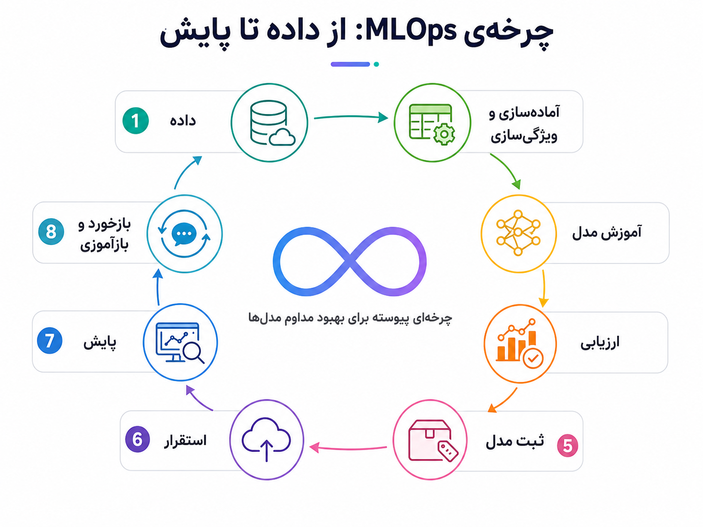
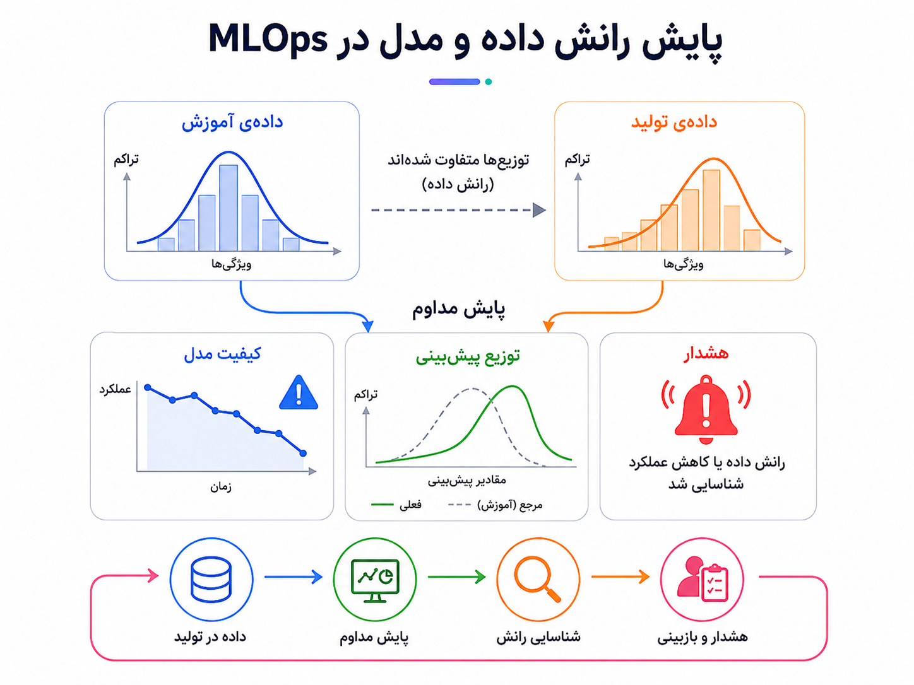
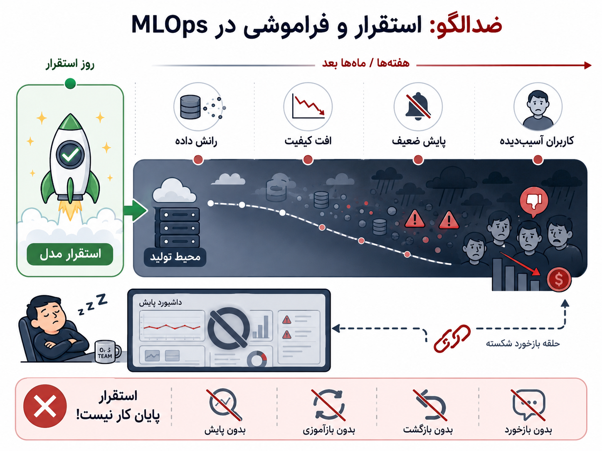

## وقتی مدل هم مثل کد، چرخه‌ی تولید و نگه‌داری می‌خواهد

در بخش قبل گفتیم سیستم مبتنی بر هوش مصنوعی فقط یک مدل نیست. داده، دستور مدل، ارزیابی، حفاظت‌ها، مشاهده‌پذیری، مسیر جایگزین و مسئولیت انسانی هم بخشی از سیستم‌اند. حالا یک قدم عملیاتی‌تر برمی‌داریم: اگر مدل وارد محصول شد، چطور آن را در تولید زنده، قابل پایش، قابل بازگشت و قابل بهبود نگه داریم؟

یک صحنه‌ی آشنا را تصور کنیم. تیم داده یا تیم محصول یک مدل خوب ساخته است. در نوت‌بوک آزمایشی همه‌چیز امیدوارکننده است. داده‌ی آموزشی آماده شده، چند نمودار خوب داریم، معیارها مناسب‌اند و مدل روی داده‌ی تست عملکرد قابل قبولی نشان می‌دهد. همه خوشحال‌اند و جمله‌ی معروف شنیده می‌شود: «خب، حالا فقط مستقر کنیم.»

اما درست از همین‌جا درد واقعی شروع می‌شود. مدل در محیط تولید با داده‌هایی روبه‌رو می‌شود که همیشه شبیه داده‌ی آزمایشگاهی نیستند. رفتار کاربران تغییر می‌کند. فصل، کمپین، قیمت، سیاست محصول، بازار یا حتی شکل استفاده‌ی کاربران عوض می‌شود. ویژگی‌هایی که موقع آموزش تمیز و کامل بودند، در تولید دیر، ناقص یا با تعریف متفاوت می‌رسند. مدلی که امروز خوب کار می‌کند، ممکن است دو ماه بعد آرام‌آرام افت کند؛ بدون اینکه سرویس از کار بیفتد یا خطای واضحی بدهد.

اینجاست که MLOps وارد داستان می‌شود.

:::tip[ایده‌ی اصلی]
MLOps یعنی ساختن چرخه‌ای قابل اعتماد برای بردن مدل‌های یادگیری ماشین از آزمایش به تولید، و نگه‌داری آن‌ها در دنیایی که داده و رفتار سیستم مدام تغییر می‌کند.
:::

مرز MLOps با بخش قبل مهم است. SE4AI می‌پرسید سیستم مبتنی بر هوش مصنوعی را چطور درست طراحی کنیم: کیفیت خروجی، ارزیابی، حفاظت، تجربه‌ی کاربر، مسئولیت و معماری محصول. MLOps بیشتر روی چرخه‌ی عملیاتی مدل و داده تمرکز دارد: داده چطور آماده می‌شود، مدل چطور آموزش می‌بیند، نسخه‌ی مدل و داده چطور ثبت می‌شود، مدل چطور مستقر می‌شود، کیفیتش در تولید چطور پایش می‌شود، و اگر افت کرد یا داده تغییر کرد، چه می‌کنیم.

MLOps از نظر ذهنی به DevOps نزدیک است. در DevOps یاد گرفتیم کد فقط نوشته نمی‌شود؛ باید ساخته، تست، مستقر، پایش و در صورت نیاز برگردانده شود. اما در سیستم‌های یادگیری ماشین، فقط کد نداریم. داده و مدل هم دارایی‌های اصلی‌اند. در نرم‌افزار کلاسیک، اگر کد تغییر نکند، انتظار داریم رفتار سیستم نسبتاً پایدار بماند. اما در یادگیری ماشین، حتی اگر کد و مدل تغییر نکنند، دنیای بیرون تغییر می‌کند و کیفیت مدل می‌تواند افت کند.

در MLOps، دارایی مهندسی فقط کد نیست؛ داده، ویژگی، مدل، معیار ارزیابی و خط لوله‌ی آموزش هم دارایی مهندسی‌اند.

_مدل فقط آموزش داده نمی‌شود؛ وارد چرخه‌ای از داده، آماده‌سازی، آموزش، ارزیابی، ثبت، استقرار، پایش و بازخورد می‌شود._

در مرحله‌ی آزمایش، نوت‌بوک ابزار بسیار خوبی است. می‌توانیم سریع ایده‌ها را امتحان کنیم، نمودار بکشیم، مدل‌ها را مقایسه کنیم و بفهمیم اصلاً مسئله ارزش ادامه دادن دارد یا نه. اما نوت‌بوک به‌تنهایی محصول نیست. اگر نمی‌دانیم داده دقیقاً از کجا آمده، چطور پاک‌سازی شده، چه ویژگی‌هایی ساخته شده، کدام نسخه از کد استفاده شده، چه پارامترهایی تنظیم شده و مدل با چه معیارهایی ارزیابی شده، بازتولید همان نتیجه بعداً سخت می‌شود.

مدلی که فقط در نوت‌بوک خوب کار می‌کند، هنوز محصول نیست؛ فقط یک شواهد آزمایشگاهی است. برای اینکه مدل وارد سیستم واقعی شود، باید آموزش آن تکرارپذیر باشد، داده‌اش قابل اعتبارسنجی باشد، مدلش نسخه داشته باشد، استقرارش کنترل‌شده باشد و کیفیتش بعد از استقرار دیده شود.

در یادگیری ماشین، داده فقط ورودی نیست؛ بخشی از رفتار سیستم است. اگر داده‌ی آموزشی نماینده‌ی دنیای واقعی نباشد، مدل در تولید بد عمل می‌کند. اگر schema داده تغییر کند، مدل ممکن است بی‌سروصدا خراب شود. اگر تعریف یک ویژگی عوض شود، مدل همان ورودی ظاهری را می‌گیرد، اما معنای آن عوض شده است. اگر داده دیر برسد یا ناقص باشد، خروجی مدل قابل اعتماد نیست.

مثلاً مدلی برای تشخیص تقلب داریم. اگر روش‌های تقلب تغییر کنند، رفتار کاربران در یک فصل خاص عوض شود، یا یک ویژگی مهم با تأخیر برسد، داده‌ی تولید با داده‌ی زمان آموزش فاصله می‌گیرد. مدل همچنان خروجی می‌دهد، اما کیفیتش ممکن است پایین آمده باشد. این نوع خرابی با خطای اجرایی معلوم نمی‌شود؛ باید با پایش داده و کیفیت مدل دیده شود.

_در یادگیری ماشین، خرابی همیشه از کار افتادن سرویس نیست؛ گاهی افت آرام کیفیت مدل است، چون داده‌ی واقعی از داده‌ی زمان آموزش فاصله گرفته است._

اینجا مفهوم رانش مهم می‌شود. رانش داده یعنی توزیع داده‌ی ورودی در تولید با داده‌ی زمان آموزش فرق کند. رانش مدل یا افت کیفیت یعنی خروجی و عملکرد مدل در دنیای واقعی دیگر مثل گذشته قابل اعتماد نباشد. گاهی این افت روی کل کاربران دیده نمی‌شود، بلکه روی یک گروه یا بخش خاص پنهان می‌ماند. برای همین فقط دیدن یک عدد کلی مثل دقت کافی نیست. باید بدانیم مدل روی گروه‌ها، سناریوها و بخش‌های مهم محصول چطور رفتار می‌کند.

MLOps باید به اعتبارسنجی داده، کیفیت داده، سازگاری ویژگی‌ها و پایش توجه کند. باید بفهمیم آیا داده‌ای که مدل می‌بیند همان معنایی را دارد که زمان آموزش داشته است یا نه. باید تشخیص دهیم آیا توزیع پیش‌بینی‌ها تغییر کرده، تأخیر بالا رفته، خطای ویژگی‌ها زیاد شده، یا کیفیت مدل روی گروه خاصی افت کرده است.

بخش مهم دیگر، نسخه‌بندی و ثبت مدل است. وقتی مدل جدیدی مستقر می‌شود، باید بتوانیم بگوییم با چه داده‌ای آموزش دیده، چه کدی آن را ساخته، چه پارامترهایی داشته، چه معیارهایی گرفته، چه کسی آن را تأیید کرده و روی چه بخش‌هایی خوب یا بد عمل کرده است. اگر مدل جدید بدتر شد، نسخه‌ی قبلی باید قابل پیدا کردن و برگشت باشد.

اینجاست که مفاهیمی مثل رهگیری آزمایش‌ها، مخزن ثبت مدل و مدیریت خروجی‌های مدل مهم می‌شوند. ابزارهایی مثل MLflow، Weights & Biases، Kubeflow یا مخزن ویژگی‌هایی مثل Feast هرکدام بخشی از این مسئله را حل می‌کنند. اما ابزار به‌تنهایی کافی نیست. اگر تیم نداند معیار تصمیم‌گیری چیست، چه چیزی باید ثبت شود و چه زمانی یک مدل اجازه‌ی ورود به تولید دارد، مخزن ثبت مدل فقط تبدیل می‌شود به انبار فایل‌های مدل.

در نرم‌افزار معمولی، CI/CD معمولاً یعنی کد را بساز، تست کن و بعد مستقر کن. در یادگیری ماشین این چرخه پیچیده‌تر است. باید کد آموزش تست شود، داده اعتبارسنجی شود، مدل آموزش ببیند، مدل ارزیابی شود، اگر از حد قابل قبول بهتر بود ثبت شود، بعد به شکل کنترل‌شده مستقر شود و پس از آن رفتار مدل در تولید پایش شود. گاهی حتی از بازآموزی پیوسته حرف می‌زنیم؛ یعنی بازآموزی مداوم یا دوره‌ای مدل. اما اینجا هم باید مراقب باشیم: خودکار کردن بازآموزی بدون کنترل کیفیت داده، یعنی سرعت دادن به تولید مدل‌های بد.

:::warning[بازآموزی خودکار همیشه بلوغ نیست]
اگر داده‌ی جدید آلوده، ناقص یا نماینده‌ی رفتار درست نباشد، بازآموزی خودکار فقط خطا را سریع‌تر وارد مدل بعدی می‌کند. MLOps خوب یعنی کنترل کیفیت چرخه، نه فقط اتوماسیون بیشتر.
:::

نقد اصلی بخش این است: خیلی از تیم‌ها MLOps را با ابزار اشتباه می‌گیرند. فکر می‌کنند اگر MLflow، Kubeflow، خط لوله‌ی جذاب یا داشبورد داشته باشند، MLOps حل شده است. اما MLOps قبل از ابزار، یک نظم مهندسی است: تعریف مالکیت، معیار کیفیت، داده‌ی قابل اعتماد، بازتولیدپذیری، ارزیابی، پایش، برگشت و فرایند تصمیم‌گیری.

MLOps بدون تعریف روشن از کیفیت مدل، فقط اتوماسیون تولید خروجی است. اگر نمی‌دانیم مدل در تولید خوب کار می‌کند یا نه، داشتن خط لوله فقط ما را سریع‌تر به ابهام می‌رساند. مدل خوب در آزمایش الزاماً مدل خوب در محصول نیست. دقت کلی ممکن است افت کیفیت روی بخش‌های مهم را پنهان کند. تشخیص رانش بدون برنامه‌ی اقدام، فقط یک هشدار تزئینی است. پایش هم فقط تأخیر و در دسترس بودن سرویس نیست؛ کیفیت پیش‌بینی هم بخشی از سلامت سیستم است.

_استقرار مدل پایان کار نیست؛ شروع نگه‌داری است. اگر مدل را مستقر کنیم و فراموش کنیم، تغییر داده و افت کیفیت دیر یا زود خودش را نشان می‌دهد._

ضدالگوی رایج این است که مدل را مستقر کنیم و بعد فراموشش کنیم. در روز استقرار همه‌چیز خوب به نظر می‌رسد. اما هفته‌ها و ماه‌ها بعد، داده تغییر می‌کند، کیفیت مدل افت می‌کند، کاربران رفتار متفاوتی نشان می‌دهند، هشدار مشخصی وجود ندارد و کسی دقیق نمی‌داند مدل فعلی با کدام داده و کدام کد ساخته شده است. اینجا مشکل فقط فنی نیست؛ اعتماد محصولی و تصمیم‌گیری سازمانی هم آسیب می‌بیند.

:::note[مدل در تولید زنده است]
مدل در تولید مثل یک فایل ثابت نیست. کیفیت آن به داده‌ی ورودی، رفتار کاربران، تغییرات محصول و شرایط بیرونی وابسته است. پس نگه‌داری مدل باید بخشی از طراحی سیستم باشد، نه کاری که بعد از اولین حادثه به آن فکر کنیم.
:::

MLOps برای آزمایش ساده‌ی دانشگاهی یا یک نمونه‌ی اولیه‌ی کوچک شاید لازم نباشد. اگر هدف فقط یادگیری، ارائه‌ی اولیه یا اثبات امکان‌پذیری است، یک نوت‌بوک و چند معیار ساده می‌تواند کافی باشد. اما وقتی خروجی مدل روی کاربران واقعی، پول، ریسک، رتبه‌بندی، پیشنهاد، تشخیص تقلب، پشتیبانی یا تصمیم محصولی اثر می‌گذارد، دیگر با یک آزمایش طرف نیستیم. مدل بخشی از سیستم تولیدی است و باید مثل بخشی از سیستم تولیدی با آن رفتار کنیم.

  
چه زمانی MLOps جدی می‌شود؟

وقتی مدل وارد تولید می‌شود، چند تیم درگیر می‌شوند، داده مرتب تغییر می‌کند، تصمیم مدل روی کاربر یا کسب‌وکار اثر دارد، و لازم است آموزش، ارزیابی، استقرار و پایش قابل تکرار و قابل ردیابی باشند، MLOps از یک انتخاب خوب به یک نیاز جدی تبدیل می‌شود.

  
چه زمانی هنوز ساده‌تر حرکت کنیم؟

اگر هنوز در مرحله‌ی اکتشاف هستیم، مدل فقط برای یادگیری یا نمونه‌ی اولیه استفاده می‌شود، خروجی روی کاربر واقعی اثر ندارد، و بازتولید دقیق هنوز مسئله‌ی اصلی نیست، می‌توان سبک‌تر شروع کرد. اما حتی در همین مرحله هم بهتر است از ابتدا عادت کنیم داده، کد، معیار و نتیجه‌ی آزمایش‌ها را شفاف نگه داریم.

برای من، MLOps یعنی مدل را از یک خروجی آزمایشگاهی به بخشی قابل اعتماد از سیستم تولید تبدیل کنیم. این کار فقط با مستقر کردن مدل تمام نمی‌شود؛ به داده‌ی قابل اعتماد، آموزش تکرارپذیر، نسخه‌بندی، ارزیابی، استقرار کنترل‌شده، پایش کیفیت، تشخیص رانش، برگشت و تصمیم‌گیری انسانی نیاز دارد. مدل در تولید زنده است، چون دنیای اطرافش تغییر می‌کند.

از یک برنامه‌ی ساده شروع کردیم و رسیدیم به سیستمی که داده، مدل، زیرساخت، عملیات، انسان، فرایند و هوش مصنوعی دارد. حالا دیگر مهندسی نرم‌افزار فقط نوشتن کد نیست؛ ساختن سیستمی است که در زمان، تغییر، خطا و رشد دوام بیاورد. بخش پایانی همین مسیر را جمع‌بندی می‌کند.
