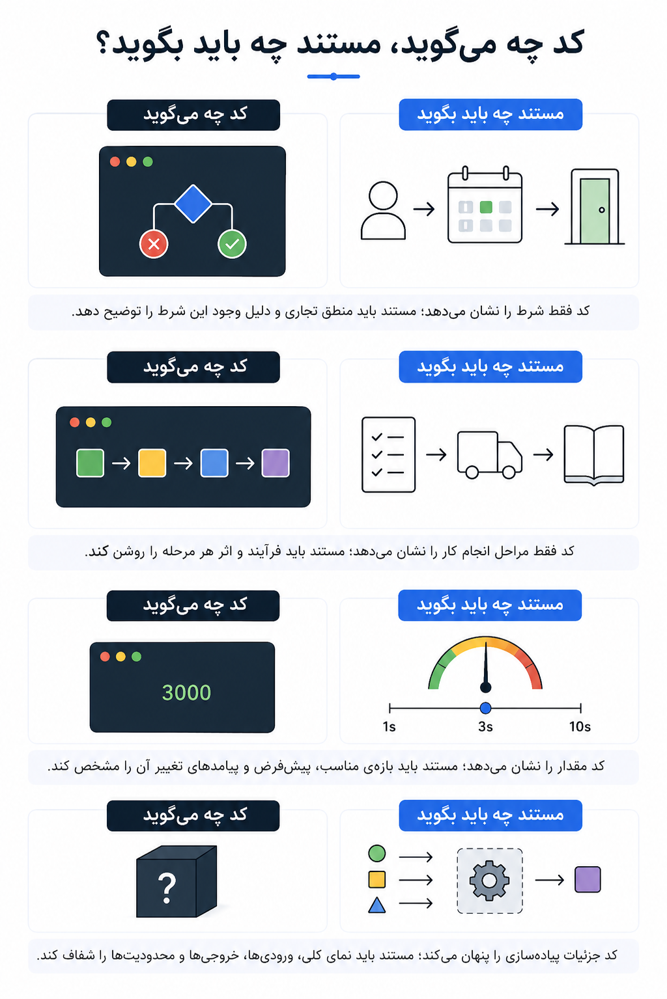
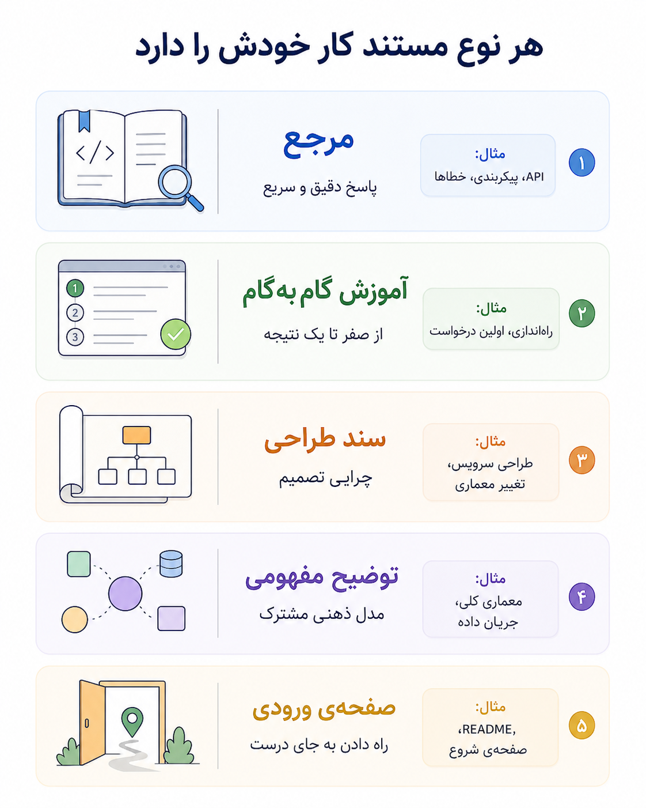
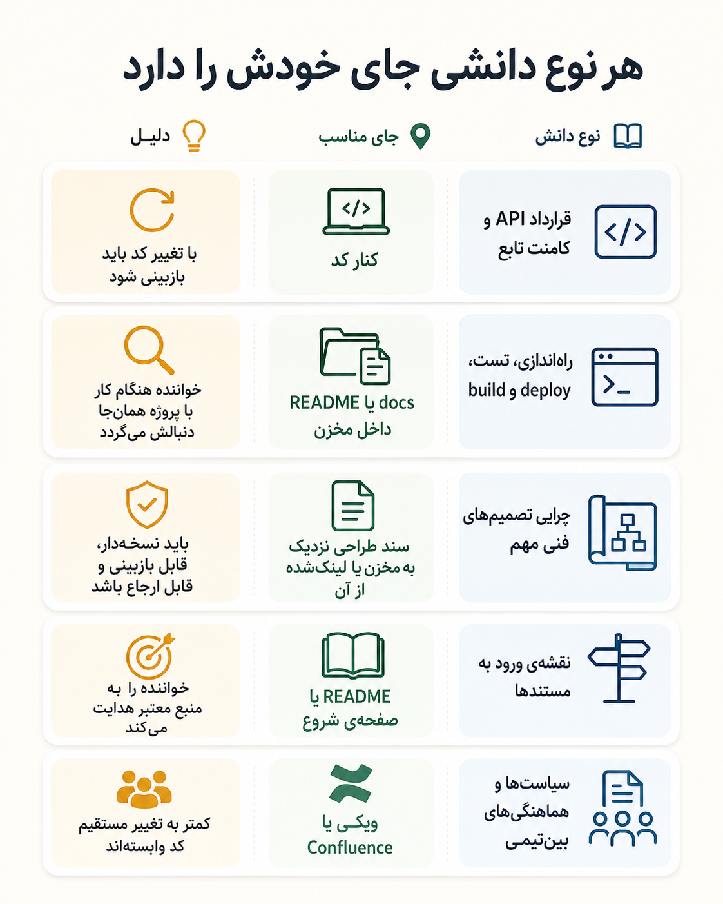

# حافظه‌ی فنی تیم کجاست؟


گاهی در یک تیم فنی، جواب مهم‌ترین پرسش‌ها جایی نوشته نشده؛ فقط یک نفر آن‌ها را می‌داند. یکی می‌داند چرا یک تنظیم نباید تغییر کند، یکی یادش هست این رفتار عجیب باگ نیست و برای سازگاری با مسیر قدیمی مانده، یکی هم می‌داند کدام صفحه‌ی ویکی هنوز معتبر است.

تا وقتی تیم کوچک است، این مدل شاید جواب بدهد. اما تیم که بزرگ‌تر می‌شود، حافظه‌ی شفاهی ترک برمی‌دارد. آدم‌ها جابه‌جا می‌شوند، کد تغییر می‌کند، سرویس‌ها زیاد می‌شوند، و دانشی که باید مشترک باشد میان ذهن چند نفر، چند کامنت پراکنده و چند سند نیمه‌کهنه پخش می‌شود.

این نوشته درباره‌ی همین حافظه‌ی فنی است: کجا باید بماند، چرا کد به‌تنهایی کافی نیست، چه زمانی کامنت کمک می‌کند، و چرا مستند فنی اگر از جریان توسعه جدا شود، آرام‌آرام بی‌اعتبار می‌شود.

{/* truncate */}

## وقتی دانسته‌ها فقط در ذهن آدم‌هاست

در تیم‌های کوچک، خیلی چیزها بی‌آنکه جایی نوشته شوند کار می‌کنند. یکی می‌داند سرویس چطور بالا می‌آید، یکی دلیل یک رفتار عجیب را یادش هست، یکی می‌داند کدام تنظیم حساس است. تا وقتی همه نزدیک‌اند، این دانش شفاهی چندان خطرناک به نظر نمی‌رسد.

اما این مدل با رشد تیم ترک برمی‌دارد. نفر جدید برای یک تغییر ساده باید از چند نفر بپرسد. کسی که دلیل یک تصمیم را می‌دانست جابه‌جا شده. صفحه‌ای در ویکی هست، اما معلوم نیست هنوز معتبر است یا نه. کد هم فقط رفتار فعلی را نشان می‌دهد، نه مسیر رسیدن به آن را.

:::warning[نکته]
دانشی که فقط در ذهن آدم‌هاست، مستند نیست؛ ریسک عملیاتی است.
:::

مثال ساده‌اش سرویسی است که همه می‌دانند نباید یک مقدار تنظیمی خاص را تغییر داد، اما هیچ‌جا نوشته نشده چرا. چند ماه بعد، یک نفر با نیت ساده‌سازی آن مقدار را عوض می‌کند و تازه معلوم می‌شود آن «تنظیم عجیب» سپر یک سازگاری قدیمی بوده است.

## چرا اصلاً مستند می‌نویسیم؟

مستند فنی را نمی‌نویسیم که پروژه رسمی‌تر به نظر برسد. مستند خوب هزینه‌ی فهمیدن سیستم را کم می‌کند: کد و API روشن‌تر فهمیده می‌شوند، خطاهای تکراری کمتر می‌شوند، راه‌اندازی و عملیات کمتر به حدس وابسته می‌ماند، و عضو تازه‌ی تیم برای هر قدم ساده دنبال آدم مناسب نمی‌گردد.

از نگاه مهندسی، فایده‌ی مستند معمولاً دیرتر از هزینه‌اش دیده می‌شود. نویسنده امروز وقت می‌گذارد، اما سود اصلی را خواننده‌های بعدی می‌برند؛ حتی خود نویسنده‌ای که دو سال بعد دیگر زمینه‌ی تصمیم امروز را به یاد ندارد.

:::info[اصل مهم]
مستند خوب سرمایه‌گذاری روی خواننده‌ی آینده است. یک بار نوشته می‌شود، اما بارها خوانده می‌شود.
:::

مستند فقط برای دیگران نیست. وقتی مجبور می‌شویم یک API، یک طراحی یا یک تصمیم را روشن توضیح دهیم، خودمان هم بهتر می‌فهمیم چه ساخته‌ایم. اگر نتوانیم قرارداد یک تابع یا دلیل یک تصمیم را ساده و دقیق توضیح دهیم، شاید مشکل فقط در نوشتن نیست؛ شاید خود طراحی هنوز مبهم است.

مستند خوب خود محصول را هم شکل می‌دهد. نوشتن قرارداد API ابهام‌های طراحی را زودتر آشکار می‌کند، راهنمای استفاده مسیرهای گیج‌کننده را نشان می‌دهد، و جواب دادن به پرسش‌های تکراری، زمان تیم را از توضیح‌های دوباره آزاد می‌کند.

## چرا مستندها بد می‌شوند؟

اگر مستندها بدند، دلیلش فقط این نیست که مهندس‌ها نمی‌خواهند بنویسند. خیلی وقت‌ها خود محیط نوشتن بد طراحی شده است: ابزار از کد جداست، تغییر سند در review دیده نمی‌شود، صفحه‌ها مالک ندارند، نمونه‌ها قدیمی می‌شوند، و نوشتن مستند مثل کاری اضافه پس از پایان مهندسی دیده می‌شود.

همین‌جا دام اصلی شکل می‌گیرد: هزینه‌ی نوشتن امروز پرداخت می‌شود، اما سودش بعداً و برای آدمی دیگر دیده می‌شود. طبیعی است که در فشار کار عقب بیفتد؛ مگر اینکه تیم آن را بخشی از تعریف کار تمام‌شده بداند.

:::warning[دام رایج]
مشکل مستند بد معمولاً کمبود نیت خوب نیست؛ نبودن سازوکار نگهداشت است.
:::

ترس از نوشتن هم واقعی است. بعضی‌ها فکر می‌کنند مستند باید متن کامل و بی‌نقص باشد. در حالی که مستند فنی خوب بیشتر از اینکه زیبا باشد، باید دقیق، پیدا شدنی، به‌روز و مناسب مخاطبش باشد.

## سندهایی که آرام‌آرام از واقعیت عقب می‌افتند

قدم بعدی معمولاً ساختن یک ویکی یا صفحه‌ای در ابزارهایی مثل Confluence است. این انتخاب در سرآغاز بد نیست: نوشتن سریع است، همه دسترسی دارند، لینک دادن آسان است، و تیم حس می‌کند دانش دارد از ذهن آدم‌ها بیرون می‌آید.

مشکل از وقتی شروع می‌شود که همان صفحه‌ها تبدیل می‌شوند به تنها جای حقیقت فنی. کد در مخزن تغییر می‌کند، تنظیمات در محیط اجرا عوض می‌شوند، API شکل تازه‌ای می‌گیرد، اما سند بیرون از این چرخه می‌ماند.

در سازمان‌های بزرگ، این وضعیت معمولاً به سندهای قدیمی، تکراری و پراکنده ختم می‌شود. برای یک کار مشخص چند راهنما پیدا می‌شود، اما معلوم نیست کدام نگه داشته شده و کدام فقط ردپای تصمیمی قدیمی است.

:::danger[خطر]
سندی که بیرون از چرخه‌ی تغییر کد می‌ماند، ممکن است از نبودن سند هم خطرناک‌تر شود؛ چون به خواننده حس اعتماد می‌دهد، اما الزاماً حقیقت را نمی‌گوید.
:::

پس مسئله این نیست که «ویکی بد است». مسئله این است که هر دانشی جای خودش را می‌خواهد. چیزی که با کد تغییر می‌کند، اگر کنار جریان تغییر کد نباشد، دیر یا زود از واقعیت عقب می‌افتد.

## کد چه می‌گوید، مستند چه باید بگوید؟

یکی از افسانه‌های محبوب ما این است که «کد خودش مستند است». این حرف اگر درست فهمیده شود، یادآوری خوبی است: کد باید تا حد ممکن روشن، ساده و قابل دنبال کردن باشد. اما اگر به این معنا باشد که دیگر لازم نیست چیزی بنویسیم، خطرناک می‌شود.

کد معمولاً خوب نشان می‌دهد سیستم **چه** می‌کند. اما همیشه نمی‌گوید **چرا** این راه انتخاب شده، **برای چه کسی** نوشته شده، **چه زمانی** معتبر است، **کجا** نباید تغییر کند و **چطور** باید با آن کار کرد. مستند خوب فقط پاسخ «چطور» نیست؛ باید پرسش‌های چه کسی، چه چیزی، چه زمانی، کجا، چرا و چگونه را روشن کند.



مثلاً این کامنت چیزی به فهم ما اضافه نمی‌کند:

```python
# Check if the error code is final.
if error_code in FINAL_ERROR_CODES:
    return False
```

اما این یکی دانشی را ثبت می‌کند که از خود کد به‌سادگی پیدا نمی‌شود:

```python
# These errors are final for the legacy payment provider.
# Retrying them creates duplicate settlement records, so we stop here.
if error_code in FINAL_ERROR_CODES:
    return False
```

:::tip[قاعده‌ی ساده]
اگر توضیح فقط همان چیزی را می‌گوید که کد واضح نشان می‌دهد، حذفش کن. اگر نیت، قرارداد، محدودیت یا دلیل تصمیم را روشن می‌کند، کنار کد نگهش دار.
:::

## مخاطب مستند کیست؟

یکی از دلیل‌های بد شدن مستند این است که نویسنده نمی‌داند برای چه کسی می‌نویسد. وقتی مخاطب روشن نباشد، سند تلاش می‌کند هم آموزش بدهد، هم مرجع باشد، هم تاریخچه‌ی تصمیم را نگه دارد، هم راهنمای عملیات شود. نتیجه معمولاً متنی بلند، مبهم و کم‌مصرف است.

پیش از نوشتن باید بدانیم خواننده کیست و دنبال چه چیزی می‌گردد. کسی که می‌خواهد یک API را مصرف کند، همان چیزی را نمی‌خواهد که نگه‌دارنده‌ی همان API می‌خواهد. تازه‌وارد هم با کسی که دنبال علت یک تصمیم معماری است نیاز یکسانی ندارد.


از این زاویه، دو نوع خواننده داریم. گاهی خواننده با پرسشی مشخص سراغ مستند می‌آید؛ او «جست‌وجوگر» است و به جواب سریع، دقیق و قابل اسکن نیاز دارد. گاهی هم خواننده تازه با سیستم روبه‌رو شده و هنوز نمی‌داند دنبال چه چیزی بگردد؛ او «رهگذر» است و به صفحه‌ی ورودی، مسیر یادگیری و توضیح مفهومی نیاز دارد.

:::note[پرسش قبل از نوشتن]
این سند قرار است تصمیم چه کسی را ساده‌تر کند؟ اگر جواب روشن نیست، احتمالاً خود سند هم روشن نخواهد شد.
:::

سندی که برای همه نوشته شده، خیلی وقت‌ها برای هیچ‌کس واقعاً مفید نیست.

## هر نوع مستند کار خودش را دارد

بعد از روشن شدن مخاطب، باید نوع سند را هم روشن کنیم. همه‌ی مستندها یک کار نمی‌کنند. اگر سند مرجع را مثل آموزش بنویسیم، پیدا کردن پاسخ سخت می‌شود. اگر سند طراحی را مثل راهنمای نصب بنویسیم، چرایی تصمیم‌ها گم می‌شود. اگر صفحه‌ی ورودی نداشته باشیم، خواننده حتی نمی‌داند از کجا باید شروع کند.

مستند خوب فقط متن درست نیست؛ متن درست در قالب درست است. مرجع، آموزش، سند طراحی، توضیح مفهومی و صفحه‌ی ورودی هرکدام نقش جدا دارند و نباید بی‌دلیل با هم قاطی شوند.



:::warning[خطای رایج]
سندی که هم‌زمان می‌خواهد آموزش، مرجع، تاریخچه و سند طراحی باشد، معمولاً آن‌قدر سنگین می‌شود که هیچ‌کدام را خوب انجام نمی‌دهد.
:::

پس بهتر است به جای ساختن یک سند بزرگ برای همه‌چیز، چند سند کوچک‌تر و روشن‌تر داشته باشیم؛ هرکدام با یک مخاطب، یک هدف و یک چرخه‌ی نگهداشت مشخص.

## سند طراحی؛ حافظه‌ی تصمیم‌ها

سند طراحی جای توضیح «چرا» است. اگر فقط بگوییم قرار است چه چیزی بسازیم، بخش مهمی از حافظه‌ی فنی را از دست داده‌ایم. چند ماه بعد، تیم فقط نتیجه را می‌بیند؛ نه گزینه‌هایی را که بررسی شده‌اند، نه هزینه‌هایی را که پذیرفته‌ایم، نه خطرهایی را که آگاهانه کنار گذاشته‌ایم.

یک سند طراحی خوب باید دست‌کم این چیزها را روشن کند: مسئله چیست، هدف و غیرهدف چیست، راه‌حل پیشنهادی چیست، چه گزینه‌هایی رد شده‌اند، بده‌بستان‌ها کجا هستند، چه نگرانی‌هایی درباره‌ی امنیت، حریم خصوصی، داده، عملیات یا مهاجرت وجود دارد، و تغییر چطور مرحله‌به‌مرحله انجام می‌شود.

:::tip[قاعده‌ی سند طراحی]
سند طراحی فقط نقشه‌ی اجرا نیست؛ ثبت دلیل تصمیم‌ها و گزینه‌های کنارگذاشته‌شده است.
:::

## آموزش گام‌به‌گام؛ از صفر تا یک نتیجه

آموزش گام‌به‌گام کارش مرجع بودن نیست. کارش این است که خواننده را از نقطه‌ی شروع به یک نتیجه‌ی واقعی برساند: اجرای سرویس، ساخت اولین درخواست، نوشتن اولین تست، یا دیدن اولین خروجی درست.

برای همین، آموزش خوب باید پیش‌نیازها را روشن کند، قدم‌ها را شماره‌گذاری کند، مثال کوچک و قابل اجرا داشته باشد، و به خواننده بگوید در هر مرحله باید چه چیزی ببیند. یک نمونه‌ی ساده‌ی «سلام دنیا» برای سیستم، اغلب بهتر از توضیح طولانی معماری است؛ چون خواننده را وارد بازی می‌کند.

:::warning[اشتباه رایج]
اگر آموزش گام‌به‌گام با توضیح‌های مرجع و تصمیم‌های معماری پر شود، خواننده قبل از رسیدن به اولین نتیجه خسته می‌شود.
:::

جزئیات کامل باید به مرجع لینک شود، نه اینکه وسط مسیر آموزش ریخته شود.

## کامنت خوب؛ حافظه‌ی نزدیک به کد

کامنت خوب متن اضافه نیست؛ بخشی از مستند مرجع سیستم است. بسیاری از مستندهای مرجع خوب از دل کامنت‌های کنار کد ساخته می‌شوند، چون همان‌جا به قرارداد واقعی، تغییر واقعی و بازبینی واقعی نزدیک‌اند.

اما همه‌ی کامنت‌ها یک کار نمی‌کنند. کامنت سطح فایل باید بگوید این فایل چه نقشی در سیستم دارد و خواننده چرا باید از این‌جا شروع کند. کامنت کلاس باید مسئولیت و رابطه‌ی آن با بقیه‌ی اجزا را روشن کند. کامنت تابع باید قرارداد رفتار را بگوید، نه فقط نام تابع را تکرار کند.

برای تابع‌ها، بهتر است توضیح با فعل آغاز شود؛ چون تابع کاری انجام می‌دهد. «Returns the active campaign» روشن‌تر از «Active campaign» است. همین قاعده‌ی کوچک کمک می‌کند کامنت از عنوان‌گذاری مبهم فاصله بگیرد و به قرارداد رفتاری نزدیک شود.

```python
# BAD: Repeats the function name.
def calculate_discount(price, user):
    """Calculates discount."""
```

```python
# GOOD: Describes the contract visible to callers.
def calculate_discount(price, user):
    """Returns the best applicable discount for an active user.

    Trial users are not eligible for loyalty discounts.
    The returned value is a percentage between 0 and 100.
    """
```

```python
# We keep this branch before the loyalty check because partner campaigns
# must override all user-level discounts. Changing the order changes billing.
if campaign.partner_discount is not None:
    return campaign.partner_discount
```

:::tip[قاعده‌ی کامنت خوب]
کامنت خوب یا قرارداد را روشن می‌کند، یا دلیل تصمیم را، یا محدودیتی را که تغییر آینده باید به آن وفادار بماند.
:::

کامنت بد ذهن را شلوغ می‌کند و با تغییر کد دروغ‌گو می‌شود. کامنت خوب، برعکس، حافظه‌ای نزدیک به کد می‌سازد؛ حافظه‌ای که هم با review دیده می‌شود، هم با تغییر کد فرصت به‌روزرسانی دارد.

## وقتی خواننده فقط انسان نیست

در گذشته، خواننده‌ی اصلی مستند انسان بود: توسعه‌دهنده، نگه‌دارنده، تازه‌وارد یا تصمیم‌گیر فنی. امروز یک خواننده‌ی دیگر هم به این جمع اضافه شده است: ابزارهایی که با مدل‌های زبانی بزرگ (LLM) کار می‌کنند و در نوشتن کد، توضیح کد، تولید تست، بازبینی و بازنویسی کمک می‌کنند.

اما این ابزارها جادو نمی‌کنند. اگر فقط کد خام را ببینند، همان محدودیت خواننده‌ی انسانی را دارند: مسیر اجرا را می‌بینند، اما الزاماً دلیل تصمیم را نمی‌فهمند.

:::warning[خطای خطرناک]
وقتی زمینه‌ی درست کنار کد نیست، ابزار هوشمند هم ممکن است با اعتمادبه‌نفس پیشنهاد اشتباه بدهد.
:::

مثلاً اگر فقط این مقدار را ببیند، شاید پیشنهاد بدهد برای سریع‌تر شدن سیستم آن را کم کنیم:

```python
PAYMENT_PROVIDER_TIMEOUT_SECONDS = 30
```

اما اگر زمینه کنار همان مقدار نوشته شده باشد، تصمیم فرق می‌کند:

```python
# The legacy payment provider may keep valid settlement requests open
# for up to 25 seconds. Lower values increase false timeout failures.
PAYMENT_PROVIDER_TIMEOUT_SECONDS = 30
```

:::note[نکته]
LLM جای مستند را نمی‌گیرد؛ نبود مستند خوب را پرهزینه‌تر و آشکارتر می‌کند.
:::

پس در دنیای ابزارهای هوشمند، مستند نزدیک به کد مهم‌تر می‌شود، نه کم‌اهمیت‌تر.

## مستند خوب فقط نوشته نمی‌شود؛ بازبینی می‌شود

همان‌طور که کد بدون review قابل اعتماد نیست، مستند مهم هم بدون review قابل اعتماد نمی‌ماند. اما review مستند فقط غلط‌گیری نگارشی نیست. برای بازبینی مستند باید سه زاویه را جدا دید: دقت فنی، وضوح برای مخاطب، و کیفیت نوشتار.

بازبینی فنی می‌پرسد آیا این سند واقعیت سیستم را درست می‌گوید؟ بازبینی مخاطب می‌پرسد آیا خواننده‌ی هدف با این متن به جواب می‌رسد؟ بازبینی نوشتاری می‌پرسد آیا متن روشن، منسجم و بی‌ابهام است؟ اگر فقط یکی از این‌ها را ببینیم، سند ناقص می‌ماند.

:::info[قاعده‌ی review]
مستند خوب باید هم از نظر فنی درست باشد، هم برای مخاطبش قابل استفاده، هم از نظر نوشتار روشن.
:::

برای مثال، ممکن است سندی از نظر فنی درست باشد، اما تازه‌وارد نتواند با آن سرویس را اجرا کند. یا ممکن است متن روانی داشته باشد، اما یک مقدار پیش‌فرض قدیمی را توضیح دهد. review خوب باید این شکاف‌ها را پیدا کند.

## مستند فنی هم باید مثل کد نگه داشته شود

مستند فنی اگر قرار است قابل اعتماد بماند، نباید مثل یادداشت شخصی با آن رفتار کنیم. باید مثل کد نگه داشته شود: مالک داشته باشد، بازبینی شود، نسخه بخورد، تغییرش در کنار تغییر کد دیده شود و وقتی قدیمی شد، یا به‌روز شود یا روشن کنار گذاشته شود.

مشکل اصلی فقط کم بودن مستند نیست؛ مشکل این است که بخشی از مستندها مالک روشن، منبع رسمی و چرخه‌ی نگهداشت ندارند. وقتی سند بی‌صاحب می‌شود، کسی مسئول درستی امروز آن نیست. وقتی چند نسخه از یک راهنما وجود دارد، خواننده نمی‌داند کدام را باید باور کند.

:::info[اصل نگهداشت]
هر سند مهم باید یک مالک، یک جای رسمی و یک راه روشن برای تغییر داشته باشد.
:::

مستند نزدیک به کد یک مزیت مهم دارد: در همان جایی زندگی می‌کند که تغییر فنی رخ می‌دهد. اگر API عوض شود، کامنت و مستند کنار آن هم در همان تغییر دیده می‌شود. اگر طراحی تغییر کند، سند طراحی می‌تواند در همان درخواست تغییر بازبینی شود.

:::warning[نشانه‌ی خطر]
اگر سندی خوانده می‌شود اما معلوم نیست چه کسی مسئول درستی آن است، آن سند بخشی از حافظه‌ی قابل اعتماد تیم نیست.
:::

برای هر سند فنی مهم باید بتوانیم به چند پرسش ساده جواب بدهیم: این سند کجا منبع رسمی دارد؟ چه کسی مالک آن است؟ آخرین بار کی و همراه با چه تغییری به‌روز شده؟ اگر غلط بود، از چه مسیری اصلاح می‌شود؟ اگر دیگر معتبر نیست، آیا این را صریح گفته‌ایم؟

## هر سندی جای خودش را دارد

حرف اصلی این متن این نیست که همه‌چیز باید کنار کد باشد و هر ابزار دیگری بی‌ارزش است. حرف دقیق‌تر این است: هر سند باید جایی زندگی کند که هم خواننده‌ی درست آن را پیدا کند، هم تغییر درست بتواند آن را به‌روز نگه دارد.

بعضی از دانش‌ها باید کنار کد باشند، چون با کد تغییر می‌کنند: قرارداد تابع‌ها، دلیل شرط‌های حساس، رفتار API، مقدارهای پیکربندی و محدودیت‌های پیاده‌سازی. بعضی چیزها بهتر است در خود مخزن و کنار پروژه باشند: راه‌اندازی محلی، دستورهای توسعه، ساخت و انتشار، و نقشه‌ی کلی سرویس. بعضی چیزها هم جای مناسبی در ویکی یا Confluence دارند: تصمیم‌های بین‌تیمی، برنامه‌ها، سیاست‌ها، گزارش‌ها و دانشی که به یک خط کد خاص وابسته نیست.



:::tip[قاعده‌ی جای درست]
اگر دانشی با کد تغییر می‌کند، تا حد ممکن نزدیک کد نگهش دار. اگر دانشی فقط مسیر پیدا کردن چیزها را نشان می‌دهد، آن را تبدیل به صفحه‌ی ورودی کن، نه منبع حقیقت.
:::

در نهایت، سؤال درست این نیست که «از چه ابزاری استفاده کنیم؟» سؤال درست این است: «این دانش با چه چیزی تغییر می‌کند و خواننده کجا دنبالش می‌گردد؟» جواب این دو پرسش معمولاً جای درست سند را نشان می‌دهد.

## جمع‌بندی: حافظه‌ی فنی باید زنده بماند

هدف مستند، زیاد کردن متن نیست؛ ساختن حافظه‌ای است که تیم بتواند به آن اعتماد کند. حافظه‌ای که فقط در ذهن آدم‌ها باشد، با رفتن آدم‌ها کم‌رنگ می‌شود. حافظه‌ای که فقط در ویکی دور از کد باشد، با تغییر سیستم عقب می‌افتد. حافظه‌ای که کنار کد، کنار تصمیم و کنار جریان تغییر باشد، شانس زنده ماندن دارد.

کد حقیقت اجرای سیستم را نشان می‌دهد، اما همه‌ی حقیقت مهندسی را نه. دلیل تصمیم‌ها، قراردادهای پنهان، محدودیت‌های تاریخی، مخاطب مستند و جای درست هر دانشی باید جایی نوشته شود که هم پیدا شود و هم به‌روز بماند.

:::info[جمع‌بندی]
مستند خوب قرار نیست جای کد را بگیرد؛ قرار است کمک کند کد، تصمیم‌ها و تغییرهای آینده درست‌تر فهمیده شوند.
:::

پس مسئله این نیست که «مستند داشته باشیم یا نه». مسئله این است که مستندمان بخشی از فرایند مهندسی باشد، نه کاری تزئینی پس از آن. اگر مستند کنار جریان واقعی تغییر بماند، به حافظه‌ی فنی تیم تبدیل می‌شود؛ اگر جدا بماند، دیر یا زود فقط بایگانیِ محترمانه‌ای از حدس‌ها خواهد بود.
