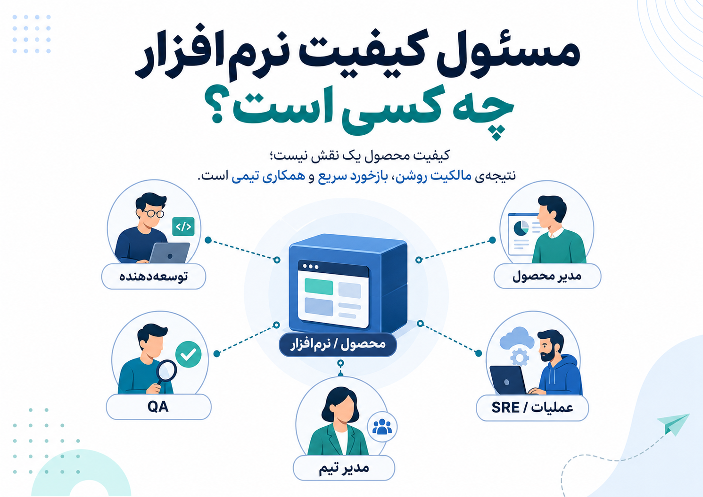
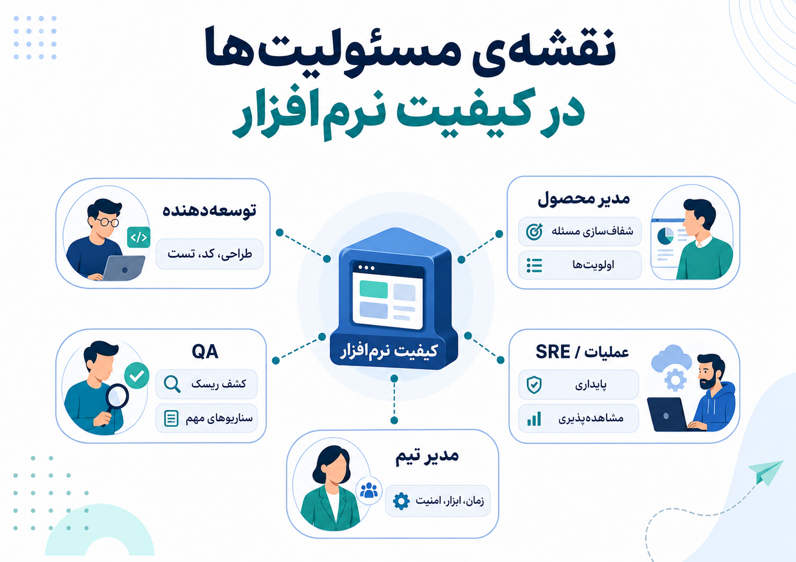
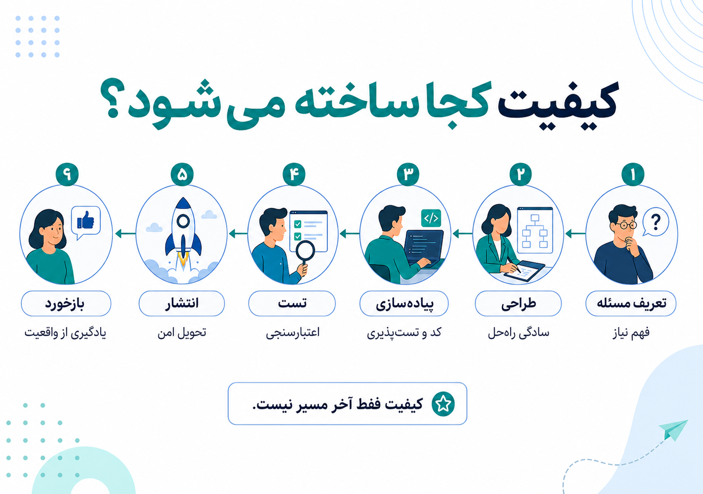
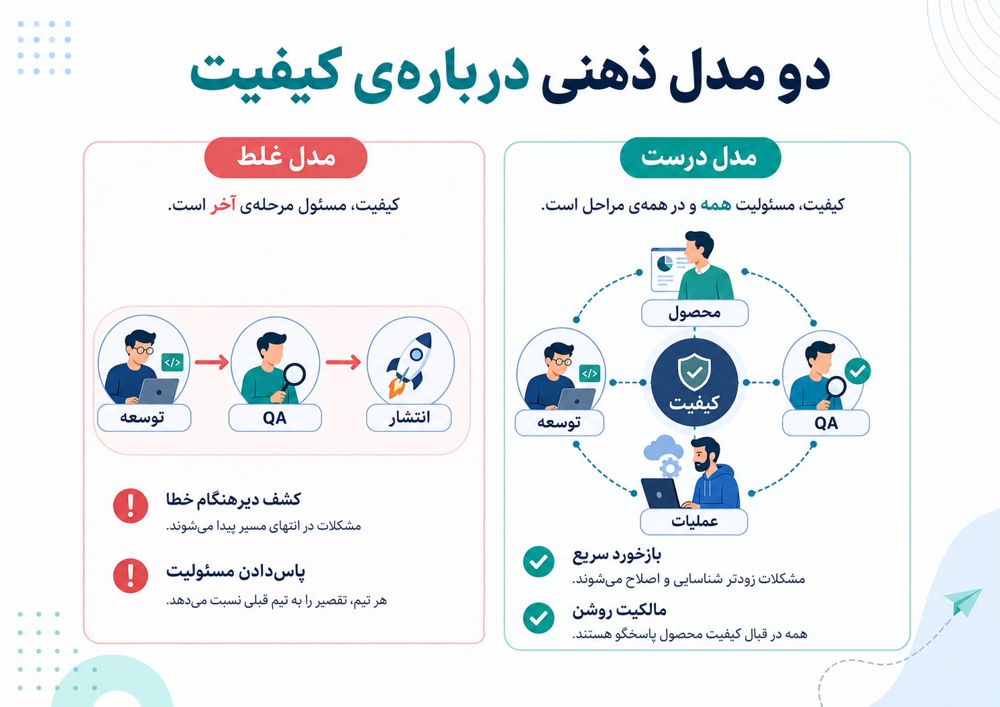
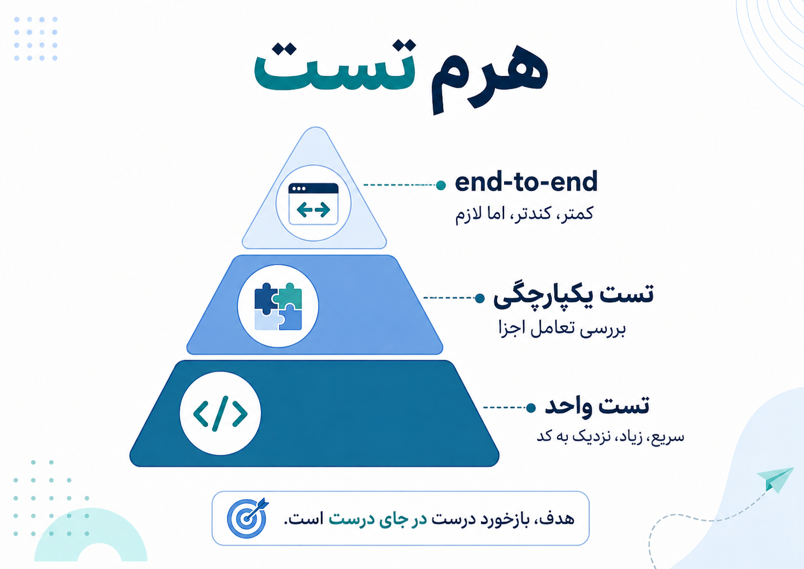
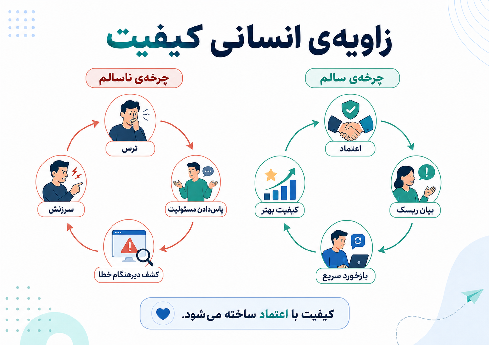
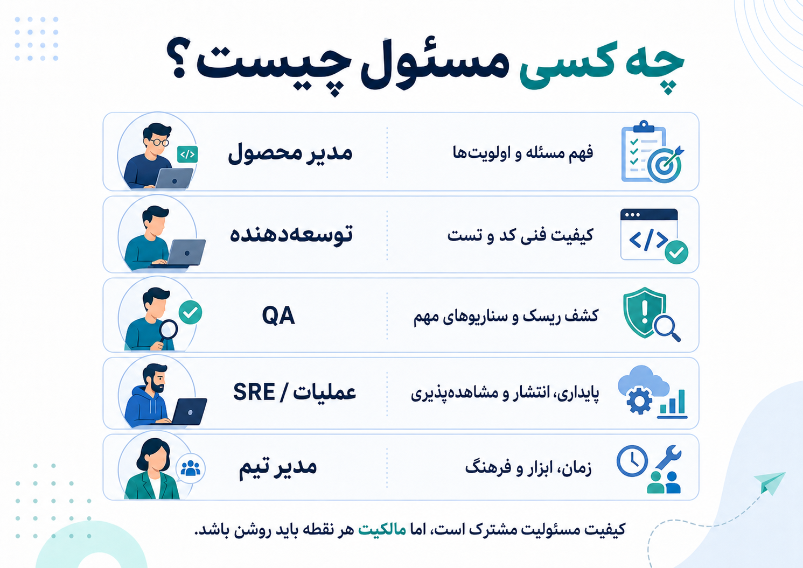

وقتی نرم‌افزار خراب می‌شود، معمولاً اولین سؤال این است: «چرا QA این را نگرفت؟»

این سؤال از یک نگرانی واقعی می‌آید. کسی انتظار دارد قبل از رسیدن خطا به کاربر، یک جایی در مسیر جلوی آن گرفته شود. اما همین سؤال، اگر دقیق بررسی نشود، ما را به یک برداشت ساده‌انگارانه می‌رساند: اینکه کیفیت چیزی است که در انتهای مسیر، توسط یک نقش جدا، به محصول اضافه می‌شود.

به نظرم این برداشت ریشه‌ی خیلی از سوءتفاهم‌های تیم‌های نرم‌افزاری است.

{/* truncate */}

کیفیت نرم‌افزار یک ایستگاه پایانی نیست. کیفیت، نتیجه‌ی زنجیره‌ای از تصمیم‌هاست: اینکه مسئله چقدر درست فهمیده شده، راه‌حل چقدر ساده طراحی شده، کد چقدر خواناست، تست‌ها چقدر قابل اعتمادند، انتشار چقدر امن است و تیم بعد از انتشار چقدر سریع بازخورد می‌گیرد.

پس پاسخ کوتاه این است: مسئول کیفیت، کل تیم است.

اما همین پاسخ هم اگر دقیق نشود، خطرناک است. چون «همه مسئول‌اند» گاهی در عمل یعنی «هیچ‌کس مسئول نیست». کیفیت باید مسئولیت مشترک باشد، اما مالکیت آن در هر نقطه باید روشن بماند.

## کیفیت یعنی چه؟

قبل از اینکه بپرسیم چه کسی مسئول کیفیت است، باید روشن کنیم کیفیت یعنی چه.

کیفیت فقط نبودن باگ نیست. نرم‌افزاری ممکن است بدون خطای فنی جدی کار کند، اما همچنان بی‌کیفیت باشد؛ چون مسئله‌ی اشتباهی را حل می‌کند، تجربه‌ی کاربر بدی دارد، کند است، تغییر دادنش سخت است، خطاهایش دیده نمی‌شود یا بعد از انتشار به‌سختی قابل نگهداشت است.

از این زاویه، کیفیت چند لایه دارد:

- کیفیت محصولی: آیا مسئله‌ی درستی را حل کرده‌ایم؟
- کیفیت طراحی: آیا راه‌حل ساده، قابل فهم و قابل تغییر است؟
- کیفیت فنی: آیا کد خوانا، تست‌پذیر و قابل نگهداشت است؟
- کیفیت عملیاتی: آیا سیستم در اجرا قابل اتکا، قابل مشاهده و قابل بازگشت است؟
- کیفیت انسانی: آیا تیم می‌تواند درباره‌ی ریسک‌ها صادقانه حرف بزند؟

وقتی کیفیت را فقط به «تست شدن» تقلیل می‌دهیم، بخش بزرگی از واقعیت را از دست می‌دهیم.

## سوءتفاهم رایج: QA آخر مسیر کیفیت را تضمین می‌کند

در خیلی از تیم‌ها، مسیر کار شبیه این است: محصول تعریف می‌شود، توسعه‌دهنده پیاده‌سازی می‌کند، بعد QA تست می‌کند و در نهایت محصول منتشر می‌شود.

این مدل در ظاهر مرتب است. نقش‌ها جدا هستند و هرکس ظاهراً کار خودش را دارد. اما مشکل اصلی اینجاست که کیفیت از محل تولید جدا می‌شود.

ابهام نیازمندی، طراحی پیچیده، کد شکننده، تست‌ناپذیری، خطای مدیریت وضعیت، نبودن مشاهده‌پذیری و تصمیم‌های عجولانه معمولاً همان‌جایی ساخته می‌شوند که محصول و کد ساخته می‌شوند؛ نه در مرحله‌ی تست نهایی.

QA می‌تواند بخشی از این مشکلات را کشف کند، اما نمی‌تواند کیفیت را بعد از تولید به محصول تزریق کند. اگر کیفیت در طراحی و توسعه ساخته نشده باشد، QA فقط می‌تواند دیرتر خبر بد را به تیم بدهد.

این تفاوت مهمی است: کشف خطا با ساختن کیفیت یکی نیست.

## نگاه فنی: توسعه‌دهنده نزدیک‌ترین فرد به کیفیت است

از زاویه‌ی فنی، توسعه‌دهنده نزدیک‌ترین فرد به کیفیت است. کسی که کد را می‌نویسد، بهتر از هرکس می‌داند تصمیم‌های فنی کجا گرفته شده‌اند، پیچیدگی کجا پنهان شده، چه چیزی تست‌پذیر نیست و کدام بخش در آینده شکننده خواهد شد.

کدی که خوانا نیست، با تست نهایی خوانا نمی‌شود. طراحی‌ای که بی‌دلیل پیچیده است، با QA ساده نمی‌شود. خطایی که درست مدیریت نشده، با چند سناریوی دستی قابل اتکا نمی‌شود. نبودن لاگ، متریک و مشاهده‌پذیری هم چیزی نیست که آخر مسیر با یک چک‌لیست حل شود.

به همین دلیل، تست واحد، بازبینی کد، طراحی ساده، مدیریت خطا، مشاهده‌پذیری و بازخورد سریع بخشی از کار توسعه‌اند، نه کارهای اضافه و تجملی.

در کتاب *Software Engineering at Google* روی همین ایده تأکید می‌شود که تست‌های کوچک و سریع فقط برای پیدا کردن باگ نیستند؛ برای افزایش بهره‌وری مهندس‌اند. چون توسعه‌دهنده می‌تواند مدام بازخورد بگیرد، با اطمینان تغییر بدهد و خطا را نزدیک به همان نقطه‌ای پیدا کند که ساخته شده است.

هرچه بازخورد به کد نزدیک‌تر باشد، اصلاح ارزان‌تر است. هرچه بازخورد دیرتر برسد، هزینه‌ی فهمیدن، بازسازی ذهنی و اصلاح بیشتر می‌شود.

## نگاه تست: تست بیشتر همیشه کیفیت بیشتر نیست

یکی از خطاهای رایج این است که فکر کنیم اگر تست‌های انتهایی بیشتری داشته باشیم، کیفیت بهتر می‌شود.

تست‌های سراسری لازم‌اند. بالاخره باید بفهمیم کاربر در مسیر واقعی با چه چیزی روبه‌رو می‌شود. اما اگر ستون اصلی اطمینان تیم، تست‌های انتهابه‌انتها باشد، معمولاً با سیستمی کند، شکننده و سخت‌عیب‌یاب روبه‌رو می‌شویم.

وقتی یک تست سراسری می‌شکند، همیشه روشن نیست مشکل از کجاست: رابط کاربری، شبکه، داده، سرویس پشتی، زمان‌بندی، وابستگی بیرونی یا خود تست؟ این نوع تست‌ها برای پوشش دادن رفتار کل سیستم مفیدند، اما برای پیدا کردن سریع ریشه‌ی خطا همیشه ابزار خوبی نیستند.

ایده‌ی هرم تست دقیقاً همین را توضیح می‌دهد: بیشتر تست‌ها باید کوچک، سریع و نزدیک به کد باشند؛ بخشی از تست‌ها یکپارچگی اجزای مهم را بررسی کنند؛ و تعداد محدودتری تست، کل مسیر سیستم را از ابتدا تا انتها بسنجد.

پس هدف، زیاد کردن کورکورانه‌ی تست نیست. هدف، ساختن چرخه‌ی بازخورد درست است.

## نگاه QA: پلیس کیفیت یا کاتالیزور کیفیت؟

نقد مدل سنتی QA به معنی بی‌ارزش دانستن تخصص کیفیت نیست.

مشکل از جایی شروع می‌شود که QA به پلیس کیفیت تبدیل می‌شود: کسی که آخر مسیر می‌ایستد، محصول را قبول یا رد می‌کند و ناخودآگاه بار روانی کیفیت را از دوش بقیه برمی‌دارد.

در چنین مدلی توسعه‌دهنده ممکن است فکر کند «اگر مشکلی بود QA می‌گیرد». مدیر محصول ممکن است فکر کند «اگر نیازمندی مبهم بود، در تست معلوم می‌شود». مدیر تیم هم ممکن است خیال کند چون یک مرحله‌ی کنترل وجود دارد، پس کیفیت مدیریت شده است.

اما نقش سالم QA چیز دیگری است.

QA می‌تواند کاتالیزور کیفیت باشد؛ یعنی کسی که کمک می‌کند تیم ریسک‌ها را زودتر ببیند، سناریوهای مهم را بهتر طراحی کند، نقاط کور محصول را پیدا کند و چرخه‌ی بازخورد را بهتر کند.

QA خوب فقط دنبال باگ نمی‌گردد. QA خوب سؤال‌های سخت می‌پرسد: اگر کاربر این مسیر را نیمه‌کاره رها کند چه می‌شود؟ اگر سرویس بیرونی کند شود چه می‌شود؟ اگر داده‌ی قدیمی برسد چه می‌شود؟ اگر نیازمندی را اشتباه فهمیده باشیم چه؟ اگر این تصمیم در مقیاس بزرگ تکرار شود چه هزینه‌ای دارد؟

این نگاه، QA را از نقش «تأییدکننده‌ی آخر مسیر» به نقش «کمک‌کننده به تفکر کیفیت‌محور» تبدیل می‌کند.

## نگاه محصول: کیفیت فقط مسئله‌ی فنی نیست

بخشی از کیفیت قبل از نوشتن اولین خط کد ساخته یا خراب می‌شود.

اگر مسئله درست فهمیده نشده باشد، اگر نیازمندی مبهم باشد، اگر حالت‌های مرزی دیده نشده باشند، اگر اولویت‌ها نادرست باشند یا اگر معیار آماده بودن روشن نباشد، خروجی نهایی حتی با کد خوب هم می‌تواند بی‌کیفیت باشد.

اینجاست که نقش مدیر محصول و طراح جدی می‌شود. کیفیت محصولی یعنی تیم بداند دقیقاً چه مسئله‌ای را حل می‌کند، برای چه کسی، با چه سطحی از ریسک، و با چه تعریفی از موفقیت.

گاهی چیزی که در پایان به شکل باگ دیده می‌شود، در واقع ریشه‌ی محصولی دارد. مثلاً نیازمندی مبهم بوده، رفتار حالت خاصی تعریف نشده، یا تیم درباره‌ی هزینه‌ی خطا توافق نکرده است.

در این حالت، سرزنش توسعه‌دهنده یا QA مسئله را حل نمی‌کند. مشکل از جایی شروع شده که تصمیم محصولی شفاف نبوده است.

## نگاه عملیات: کیفیت بعد از merge تمام نمی‌شود

کیفیت با merge شدن کد تمام نمی‌شود. بخشی از کیفیت تازه بعد از انتشار دیده می‌شود.

آیا سیستم قابل مشاهده است؟ آیا می‌توانیم بفهمیم چه چیزی خراب شده؟ آیا rollout مرحله‌ای داریم؟ آیا rollback آسان است؟ آیا alertها معنادارند؟ آیا خطاها به تیمی می‌رسند که می‌تواند آن‌ها را اصلاح کند؟

اگر پاسخ این سؤال‌ها روشن نباشد، حتی کد خوب هم می‌تواند تجربه‌ی بدی برای کاربر بسازد.

یکپارچه‌سازی پیوسته و تحویل پیوسته برای همین مهم‌اند. تغییرات کوچک‌تر، ادغام سریع‌تر، build خودکار و تست خودکار باعث می‌شوند خطاها زودتر دیده شوند و تیم به جای انباشتن ریسک، آن را در جریان کار مدیریت کند.

کیفیت عملیاتی یعنی تیم فقط مسئول ساختن قابلیت نیست؛ مسئول سالم رساندن آن به کاربر و یاد گرفتن از رفتار واقعی سیستم هم هست.

## نگاه مدیریتی: کیفیت بدون هزینه ساخته نمی‌شود

هیچ تیمی فقط با شعار، مالک کیفیت نمی‌شود.

اگر همیشه سرعت ظاهری مهم‌تر از درستی باشد، کیفیت قربانی می‌شود. اگر برای تست، بازبینی، ساده‌سازی، بازپرداخت بدهی فنی و بهبود ابزار زمان وجود نداشته باشد، کیفیت به حرفی زیبا در جلسه‌ها تبدیل می‌شود.

مدیر تیم مسئول ساختن سیستمی است که در آن کیفیت امکان‌پذیر باشد. یعنی زمان، ابزار، اختیار و معیارهای درست فراهم باشد.

اگر تیم برای گفتن «این آماده نیست» امنیت نداشته باشد، دیر یا زود یاد می‌گیرد ریسک را پنهان کند. اگر فقط تعداد خروجی‌ها اندازه‌گیری شود، آدم‌ها به سمت تحویل سریع‌تر و سطحی‌تر هل داده می‌شوند. اگر خطاها با سرزنش پاسخ داده شوند، تیم به جای یادگیری، دفاعی می‌شود.

پس کیفیت فقط مسئولیت افراد نیست؛ محصول سیستم کاری تیم هم هست.

## نگاه انسانی: کیفیت با اعتماد ساخته می‌شود

بحث «مسئول کیفیت کیست؟» فقط بحث فرایند و نقش سازمانی نیست؛ بحث ترس، اعتماد، مالکیت و سرزنش هم هست.

در بسیاری از تیم‌ها، QA به‌مرور تبدیل می‌شود به سپر روانی تیم. توسعه‌دهنده ناخودآگاه فکر می‌کند «اگر مشکلی بود QA می‌گیرد». مدیر محصول خیال می‌کند «اگر نیازمندی مبهم بود، در تست معلوم می‌شود». مدیر تیم هم احساس می‌کند یک مرحله‌ی کنترل آخر مسیر دارد.

این مدل شاید اضطراب تیم را کم کند، اما کیفیت را واقعاً بهتر نمی‌کند. فقط نگرانی را از یک نقش به نقش دیگر منتقل می‌کند.

از طرف دیگر، گفتن اینکه «QA لازم نیست و همه مسئول کیفیت‌اند» هم اگر بدون دقت گفته شود، می‌تواند بی‌رحمانه باشد. تیمی که زمان، ابزار، مهارت و امنیت روانی کافی ندارد، با شعار مالک کیفیت نمی‌شود.

وقتی ضرب‌الاجل سنگین است و فرهنگ تیم سرزنش‌گر است، آدم‌ها کیفیت را قربانی زنده‌ماندن می‌کنند.

کیفیت وقتی ساخته می‌شود که اعضای تیم اجازه داشته باشند درباره‌ی ریسک حرف بزنند، تصمیم‌های عجولانه را نقد کنند، بگویند «این هنوز آماده نیست» و بابت پیدا کردن مشکل تنبیه نشوند.

توسعه‌دهنده بدون زمان و ابزار، مالک کیفیت نمی‌شود. QA بدون احترام، فقط به باگ‌یاب خسته تبدیل می‌شود. مدیر بدون پذیرش هزینه‌ی کیفیت، فقط شعار کیفیت می‌دهد.

## پس بالاخره مسئول کیفیت کیست؟

مسئول کیفیت همه هستند، اما نه به معنای بی‌مالکیتی.

هرکس در نقطه‌ای که تصمیم می‌گیرد و اثر می‌گذارد، مسئول کیفیت همان نقطه است.

مدیر محصول مسئول کیفیت فهم مسئله، اولویت‌ها و تعریف درست آماده بودن است.

توسعه‌دهنده مسئول کیفیت فنی راه‌حل، کد، تست‌پذیری، مدیریت خطا و نگهداشت‌پذیری است.

QA مسئول کمک به کشف ریسک، طراحی سناریوهای مهم و بهتر کردن چرخه‌ی بازخورد است.

عملیات و تیم‌های زیرساخت مسئول قابل اتکا بودن مسیر اجرا، انتشار، مشاهده‌پذیری و بازگشت امن‌اند.

مدیر تیم مسئول ساختن محیطی است که در آن کیفیت فقط شعار نباشد و آدم‌ها برای درست کار کردن، زمان و امنیت داشته باشند.

کیفیت را نقش‌ها به‌تنهایی نمی‌سازند. رابطه‌ی سالم بین نقش‌ها، بازخورد سریع و مالکیت روشن است که کیفیت می‌سازد.

## جمع‌بندی

QA نمی‌تواند کیفیت را بعد از تولید به محصول تزریق کند. تست نهایی نمی‌تواند جای طراحی خوب، کد خوانا، نیازمندی شفاف، انتشار امن و فرهنگ سالم را بگیرد.

کیفیت از همان لحظه‌ای ساخته می‌شود که مسئله تعریف می‌شود، تصمیم گرفته می‌شود، کد نوشته می‌شود، تست طراحی می‌شود و تغییر به دست کاربر می‌رسد.

پس شاید پاسخ دقیق‌تر این باشد:

مسئول کیفیت، تیم است؛ اما هر نقش باید مالک کیفیت همان جایی باشد که بیشترین اثر را روی آن دارد.

## برای مطالعه‌ی بیشتر

- [How Google Tests Software - Part One](https://testing.googleblog.com/2011/01/how-google-tests-software.html)
- [Just Say No to More End-to-End Tests](https://testing.googleblog.com/2015/04/just-say-no-to-more-end-to-end-tests.html)
- [Software Engineering at Google: Unit Testing](https://abseil.io/resources/swe-book/html/ch12.html)
- [Practical Test Pyramid](https://martinfowler.com/articles/practical-test-pyramid.html)
- [Continuous Integration](https://martinfowler.com/articles/continuousIntegration.html)
- [DORA: Test Automation](https://dora.dev/capabilities/test-automation/)
- [QA as a catalyst for quality-first software development](https://www.thoughtworks.com/en-br/insights/blog/testing/qa-catalyst-quality-first-software)
