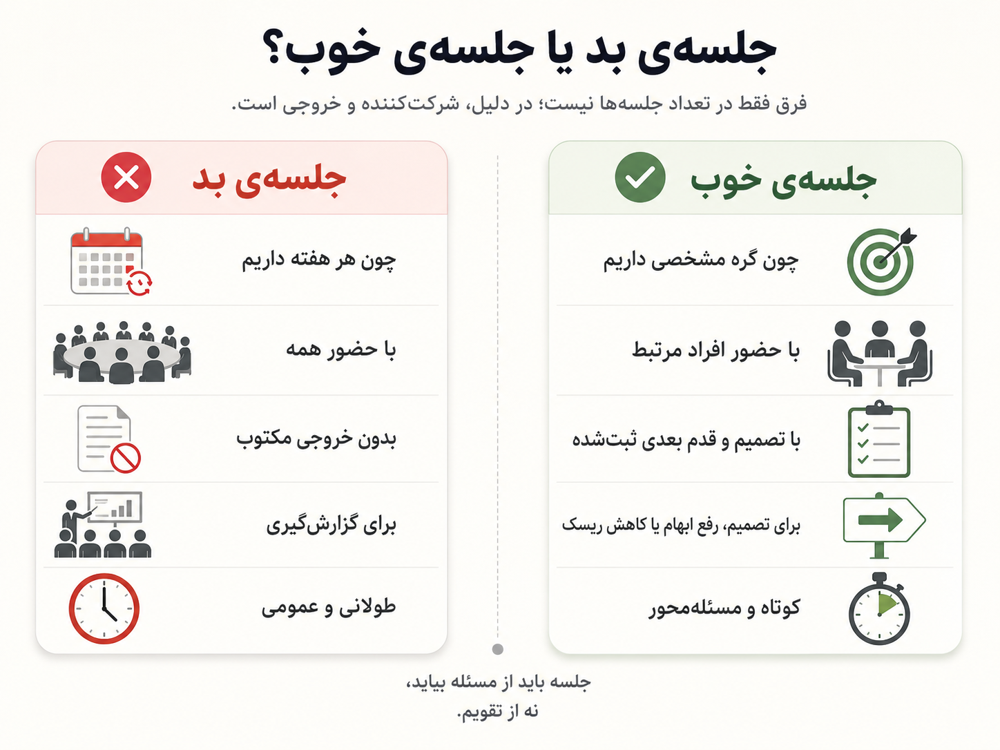

یک جایی در مسیر کار تیمی، فهمیدم چیزی که اسمش را هماهنگی گذاشته‌ایم، همیشه هماهنگی نمی‌سازد.

گاهی فقط همه را در یک اتاق نگه می‌دارد.

جلسه‌ی پلنینگ شروع می‌شود. چند نفر درباره‌ی کاری حرف می‌زنند که واقعاً به آن وصل‌اند. بقیه گوش می‌دهند، گاهی نظری می‌دهند، گاهی هم فقط منتظرند نوبت موضوع خودشان برسد. آخر جلسه حس می‌کنیم برنامه‌ریزی کرده‌ایم؛ اما واقعیت این است که بیشتر وقت جلسه صرف ساختن تصویری مرتب از آینده‌ای شده که هنوز خوب نمی‌شناسیم.

{/* truncate */}

:::info[خلاصه‌ی حرف]

من با هماهنگی مخالف نیستم. با این مخالفم که برای هر نوع هماهنگی، همه را وارد همه‌ی بحث‌ها کنیم.

:::

در این متن، پلنینگ تیمی را جدا از قاب رایج اسکرام نمی‌بینم. بخش مهمی از چیزی که نقد می‌کنم همان جایی است که اسکرام با اسپرینت، بک‌لاگ، امتیازدهی و مراسم تکرارشونده، هدف را زیر اداره‌ی فرایند پنهان می‌کند.

البته بعضی جلسه‌ها لازم‌اند. بحث من با جلسه‌ای است که از تقویم، نقش یا مراسم می‌آید؛ نه از گره واقعی کار.

## جلسه‌ای که اسمش هماهنگی بود

خیلی از جلسه‌های تیمی با یک نیت درست شروع می‌شوند: همه در جریان باشند، وابستگی‌ها زودتر دیده شوند، کسی از چیزی بی‌خبر نماند و کارها روی هوا نماند. این نیت بدی نیست. اتفاقاً هر تیمی که کمی جدی کار می‌کند به همین چیزها نیاز دارد.

مسئله از جایی شروع می‌شود که «در جریان بودن» را با «حضور داشتن» یکی می‌گیریم. یعنی فکر می‌کنیم اگر همه در جلسه بودند، پس همه فهم مشترک دارند. در عمل اما خیلی وقت‌ها فقط حضور مشترک داریم، نه فهم مشترک. آدم‌ها در یک جلسه بوده‌اند، اما هرکدام با یک برداشت متفاوت بیرون آمده‌اند.

مثلاً در جلسه تصمیم می‌گیریم یک قابلیت فعلاً بدون چند حالت خاص منتشر شود، چون ریسک اصلی جای دیگری است. اگر این تصمیم، دلیلش و محدوده‌اش جایی ثبت نشود، دو هفته بعد همان تصمیم دوباره محل اختلاف می‌شود. یکی فکر می‌کند آن حالت‌ها حذف شده‌اند، یکی فکر می‌کند فقط عقب افتاده‌اند، یکی هم اصلاً یادش نیست چرا چنین تصمیمی گرفتیم.

این‌جاست که جلسه به‌جای شفافیت، توهم شفافیت می‌سازد. همه حس می‌کنند موضوع گفته شده، اما خروجی قابل ارجاعی وجود ندارد. در چنین حالتی، جلسه فقط یک حافظه‌ی کوتاه‌مدت جمعی می‌سازد؛ حافظه‌ای که با تغییر آدم‌ها، فاصله‌ی زمانی، یا فشار کار خیلی زود خراب می‌شود.

شفافیت واقعی وقتی ساخته می‌شود که خروجی تصمیم روشن و قابل مراجعه باشد. اگر کسی بعداً وارد موضوع شد، نباید مجبور باشد از چند نفر بپرسد «آخرش چی شد؟».

> حضور در جلسه، شفافیت نیست. شفافیت یعنی خروجی تصمیم برای آدم‌های بعدی هم قابل دیدن و قابل پیگیری باشد.

بخشی از هماهنگی اصلاً جنس جلسه ندارد. مثلاً اینکه تغییر جدید با مرزهای معماری جور درمی‌آید یا نه، یک قرارداد ضمنی را شکسته یا نه، نام‌گذاری و جای‌گذاری کد مسیر فهم آینده را خراب می‌کند یا نه، معمولاً در گفت‌وگوی کلی جلسه معلوم نمی‌شود. این‌ها وقتی دیده می‌شوند که تغییر واقعی روی کد نشسته باشد.

اینجا بازبینی کد جای جلسه را می‌گیرد. نه به این معنا که بازبین فقط دنبال غلط املایی یا سبک کدنویسی بگردد؛ بازبینی کد باید بخشی از سازوکار هماهنگی فنی باشد. خیلی از وابستگی‌ها، شکست مرزها، تصمیم‌های پنهان و بدهی‌های کوچک فقط در متن تغییر دیده می‌شوند. اگر این هماهنگی را به جلسه‌ی پلنینگ منتقل کنیم، معمولاً فقط درباره‌ی چیزی حرف می‌زنیم که هنوز شکل نگرفته است.

به نظرم خطای اصلی این است که همه‌ی هماهنگی‌ها را یک‌جور می‌بینیم. هماهنگی تصمیمی شاید گفت‌وگوی هم‌زمان بخواهد؛ مثلاً وقتی دو مسیر محصولی یا فنی واقعاً قفل شده‌اند. هماهنگی فنی اغلب در بازبینی کد، مرور طراحی و دیدن تغییر واقعی بهتر انجام می‌شود. هماهنگی دانشی با ثبت کوتاه تصمیم، دلیل و محدوده زنده می‌ماند. هماهنگی اجرایی هم بیشتر به مالک روشن، قدم بعدی و وضعیت قابل مشاهده نیاز دارد. وقتی همه‌ی این‌ها را در یک جلسه‌ی عمومی می‌ریزیم، جلسه سنگین می‌شود و هیچ‌کدام را هم دقیق انجام نمی‌دهد.

## وقتی پلنینگ تیمی کار را تسک‌محور می‌کند

مشکل من فقط با جلسه‌ی طولانی نیست. مشکل عمیق‌تر این است که پلنینگ تیمی معمولاً واحد فکر کردن را عوض می‌کند. به‌جای اینکه از «مسئله» شروع کنیم، از «آیتم بک‌لاگ» شروع می‌کنیم. همین تغییر کوچک، مسیر گفتگو را عوض می‌کند.

وقتی واحد گفتگو تسک باشد، سؤال‌های جلسه هم تسک‌محور می‌شوند: چه تسکی داریم؟ چند امتیاز دارد؟ چه کسی برمی‌دارد؟ کی تمام می‌شود؟ این سؤال‌ها بد نیستند، اما اگر زودتر از فهم مسئله پرسیده شوند، تیم را به سمت بستن آیتم‌ها هل می‌دهند، نه حل مسئله.

یک مثال ساده: فرض کن هدف این است که کاربر بتواند وضعیت سفارش‌های قبلی‌اش را راحت‌تر پیگیری کند. در مدل تسک‌محور، خیلی زود بحث می‌رود سمت ساختن نقطه‌ی دسترسی، اضافه‌کردن جدول، طراحی صفحه، نوشتن تست و تخمین هرکدام. اما ممکن است هنوز روشن نباشد مسئله‌ی اصلی کاربر چیست: پیدا نکردن سفارش؟ نامفهوم بودن وضعیت؟ کند بودن پشتیبانی؟ یا نبودن تاریخچه‌ی کامل؟

اگر این سؤال‌ها روشن نشوند، تیم ممکن است همه‌ی تسک‌ها را ببندد و باز هم مسئله‌ی اصلی سر جایش بماند. از بیرون کار مرتب به نظر می‌رسد: کارت‌ها جابه‌جا شده‌اند، چند تسک بسته شده، شاید دمو هم داریم. اما خروجی واقعی ممکن است فقط یک پیاده‌سازی باشد، نه حل مسئله.

هدف‌محوری یعنی قبل از خردکردن کار، بپرسیم چه تغییری باید ایجاد شود. چه ریسکی باید کم شود؟ کدام ابهام اگر حل نشود، کل کار را بی‌اثر می‌کند؟ خروجی قابل استفاده دقیقاً یعنی چه؟ بعد از این مرحله، تسک‌ها هنوز لازم‌اند؛ اما دیگر مرکز فکر نیستند. ابزار اجرای هدف‌اند.

برای همین من با تسک مخالف نیستم. با این مخالفم که تسک تبدیل شود به واحد اصلی مدیریت کار. وقتی واحد مدیریت، تسک باشد، طبیعی است که پلنینگ، تخمین و گزارش‌گیری زیاد شود. وقتی واحد مدیریت، هدف باشد، جلسه‌ها هم کمتر و دقیق‌تر می‌شوند، چون گفتگو حول تصمیم، ریسک و خروجی واقعی شکل می‌گیرد.

اینجاست که نقد من از پلنینگ تیمی به نقد خود اسکرام می‌رسد. به نظرم این مسئله فقط «اجرای بد اسکرام» نیست. خودِ قاب اسکرام، با اسپرینت، بک‌لاگ، امتیازدهی، مراسم تکرارشونده و نقش‌های ثابت، خیلی راحت توجه تیم را از هدف واقعی به اداره‌ی فرایند منتقل می‌کند. مسئله از جایی شروع می‌شود که به‌جای اینکه بپرسیم «چه تغییری باید در واقعیت ایجاد شود؟»، می‌پرسیم «در این اسپرینت چه آیتم‌هایی را جا می‌دهیم؟».

دفاع رایج «این اسکرام واقعی نیست» هم قانع‌کننده نیست. چارچوب‌ها فقط با تعریف کتابی‌شان سنجیده نمی‌شوند؛ با رفتاری هم سنجیده می‌شوند که در فشار کار روزمره تولید می‌کنند. اگر یک قالب بارها تیم را به سمت تسک‌محوری، عددسازی، پرکردن جلسه و گزارش‌دادن از حرکت سوق می‌دهد، نمی‌شود همه‌ی تقصیر را گردن آدم‌ها انداخت.

ممکن است کسی بگوید در اسکرام هم هدف اسپرینت داریم و پلنینگ قرار نیست فقط تقسیم تسک باشد. همین‌جا به نظرم ضعف اصلی پیدا می‌شود: وقتی هدف داخل ظرفی به نام اسپرینت قرار می‌گیرد، خیلی زود تابع ظرفیت، بک‌لاگ و تعهدهای کوتاه‌مدت می‌شود. هدف به‌جای اینکه جهت کار را تعیین کند، تبدیل می‌شود به جمله‌ای که باید با آیتم‌های انتخاب‌شده جور دربیاید.

اگر جلسه با مرور بک‌لاگ، تخمین آیتم‌ها و تقسیم کار جلو برود، هدف اسپرینت خیلی وقت‌ها فقط یک عنوان مرتب برای مجموعه‌ای از تسک‌ها می‌شود. معیار واقعی این نیست که آیا در پایان جلسه جمله‌ای به اسم هدف نوشته‌ایم یا نه؛ معیار این است که آیا تصمیم‌های جلسه واقعاً از آن هدف پیروی کرده‌اند.

به بیان دیگر، اگر هدف نتواند باعث حذف بخشی از کار، تغییر ترتیب کارها، یا کنارگذاشتن یک تسک جذاب اما کم‌اثر شود، هدف نیست؛ برچسب است.

خود بک‌لاگ هم در این میان بی‌طرف نیست. وقتی مسئله‌ی واقعی از مسیر بک‌لاگ وارد تیم می‌شود، تیم خیلی وقت‌ها با خود مسئله روبه‌رو نیست؛ با نسخه‌ای خردشده، مرتب‌شده و از پیش قالب‌خورده از مسئله روبه‌روست. مالک محصول می‌تواند این فاصله را کم کند، اما خود وجود صف آیتم‌ها تیم را وسوسه می‌کند که به‌جای فهم مستقیم مسئله، صف را جلو ببرد. این‌جاست که «اولویت» کم‌کم جای «معنا» را می‌گیرد.

## تخمین‌هایی که شبیه دقت‌اند

تخمین‌زدن در نرم‌افزار همیشه کمی فریبنده است. عدد می‌دهیم و حس می‌کنیم آینده را دقیق‌تر کرده‌ایم. اما در بسیاری از کارهای مهندسی، بخش مهمی از مسئله موقع انجام کار کشف می‌شود. دقیقاً همان‌جایی که کار را ساده و قابل تخمین فرض کرده‌ایم، ممکن است تازه بفهمیم مسئله چه بوده است.

مشکل از خود تخمین شروع نمی‌شود. تخمین می‌تواند برای فهم اندازه‌ی تقریبی کار، مقایسه‌ی گزینه‌ها، یا دیدن ابهام‌ها مفید باشد. مشکل از جایی شروع می‌شود که سه چیز را با هم قاطی می‌کنیم: تخمین، پیش‌بینی و تعهد.

تخمین یعنی «با دانسته‌های فعلی، این کار حدوداً چقدر بزرگ به نظر می‌رسد؟» پیش‌بینی یعنی «با وضعیت فعلی تیم و وابستگی‌ها، احتمالاً چه زمانی به خروجی می‌رسیم؟» تعهد یعنی «ما مسئولیت می‌پذیریم که در یک بازه‌ی مشخص، نتیجه‌ی مشخصی تحویل بدهیم.» این سه تا یکی نیستند، اما در خیلی از پلنینگ‌ها یک عدد کوچک روی کارت، کم‌کم نقش هر سه را بازی می‌کند.

وقتی چنین اتفاقی می‌افتد، عدد دیگر ابزار فهم نیست؛ ابزار فشار است. آدم‌ها شروع می‌کنند از عدد دفاع کنند، کارها را امن‌تر و بزرگ‌تر تخمین بزنند، یا درباره‌ی چیزی که هنوز خوب نفهمیده‌اند وانمود به قطعیت کنند. جلسه‌ای که قرار بود ابهام را آشکار کند، تبدیل می‌شود به جایی برای تولید اطمینان نمایشی.

:::caution[جایی که تخمین خطرناک می‌شود]

تخمین وقتی از ابزار فهم مسئله به ابزار فشار تبدیل شود، دیگر به تیم کمک نمی‌کند. فقط باعث می‌شود آدم‌ها محتاط‌تر حرف بزنند، کارها را بزرگ‌تر تخمین بزنند، یا انرژی‌شان را صرف دفاع از عددها کنند.

:::

به نظرم تخمین اگر قرار است بماند، باید در خدمت کشف ابهام باشد، نه کنترل آدم‌ها. عدد باید باعث شود بپرسیم «چرا این کار بزرگ است؟»، «کدام بخشش ناشناخته است؟»، «چه چیزی را باید زودتر روشن کنیم؟» نه اینکه جلسه را با یک عدد ببندیم و بعد همان عدد را تبدیل کنیم به معیار عملکرد.

دفاع رایج این است که در اسکرام، تخمین تعهد نیست و فقط ابزار گفتگوست. مشکل این دفاع این است که سرنوشت عدد را بعد از جلسه نادیده می‌گیرد. وقتی خود فرایند عدد را تولید، ثبت و در چرخه‌های تکراری مقایسه می‌کند، عدد به‌طور طبیعی زندگی دوم پیدا می‌کند: در گزارش، داشبورد، سرعت تیم، مقایسه‌ی اسپرینت‌ها و فشار مدیریتی. اگر چیزی به‌راحتی از ابزار فهم به ابزار کنترل تبدیل می‌شود، این فقط سوءاستفاده‌ی بیرونی نیست؛ نشانه‌ای است که خود فرایند مسیر کنترل‌پذیرکردن کار را آماده کرده است.

سنجه‌ی «سرعت تیم» هم همین خطر را دارد. در ظاهر قرار است برای پیش‌بینی کمک کند، اما خیلی زود به عددی تبدیل می‌شود که از تیم انتظار ثبات یا رشد دارد. وقتی چنین سنجه‌ای مرکز توجه شود، تیم ناخودآگاه به‌جای کم‌کردن ابهام و حل مسئله، به پایدار نگه‌داشتن عدد فکر می‌کند. این همان لحظه‌ای است که فرایند از هدف جلو می‌زند.

برای همین من ترجیح می‌دهم به‌جای زمان صرف‌شده، زمان انجام‌شدن کار را ببینیم: از وقتی کار واقعاً شروع می‌شود تا وقتی خروجی قابل استفاده دارد. این معیار بیشتر درباره‌ی جریان کار حرف می‌زند، نه درباره‌ی کنترل آدم‌ها. اگر کاری زیاد طول کشیده، شاید مشکل از آدم‌ها نبوده؛ شاید ابهام دیر کشف شده، تصمیم دیر گرفته شده، وابستگی جایی گیر کرده، یا خروجی قابل استفاده از اول درست تعریف نشده بوده است.

## همه لازم نیست در همه‌چیز باشند

اصل پیشنهادی من ساده است:

:::tip[اصل پیشنهادی]

مشارکت برای افراد مرتبط؛ شفافیت برای همه.

:::

یعنی همه لازم نیست در همه‌ی بحث‌ها باشند، اما همه باید بتوانند خروجی بحث‌ها را ببینند. اگر موضوعی به کار کسی وصل شد، باید بتواند وارد شود. اما حضور پیش‌فرض کل تیم در همه‌ی گفتگوها، راه گرانی برای ساختن شفافیت است.

البته این حرف اگر معیار نداشته باشد، خودش مبهم می‌شود. «افراد مرتبط» یعنی کسانی که تصمیم روی کارشان اثر مستقیم دارد؛ کسانی که مالک یک وابستگی‌اند؛ کسانی که باید بخشی از خروجی را بسازند یا نگه‌داری کنند؛ کسانی که ریسک فنی یا محصولی را بهتر می‌شناسند؛ یا کسانی که باید تصمیم را مرور کنند. اگر کسی فقط لازم است بداند چه تصمیمی گرفته شده، مخاطب خروجی است، نه لزوماً عضو جلسه.

اشتباه رایج این است که حق اثرگذاری را با الزام حضور یکی بگیریم. اگر کسی حق دارد روی تصمیم اثر بگذارد، باید راه روشن و کم‌هزینه‌ای برای ورود به بحث داشته باشد. اما این به معنی آن نیست که از ابتدا باید در همه‌ی گفت‌وگوها حاضر باشد. حضور همگانی، ضمانت مشارکت واقعی نیست؛ گاهی فقط هزینه‌ی مشارکت را برای همه بالا می‌برد.

شفافیت برای همه یعنی خروجی بحث باید قابل دیدن باشد، نه اینکه همه در فرایند تولید آن خروجی حاضر باشند. این خروجی هم نباید صورت‌جلسه‌ی مفصل باشد. اگر برای حذف جلسه، دفتر و دستک تازه بسازیم، فقط هزینه را از تقویم به متن منتقل کرده‌ایم. چند خط تصمیم‌محور کافی است: چه چیزی قطعی شد، چه چیزی باز ماند، و ادامه‌ی کار دست کیست.

در این مدل، کسی از جریان کار حذف نمی‌شود؛ فقط شکل مشارکت دقیق‌تر می‌شود. کسی که باید تصمیم بسازد وارد بحث می‌شود و کسی که باید اثر تصمیم را بداند، خروجی را می‌بیند.

البته این مدل فقط وقتی سالم می‌ماند که تصمیم‌های کوچک به جلسه‌های سایه‌ای تبدیل نشوند. تصمیم مهم نباید در جمع کوچک بسته و بعد فقط به تیم اعلام شود. نسخه‌ی سالم این است: مسئله در جای قابل دیدن نوشته شود، افراد بتوانند پیش از نهایی‌شدن تصمیم وارد بحث شوند، و تصمیم نهایی همراه با دلیلش ثبت شود. پنهان‌بودن مسئله است، نه کوچک‌بودن جلسه.

### پلنینگ تیمی رایج

همه‌ی تیم در جلسه حاضر می‌شوند. بک‌لاگ مرور می‌شود. درباره‌ی آیتم‌هایی حرف می‌زنیم که گاهی فقط به چند نفر مربوط‌اند. تخمین‌ها ثبت می‌شوند و در پایان، حس می‌کنیم برنامه داریم.

مشکل این مدل فقط زمان جلسه نیست. مشکل این است که برای کم‌کردن ریسک بی‌خبری، هزینه‌ی تمرکز همه را خرج هماهنگی چند نفر می‌کند. این مدل معمولاً از ترس جا ماندن آدم‌ها، همه را به همه‌چیز وصل می‌کند؛ اما اتصال زیاد همیشه فهم بیشتر نمی‌سازد.

### برنامه‌ریزی هدف‌محور

ابتدا جهت کلی نوشته می‌شود. برای هر هدف، مالک مشخص می‌شود. مالک، آدم‌های مرتبط را وارد بحث می‌کند. اگر نوشتار کافی نبود، یک سینک کوچک برگزار می‌شود. خروجی برای همه منتشر می‌شود.

در این مدل، مشارکت محدود است، اما شفافیت محدود نیست. تفاوت مهم همین‌جاست: آدم‌های کمتری در جلسه‌اند، اما آدم‌های بیشتری می‌توانند نتیجه را بفهمند و دنبال کنند.

### سینک و یک‌به‌یک

جلسه‌های کوچک‌تر برای من جایگزین تزئینی جلسه‌ی عمومی نیستند؛ ابزارهای دقیق‌تری‌اند. هرکدام باید برای یک نوع مسئله استفاده شوند، نه اینکه همه‌ی نیازهای هماهنگی را با یک جلسه‌ی بزرگ حل کنیم.

سینک پروژه‌ای وقتی مفید است که چند نفر واقعاً روی یک جریان مشترک کار می‌کنند و وابستگی بین کارهایشان وجود دارد. هدفش گزارش‌گیری نیست؛ هدفش این است که گره‌ها زود دیده شوند، تصمیم‌های کوچک سریع گرفته شوند و کسی منتظر تصمیم نامعلوم نماند.

یک‌به‌یک جنس دیگری دارد. آنجا معمولاً بحث درباره‌ی خود کار نیست، درباره‌ی زمینه‌ی کار است: ابهامی که فرد در اولویت‌ها دارد، مانعی که نمی‌خواهد در جلسه‌ی عمومی مطرح کند، بازخوردی که باید دقیق و شخصی داده شود، یا مسیری که برای رشد و مسئولیت‌پذیری بعدی لازم است.

مرور طراحی هم یک جلسه‌ی دیگر با کارکرد متفاوت است. این جلسه باید دور تصمیم فنی بچرخد: چه گزینه‌هایی داریم، بده‌بستان هر گزینه چیست، چه چیزی را الان می‌پذیریم، و چه چیزی را آگاهانه عقب می‌اندازیم. آدم‌هایی که باید در آن باشند، کسانی‌اند که روی تصمیم اثر می‌گذارند یا بعداً با پیامدش زندگی می‌کنند.

گاهی هم فقط یک جلسه‌ی کوتاه لازم است برای بازکردن یک گره مشخص. مثلاً دو نفر روی رابط برنامه‌نویسی و رابط کاربری گیر کرده‌اند، یا یک ابهام محصولی باعث شده کار جلو نرود. چنین جلسه‌ای اگر با آدم‌های درست و خروجی روشن برگزار شود، از یک پلنینگ عمومی یک‌ساعته بسیار مفیدتر است.

تفاوت اصلی این است: جلسه‌ی عمومی معمولاً از تقویم می‌آید، اما این جلسه‌های کوچک از مسئله می‌آیند. وقتی مسئله روشن باشد، شرکت‌کننده‌ها هم روشن می‌شوند و خروجی جلسه هم قابل تعریف است.

## مالکیت واحد، نه دانش انحصاری

ایراد قابل پیش‌بینی این است: اگر هر هدف مالک داشته باشد، تک‌نقطه‌ی شکست درست نمی‌شود؟

به نظرم این نگرانی درست است، اما راه‌حلش جلسه‌ی عمومی نیست. مالک داشتن یعنی مسئولیت روشن باشد، نه اینکه دانش فقط پیش یک نفر بماند. اتفاقاً اگر درست طراحی شود، مالکیت روشن می‌تواند ریسک گم‌شدن کار را کمتر کند؛ چون همه می‌دانند چه کسی باید جهت را نگه دارد، ابهام‌ها را جمع کند، تصمیم‌ها را جلو ببرد و خروجی را قابل پیگیری کند.

مشکل از جایی شروع می‌شود که مالکیت را با اختیار بی‌قید یا دانش انحصاری اشتباه بگیریم. مالک هدف نباید تنها کسی باشد که مسئله را می‌فهمد، تنها کسی باشد که تصمیم می‌گیرد، یا تنها کسی باشد که می‌تواند کار را ادامه دهد. مالک یعنی یک نفر مسئول است که کار روی زمین نماند؛ نه اینکه بقیه از فهم کار کنار گذاشته شوند.

اینجا هم یک سوءتفاهم رایج وجود دارد: مالک هدف، جایگزین مالکیت تیم نیست. اتفاقاً بدون مالک روشن، عبارت «تیم مالک است» خیلی وقت‌ها به این معنی تبدیل می‌شود که هیچ‌کس مسئول تصمیم بعدی، جمع‌کردن ابهام‌ها و نوشتن خروجی نیست. مالک هدف یعنی پاسخ‌گویی برای پیش‌بردن جریان کار؛ مالکیت تیم یعنی اختیار و مسئولیت جمعی برای کیفیت خروجی. این دو اگر درست تعریف شوند، همدیگر را تقویت می‌کنند.

برای همین در مدل سالم، مالک تنها نیست. کنار مالک باید بازبین، نفر پشتیبان و یادداشت انتقال کار وجود داشته باشد. این‌ها هزینه دارند، اما هزینه‌شان از جلسه‌های عمومی طولانی کمتر است و خروجی‌شان هم ماندگارتر است.

پس چطور جلوی تک‌نقطه‌ی شکست را بگیریم؟

- برای هر هدف، یک مالک روشن داشته باشیم؛ کسی که جهت، تصمیم‌ها و خروجی را جلو می‌برد.
- برای تصمیم‌های مهم، بازبین مشخص کنیم؛ کسی که تصمیم را از بیرون نگاه کند و نقطه‌های کور را ببیند.
- برای هدف‌های حساس، نفر پشتیبان داشته باشیم؛ نه برای اینکه همه‌چیز را هم‌زمان انجام دهد، برای اینکه مسیر کار برای یک نفر قفل نشود.
- تصمیم‌های مهم و دلیلشان در دفترچه‌ی تصمیم‌ها ثبت شود.
- محدوده، وابستگی‌ها، ریسک‌ها و قدم بعدی در جای قابل دیدن باشد.
- اگر مالک مدتی در دسترس نبود یا کار طولانی شد، یادداشت انتقال کار کوتاه نوشته شود: الان کجا هستیم، چه تصمیم‌هایی گرفته شده، چه چیزی باز مانده است.
- خروجی جلسه‌ها، اگر جلسه‌ای لازم شد، به متن برگردد.

جلسه‌ی عمومی لزوماً دانش مشترک نمی‌سازد. خیلی وقت‌ها فقط توهم دانش مشترک می‌سازد. دانش مشترک واقعی وقتی شکل می‌گیرد که آدم بعدی بتواند بدون حضور در جلسه مسیر تصمیم را دنبال کند.

پس مسئله این نیست که همه در همه‌ی تصمیم‌ها حاضر باشند. مسئله این است که مسیر ادامه‌دادن کار فقط در ذهن یک نفر نماند. مالکیت روشن، وقتی با مستندسازی سبک، بازبینی و نفر پشتیبان همراه شود، ضد شفافیت نیست؛ راهی برای ساختن شفافیت پایدارتر است.

## جایگزین پیشنهادی من

اگر بخواهم جایگزین پلنینگ تیمی را خلاصه کنم، این است:

این مدل برای من یک فرمول سنگین فرایندی نیست. بیشتر یک مسیر سبک است برای اینکه تیم بدون جلسه‌ی پیش‌فرض هم جهت مشترک داشته باشد. فرقش با پلنینگ رایج این است که از «تقسیم تسک» شروع نمی‌کند؛ از روشن‌کردن جهت، هدف و مسئولیت شروع می‌کند.

اگر همین چرخه هم تبدیل به مراسم ثابت شود، دوباره همان بیماری قبلی را تولید می‌کند. قرار نیست هر هفته با همین ترتیب و همین قالب اجرا شود. ارزش این چرخه در این است که به تیم یادآوری کند قبل از جلسه، قبل از تخمین و قبل از تقسیم کار، باید مسئله، هدف، مالکیت و خروجی روشن باشد. اگر این‌ها روشن‌اند، شاید اصلاً نیازی به اجرای همه‌ی مرحله‌ها نباشد.

یادداشت جهت‌دهی نقطه‌ی شروع است؛ کوتاه و روشن: چرا این کار مهم است، چه مسئله‌ای را می‌خواهیم حل کنیم، چه چیزی فعلاً بیرون محدوده است و چه ابهام‌هایی داریم. بعد هدف باید دقیق شود. هدف خوب فقط اسم یک قابلیت نیست؛ باید بگوید چه تغییری می‌خواهیم ایجاد کنیم و خروجی قابل استفاده یعنی چه.

بعد از آن مالک هدف جهت را نگه می‌دارد، افراد مرتبط را وارد می‌کند و نمی‌گذارد تصمیم‌ها پخش و بی‌صاحب بمانند. اگر نوشتار کافی نبود، یک سینک کوچک برگزار می‌شود؛ با کسانی که واقعاً باید تصمیم بسازند. خروجی این سینک باید تصمیم و قدم بعدی باشد، نه صرفاً گفت‌وگو.

آخرین مرحله، بازبینی خروجی است؛ نه شمارش جلسه‌ها و نه فقط شمارش تسک‌های بسته‌شده. باید ببینیم آیا خروجی واقعاً به هدف نزدیک شده یا نه. اگر نه، مسئله ممکن است در تعریف هدف، تصمیم‌های میانی، وابستگی‌ها یا حتی خود فرض اولیه بوده باشد.

این بازبینی با بازنگری فرایند فرق دارد. بازنگری فرایند می‌پرسد همکاری تیم چطور بهتر شود؛ بازبینی خروجی می‌پرسد آیا واقعاً مسئله‌ای که به‌خاطرش کار را شروع کردیم بهتر شده است یا نه. ممکن است فرایند مرتب بوده باشد، جلسه‌ها برگزار شده باشند و تسک‌ها بسته شده باشند، اما خروجی هنوز اثر لازم را نداشته باشد. این همان جایی است که تمرکز بر هدف باید از تمرکز بر فرایند جلو بزند.

این مدل چند اصل دارد:

1. جلسه پیش‌فرض نیست.
2. هر هدف مالک دارد.
3. آدم‌های مرتبط وارد بحث می‌شوند، نه کل تیم.
4. خروجی برای همه قابل مشاهده است.
5. بازبینی روی اثر و خروجی انجام می‌شود، نه روی تعداد تسک‌های بسته‌شده.

:::note

در این مدل، مدیر آدم‌ها را با جلسه مدیریت نمی‌کند. مدیر جریان کار، اولویت، ریسک و وابستگی را مدیریت می‌کند.

:::

## پس جلسه کی لازم است؟

من نمی‌گویم هیچ جلسه‌ای لازم نیست. اتفاقاً بعضی جلسه‌ها بسیار لازم‌اند: وقتی تصمیم بین چند نفر قفل شده، وقتی وابستگی جدی داریم، وقتی ابهام نوشتاری بیش از حد رفت‌وبرگشت می‌سازد، یا وقتی ریسک مشترکی وجود دارد که باید سریع فهمیده شود.

اما هر مسئله‌ای که چند نفر را درگیر می‌کند، جلسه نمی‌خواهد. اگر مسئله در خود تغییر کد آشکار می‌شود، جای درستش بازبینی کد است. اگر درباره‌ی مرز ماژول، اثر جانبی تغییر، شکست قرارداد، خوانایی مسیر اجرا، یا هزینه‌ی نگهداشت آینده حرف می‌زنیم، جلسه‌ی عمومی معمولاً زودتر از واقعیت حرف می‌زند. بازبینی کد دیرتر می‌آید، اما روی چیز واقعی دست می‌گذارد.

یک معیار ساده این است: اگر قرار است تصمیمی هم‌زمان ساخته شود، جلسه می‌تواند مفید باشد. اگر فقط قرار است چیزی اطلاع‌رسانی شود، متن کافی است. اگر ابهام با دو سه رفت‌وبرگشت نوشتاری حل نمی‌شود، یک گفت‌وگوی کوتاه لازم است. اگر مسئله در کد، طراحی یا اثر جانبی تغییر دیده می‌شود، جای آن بازبینی کد یا مرور طراحی است. اگر هدف هنوز روشن نیست، جلسه‌ی پلنینگ زود است؛ اول باید خود مسئله روشن شود.

یک تمایز دیگر هم مهم است. کارهای اجرایی و تکراری گاهی با برنامه‌ریزی ساده جلو می‌روند؛ مسئله روشن است و فقط باید انجام شود. اما کارهای کشفی، که در آن‌ها فهم مسئله بخشی از خود کار است، با پلنینگ دقیق زودهنگام آسیب می‌بینند. خیلی از کارهای نرم‌افزاری از جنس دوم‌اند، اما اسکرام آن‌ها را به شکل بسته‌های قابل تخمین و قابل جا دادن در اسپرینت نمایش می‌دهد.

اما جلسه باید از مسئله بیاید، نه از تقویم.

## چند الهام نزدیک به این نگاه

منابعی که این نگاه را بهتر توضیح می‌دهند

- کتاب *Software Engineering at Google*، مخصوصاً ایده‌ی «برنامه‌نویسی در گذر زمان» و تأکیدش بر مستندسازی، تصمیم‌های قابل ردیابی و دانش قابل انتقال.
- کتاب *Rework* و نوشته‌های 37signals درباره‌ی هزینه‌ی جلسه‌های زیاد و وقفه در کار واقعی.
- کتاب *Shape Up* درباره‌ی کار با هدف‌های شکل‌داده‌شده، نه بک‌لاگ‌گردانی دائمی.
- تجربه‌ی تیم NASA ADS درباره‌ی تطبیق فرایند با تیم‌های خلاق و خودمختار، نه تحمیل کامل یک قالب ثابت.
- نگاه کانبان به جریان کار، محدود کردن کار هم‌زمان و استفاده از داده‌ی واقعی به‌جای تخمین‌های نمایشی.

## جمع‌بندی

من از پلنینگ‌های تیمی فراری‌ام، چون خیلی وقت‌ها مسئله‌ی درست را حل نمی‌کنند. اسکرام هم به نظرم این مشکل را کم نکرده؛ در بسیاری از تیم‌ها فقط برای آن زبان، نقش، مراسم و عدد ساخته است.

قرار است هماهنگی بسازد، اما گاهی فقط تمرکز را می‌گیرد. قرار است شفافیت بسازد، اما گاهی فقط حضور می‌سازد. قرار است برنامه بدهد، اما گاهی فقط آینده‌ی مبهم را عددی و مرتب نشان می‌دهد.

برای تیم حرفه‌ای، هماهنگی لازم است؛ اما هماهنگی الزاماً به معنی جلسه‌ی عمومی نیست.

به نظرم نسخه‌ی سالم‌تر این است: هدف روشن، مالک مشخص، مشارکت افراد مرتبط، خروجی مکتوب، و شفافیت برای همه.

جلسه باید وقتی بیاید که واقعاً گرهی را باز می‌کند. نه وقتی که فقط در تقویم جا مانده است.
