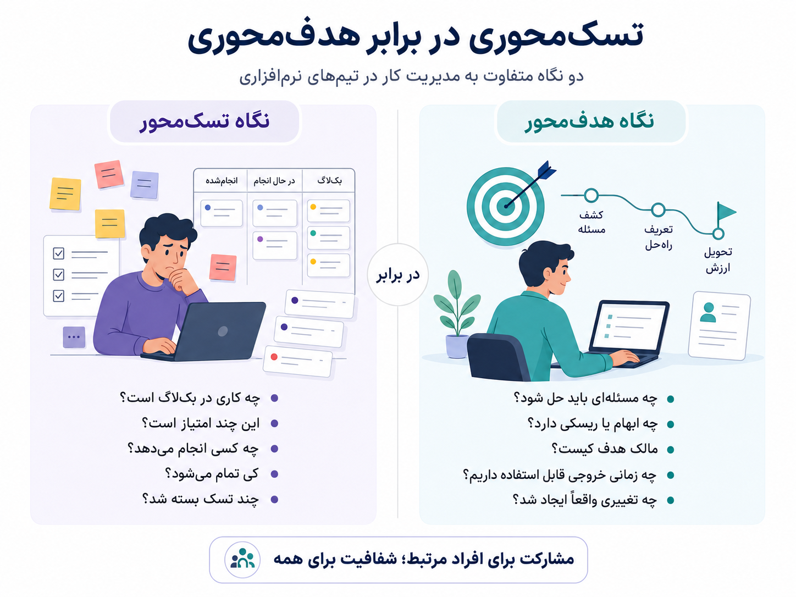
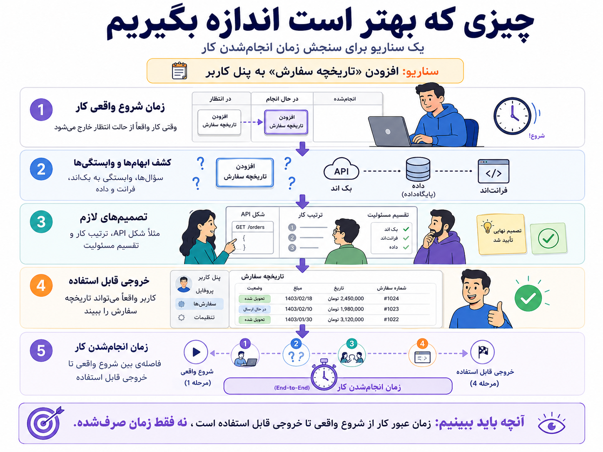

یک جایی در مسیر کار تیمی، فهمیدم چیزی که اسمش را هماهنگی گذاشته‌ایم، همیشه هماهنگی نمی‌سازد.

گاهی فقط همه را در یک اتاق نگه می‌دارد.

جلسه‌ی پلنینگ شروع می‌شود. چند نفر درباره‌ی کاری حرف می‌زنند که واقعاً به آن وصل‌اند. بقیه گوش می‌دهند، گاهی نظری می‌دهند، گاهی هم فقط منتظرند نوبت موضوع خودشان برسد. آخر جلسه حس می‌کنیم برنامه‌ریزی کرده‌ایم؛ اما واقعیت این است که بیشتر وقت جلسه صرف ساختن تصویری مرتب از آینده‌ای شده که هنوز خوب نمی‌شناسیم.


{/* truncate */}

:::info[خلاصه‌ی حرف]

من با هماهنگی مخالف نیستم. با این مخالفم که برای هر نوع هماهنگی، همه را وارد همه‌ی بحث‌ها کنیم.

:::

## جلسه‌ای که اسمش هماهنگی بود

خیلی از جلسه‌های تیمی با یک نیت درست شروع می‌شوند: همه در جریان باشند، وابستگی‌ها زودتر دیده شوند، کسی از چیزی بی‌خبر نماند و کارها روی هوا نماند. این نیت بدی نیست. اتفاقاً هر تیمی که کمی جدی کار می‌کند به همین چیزها نیاز دارد.

مسئله از جایی شروع می‌شود که «در جریان بودن» را با «حضور داشتن» یکی می‌گیریم. یعنی فکر می‌کنیم اگر همه در جلسه بودند، پس همه فهم مشترک دارند. در عمل اما خیلی وقت‌ها فقط حضور مشترک داریم، نه فهم مشترک. آدم‌ها در یک جلسه بوده‌اند، اما هرکدام با یک برداشت متفاوت بیرون آمده‌اند.

مثلاً در جلسه تصمیم می‌گیریم یک قابلیت فعلاً بدون چند حالت خاص منتشر شود، چون ریسک اصلی جای دیگری است. اگر این تصمیم، دلیلش و محدوده‌اش جایی ثبت نشود، دو هفته بعد همان تصمیم دوباره محل اختلاف می‌شود. یکی فکر می‌کند آن حالت‌ها حذف شده‌اند، یکی فکر می‌کند فقط عقب افتاده‌اند، یکی هم اصلاً یادش نیست چرا چنین تصمیمی گرفتیم.

این‌جاست که جلسه به‌جای شفافیت، توهم شفافیت می‌سازد. همه حس می‌کنند موضوع گفته شده، اما خروجی قابل ارجاعی وجود ندارد. در چنین حالتی، جلسه فقط یک حافظه‌ی کوتاه‌مدت جمعی می‌سازد؛ حافظه‌ای که با تغییر آدم‌ها، فاصله‌ی زمانی، یا فشار کار خیلی زود خراب می‌شود.

شفافیت واقعی وقتی ساخته می‌شود که تصمیم، دلیل تصمیم، محدوده، ریسک و قدم بعدی روشن و قابل مراجعه باشد. اگر کسی بعداً وارد موضوع شد، نباید مجبور باشد از چند نفر بپرسد «آخرش چی شد؟». باید بتواند با خواندن خروجی، بفهمد چه تصمیمی گرفته شده، چرا گرفته شده، چه چیزی داخل محدوده است، چه چیزی بیرون محدوده است و قدم بعدی دست چه کسی است.

> حضور در جلسه، شفافیت نیست. شفافیت یعنی خروجی تصمیم برای آدم‌های بعدی هم قابل دیدن و قابل پیگیری باشد.

## وقتی پلنینگ تیمی کار را تسک‌محور می‌کند

مشکل من فقط با جلسه‌ی طولانی نیست. مشکل عمیق‌تر این است که پلنینگ تیمی معمولاً واحد فکر کردن را عوض می‌کند. به‌جای اینکه از «مسئله» شروع کنیم، از «آیتم بک‌لاگ» شروع می‌کنیم. همین تغییر کوچک، مسیر گفتگو را عوض می‌کند.

وقتی واحد گفتگو تسک باشد، سؤال‌های جلسه هم تسک‌محور می‌شوند: چه تسکی داریم؟ چند امتیاز دارد؟ چه کسی برمی‌دارد؟ کی تمام می‌شود؟ این سؤال‌ها بد نیستند، اما اگر زودتر از فهم مسئله پرسیده شوند، تیم را به سمت بستن آیتم‌ها هل می‌دهند، نه حل مسئله.

یک مثال ساده: فرض کن هدف این است که کاربر بتواند وضعیت سفارش‌های قبلی‌اش را راحت‌تر پیگیری کند. در مدل تسک‌محور، خیلی زود بحث می‌رود سمت ساختن endpoint، اضافه‌کردن جدول، طراحی صفحه، نوشتن تست و تخمین هرکدام. اما ممکن است هنوز روشن نباشد مسئله‌ی اصلی کاربر چیست: پیدا نکردن سفارش؟ نامفهوم بودن وضعیت؟ کند بودن پشتیبانی؟ یا نبودن تاریخچه‌ی کامل؟

اگر این سؤال‌ها روشن نشوند، تیم ممکن است همه‌ی تسک‌ها را ببندد و باز هم مسئله‌ی اصلی سر جایش بماند. از بیرون کار مرتب به نظر می‌رسد: کارت‌ها جابه‌جا شده‌اند، چند تسک بسته شده، شاید دمو هم داریم. اما خروجی واقعی ممکن است فقط یک پیاده‌سازی باشد، نه حل مسئله.

هدف‌محوری یعنی قبل از خردکردن کار، بپرسیم چه تغییری باید ایجاد شود. چه ریسکی باید کم شود؟ کدام ابهام اگر حل نشود، کل کار را بی‌اثر می‌کند؟ خروجی قابل استفاده دقیقاً یعنی چه؟ بعد از این مرحله، تسک‌ها هنوز لازم‌اند؛ اما دیگر مرکز فکر نیستند. ابزار اجرای هدف‌اند.

برای همین من با تسک مخالف نیستم. با این مخالفم که تسک تبدیل شود به واحد اصلی مدیریت کار. وقتی واحد مدیریت، تسک باشد، طبیعی است که پلنینگ، تخمین و گزارش‌گیری زیاد شود. وقتی واحد مدیریت، هدف باشد، جلسه‌ها هم کمتر و دقیق‌تر می‌شوند، چون گفتگو حول تصمیم، ریسک و خروجی واقعی شکل می‌گیرد.



## تخمین‌هایی که شبیه دقت‌اند

تخمین‌زدن در نرم‌افزار همیشه کمی فریبنده است. عدد می‌دهیم و حس می‌کنیم آینده را دقیق‌تر کرده‌ایم. اما در بسیاری از کارهای مهندسی، بخش مهمی از مسئله موقع انجام کار کشف می‌شود. دقیقاً همان‌جایی که کار را ساده و قابل تخمین فرض کرده‌ایم، ممکن است تازه بفهمیم مسئله چه بوده است.

مشکل از خود تخمین شروع نمی‌شود. تخمین می‌تواند برای فهم اندازه‌ی تقریبی کار، مقایسه‌ی گزینه‌ها، یا دیدن ابهام‌ها مفید باشد. مشکل از جایی شروع می‌شود که سه چیز را با هم قاطی می‌کنیم: تخمین، پیش‌بینی و تعهد.

تخمین یعنی «با دانسته‌های فعلی، این کار حدوداً چقدر بزرگ به نظر می‌رسد؟» پیش‌بینی یعنی «با وضعیت فعلی تیم و وابستگی‌ها، احتمالاً چه زمانی به خروجی می‌رسیم؟» تعهد یعنی «ما مسئولیت می‌پذیریم که در یک بازه‌ی مشخص، نتیجه‌ی مشخصی تحویل بدهیم.» این سه تا یکی نیستند، اما در خیلی از پلنینگ‌ها یک عدد کوچک روی کارت، کم‌کم نقش هر سه را بازی می‌کند.

وقتی چنین اتفاقی می‌افتد، عدد دیگر ابزار فهم نیست؛ ابزار فشار است. آدم‌ها شروع می‌کنند از عدد دفاع کنند، کارها را امن‌تر و بزرگ‌تر تخمین بزنند، یا درباره‌ی چیزی که هنوز خوب نفهمیده‌اند وانمود به قطعیت کنند. جلسه‌ای که قرار بود ابهام را آشکار کند، تبدیل می‌شود به جایی برای تولید اطمینان نمایشی.

:::caution[جایی که تخمین خطرناک می‌شود]

تخمین وقتی از ابزار فهم مسئله به ابزار فشار تبدیل شود، دیگر به تیم کمک نمی‌کند. فقط باعث می‌شود آدم‌ها محتاط‌تر حرف بزنند، کارها را بزرگ‌تر تخمین بزنند، یا انرژی‌شان را صرف دفاع از عددها کنند.

:::

به نظرم تخمین اگر قرار است بماند، باید در خدمت کشف ابهام باشد، نه کنترل آدم‌ها. عدد باید باعث شود بپرسیم «چرا این کار بزرگ است؟»، «کدام بخشش ناشناخته است؟»، «چه چیزی را باید زودتر روشن کنیم؟» نه اینکه جلسه را با یک عدد ببندیم و بعد همان عدد را تبدیل کنیم به معیار عملکرد.

برای همین من ترجیح می‌دهم به‌جای زمان صرف‌شده، زمان انجام‌شدن کار را ببینیم: از وقتی کار واقعاً شروع می‌شود تا وقتی خروجی قابل استفاده دارد. این معیار بیشتر درباره‌ی جریان کار حرف می‌زند، نه درباره‌ی کنترل آدم‌ها. اگر کاری زیاد طول کشیده، شاید مشکل از آدم‌ها نبوده؛ شاید ابهام دیر کشف شده، تصمیم دیر گرفته شده، وابستگی جایی گیر کرده، یا خروجی قابل استفاده از اول درست تعریف نشده بوده است.



## همه لازم نیست در همه‌چیز باشند

اصل پیشنهادی من ساده است:

:::tip[اصل پیشنهادی]

مشارکت برای افراد مرتبط؛ شفافیت برای همه.

:::

یعنی همه لازم نیست در همه‌ی بحث‌ها باشند، اما همه باید بتوانند خروجی بحث‌ها را ببینند. اگر موضوعی به کار کسی وصل شد، باید بتواند وارد شود. اما حضور پیش‌فرض کل تیم در همه‌ی گفتگوها، راه گرانی برای ساختن شفافیت است.

البته این حرف اگر معیار نداشته باشد، خودش مبهم می‌شود. «افراد مرتبط» یعنی کسانی که تصمیم روی کارشان اثر مستقیم دارد؛ کسانی که مالک یک وابستگی‌اند؛ کسانی که باید بخشی از خروجی را بسازند یا نگه‌داری کنند؛ کسانی که ریسک فنی یا محصولی را بهتر می‌شناسند؛ یا کسانی که باید تصمیم را مرور کنند. اگر کسی فقط لازم است بداند چه تصمیمی گرفته شده، مخاطب خروجی است، نه لزوماً عضو جلسه.

شفافیت برای همه یعنی خروجی بحث باید قابل دیدن باشد، نه اینکه همه در فرایند تولید آن خروجی حاضر باشند. خروجی خوب معمولاً چند چیز ساده دارد: مسئله چه بود، چه تصمیمی گرفته شد، چرا این تصمیم گرفته شد، چه چیزی داخل محدوده است، چه چیزی بیرون محدوده است، وابستگی‌ها کدام‌اند و قدم بعدی دست چه کسی است.

در این مدل، کسی از جریان کار حذف نمی‌شود؛ فقط شکل مشارکت دقیق‌تر می‌شود. کسی که باید تصمیم بسازد وارد بحث می‌شود. کسی که باید اثر تصمیم را بداند، خروجی را می‌بیند. کسی که بعداً درگیر موضوع می‌شود، از روی متن و تصمیم‌های ثبت‌شده وارد مسیر می‌شود، نه از روی حافظه‌ی پراکنده‌ی آدم‌ها.

### پلنینگ تیمی رایج

همه‌ی تیم در جلسه حاضر می‌شوند. بک‌لاگ مرور می‌شود. درباره‌ی آیتم‌هایی حرف می‌زنیم که گاهی فقط به چند نفر مربوط‌اند. تخمین‌ها ثبت می‌شوند و در پایان، حس می‌کنیم برنامه داریم.

مشکل این مدل فقط زمان جلسه نیست. مشکل این است که برای کم‌کردن ریسک بی‌خبری، هزینه‌ی تمرکز همه را خرج هماهنگی چند نفر می‌کند. این مدل معمولاً از ترس جا ماندن آدم‌ها، همه را به همه‌چیز وصل می‌کند؛ اما اتصال زیاد همیشه فهم بیشتر نمی‌سازد.

### برنامه‌ریزی هدف‌محور

ابتدا جهت کلی نوشته می‌شود. برای هر هدف، مالک مشخص می‌شود. مالک، آدم‌های مرتبط را وارد بحث می‌کند. اگر نوشتار کافی نبود، یک سینک کوچک برگزار می‌شود. خروجی برای همه منتشر می‌شود.

در این مدل، مشارکت محدود است، اما شفافیت محدود نیست. تفاوت مهم همین‌جاست: آدم‌های کمتری در جلسه‌اند، اما آدم‌های بیشتری می‌توانند نتیجه را بفهمند و دنبال کنند.

### سینک و یک‌به‌یک

بخش زیادی از هماهنگی واقعی در گفت‌وگوهای کوچک‌تر اتفاق می‌افتد: سینک پروژه‌ای، یک‌به‌یک، مرور طراحی، یا جلسه‌ی کوتاه برای باز کردن یک گره مشخص.

این‌ها معمولاً از جلسه‌ی عمومی مفیدترند، چون آدم‌های درست دور مسئله‌ی درست جمع می‌شوند.

## مالکیت واحد، نه دانش انحصاری

ایراد قابل پیش‌بینی این است: اگر هر هدف مالک داشته باشد، تک‌نقطه‌ی شکست درست نمی‌شود؟

به نظرم این نگرانی درست است، اما راه‌حلش جلسه‌ی عمومی نیست. مالک داشتن یعنی مسئولیت روشن باشد، نه اینکه دانش فقط پیش یک نفر بماند.

<details>
<summary>پس چطور جلوی تک‌نقطه‌ی شکست را بگیریم؟</summary>

- تصمیم‌ها و دلیلشان ثبت شود.
- برای هدف‌های مهم، نفر پشتیبان مشخص شود.
- تغییرهای حساس مرور فنی داشته باشند.
- وابستگی‌ها و ریسک‌ها در جای قابل دیدن نوشته شوند.
- خروجی جلسه‌ها، اگر جلسه‌ای لازم شد، به متن برگردد.

</details>

جلسه‌ی عمومی لزوماً دانش مشترک نمی‌سازد. خیلی وقت‌ها فقط توهم دانش مشترک می‌سازد. دانش مشترک واقعی وقتی شکل می‌گیرد که آدم بعدی بتواند بدون حضور در جلسه بفهمد چه تصمیمی گرفته شده، چرا گرفته شده، و قدم بعدی چیست.

## جایگزین پیشنهادی من

اگر بخواهم جایگزین پلنینگ تیمی را خلاصه کنم، این است:

```text title="چرخه‌ی پیشنهادی"
یادداشت جهت‌دهی
        ↓
تعریف هدف
        ↓
مالک هدف
        ↓
سینک کوچک با افراد مرتبط
        ↓
ثبت تصمیم، محدوده و وابستگی‌ها
        ↓
بازبینی خروجی، نه شمارش جلسه‌ها
```

این مدل چند اصل دارد:

1. جلسه پیش‌فرض نیست.
2. هر هدف مالک دارد.
3. آدم‌های مرتبط وارد بحث می‌شوند، نه کل تیم.
4. خروجی برای همه قابل مشاهده است.
5. بازبینی روی اثر و خروجی انجام می‌شود، نه روی تعداد تسک‌های بسته‌شده.

:::note

در این مدل، مدیر آدم‌ها را با جلسه مدیریت نمی‌کند. مدیر جریان کار، اولویت، ریسک و وابستگی را مدیریت می‌کند.

:::

## پس جلسه کی لازم است؟

من نمی‌گویم هیچ جلسه‌ای لازم نیست. اتفاقاً بعضی جلسه‌ها بسیار لازم‌اند: وقتی تصمیم بین چند نفر قفل شده، وقتی وابستگی جدی داریم، وقتی ابهام نوشتاری بیش از حد رفت‌وبرگشت می‌سازد، یا وقتی ریسک مشترکی وجود دارد که باید سریع فهمیده شود.

اما جلسه باید از مسئله بیاید، نه از تقویم.

| جلسه‌ی بد | جلسه‌ی خوب |
|---|---|
| چون هر هفته داریم | چون گره مشخصی داریم |
| با حضور همه | با حضور افراد مرتبط |
| بدون خروجی مکتوب | با تصمیم و قدم بعدی ثبت‌شده |
| برای گزارش‌گیری | برای تصمیم، رفع ابهام یا کاهش ریسک |
| طولانی و عمومی | کوتاه و مسئله‌محور |

## چند الهام نزدیک به این نگاه

<details>
<summary>منابعی که این نگاه را بهتر توضیح می‌دهند</summary>

- کتاب *Software Engineering at Google*، مخصوصاً ایده‌ی «برنامه‌نویسی در گذر زمان» و تأکیدش بر مستندسازی، تصمیم‌های قابل ردیابی و دانش قابل انتقال.
- کتاب *Rework* و نوشته‌های 37signals درباره‌ی هزینه‌ی جلسه‌های زیاد و وقفه در کار واقعی.
- کتاب *Shape Up* درباره‌ی کار با هدف‌های شکل‌داده‌شده، نه بک‌لاگ‌گردانی دائمی.
- تجربه‌ی تیم NASA ADS درباره‌ی تطبیق فرایند با تیم‌های خلاق و خودمختار، نه تحمیل کامل یک قالب ثابت.
- نگاه کانبان به جریان کار، محدود کردن کار هم‌زمان و استفاده از داده‌ی واقعی به‌جای تخمین‌های نمایشی.

</details>

## جمع‌بندی

من از پلنینگ‌های تیمی فراری‌ام، چون خیلی وقت‌ها مسئله‌ی درست را حل نمی‌کنند. قرار است هماهنگی بسازند، اما گاهی فقط تمرکز را می‌گیرند. قرار است شفافیت بسازند، اما گاهی فقط حضور می‌سازند. قرار است برنامه بدهند، اما گاهی فقط آینده‌ی مبهم را عددی و مرتب نشان می‌دهند.

برای تیم حرفه‌ای، هماهنگی لازم است؛ اما هماهنگی الزاماً به معنی جلسه‌ی عمومی نیست.

به نظرم نسخه‌ی سالم‌تر این است: هدف روشن، مالک مشخص، مشارکت افراد مرتبط، خروجی مکتوب، و شفافیت برای همه.

جلسه باید وقتی بیاید که واقعاً گرهی را باز می‌کند. نه وقتی که فقط در تقویم جا مانده است.
