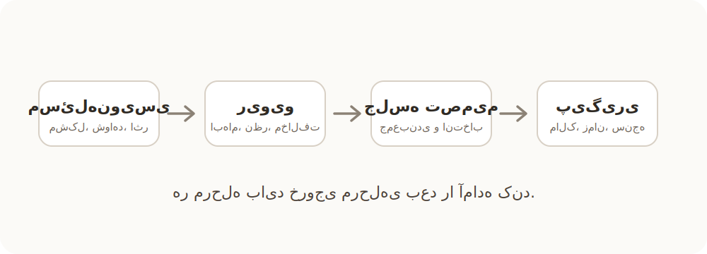

## اول بنویسیم، بعد ریویو کنیم، بعد جلسه بگذاریم

پیشنهادم لزوماً پست‌مورتم نیست. پست‌مورتم فقط یکی از قالب‌هاست. حرف اصلی این است که برای مسئله‌های مهم، قبل از جلسه باید یک متن کوتاه داشته باشیم.

این متن قرار نیست سند سنگین یا رسمی باشد. قرار است کمک کند جلسه از نقطه صفر شروع نشود. کسی که مسئله را دیده، اول باید مسئله را تا حدی صورت‌بندی کند که بقیه بتوانند قبل از جلسه درباره‌اش فکر کنند.

یک قالب ساده می‌تواند این باشد:

- مسئله دقیقاً چیست؟
- از کجا فهمیده‌ایم این مسئله وجود دارد؟
- اثرش روی کار، کیفیت، سرعت یا تصمیم‌های تیم چیست؟
- یک یا دو نمونه‌ی واقعی از آن داریم؟
- چه گزینه‌هایی برای حل یا کاهش مسئله وجود دارد؟
- پیشنهاد اولیه چیست؟
- کجا نیاز به تصمیم یا توافق تیم داریم؟

بعد از نوشتن، بقیه متن را ریویو کنند. یعنی ابهام‌ها را بپرسند، شواهد را کامل کنند، با راهکار مخالفت کنند، گزینه‌ی جدید پیشنهاد بدهند یا بگویند مسئله از نظر آن‌ها جای دیگری است.

اگر بعد از این ریویو هنوز نیاز به گفت‌وگوی هم‌زمان داشتیم، جلسه می‌گذاریم. اما آن جلسه دیگر برای کشف اولیه‌ی مسئله نیست؛ برای تصمیم‌گیری، جمع‌بندی و مشخص کردن قدم بعدی است.

:::tip[اصل پیشنهادی]
هر چیزی که قبل از جلسه می‌شود نوشت، نباید در جلسه کشف شود.
:::
