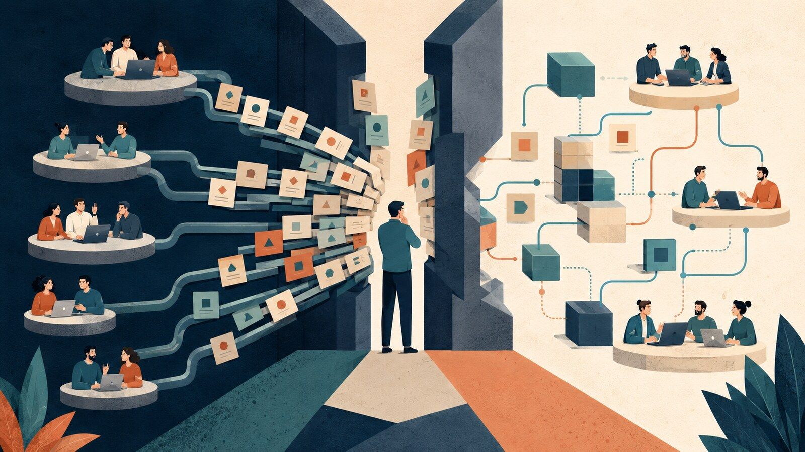

اگر برای انتخاب یک کتابخانه، تغییر مرز یک سرویس یا اضافه‌کردن یک وابستگی تازه باید منتظر تأیید یک نفر بمانیم، احتمالاً با یک معمار قدرتمند طرف نیستیم؛ با یک گلوگاه طرفیم.

گلوگاهی که شاید خودش هم آن را نساخته باشد. سازمان از او خواسته مراقب انسجام معماری باشد، تیم‌ها هم عادت کرده‌اند تصمیم‌های سخت را به او بسپارند. نتیجه این می‌شود که همه‌چیز از یک نفر عبور می‌کند؛ تصمیم‌ها کند می‌شوند، صف مشورت طولانی‌تر می‌شود و تیم‌ها کم‌کم توان تصمیم‌گرفتن را از دست می‌دهند.

{/* truncate */}

:::info[مشخصات سخنرانی]

**عنوان:** Facilitating Software Architecture: Empowering Teams to Make Architectural Decisions  
**سخنرانان:** اندرو هارمل‌لا (Andrew Harmel-Law) و سونیا ناتانزون (Sonya Natanzon)  
**مجموعه:** GOTO Book Club، دسامبر ۲۰۲۴  
**ویدئو:** [تماشای سخنرانی در یوتیوب](https://www.youtube.com/watch?v=YpFR8qzwYSA)

:::

## وقتی معمار، خودش جلوی معماری را می‌گیرد

یکی از صادقانه‌ترین بخش‌های این گفت‌وگو جایی است که اندرو هارمل‌لا از تجربه‌ی خودش می‌گوید. او متوجه شده بود کاری که سال‌ها به‌عنوان وظیفه‌ی معمار انجام می‌داد، دیگر همیشه به تیم کمک نمی‌کند؛ گاهی خودش دارد سرعت تیم را پایین می‌آورد.

این اتفاق عجیب نیست. معمولاً معمار کسی است که تجربه‌ی بیشتری دارد، تصویر بزرگ‌تری از سیستم می‌بیند و باید حواسش به تصمیم‌هایی باشد که اثرشان چند ماه یا چند سال بعد معلوم می‌شود. طبیعی است که سازمان بخواهد تصمیم‌های مهم از مسیر او بگذرند.

مشکل از جایی شروع می‌شود که «دیدن تصویر بزرگ» آرام‌آرام به «تصمیم‌گرفتن درباره‌ی همه‌چیز» تبدیل می‌شود.

تیم برای هر تغییر منتظر معمار می‌ماند. معمار هم برای اینکه چیزی از کنترل خارج نشود، تصمیم‌های بیشتری را خودش نگه می‌دارد. هرچه تصمیم‌ها بیشتر متمرکز می‌شوند، تیم کمتر تمرین می‌کند و هرچه تیم کمتر تمرین می‌کند، اعتماد معمار به تصمیم‌های آن کمتر می‌شود. یک چرخه شکل می‌گیرد که در آن همه از کندی ناراضی‌اند، اما رفتارشان همان کندی را بازتولید می‌کند.

:::caution[گلوگاه‌ها همیشه آدم‌های کنترل‌گر نیستند]

گاهی گلوگاه‌شدن نتیجه‌ی مسئولیت‌پذیری زیاد است. کسی می‌خواهد از سیستم محافظت کند، پس تصمیم‌های بیشتری را روی میز خودش نگه می‌دارد. نیت خوب است؛ اما نتیجه می‌تواند تیمی باشد که بدون حضور او نمی‌تواند جلو برود.

:::

## قرار نیست تصمیم‌ها را رها کنیم

جایگزینی که هارمل‌لا پیشنهاد می‌کند، کنارکشیدن معمار و رهاکردن تیم‌ها نیست. حرفش این نیست که هرکس هر تصمیمی خواست بگیرد و بعد اسمش را استقلال بگذارد. ایده‌ی اصلی، «فرایند مشورت» (Advice Process) است.

در این مدل، هرکسی می‌تواند یک تصمیم معماری بگیرد؛ به شرطی که قبل از تصمیم با دو گروه مشورت کند:

1. کسانی که درباره‌ی موضوع تجربه و دانش دارند.
2. کسانی که از نتیجه‌ی تصمیم تأثیر می‌گیرند.

تصمیم‌گیرنده مجبور نیست نظر همه را اجرا کند و قرار هم نیست برای رسیدن به اجماع بی‌پایان صبر کند. اما باید نظرهای مرتبط را بشنود، بده‌بستان‌ها را بفهمد و مسئولیت تصمیمش را بپذیرد.

این تفاوت مهمی با تأییدگرفتن دارد. در مدل تأیید، اختیار هنوز دست یک نفر است و تیم فقط درخواست می‌دهد. در فرایند مشورت، اختیار دست کسی است که به مسئله نزدیک‌تر است؛ اما تصمیم او از گفت‌وگو و دانش جمعی عبور می‌کند.

> مشورت یعنی قبل از تصمیم، آدم‌های درست را وارد گفت‌وگو کنیم؛ نه اینکه تصمیم را به رأی‌گیری عمومی بگذاریم.

## پس معمار دقیقاً چه‌کار می‌کند؟

وقتی قرار نیست معمار همه‌ی تصمیم‌ها را خودش بگیرد، ممکن است به نظر برسد نقشش کم‌رنگ شده است. اتفاقاً برعکس؛ کارش سخت‌تر و مهم‌تر می‌شود.

معمار باید کمک کند مسئله درست صورت‌بندی شود، آدم‌های مرتبط یکدیگر را پیدا کنند، بده‌بستان‌های تصمیم دیده شوند و نتیجه جایی ثبت شود که نفر بعدی مجبور نباشد همان بحث را از صفر شروع کند. ثبت تصمیم معماری (ADR) در اینجا حکم فرم اداری ندارد؛ حافظه‌ی گفت‌وگوست: چه تصمیمی گرفتیم، چرا گرفتیم و چه گزینه‌هایی را کنار گذاشتیم.

در این مدل، ارزش معمار از تعداد تصمیم‌هایی که امضا می‌کند نمی‌آید. ارزشش از کیفیت تصمیم‌هایی می‌آید که حتی بدون حضور مستقیم او در سراسر تیم گرفته می‌شوند.

:::tip[معمار به‌عنوان تسهیل‌کننده]

کار معمار این نیست که جواب همه‌ی سؤال‌ها را بداند. باید کمک کند سؤال درست پرسیده شود، آدم‌های درست با هم حرف بزنند و تصمیم در جای درستی گرفته شود.

:::

## اعتماد، بخش سخت ماجراست

چیزی که توی این گفت‌وگو برای من ارزشمند بود، این بود که تصمیم‌گیری توزیع‌شده را فقط یک فرایند یا تکنیک معرفی نمی‌کرد. هارمل‌لا بارها به اعتماد برمی‌گردد. اگر اعتماد واقعی وجود نداشته باشد، فرایند مشورت خیلی زود تبدیل می‌شود به همان تأییدگرفتن قبلی با یک اسم تازه.

تیم باید مطمئن باشد اگر با اطلاعات فعلی تصمیمی منطقی گرفت و نتیجه کامل نبود، قرار نیست تنبیه شود. معمار هم باید بپذیرد که بعضی تصمیم‌ها دقیقاً همان چیزی نخواهند بود که خودش انتخاب می‌کرد. استقلالی که فقط تا زمان اولین اشتباه دوام داشته باشد، استقلال نیست.

امنیت روانی در اینجا یک شعار منابع انسانی نیست؛ بخشی از معماری است. اگر آدم‌ها از مطرح‌کردن تردید، مخالفت یا اشتباه بترسند، اطلاعات مهم وارد تصمیم نمی‌شود. تصمیم ظاهراً سریع گرفته می‌شود، اما بخشی از واقعیت سیستم پشت سکوت آدم‌ها پنهان می‌ماند.

## جایی که با سخنرانی فاصله می‌گیرم

با اصل حرف موافقم، ولی فکر می‌کنم اجرای آن در همه‌ی سازمان‌ها به یک اندازه ساده نیست. تیمی که تجربه‌ی کمی دارد، مرزهای سیستم را نمی‌شناسد یا مدام اعضایش عوض می‌شوند، ممکن است هنوز برای بعضی تصمیم‌ها به راهنمایی نزدیک‌تری نیاز داشته باشد. از طرف دیگر، تصمیم‌هایی مثل امنیت، حریم خصوصی یا تغییرهای برگشت‌ناپذیر داده را نمی‌شود فقط با امید به مشورت خوب جلو برد.

پس توزیع تصمیم به معنای یکسان‌کردن همه‌ی تصمیم‌ها نیست. می‌شود درباره‌ی سطح اختیار شفاف بود: کدام تصمیم‌ها محلی و برگشت‌پذیرند، کدام‌ها چند تیم را درگیر می‌کنند و کدام‌ها به‌خاطر ریسک بالا به بررسی دقیق‌تری نیاز دارند.

به نظرم نکته‌ی اصلی این نیست که «معمار تصمیم نگیرد». نکته این است که معمار نباید مالک پیش‌فرض همه‌ی تصمیم‌ها باشد. اگر هر تصمیمی، مستقل از اندازه و ریسکش، باید از یک میز عبور کند، آن میز دیر یا زود به گلوگاه تبدیل می‌شود.

:::note[یک معیار ساده]

اگر نبودن یک نفر تصمیم‌های معماری تیم را متوقف می‌کند، احتمالاً دانش و اختیار را به‌اندازه‌ی کافی پخش نکرده‌ایم.

:::

منابع

- [ویدئوی گفت‌وگو در یوتیوب](https://www.youtube.com/watch?v=YpFR8qzwYSA)
- [متن و مشخصات گفت‌وگو در GOTO](https://gotopia.tech/episodes/348/facilitating-software-architecture-empowering-teams-to-make-architectural-decisions)
- [Breaking the Architecture Bottleneck](https://gotopia.tech/sessions/3891/breaking-the-architecture-bottleneck)
- [منابع تکمیلی کتاب Facilitating Software Architecture](https://facilitatingsoftwarearchitecture.com/supportingmaterial/)

---

این مطلب، بخشی از تمرینهای درس معماری نرم‌افزار در دانشگاه شهیدبهشتی است
