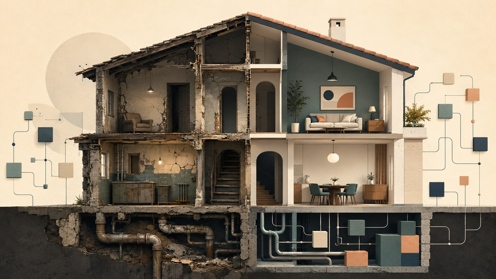

فرض کنید خانه‌ای قدیمی داریم. مبلمانش را عوض می‌کنیم، پرده‌های تازه می‌خریم و دیوارها را رنگ می‌زنیم. چند روز اول همه‌چیز نو و دل‌نشین به نظر می‌رسد؛ اما هنوز نقشهٔ خانه بد است، لوله‌کشی فرسوده است و اتاق‌ها آن‌طور که باید به کار نمی‌آیند.

آیا می‌توانیم بگوییم خانه را نوسازی کرده‌ایم؟

خیلی از تیم‌ها با نرم‌افزارشان همین کار را می‌کنند. فناوری تازه می‌آورند، سامانه را به ریزخدمت‌ها تقسیم می‌کنند یا زیرساخت را به فضای ابری می‌برند؛ اما مرزهای بد، فرایندهای پیچیده و وابستگی میان تیم‌ها را دست‌نخورده باقی می‌گذارند. ظاهر معماری عوض می‌شود، ولی دردهای قدیمی سر جایشان می‌مانند.

{/* truncate */}

## ماه‌های اول همیشه امیدوارکننده‌اند

این داستان برای خیلی از تیم‌های فرانت‌اند آشناست. پروژه چند سال با Vue جلو رفته و حالا تغییر در آن سخت شده است. کامپوننت‌ها بزرگ‌اند، مدیریت وضعیت در چند جا پخش شده، وابستگی‌ها درست معلوم نیستند و یک تغییر کوچک ممکن است چند گوشهٔ دور از هم را درگیر کند.

در چنین وضعی یک پیشنهاد جذاب مطرح می‌شود:

> بیایید همه‌چیز را با React بازنویسی کنیم.

پروژهٔ تازه شروع می‌شود و ماه‌های اول واقعاً لذت‌بخش‌اند. هنوز کد زیادی وجود ندارد، اسم‌ها مرتب‌اند، وابستگی‌ها کم‌اند و تیم فرصت دارد اشتباه‌های نسخهٔ قبلی را تکرار نکند. سرعت توسعه بالا می‌رود و کم‌کم این تصور شکل می‌گیرد که مشکل از Vue بوده است.

اما محصول رشد می‌کند. حالت‌های خاص بیشتر می‌شوند، فشار تحویل بالا می‌رود و تصمیم‌های موقت یکی‌یکی وارد کد می‌شوند. چند کتابخانه برای مدیریت وضعیت، فرم، درخواست‌های شبکه و مسیریابی اضافه می‌شود. مرز کامپوننت‌ها آرام‌آرام مبهم می‌شود و منطق کسب‌وکار دوباره میان رابط کاربری، هوک‌ها و سرویس‌ها پخش می‌شود.

چند سال بعد همان جمله را با نام دیگری می‌شنویم:

> React دیگر برای این پروژه مناسب نیست؛ بهتر است به Angular مهاجرت کنیم تا ساختار مشخص‌تری داشته باشیم.

بازنویسی دیگری آغاز می‌شود و برای مدتی همه‌چیز دوباره مرتب به نظر می‌رسد؛ نه لزوماً چون Angular مسئله را حل کرده، بلکه چون سامانه هنوز کوچک است و فرصت نکرده پیچیدگی واقعی محصول را در خودش جمع کند.

:::caution[چارچوب تازه، ماه‌عسل تازه]

روزهای اول یک بازنویسی معمولاً منصفانه با سال‌های آخر سامانهٔ قبلی مقایسه نمی‌شوند. یک طرف، پروژه‌ای کوچک و تمیز است؛ طرف دیگر، محصولی است که سال‌ها تصمیم، استثنا، فشار و بدهی را با خودش حمل می‌کند.

:::

حرف این نیست که Vue، React و Angular فرقی ندارند. هرکدام مدل ذهنی، محدودیت و نقطهٔ قوت خودشان را دارند. مسئله این است که چارچوب نمی‌تواند جای معماری را بگیرد. اگر تیم دربارهٔ مرز مسئولیت‌ها، محل منطق کسب‌وکار، مدیریت وابستگی‌ها و شیوهٔ تغییر سامانه تصمیم روشنی نداشته باشد، همان آشفتگی را با نحو و ابزار تازه‌ای بازسازی می‌کند.

تعویض چارچوب در این وضعیت شبیه عوض‌کردن وسایل خانه است: چند ماه اول همه‌چیز تازه و مرتب است؛ اما اگر نقشهٔ خانه تغییری نکرده باشد، مشکلات قدیمی بالاخره راهشان را به فضای تازه پیدا می‌کنند.

سخنرانی نیک تیون دقیقاً از همین خطا شروع می‌کند: نوسازی معماری را نباید با بازسازی سامانه به کمک فناوری‌های تازه یکی دانست.

:::info[مشخصات سخنرانی]

**عنوان:** Architecture Modernization: Aligning Software, Strategy & Structure  
**سخنران:** نیک تیون (Nick Tune)  
**رویداد:** GOTO Amsterdam 2024  
**ویدئو:** [تماشای سخنرانی در یوتیوب](https://www.youtube.com/watch?v=DwAI2NqscMo)

:::

  <iframe
    src="https://www.youtube-nocookie.com/embed/DwAI2NqscMo"
    title="Architecture Modernization: Aligning Software, Strategy & Structure"
    style={{position: 'absolute', top: 0, right: 0, width: '100%', height: '100%', border: 0}}
    allow="accelerometer; autoplay; clipboard-write; encrypted-media; gyroscope; picture-in-picture; web-share"
    allowFullScreen
  />

## نوسازی معماری از کجا آغاز می‌شود؟

نیک تیون از همان ابتدا بحث را از سطح ابزار بالاتر می‌برد: معماری قدیمی فقط دردسر تیم فنی نیست؛ می‌تواند به خطری برای خود کسب‌وکار تبدیل شود. وقتی تغییر در سامانه سخت است، قابلیت‌های تازه دیرتر به دست کاربر می‌رسند و سازمان در برابر نیازهای جدید کندتر واکنش نشان می‌دهد.

واکنش وسوسه‌کننده این است که سراغ فناوری جدید برویم: زبان را عوض کنیم، سامانهٔ یکپارچه را بشکنیم یا همه‌چیز را به فضای ابری ببریم. این تغییرها گاهی کاملاً لازم‌اند؛ اما به‌تنهایی نوسازی نیستند. اگر همان قابلیت‌ها، فرایندها و مرزهای قبلی را با فناوری تازه بازسازی کنیم، فقط برای ساخت دوبارهٔ همان سامانهٔ قدیمی پول بیشتری خرج کرده‌ایم.

از نگاه تیون، نوسازی فرصتی برای بازاندیشی در کل سامانه است؛ از تجربهٔ کاربر و قابلیت‌های محصول گرفته تا فرایندهای کسب‌وکار، مدل دامنه، ساختار تیم‌ها و معماری نرم‌افزار. بنابراین پرسش اصلی نباید این باشد:

> سامانه را با چه فناوری تازه‌ای بازنویسی کنیم؟

پرسش مهم‌تر این است:

> کدام بخش‌های سامانه هنوز برای کسب‌وکار ارزشمندند و چه چیزهایی باید از اساس تغییر کنند؟

## معماری، محصول و سازمان از هم جدا نیستند

یکی از حرف‌های مهم سخنرانی این است که راهبرد کسب‌وکار، جهت محصول، مرزهای دامنه، ساختار تیم‌ها و معماری نرم‌افزار پنج جهان جدا نیستند. بااین‌حال، در خیلی از سازمان‌ها همین‌طور با آن‌ها رفتار می‌شود: مدیران دربارهٔ راهبرد تصمیم می‌گیرند، تیم محصول قابلیت‌ها را تعریف می‌کند و تیم فنی دربارهٔ سرویس‌ها و فناوری‌ها تصمیم می‌گیرد.

حاصل این جدایی ممکن است معماری‌ای باشد که از نظر فنی منظم به نظر می‌رسد، اما با نیاز واقعی کسب‌وکار تناسب ندارد.

برای نمونه، اگر چند تیم برای ایجاد یک تغییر ساده مجبور باشند هم‌زمان بخش‌های مختلف سامانه را اصلاح کنند، مشکل فقط در کد نیست. احتمال دارد مرز مسئولیت تیم‌ها و مرز اجزای نرم‌افزار درست تعریف نشده باشد. در این وضعیت، تبدیل سامانه به ریزخدمت‌ها الزاماً استقلال ایجاد نمی‌کند؛ فقط وابستگی‌های قبلی را از فراخوانی‌های درون برنامه به ارتباطات شبکه‌ای منتقل می‌کند.

:::caution[ریزخدمت، به‌خودی‌خود استقلال نمی‌سازد]

اگر مرز سرویس‌ها با مرز قابلیت‌های کسب‌وکار و مالکیت تیم‌ها هماهنگ نباشد، نتیجه ممکن است یک سامانهٔ یکپارچهٔ توزیع‌شده باشد: اجزای زیادی که جدا استقرار می‌یابند، اما برای هر تغییر همچنان به یکدیگر وابسته‌اند.

:::

## قبل از بازنویسی، پیچیدگی را کم کنیم

یک دام دیگر هم وجود دارد: فرض می‌کنیم هر چیزی که در سامانهٔ قدیمی هست، حتماً باید در نسخهٔ تازه هم ساخته شود. درحالی‌که بعضی قابلیت‌ها دیگر استفاده نمی‌شوند، بعضی فرایندها یادگار محدودیت‌های گذشته‌اند و بخشی از پیچیدگی فقط در طول زمان ته‌نشین شده است.

اگر این موارد را بدون ارزیابی به معماری تازه منتقل کنیم، پیچیدگی قدیمی را با ابزارهای جدید بازتولید کرده‌ایم. بنابراین نوسازی باید با شناخت سبد سامانه‌ها و قابلیت‌های کسب‌وکار همراه باشد: چه چیزی باید حفظ شود، چه چیزی باید ساده شود، چه چیزی باید تغییر کند و چه چیزی را می‌توان کنار گذاشت.

این نگاه، نوسازی را از یک پروژهٔ بازنویسی به یک تصمیم راهبردی تبدیل می‌کند. هدف دیگر تحویل نسخه‌ای تازه از همان سامانه نیست؛ هدف کاهش هزینهٔ تغییر و ایجاد ظرفیت برای حرکت‌های بعدی کسب‌وکار است.

## برداشت من از سخنرانی

چیزی که این سخنرانی را برای من ارزشمند می‌کند، بیرون‌آوردن نوسازی از ویترین فناوری است. فضای ابری، ریزخدمت و معماری رویدادمحور جذاب‌اند و گاهی واقعاً انتخاب درستی هستند؛ اما مدرن‌بودن معماری از روی فهرست ابزارها مشخص نمی‌شود. معیار مهم‌تر این است که سامانه و سازمان چقدر خوب می‌توانند تغییر کنند.

البته حرف تیون روی کاغذ ساده‌تر از اجراست. هماهنگ‌کردن راهبرد، محصول، ساختار تیم‌ها و معماری به مشارکت چند بخش سازمان نیاز دارد. تیم فنی به‌تنهایی نمی‌تواند مرزهای کسب‌وکار یا مسئولیت تیم‌ها را تغییر دهد. اگر نوسازی فقط یک پروژهٔ فنی باشد، حتی طراحی خوب هم ممکن است در همان ساختار قدیمی سازمان گیر کند.

به نظرم پیش از آغاز هر برنامهٔ نوسازی باید دست‌کم سه پرسش پاسخ داده شود:

1. کدام مسئلهٔ کسب‌وکار قرار است حل شود؟
2. کدام بخش‌های سامانه واقعاً مانع تغییر هستند؟
3. آیا ساختار و مالکیت تیم‌ها با معماری موردنظر هماهنگ است؟

بدون پاسخ روشن به این پرسش‌ها، انتخاب فناوری بیشتر شبیه خرید وسایل تازه برای همان خانهٔ قدیمی است.

:::tip[خلاصهٔ حرف]

نوسازی واقعی زمانی اتفاق می‌افتد که سامانه برای نیازهای امروز کسب‌وکار مناسب‌تر و تغییر آن کم‌هزینه‌تر شود؛ نه زمانی که فقط ظاهر فناوری تازه‌ای پیدا کند.

:::

منابع

- [ویدئوی سخنرانی در یوتیوب](https://www.youtube.com/watch?v=DwAI2NqscMo)
- [صفحهٔ رسمی سخنرانی در وب‌سایت GOTO](https://gotopia.tech/sessions/3173/architecture-modernization-aligning-software-strategy-and-structure)
- [Farewell, AngularJS: A Study in UI Legacy Migrations](https://www.thoughtworks.com/en-us/insights/articles/farewell-angularjs)
- [Modularizing React Applications with Established UI Patterns](https://martinfowler.com/articles/modularizing-react-apps.html)

---

این مطلب، بخشی از تمرینهای درس معماری نرم‌افزار در دانشگاه شهیدبهشتی است
