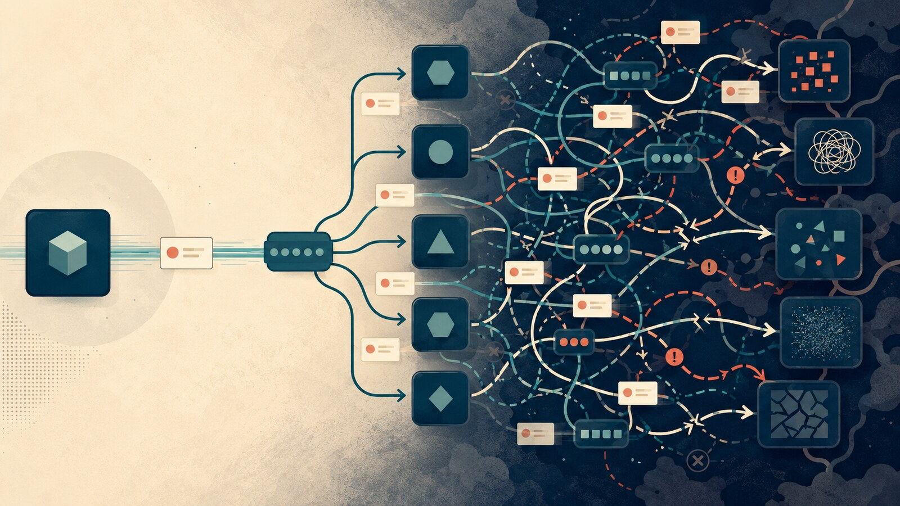
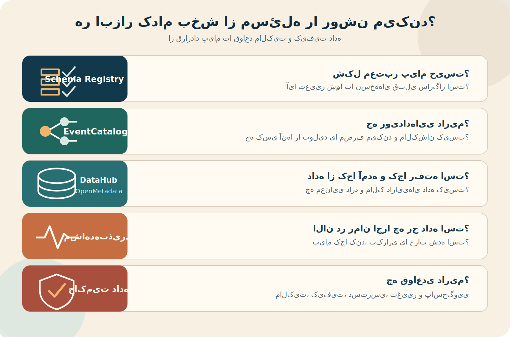

اولش همه‌چیز ساده بود. یک سرویس رویدادی منتشر می‌کرد و یک مصرف‌کننده هم آن را می‌خواند. تولیدکننده لازم نبود مصرف‌کننده را بشناسد، اگر مصرف‌کننده برای مدتی از دسترس خارج می‌شد پیام از بین نمی‌رفت و هر دو طرف می‌توانستند با سرعت خودشان جلو بروند.

همان چیزی بود که از معماری رویدادمحور می‌خواستیم: وابستگی کمتر و استقلال بیشتر.

بعد مصرف‌کننده‌ی دوم اضافه شد. بعدی برای گزارش، یکی برای اعلان، یکی برای ضدتقلب و یکی هم برای ساختن داده‌های تحلیلی. چند نسخه از رویداد شکل گرفت، بعضی مصرف‌کننده‌ها عقب ماندند و یک تغییر کوچک در قرارداد، جایی دورتر از تولیدکننده را شکست.

قرار بود سرویس‌ها مستقل شوند؛ اما حالا وابستگی‌ها فقط از جلوی چشممان ناپدید شده بودند.

{/* truncate */}

:::info[مشخصات سخنرانی]

**عنوان:** Complexity Is the Gotcha of Event-Driven Architecture  
**سخنران:** دیوید بوین (David Boyne)  
**رویداد:** GOTO EDA Day London 2024  
**ویدئو:** [تماشای سخنرانی در یوتیوب](https://www.youtube.com/watch?v=gjPdHVMNfb0)

:::

## استقلالی که ارزان به دست نمی‌آید

من قبلاً در نوشته‌ی [«نه به معماری نمایشی»](/blog/software-engineering-growth-story) درباره‌ی معماری رویدادمحور و صف پیام نوشته بودم. آنجا مسئله این بود که چه زمانی انتشار رویداد می‌تواند وابستگی مستقیم میان سرویس‌ها را کمتر کند و چه هزینه‌هایی مثل پیام تکراری، ترتیب، تلاش مجدد و عقب‌ماندن مصرف‌کننده را وارد سیستم می‌کند.

سخنرانی دیوید بوین از جایی شروع می‌شود که آن معرفی معمولاً تمام می‌شود: وقتی معماری رویدادمحور جواب داده، رشد کرده و حالا تعداد رویدادها، تولیدکننده‌ها و مصرف‌کننده‌ها آن‌قدر زیاد شده که دیگر تصویر روشنی از کل سیستم نداریم.

حرف اصلی او این است که معماری رویدادمحور می‌تواند به تیم‌ها استقلال بدهد و تغییر سیستم را آسان‌تر کند؛ اما همین استقلال، اگر بدون مرز و حاکمیت رشد کند، پیچیدگی را پنهان می‌کند. در ارتباط مستقیم، تولیدکننده معمولاً می‌داند چه کسی را صدا می‌زند. در مدل رویدادمحور، تولیدکننده رویداد را منتشر می‌کند و ممکن است نداند چند مصرف‌کننده، با چه انتظاری و در کدام مسیر کسب‌وکار به آن وابسته‌اند.

وابستگی حذف نشده است؛ فقط از وابستگی زمانی و مستقیم به وابستگی قراردادی و رفتاری تبدیل شده است.

> رویدادمحوری سرویس‌ها را از دانستن مکان و زمان اجرای یکدیگر آزاد می‌کند؛ نه از نیاز به یک قرارداد قابل اعتماد.

## تجربه‌ای که با Kafka برایم تکرار شد

توی کار با Kafka، روزهای اول معمولاً جذاب‌اند. یک موضوع ساخته می‌شود، تولیدکننده پیام می‌فرستد و مصرف‌کننده داده را می‌گیرد. نمودار معماری هم تمیز است: یک فلش از تولیدکننده به Kafka و یک فلش از Kafka به مصرف‌کننده.

اما سیستم واقعی خیلی زود از آن نمودار جلو می‌زند. یک تیم برای نیاز خودش مصرف‌کننده‌ی تازه‌ای می‌سازد. تیم دیگری همان داده را با چند فیلد اضافه می‌خواهد. یک مصرف‌کننده معنای یک فیلد را با چیزی که تولیدکننده در ذهن داشته متفاوت می‌فهمد. بعد از مدتی دیگر سؤال فقط این نیست که «این پیام کجا می‌رود؟»؛ سؤال‌های سخت‌تری شکل می‌گیرند:

- چه کسانی این رویداد را مصرف می‌کنند؟
- کدام فیلد برای کدام مصرف‌کننده حیاتی است؟
- اگر قرارداد تغییر کند، چه چیزی می‌شکند؟
- اگر پیام دوبار برسد، نتیجه دوبار اعمال می‌شود؟
- اگر مصرف‌کننده سه ساعت عقب باشد، داده‌ی خروجی هنوز قابل اعتماد است؟
- مالک اصلاح داده‌ای که نصفه پردازش شده چه کسی است؟

من اینجا یک اشتباه تکرارشونده دیده‌ام: چون تولیدکننده و مصرف‌کننده در کد مستقیماً به هم وصل نیستند، تصور می‌کنیم به هم وابسته نیستند. اما کافی است یک فیلد حذف شود، معنای یک وضعیت تغییر کند یا ترتیب پیام‌ها به هم بخورد تا وابستگی پنهان خودش را نشان دهد.

:::caution[فلش حذف شده، وابستگی نه]

نبودن فراخوانی مستقیم در کد به معنی نبودن وابستگی نیست. قرارداد رویداد، معنای داده، ترتیب، زمان رسیدن و تضمین تحویل، همگی شکل‌هایی از وابستگی‌اند.

:::

## وقتی کسی نمی‌داند چه کسی گوش می‌دهد

یکی از پیچیدگی‌های اصلی، کشف مصرف‌کننده‌هاست. اگر رویدادی مثل `OrderCreated` پنج مصرف‌کننده داشته باشد، تغییر آن دیگر یک تصمیم محلی در تیم سفارش نیست. بااین‌حال، در خیلی از سیستم‌ها فهرست قابل اعتمادی از مصرف‌کننده‌ها، مالک آن‌ها و انتظاری که از قرارداد دارند وجود ندارد.

در نتیجه، تیم تولیدکننده یا از ترس شکستن مصرف‌کننده‌های ناشناخته هیچ‌چیز را تغییر نمی‌دهد، یا تغییر را انجام می‌دهد و منتظر می‌ماند تا خطا از جایی دیگر گزارش شود. اولی سرعت تغییر را می‌گیرد و دومی اعتماد به سیستم را.

بوین روی مستندسازی و فهرست‌کردن رویدادها، قراردادها، تولیدکننده‌ها و مصرف‌کننده‌ها تأکید می‌کند. این کار قرار نیست یک دانشنامه‌ی سنگین و بی‌صاحب بسازد. هدف این است که وابستگی‌هایی که در زمان اجرا پخش شده‌اند، دوباره برای آدم‌ها قابل دیدن شوند.

:::tip[حداقل چیزی که باید از یک رویداد بدانیم]

- چه کسی آن را تولید می‌کند؟
- چه اتفاقی در دامنه را بیان می‌کند؟
- قرارداد و نسخه‌ی آن کجاست؟
- چه کسانی آن را مصرف می‌کنند؟
- مالک پاسخ‌گویی به تغییر و خرابی آن کیست؟

:::

## مالک کد، مالک داده و مالک رویداد یکی نیستند

اینجا یک ابهام رایج وجود دارد. وقتی می‌گوییم «این تیم مالک این سرویس است»، دقیقاً مالک چه چیزی است؟ مخزن کد؟ داده‌ای که سرویس نگه می‌دارد؟ رویدادی که منتشر می‌کند؟ یا زیرساختی که پیام را جابه‌جا می‌کند؟ این‌ها به هم نزدیک‌اند، اما یکی نیستند.

**مالکیت کد** یعنی یک فرد یا تیم مسئول سلامت و تغییرپذیری بخشی از کدبیس است. می‌داند این کد چرا وجود دارد، تغییرهای مهمش را بازبینی می‌کند، برای خطاهایش پاسخ‌گوست و اجازه نمی‌دهد بخش بدون نگه‌دارنده بماند. سازوکارهایی مثل فایل [`CODEOWNERS`](https://docs.github.com/repositories/managing-your-repositorys-settings-and-features/customizing-your-repository/about-code-owners) در GitHub کمک می‌کنند برای مسیرهای مختلف مخزن، افراد یا تیم‌های مسئول مشخص شوند.

اما مالک کد بودن به معنی این نیست که فقط همان تیم اجازه دارد کد را تغییر دهد یا نظرش همیشه برنده است. مالکیت بیشتر از جنس پاسخ‌گویی و نگه‌داری زمینه است، نه حصارکشیدن دور مخزن.

**مالکیت داده** یک قدم متفاوت است. مالک داده باید درباره‌ی معنا، کیفیت، دسترسی و چرخه‌ی عمر داده پاسخ بدهد. مثلاً اگر فیلد `status` در رویداد سفارش وجود دارد، مالک داده باید بتواند بگوید هر وضعیت دقیقاً چه معنایی دارد، چه زمانی تغییر می‌کند، چه محدودیت‌هایی دارد و اگر داده نادرست شد چطور باید اصلاح شود.

ممکن است تیم پلتفرم Kafka را اجرا کند و تیم داده پیام‌ها را وارد دریاچه‌ی داده کند، اما هیچ‌کدام لزوماً مالک معنای «سفارش تکمیل‌شده» نیستند. این معنا معمولاً باید پیش تیمی بماند که دامنه‌ی سفارش را می‌شناسد. یکی از ایده‌های اصلی [داده‌مش](https://martinfowler.com/articles/data-mesh-principles.html) هم همین مالکیت دامنه‌محور داده است: داده از تیمی که معنای کسب‌وکاری آن را می‌فهمد جدا نشود و فقط به یک تیم مرکزی داده سپرده نشود.

**مالکیت رویداد یا قرارداد** بین این دو قرار می‌گیرد. تیم تولیدکننده باید مالک نام، معنا، شِما و مسیر تکامل رویداد باشد. حذف فیلد، تغییر معنا یا انتشار نسخه‌ی ناسازگار فقط تغییر چند خط کد نیست؛ تغییر یک قرارداد عمومی است. در مقابل، هر مصرف‌کننده مالک شیوه‌ی واکنش خودش است: تحمل پیام تکراری، عقب‌ماندن، خطا، بازپردازش و سازگاری با نسخه‌های پشتیبانی‌شده.

| نوع مالکیت | پرسش اصلی | مسئولیت‌های اصلی |
|---|---|---|
| مالکیت کد | چه کسی این بخش را تغییرپذیر و قابل نگه‌داری نگه می‌دارد؟ | بازبینی تغییر، نگه‌داری زمینه، آزمون و پاسخ‌گویی به خطا |
| مالکیت داده | چه کسی معنای داده و کیفیت آن را تضمین می‌کند؟ | تعریف معنا، کیفیت، دسترسی، نگه‌داری و اصلاح داده |
| مالکیت رویداد | چه کسی قرارداد عمومی میان تولیدکننده و مصرف‌کننده‌ها را نگه می‌دارد؟ | شِما، نسخه‌بندی، سازگاری و اعلام تغییر |
| مالکیت زیرساخت | چه کسی بستر انتقال را پایدار نگه می‌دارد؟ | بروکر، ظرفیت، امنیت، پشتیبان‌گیری و پایش زیرساخت |

مشکل وقتی شروع می‌شود که همه فکر می‌کنند دیگری مالک است. تیم سرویس می‌گوید پیام را منتشر کرده و کارش تمام است. تیم پلتفرم می‌گوید Kafka سالم است و مسئول محتوای پیام نیست. تیم داده هم می‌گوید فقط چیزی را ذخیره کرده که دریافت کرده است. در این میان، اگر مبلغ سفارش اشتباه باشد یا معنای یک وضعیت بی‌خبر تغییر کند، هیچ‌کس خودش را مسئول نمی‌داند.

> داده‌ی بی‌مالک معمولاً داده‌ی بی‌استفاده نیست؛ بدتر است، داده‌ای است که استفاده می‌شود اما کسی کیفیت و معنایش را تضمین نمی‌کند.

برای هر رویداد بهتر است دست‌کم یک تیم مالک مشخص باشد، نه فقط نام یک فرد. آدم‌ها جابه‌جا می‌شوند و مرخصی می‌روند، اما مسئولیت باید در تیم زنده بماند. همچنین مالکیت باید همراه اختیار باشد. نمی‌شود تیمی را مسئول کیفیت قرارداد دانست، اما اجازه‌ی اصلاح شِما، متوقف‌کردن تولید ناسازگار یا تعیین مسیر مهاجرت را از آن گرفت.

مالکیت خوب جلوی مشارکت بقیه را نمی‌گیرد؛ نقطه‌ی پاسخ‌گویی می‌سازد. همه می‌توانند پیشنهاد بدهند و تغییر ایجاد کنند، اما معلوم است چه کسی باید اثر تغییر را بفهمد، مصرف‌کننده‌ها را پیدا کند و تا پایان مهاجرت کنار موضوع بماند.

## ابزار مالکیت نمی‌سازد، اما آن را قابل دیدن می‌کند

وقتی تعداد جدول‌ها، تاپیک‌ها، پایپ‌لاین‌ها و داشبوردها زیاد می‌شود، نگه‌داشتن همه‌ی این روابط در ذهن آدم‌ها یا چند صفحه‌ی پراکنده دیگر جواب نمی‌دهد. اینجا ابزارهایی مثل [DataHub](https://docs.datahub.com/docs/features)، OpenMetadata یا ابزارهای تخصصی‌تری مثل EventCatalog می‌توانند کمک کنند.

DataHub در اصل یک کاتالوگ فراداده است. می‌تواند نشان دهد یک دارایی داده کجاست، چه شِمایی دارد، مالک آن کیست، از چه منبعی آمده و در ادامه به کدام جدول، پایپ‌لاین یا داشبورد رسیده است. این مسیر حرکت داده را معمولاً تبار داده یا **data lineage** می‌نامند. اگر بخواهیم فیلدی را تغییر دهیم، lineage کمک می‌کند اثر احتمالی آن را در پایین‌دست ببینیم؛ مثلاً بفهمیم تغییر یک ستون ممکن است کدام گزارش یا مدل یادگیری ماشین را خراب کند.

DataHub همچنین می‌تواند دامنه‌ها، محصولات داده، واژه‌نامه‌ی کسب‌وکار، انواع مختلف مالکیت و قراردادهای داده را کنار دارایی‌های فنی نگه دارد. این یعنی `customer_id` فقط نام یک ستون نیست؛ می‌تواند به یک تعریف مشترک کسب‌وکاری، مالک مشخص و قواعد کیفیت یا دسترسی وصل شود.

اما برای معماری رویدادمحور، ابزار عمومی کاتالوگ داده همیشه همه‌ی داستان را نشان نمی‌دهد. [EventCatalog](https://www.eventcatalog.dev/features/documentation) مستقیماً برای مستندسازی دامنه‌ها، سرویس‌ها، رویدادها، فرمان‌ها، شِماها، تولیدکننده‌ها و مصرف‌کننده‌ها ساخته شده است. می‌تواند مشخص کند یک سرویس چه رویدادی منتشر می‌کند، چه کسی آن را مصرف می‌کند و مالک هر بخش کیست. همچنین می‌تواند اطلاعات را از AsyncAPI، OpenAPI و Schema Registry بگیرد تا مستندات کمتر از واقعیت اجرا عقب بمانند.

| ابزار یا سازوکار | بیشتر به چه سؤالی جواب می‌دهد؟ |
|---|---|
| Schema Registry | شکل معتبر پیام چیست و تغییر شِما با نسخه‌های قبلی سازگار است؟ |
| EventCatalog | چه رویدادهایی داریم، چه کسی آن‌ها را تولید یا مصرف می‌کند و مالکشان کیست؟ |
| DataHub یا OpenMetadata | داده از کجا آمده، کجا رفته، چه معنایی دارد و مالک دارایی‌های داده کیست؟ |
| مشاهده‌پذیری | الان در زمان اجرا چه رخ داده و پیام کجا کند، تکراری یا خراب شده است؟ |
| حاکمیت داده | چه قواعدی درباره‌ی مالکیت، کیفیت، دسترسی، تغییر و پاسخ‌گویی داریم؟ |

این تفاوت آخر مهم است: **حاکمیت داده یک ابزار نیست.** حاکمیت داده یعنی تصمیم بگیریم چه کسی پاسخ‌گوست، کیفیت قابل قبول چیست، چه کسی اجازه‌ی دسترسی دارد، تغییر ناسازگار چگونه انجام می‌شود و اگر داده خراب بود چه مسیری برای اصلاح داریم. DataHub و ابزارهای مشابه می‌توانند این تصمیم‌ها را ثبت، قابل جست‌وجو و تا حدی قابل اجرا کنند؛ اما نمی‌توانند به‌جای سازمان درباره‌ی آن‌ها تصمیم بگیرند.

:::warning[کاتالوگ بی‌صاحب، قبرستان فراداده]

اگر اطلاعات مالکیت دستی ثبت شوند و کسی مسئول به‌روز نگه‌داشتنشان نباشد، کاتالوگ خیلی زود به فهرستی قدیمی تبدیل می‌شود که کسی به آن اعتماد ندارد. تا جای ممکن باید شِما، lineage، تولیدکننده و مصرف‌کننده از کد، رجیستری و پایپ‌لاین استقرار به‌صورت خودکار همگام شوند.

:::

به نظرم مسیر معقول این نیست که از روز اول یک برنامه‌ی بزرگ «دیتا گاورننس» راه بیندازیم. می‌شود از چند درد واقعی شروع کرد: برای تاپیک‌های مهم مالک تیمی مشخص کنیم، شِما را در رجیستری نگه داریم، چند اصطلاح حساس کسب‌وکار را تعریف کنیم و برای تغییرهای ناسازگار بررسی خودکار بگذاریم. وقتی تعداد دارایی‌ها و وابستگی‌ها رشد کرد، کاتالوگی مثل DataHub یا EventCatalog می‌تواند این اطلاعات پراکنده را به یک تصویر قابل استفاده تبدیل کند.

ابزار خوب حافظه‌ی معماری را تقویت می‌کند؛ اما اگر مالکیت و فرایند تصمیم‌گیری نداشته باشیم، فقط یک رابط کاربری زیبا برای آشفتگی می‌سازیم.

## مشاهده‌پذیری یعنی دیدن داستان، نه فقط بروکر

متریک سالم‌بودن Kafka یا کم‌بودن خطای بروکر کافی نیست. ممکن است زیرساخت کاملاً سالم باشد، اما یک پیام در مصرف‌کننده‌ای چند بار شکست بخورد، داده‌ای با تأخیر به داشبورد برسد یا دو سرویس از یک رویداد دو برداشت متفاوت داشته باشند.

در نوشته‌ی [«قابلیت اداره‌پذیری سیستم‌ها چیست؟»](/blog/system-operability-not-monitoring) درباره‌ی پرداختی نوشتم که موفق شده، اما سفارش آن در پنل دیده نمی‌شود. در چنین رخدادی ممکن است هیچ سرویس واحدی خاموش نباشد. مسئله این است که نمی‌توانیم داستان کامل یک سفارش را در طول چند رویداد و مصرف‌کننده دنبال کنیم.

برای همین، مشاهده‌پذیری در معماری رویدادمحور باید بتواند به سؤال‌های کسب‌وکاری جواب بدهد: این رویداد چه زمانی تولید شد؟ کدام مصرف‌کننده آن را دید؟ کجا شکست خورد؟ چند بار تلاش شد؟ آیا پردازش بعدی انجام شد؟ و آیا نتیجه‌ی نهایی با چیزی که کاربر انتظار داشت یکی است؟

اگر فقط تعداد پیام‌ها و سلامت کلاستر را ببینیم، زیرساخت را مانیتور کرده‌ایم؛ هنوز رفتار سیستم را نفهمیده‌ایم.

## حاکمیت بدون ساختن یک گلوگاه تازه

راه‌حل پیچیدگی رویدادها این نیست که یک تیم مرکزی همه‌ی قراردادها و تغییرها را تأیید کند. این کار همان مسئله‌ی پست قبلی، [«معمار یا گلوگاه؟»](/blog/architect-or-bottleneck)، را در مقیاسی دیگر تکرار می‌کند.

حاکمیت خوب باید مسیر تصمیم را روشن کند، نه اینکه همه‌ی تصمیم‌ها را در یک صف مرکزی نگه دارد. تیم‌ها می‌توانند مالک رویدادهای خودشان باشند، به شرطی که چند قاعده‌ی مشترک وجود داشته باشد: قراردادها قابل کشف باشند، تغییرهای ناسازگار بی‌خبر منتشر نشوند، مالکیت روشن باشد و برای خطا، بازپردازش و کنارگذاشتن پیام‌های خراب تصمیم مشخصی وجود داشته باشد.

به نظرم مرز میان آزادی و آشوب همین‌جاست. آزادی یعنی تیم بتواند بدون هماهنگی دائمی با همه، تغییر کند. آشوب یعنی تغییر تیم روی آدم‌هایی اثر بگذارد که نه می‌شناسد و نه راهی برای پیدا کردنشان دارد.

## جایی که باید اصلاً رویداد نسازیم

چیزی که توی این سخنرانی برای من ارزشمند بود، این بود که پیچیدگی را هزینه‌ی جانبی کم‌اهمیت معرفی نمی‌کرد. معماری رویدادمحور یک انتخاب جدی است و باید برای استقلالی که می‌دهد، هزینه‌ی قرارداد، عملیات، مشاهده‌پذیری و حاکمیتش را هم بپردازیم.

اما به نظرم یک قدم دیگر هم باید عقب برویم: بعضی ارتباط‌ها اصلاً لازم نیست رویدادمحور باشند. اگر دو بخش رابطه‌ای ساده دارند، پاسخ فوری لازم است و شکست مسیر باید همان لحظه به کاربر برگردد، ارتباط مستقیم ممکن است روشن‌تر و ارزان‌تر باشد. تبدیل هر تغییر وضعیت به رویداد، سیستم را مدرن‌تر نمی‌کند؛ فقط روایت آن را پخش‌تر می‌کند.

من قبل از اضافه‌کردن هر رویداد این سؤال‌ها را مفید می‌دانم:

1. این رویداد یک اتفاق واقعی در دامنه است یا فقط راهی غیرمستقیم برای صداکردن سرویس دیگر؟
2. آیا چند مصرف‌کننده‌ی مستقل واقعاً به آن نیاز دارند؟
3. تأخیر، تکرار و پردازش خارج از ترتیب برای این جریان قابل قبول است؟
4. اگر مسیر نصفه ماند، چطور آن را پیدا و اصلاح می‌کنیم؟
5. آیا تیم توان نگه‌داری پیچیدگی عملیاتی این انتخاب را دارد؟

:::note[خلاصه‌ی حرف]

معماری رویدادمحور وابستگی را حذف نمی‌کند؛ شکل آن را تغییر می‌دهد. اگر قرارداد، مالکیت و مشاهده‌پذیری نداشته باشیم، استقلال خیلی زود به آشوب تبدیل می‌شود.

:::

منابع

- [ویدئوی سخنرانی در یوتیوب](https://www.youtube.com/watch?v=gjPdHVMNfb0)
- [صفحه‌ی رسمی سخنرانی در GOTO](https://gotopia.tech/sessions/3165/complexity-is-the-gotcha-of-event-driven-architecture)
- [نه به معماری نمایشی](/blog/software-engineering-growth-story)
- [قابلیت اداره‌پذیری سیستم‌ها چیست؟](/blog/system-operability-not-monitoring)
- [معمار یا گلوگاه؟](/blog/architect-or-bottleneck)
- [Data Mesh Principles and Logical Architecture](https://martinfowler.com/articles/data-mesh-principles.html)
- [مستند GitHub درباره‌ی مالکیت کد](https://docs.github.com/repositories/managing-your-repositorys-settings-and-features/customizing-your-repository/about-code-owners)
- [ملاحظات داده در معماری ریزخدمت‌ها](https://learn.microsoft.com/en-us/azure/architecture/microservices/design/data-considerations)
- [امکانات DataHub برای کشف، lineage و حاکمیت داده](https://docs.datahub.com/docs/features)
- [مستند DataHub درباره‌ی تبار داده](https://docs.datahub.com/docs/features/feature-guides/lineage)
- [مستندسازی رویدادها و مالکیت در EventCatalog](https://www.eventcatalog.dev/features/documentation)

---

این مطلب، بخشی از تمرینهای درس معماری نرم‌افزار در دانشگاه شهیدبهشتی است
