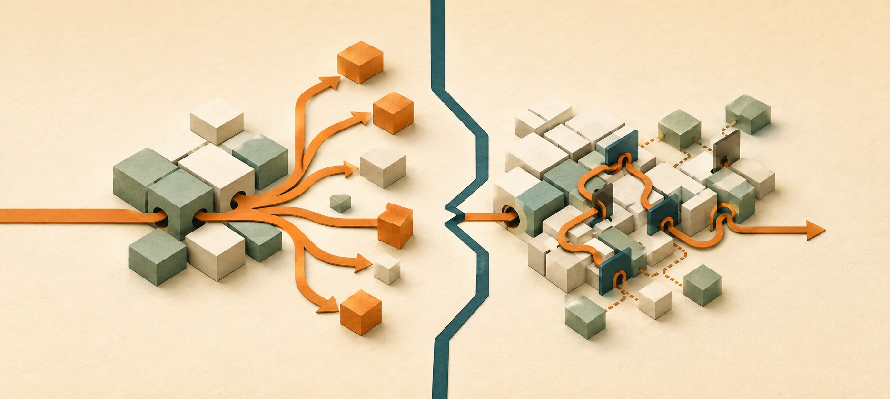
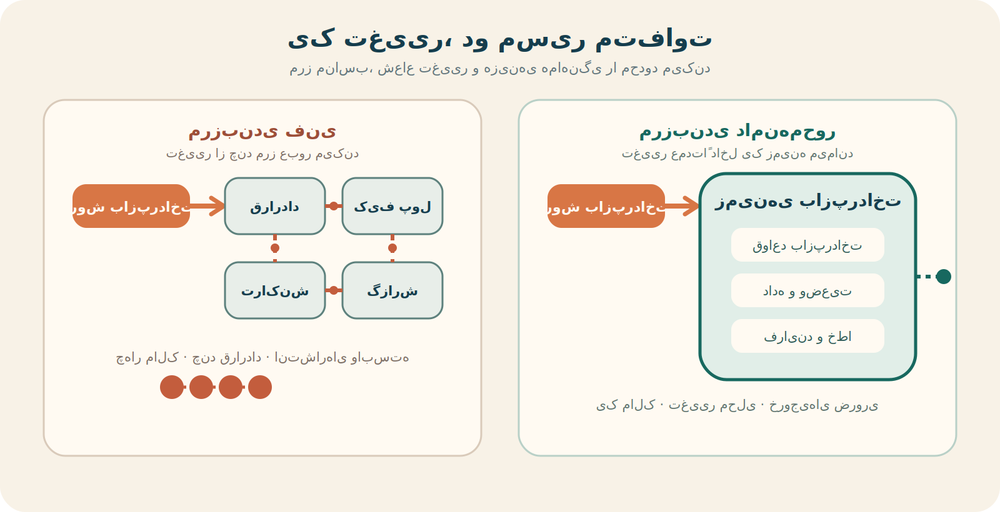
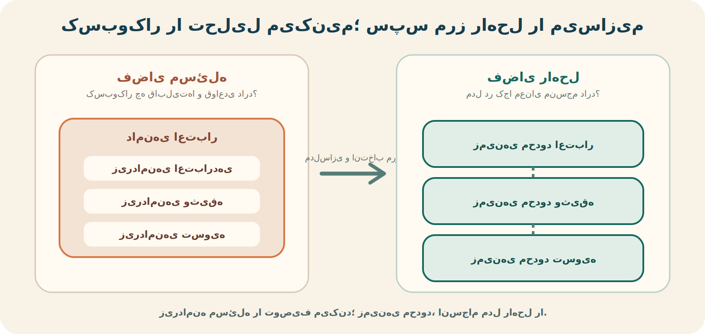

درخواست در ظاهر ساده بود: یک نوع تازه از اعتبار به محصول اضافه کنیم. انتظار اولیه این بود که بخش اصلی کار در همان سرویس اعتبار انجام شود. اما خیلی زود معلوم شد برای تحویل کاملش باید منطق چند سرویس تغییر کند: قرارداد، کیف پول، تسویه، گزارش و اعلان.

هر تیم بخشی از کار را می‌دانست، اما هیچ تیمی مالک نتیجه‌ی کامل نبود. یک تغییر کسب‌وکاری به چند تسک، چند قرارداد و چند انتشار وابسته تبدیل شد. اگر یکی از تیم‌ها اولویت دیگری داشت، کل قابلیت منتظر می‌ماند.

ما سامانه را به چند سرویس تقسیم کرده بودیم، اما قابلیت کسب‌وکار را از جای اشتباهی بریده بودیم.



{/* truncate */}

:::info[مشخصات گفت‌وگو]

**عنوان:** Architecture for Flow  
**مهمان:** سوزان کایزر (Susanne Kaiser)  
**میزبان:** جیمز لوئیس (James Lewis)  
**رسانه:** GOTO Unscripted  
**صفحه‌ی گفت‌وگو:** [Architecture for Flow در GOTO](https://gotopia.tech/episodes/424/architecture-for-flow)

:::

## یک تصمیم فنی که فنی باقی نمی‌ماند

معمولاً هنگام مرزبندی سرویس‌ها درباره‌ی اندازه‌ی کدبیس، دیتابیس مستقل، مقیاس‌پذیری یا استقرار جداگانه حرف می‌زنیم. این‌ها مهم‌اند، اما اثر اصلی مرز کمی دیرتر دیده می‌شود: وقتی کسب‌وکار می‌خواهد قابلیت تازه‌ای بسازد یا بخشی از محصول را با سرعت متفاوتی تغییر دهد.

هر مرز مشخص می‌کند تصمیم‌های یک قابلیت کجا گرفته شوند، داده‌ی آن دست چه کسی باشد، کدام تیم بتواند مستقلاً تغییرش دهد و برای تحویل آن با چند تیم دیگر هماهنگ شود. به همین دلیل، مرز سرویس فقط معماری امروز را توضیح نمی‌دهد؛ بخشی از آینده‌ی محصول را هم شکل می‌دهد.

> مرز خوب، تغییر مرتبط را کنار هم نگه می‌دارد و تغییر نامرتبط را از هم جدا می‌کند.

اگر دو قابلیتی را که قرار است با سرعت‌های متفاوت رشد کنند به هم بچسبانیم، رشد یکی به اولویت‌ها و محدودیت‌های دیگری گره می‌خورد. اگر یک قابلیت واحد را زودتر از موعد بین چند سرویس پخش کنیم، برای هر تغییر هزینه‌ی هماهنگی، قرارداد و سازگاری می‌سازیم.

## تجربه‌ای که بعد از رسم نمودار خودش را نشان می‌دهد

در نمودار معماری، جداکردن سرویس‌ها معمولاً مرتب به نظر می‌رسد. جعبه‌هایی با نام‌های روشن داریم و میانشان چند فلش. مسئله وقتی شروع می‌شود که یک نیاز واقعی را روی همین نمودار دنبال کنیم.

من بارها دیده‌ام یک تغییر که در زبان کسب‌وکار یک جمله است، در برنامه‌ی تیم فنی به چندین کار مستقل تبدیل می‌شود. یک تیم باید وضعیت تازه‌ای اضافه کند، تیم دیگر قرارداد رابط را عوض کند، تیم سوم داده‌ی جدید را نگه دارد و تیم چهارم گزارش را اصلاح کند. هر تغییر کوچک به جلسه‌ی هماهنگی و انتشار مرحله‌ای نیاز دارد.

اوایل ممکن است این وضعیت را طبیعی بدانیم؛ بالاخره سامانه توزیع‌شده است. اما اگر تقریباً هر تغییر مهم همیشه همان چند سرویس را با هم درگیر می‌کند، احتمالاً با پیچیدگی ذاتی کسب‌وکار روبه‌رو نیستیم. مرزهایمان با مسیر تغییر هم‌راستا نیستند.

از یک جایی به بعد فهمیدم سؤال مفید این نیست که «هر سرویس چه کاری انجام می‌دهد؟». سؤال بهتر این است:

> برای رساندن یک تغییر معنادار کسب‌وکار به تولید، چند مرز و چند تیم را باید رد کنیم؟



در سمت اول، مرزها حول اجزای فنی کشیده شده‌اند و یک تغییر کسب‌وکار باید از چند مالک و قرارداد عبور کند. در سمت دوم، قواعد، داده و فرایند مرتبط داخل زمینه‌ی بازپرداخت مانده‌اند و فقط خروجی‌های ضروری از مرز خارج می‌شوند. هدف حذف همه‌ی ارتباط‌ها نیست؛ محلی‌کردن بخش اصلی تغییر است.

## سرویس را از روی جدول نبُریم

یکی از وسوسه‌های رایج این است که موجودیت‌های اصلی را به سرویس تبدیل کنیم: سرویس کاربر، سفارش، پرداخت، وضعیت یا تراکنش. این تقسیم‌بندی تمیز و قابل فهم است، اما لزوماً رفتار کسب‌وکار را دنبال نمی‌کند.

فرض کنیم برای نهایی‌شدن خرید باید سفارش خوانده شود، موجودی کم شود، پرداخت تأیید شود و وضعیت تغییر کند. اگر هر اسم به یک سرویس مستقل تبدیل شده باشد، یک رفتار واحد کسب‌وکار را میان چند مرز پخش کرده‌ایم. حالا مسئله‌ای که می‌توانست داخل یک محدوده با یک تصمیم سازگار حل شود، به هماهنگی توزیع‌شده تبدیل می‌شود.

زَمَک دهنه در نوشته‌ی [شکستن تک‌سنگ به ریزخدمت‌ها](https://martinfowler.com/articles/break-monolith-into-microservices.html) درباره‌ی همین افراط هشدار می‌دهد: سرویس‌های بسیار کوچک که از نمای نرمال‌شده‌ی داده الهام گرفته‌اند، اغلب امکان انتشار و اجرای مستقل را از دست می‌دهند و فقط اصطکاک عملیاتی بیشتری می‌سازند.

مسئله این نیست که موجودیت‌ها بی‌اهمیت‌اند؛ مسئله این است که واحد رشد کسب‌وکار معمولاً یک «اسم» نیست. مجموعه‌ای از تصمیم‌ها، قواعد و رفتارهایی است که با هم یک قابلیت می‌سازند.

## معماری باید نام کسب‌وکار را فریاد بزند

رابرت مارتین برای توضیح این مسئله از تعبیر «معماری جیغ‌زننده» (Screaming Architecture) استفاده می‌کند. به‌گفته‌ی او، همان‌طور که نقشه‌ی یک کتابخانه یا خانه از کاربرد ساختمان خبر می‌دهد، ساختار نرم‌افزار هم باید کاربردها و مقصود سامانه را آشکار کند؛ نه اینکه در نگاه اول فقط چارچوب، دیتابیس و شیوه‌ی تحویل HTTP را نشان دهد.

اگر وارد کد سامانه‌ی اعتبار شویم و نخستین چیزهایی که ببینیم `controllers`، `services`، `repositories` و `models` باشند، هنوز چیزی درباره‌ی مسئله‌ی اصلی نفهمیده‌ایم. این پوشه‌ها ممکن است از نظر فنی منظم باشند، اما تقریباً در هر محصول دیگری نیز وجود دارند.

در مقابل، نام‌هایی مثل «اعتبار»، «وثیقه»، «بازپرداخت»، «نقدکردن وثیقه» و «تسویه» درباره‌ی قابلیت‌ها، زبان و تصمیم‌های کسب‌وکار حرف می‌زنند. معماری اینجا پیش از فناوری، هدف سامانه را نشان می‌دهد.

```text
# ساختاری که لایه‌های فنی را نشان می‌دهد
controllers/
services/
repositories/
models/

# ساختاری که دامنه را آشکار می‌کند
borrowing/
collateral/
repayment/
liquidation/
settlement/
```

این ایده فقط درباره‌ی نام پوشه‌ها نیست. اگر پوشه‌ها دامنه‌محور باشند اما برای تغییر «بازپرداخت» همچنان پنج سرویس و چهار تیم را هماهنگ کنیم، معماری فقط ظاهر دامنه را گرفته است. ساختار کد، مالکیت داده، اختیار تیم و مسیر استقرار باید تا حد معقول از همان مرز مفهومی پشتیبانی کنند.

:::caution[معماری جیغ‌زننده مساوی ریزخدمت نیست]

معماری می‌تواند یک تک‌سنگ ماژولار باشد و همچنان نام کسب‌وکار را فریاد بزند. از آن طرف، ممکن است ده‌ها ریزخدمت داشته باشیم که فقط نام موجودیت‌ها را گرفته‌اند و هیچ قابلیت مستقلی را دربر نمی‌گیرند.

:::

## طراحی دامنه‌محور چطور به کشف مرز کمک می‌کند؟

معماری جیغ‌زننده می‌گوید ساختار باید درباره‌ی کسب‌وکار حرف بزند؛ طراحی دامنه‌محور (Domain-Driven Design یا DDD) کمک می‌کند بفهمیم آن کسب‌وکار را چگونه ببینیم و درباره‌اش با زبان مشترک صحبت کنیم.

DDD از فناوری شروع نمی‌کند. ابتدا سراغ دامنه می‌رود: مسئله‌ای که سازمان در آن فعالیت می‌کند و نرم‌افزار قرار است بخشی از آن را حل کند. سپس چند مفهوم راهبردی برای شناخت مرزها در اختیارمان می‌گذارد:

- **دامنه:** فضای کلی مسئله و فعالیت کسب‌وکار؛ برای نمونه، ارائه‌ی اعتبار با پشتوانه‌ی دارایی.
- **زیر‌دامنه:** بخش متمایزی از مسئله با دانش و قواعد خاص خود؛ مانند اعتبارسنجی، مدیریت وثیقه یا وصول بدهی.
- **زیر‌دامنه‌ی اصلی:** بخشی که مزیت رقابتی می‌سازد و ارزش سرمایه‌گذاری و مدل‌سازی دقیق‌تر دارد.
- **زبان مشترک:** واژگانی که متخصصان دامنه و تیم فنی با معنای یکسان به کار می‌برند و در کد نیز دیده می‌شود.
- **زمینه‌ی محدود:** محدوده‌ای که یک مدل و زبان درون آن معنای منسجم دارد.
- **نقشه‌ی زمینه‌ها:** تصویری از رابطه، وابستگی و شیوه‌ی همکاری زمینه‌های محدود.

تفاوت زیر‌دامنه و زمینه‌ی محدود مهم است. زیر‌دامنه بخشی از **فضای مسئله** است؛ یعنی کسب‌وکار را چگونه تحلیل می‌کنیم. زمینه‌ی محدود مرزی در **فضای راه‌حل** است؛ یعنی مدل نرم‌افزاری را کجا منسجم نگه می‌داریم. این دو معمولاً بهتر است هم‌راستا باشند، اما الزاماً رابطه‌ی یک‌به‌یک ندارند.



این تصویر نباید به‌عنوان نگاشت اجباری یک‌به‌یک خوانده شود. گاهی چند زیر‌دامنه‌ی کوچک در یک زمینه‌ی محدود پیاده می‌شوند یا یک زیر‌دامنه‌ی پیچیده به چند زمینه‌ی محدود نیاز دارد. تصویر فقط دو نوع تصمیم را جدا می‌کند: کشف ساختار کسب‌وکار و طراحی مرز مدل نرم‌افزار.

## یک «دارایی» با چهار معنای متفاوت

واژه‌ی «دارایی» در بخش‌های مختلف یک سامانه‌ی مالی ممکن است به چیزهای متفاوتی اشاره کند:

- در **کیف پول**، موجودی قابل انتقال کاربر است.
- در **وثیقه**، ارزشی است که بدهی را پوشش می‌دهد و نسبت پوشش دارد.
- در **معامله**، مقداری است که می‌تواند خریدوفروش شود و قواعد اندازه و قیمت دارد.
- در **حسابداری**، اثری است که باید با قواعد مشخص در دفترکل ثبت شود.

اگر یک مدل عمومی `Asset` را به همه‌ی این بخش‌ها تحمیل کنیم، خیلی زود فیلدها و قواعدی به آن اضافه می‌شوند که فقط برای یکی از زمینه‌ها معنا دارند. سپس تغییر وثیقه ممکن است مدل کیف پول را هم درگیر کند و تغییر معامله روی گزارش حسابداری اثر ناخواسته بگذارد.

زمینه‌ی محدود اجازه می‌دهد بپذیریم «دارایی» در هر زمینه مدل متفاوتی دارد. قرار نیست این مدل‌ها بی‌خبر از هم باشند؛ رابطه‌ی میانشان باید با قرارداد و نگاشت روشن تعریف شود. هدف، حذف ارتباط نیست؛ جلوگیری از نشت مدل و تصمیم‌های یک زمینه به زمینه‌ی دیگر است.

## مرز را دور قابلیت و تصمیم بکشیم

هدف DDD این نیست که تعداد ریزخدمت‌ها را برایمان محاسبه کند. کمک می‌کند بفهمیم کدام تصمیم‌ها، قواعد و واژه‌ها باید کنار هم بمانند و معنا در کجا تغییر می‌کند. مرز فنی می‌تواند بعداً با توجه به اندازه‌ی تیم، بار عملیاتی، امنیت، مقررات و سرعت تغییر روی این شناخت سوار شود.

سوزان کایزر در گفت‌وگوی «معماری برای جریان» پیشنهاد می‌کند پیش از رفتن سراغ فضای راه‌حل، مسئله را از سه زاویه کنار هم ببینیم: راهبرد کسب‌وکار، معماری نرم‌افزار و سازمان تیم‌ها. اگر فقط یکی را ببینیم، ممکن است معماری‌ای بسازیم که از نظر فنی مرتب است اما جریان ارزش را قطع می‌کند.

:::note[زمینه‌ی محدود مساوی ریزخدمت نیست]

یک زمینه‌ی محدود می‌تواند درون یک تک‌سنگ ماژولار پیاده شود یا از چند جزء فنی تشکیل شده باشد. مرز دامنه به ما می‌گوید معنا و مسئولیت کجا تغییر می‌کند؛ شیوه‌ی استقرار تصمیمی جداگانه است.

:::

## کتابی که پیش از ریزخدمت‌ها درباره‌ی مرزها حرف می‌زد

منبع اصلی این مفاهیم، کتاب **Domain-Driven Design: Tackling Complexity in the Heart of Software** نوشته‌ی اریک ایوانز است که می‌توان عنوانش را «طراحی دامنه‌محور؛ مهار پیچیدگی در قلب نرم‌افزار» ترجمه کرد.

ایوانز بحث را از تعداد سرویس‌ها شروع نمی‌کند. مسئله‌ی او این است که تیم فنی و متخصصان کسب‌وکار چگونه مدل مشترکی از یک دامنه‌ی پیچیده بسازند، زبانشان را به هم نزدیک کنند و محدوده‌ای تعریف کنند که مدل درون آن منسجم بماند. به همین دلیل، کتاب با وجود نوشته‌شدن پیش از فراگیرشدن ریزخدمت‌ها، هنوز یکی از منابع اصلی بحث مرزبندی سرویس‌هاست.

البته کتاب دستورالعمل تجزیه‌ی سامانه به ریزخدمت‌ها نیست. تبدیل خودکار هر زمینه‌ی محدود به یک سرویس مستقل، برداشت ساده‌شده‌ای از DDD است. کتاب بیشتر کمک می‌کند مسئله و مدل را درست ببینیم؛ تصمیم درباره‌ی استقرار، اندازه‌ی سرویس و ساختار تیم همچنان به شرایط سازمان وابسته است.

برای مطالعه، این مسیر معقول‌تر به نظر می‌رسد:

1. **Learning Domain-Driven Design** نوشته‌ی ولاد خونو‌نوف؛ شروعی امروزی و کاربردی با ارتباط روشن میان راهبرد کسب‌وکار و معماری.
2. **Domain-Driven Design Distilled** نوشته‌ی وان ورنون؛ مرور کوتاه‌تر مفاهیم اصلی و طراحی راهبردی.
3. **Domain-Driven Design** نوشته‌ی اریک ایوانز؛ منبع اصلی برای مطالعه‌ی عمیق‌تر و ساختن درک منسجم از DDD.

برای کسی که تازه وارد این بحث می‌شود، شروع مستقیم از کتاب اصلی لزوماً بهترین مسیر نیست. کتاب ایوانز ارزشمند اما متراکم است؛ یک مقدمه‌ی جدیدتر کمک می‌کند مفاهیم آن در تجربه‌ی روزمره جای مشخص‌تری پیدا کنند.

## مرز امروز، هزینه‌ی تغییر فرداست

مرز بیش از حد بزرگ و بیش از حد کوچک، هر دو رشد را کند می‌کنند.

در مرز بزرگ، چند قابلیت با ریتم‌های متفاوت در یک محدوده قرار می‌گیرند. تیم‌ها روی کد و انتشار مشترک با هم رقابت می‌کنند، دامنه‌ی شناخت بزرگ می‌شود و تغییر بخش حساس، بقیه را هم در معرض خطر قرار می‌دهد.

در مرز کوچک، یک قابلیت واحد میان سرویس‌های متعدد پخش می‌شود. هر تغییر به قرارداد تازه، مدیریت خطای توزیع‌شده، هماهنگی انتشار و گاهی مهاجرت چند داده نیاز پیدا می‌کند. استقلالی که انتظار داشتیم، جای خودش را به تحویل‌های وابسته می‌دهد.

مرز مناسب الزاماً کوچک‌ترین مرز نیست. مرزی است که تغییرهای پرارتباط را محلی نگه دارد و اجازه دهد قابلیت‌هایی که واقعاً مسیر متفاوتی دارند، مستقل تکامل پیدا کنند.

## نمونه‌ای که مسئله را از کد بزرگ‌تر می‌کند

در مطالعه‌ی موردی Telenet، مشکل فقط معماری نرم‌افزار نبود. قابلیت‌های کسب‌وکار میان مرزهای سازمانی و تخصصی پخش شده بودند. در بخش تجارت الکترونیکی، یک جریان ارزش به ۹ تیم وابسته بود و حتی قابلیت‌های کوچک برای رسیدن به تولید باید چند بار دست‌به‌دست می‌شدند.

تیم‌ها روی کاغذ خودمختار بودند، اما برای ساخت نتیجه‌ی واقعی به یکدیگر وابسته می‌ماندند. تفاوت اولویت‌ها تصمیم‌گیری را تا سطوح بالای سازمان می‌برد و هزینه‌ی هماهنگی با رشد سازمان بیشتر می‌شد.

این نمونه یک نکته‌ی مهم دارد: نمی‌توان مرز نرم‌افزار را جدا از مرز اختیار و مسئولیت تیم طراحی کرد. اگر مالکیت یک قابلیت میان چند تیم تقسیم شود، جداسازی مخزن‌ها یا استقرارها به‌تنهایی استقلال نمی‌سازد.

این همان جایی است که قانون کانوی از یک مشاهده‌ی مشهور به مسئله‌ای روزمره تبدیل می‌شود: ساختار ارتباط سازمان در ساختار سامانه بازتاب پیدا می‌کند و ساختار سامانه هم شکل همکاری آینده را تثبیت می‌کند.

## مالک نتیجه چه کسی است؟

در نوشته‌ی [«رویداد یا آشوب؟»](/blog/event-or-chaos) درباره‌ی تفاوت مالک کد، داده، قرارداد و زیرساخت نوشتم. اینجا باید یک مالکیت دیگر را هم اضافه کنیم: مالکیت نتیجه‌ی کسب‌وکار.

ممکن است هر سرویس مالک مشخصی داشته باشد، اما وقتی یک فرایند نصفه می‌ماند هیچ‌کس مسئول تجربه‌ی نهایی کاربر نباشد. تیم پرداخت می‌گوید تراکنش موفق بوده، تیم سفارش می‌گوید رویداد را نگرفته و تیم زیرساخت هم سالم‌بودن بستر را نشان می‌دهد. همه در محدوده‌ی خود درست می‌گویند، اما کاربر هنوز به نتیجه نرسیده است.

مرزبندی خوب باید تا حد ممکن دانش، اختیار و پاسخ‌گویی را کنار هم قرار دهد. تیمی که مسئول نتیجه است باید بتواند بخش عمده‌ی تصمیم‌ها و تغییرهای لازم برای همان نتیجه را نیز انجام دهد.

## استقلال را با تعداد سرویس‌ها نسنجیم

تعداد سرویس‌ها معیار بلوغ معماری نیست. حتی استقرار جداگانه هم به‌تنهایی استقلال را ثابت نمی‌کند. اگر دو سرویس همیشه با هم تغییر می‌کنند، آزمون‌هایشان به محیط مشترک وابسته است یا انتشار یکی منتظر دیگری می‌ماند، مرزشان استقلال معناداری نساخته است.

گاهی یک تک‌سنگ ماژولار با مرزهای روشن و مالکیت مشخص، آزادی تغییر بیشتری از ده ریزخدمت دارد. در تک‌سنگ منظم، می‌توانیم مرزهای دامنه را بیازماییم و وقتی نیاز واقعی شکل گرفت، بخشی را جدا کنیم؛ بدون اینکه از روز اول هزینه‌ی شبکه، سازگاری و عملیات توزیع‌شده را بپردازیم.

به نظرم چند پرسش عملی از شمارش سرویس‌ها مفیدترند:

1. یک تیم چه مقدار از مسیر ایده تا تولید را خودش در اختیار دارد؟
2. تغییر یک قابلیت معمولاً چند سرویس و چند تیم را درگیر می‌کند؟
3. آیا سرویس‌ها واقعاً جدا منتشر می‌شوند یا فقط خط لوله‌های جدا دارند؟
4. وقتی جریان شکست می‌خورد، یک تیم مسئول پیگیری نتیجه‌ی نهایی هست؟
5. آیا تغییر محتمل در نقشه‌ی راه داخل یک مرز می‌ماند یا همه‌جا پخش می‌شود؟

## نشانه‌های مرزی که دیگر جواب نمی‌دهد

مرزها را نمی‌شود یک‌بار برای همیشه درست طراحی کرد. اما چند علامت معمولاً می‌گویند باید دوباره نگاهشان کنیم:

- دو یا چند سرویس تقریباً همیشه با هم تغییر و منتشر می‌شوند.
- برای یک قابلیت کوچک، کار میان چند تیم دست‌به‌دست می‌شود.
- سرویس‌ها دائماً داده‌ی داخلی یکدیگر را می‌خواهند.
- یک مفهوم مشترک در چند سرویس با قواعد متناقض تکرار شده است.
- قراردادهای میان سرویس‌ها سریع‌تر از خود قابلیت تغییر می‌کنند.
- تیم‌ها مالک جزء هستند، اما هیچ‌کس مالک نتیجه نیست.
- بخش مهمی از زمان تحویل صرف انتظار، هماهنگی و هم‌ترازکردن اولویت‌ها می‌شود.

هیچ‌کدام به‌تنهایی حکم قطعی برای ادغام یا جداسازی نیستند. اما اگر الگوی تکرارشونده شده‌اند، باید هزینه‌ی مرز را اندازه بگیریم؛ نه اینکه آن را بخشی اجتناب‌ناپذیر از معماری توزیع‌شده بدانیم.

## مرز درست را از آینده قرض نگیریم

یک خطر دیگر، طراحی برای آینده‌ای است که هنوز نیامده. ممکن است تصور کنیم قابلیتی روزی بسیار بزرگ می‌شود و از همان ابتدا آن را به چند سرویس تقسیم کنیم. اگر آن رشد رخ ندهد، سال‌ها هزینه‌ی مرزی را برای فرضی پرداخت کرده‌ایم که هیچ‌وقت واقعی نشده است.

در سوی دیگر، اگر معماری را طوری بسازیم که هیچ مرز داخلی روشنی نداشته باشد، هنگام رشد واقعی جداکردن قابلیت بسیار پرهزینه می‌شود. راه میانه، پیش‌بینی دقیق آینده نیست؛ حفظ امکان انتخاب است.

مرزهای مفهومی را روشن نگه داریم، وابستگی‌ها را کنترل کنیم، تغییرهای واقعی را مشاهده کنیم و وقتی شواهد کافی داشتیم مرز استقرار یا مالکیت را جابه‌جا کنیم. کایزر هم بر همین پیوستگی تأکید می‌کند: تصویر آینده ثابت نیست و باید با بازخورد و شناخت تازه اصلاح شود.

> معماری خوب آینده را پیش‌بینی نمی‌کند؛ هزینه‌ی اصلاح تصمیم را پایین نگه می‌دارد.

## چیزی که باید از خودمان بپرسیم

بحث مرز سرویس نباید با این سؤال شروع شود که «چند ریزخدمت می‌خواهیم؟». بهتر است ابتدا بپرسیم کسب‌وکار قرار است کجا تغییر کند، کدام قابلیت مزیت رقابتی ماست، کدام بخش‌ها ریتم متفاوتی دارند و چه تیمی باید مالک نتیجه باشد.

بعد می‌توان درباره‌ی مرز کد، داده، تیم و استقرار تصمیم گرفت. شاید پاسخ یک ریزخدمت مستقل باشد؛ شاید یک ماژول تازه داخل همان برنامه؛ و شاید اصلاً لازم باشد مسئولیت دو تیم را دوباره تعریف کنیم.

:::note[خلاصه‌ی حرف]

مرز سرویس فقط کد را تقسیم نمی‌کند؛ اختیار، دانش و هزینه‌ی هماهنگی را هم تقسیم می‌کند. مرزهای امروز تعیین می‌کنند کسب‌وکار فردا کدام قابلیت را مستقل رشد دهد و برای کدام تغییر در صف هماهنگی بماند.

:::

<details>
<summary>منابع</summary>

- [Architecture for Flow؛ گفت‌وگوی سوزان کایزر و جیمز لوئیس](https://gotopia.tech/episodes/424/architecture-for-flow)
- [Screaming Architecture؛ رابرت مارتین](https://blog.cleancoder.com/uncle-bob/2011/09/30/Screaming-Architecture.html)
- [Bounded Context؛ مارتین فاولر](https://martinfowler.com/bliki/BoundedContext.html)
- [منابع رسمی طراحی دامنه‌محور و کتاب اریک ایوانز](https://www.domainlanguage.com/ddd/)
- [Learning Domain-Driven Design؛ ولاد خونو‌نوف](https://www.oreilly.com/library/view/learning-domain-driven-design/9781098100124/)
- [Domain-Driven Design Distilled؛ وان ورنون](https://kalele.io/books/)
- [How to break a Monolith into Microservices؛ زَمَک دهنه](https://martinfowler.com/articles/break-monolith-into-microservices.html)
- [Linking Modular Architecture to Development Teams](https://martinfowler.com/articles/linking-modular-arch.html)
- [مطالعه‌ی موردی Telenet و Team Topologies](https://teamtopologies.com/industry-examples/organization-wide-business-agility-in-telecoms-with-team-topologies-at-telenet)
- [رویداد یا آشوب؟](/blog/event-or-chaos)
- [معمار یا گلوگاه؟](/blog/architect-or-bottleneck)

</details>

---

این مطلب، بخشی از تمرینهای درس معماری نرم‌افزار در دانشگاه شهیدبهشتی است
